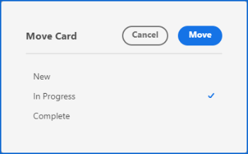

# 카드 관리

카드를 보드의 임의의 열로 이동하거나 카드를 복사할 수 있습니다.

필드 값을 업데이트하기 위해 열 정책을 활성화한 경우 한 열에서 다른 열로 카드를 이동할 때 상태, 할당자 및 태그가 자동으로 업데이트될 수 있습니다. 자세한 내용은 문서 [보드 열 관리](/help/quicksilver/agile/get-started-with-boards/manage-board-columns.md)에서 &quot;열 설정 및 정책 정의&quot;를 참조하십시오.

>[!NOTE]
>
>You can&#39;t move a card from one board to another board.

## 액세스 요구 사항

+++ 이 문서의 기능에 대한 액세스 요구 사항을 보려면 확장하십시오.

<table style="table-layout:auto"> 
 <col> 
 <col> 
 <tbody> 
  <tr> 
   <td role="rowheader">Adobe Workfront 패키지</td> 
   <td> 
Any
 </td> 
  </tr> 
  <tr> 
   <td role="rowheader">Adobe Workfront 라이선스</td> 
   <td> 
   
기여자 이상
 
   
요청 이상

   </td> 
  </tr> 
 </tbody> 
</table>

이 표의 정보에 대한 자세한 내용은 [Workfront 설명서의 액세스 요구 사항](/help/quicksilver/administration-and-setup/add-users/access-levels-and-object-permissions/access-level-requirements-in-documentation.md)을 참조하십시오.

+++

## 열 간에 카드 이동

{{step1-to-boards}}

1. 보드에 액세스합니다. 자세한 내용은 [게시판 만들기 또는 편집](../../agile/get-started-with-boards/create-edit-board.md)을 참조하세요.
1. Drag and drop the card into another column, in the position you want it to appear.

   또는

   Click the **[!UICONTROL More]** menu  on the card, and select **[!UICONTROL Move]**. Then, on the **[!UICONTROL Move Item]** box, choose another column and select **[!UICONTROL Move]**.

   

   >[!NOTE]
   >
   >When you use the **[!UICONTROL Move Item]** box, the card is always moved to the top of the column.

## Move cards to the top or bottom of a column

1. 보드에 액세스합니다.
1. 카드를 열에 표시할 위치로 끌어다 놓습니다.

   또는

   Click the **[!UICONTROL More]** menu  on the card, and select **[!UICONTROL Top of column]** or **[!UICONTROL Bottom of column]**.

   

## Copy a card

Copying an ad hoc card duplicates all fields on the card, including checklist items.

>[!NOTE]
>
>You can&#39;t copy connected cards.

1. 보드에 액세스합니다.
1. Click the **[!UICONTROL More]** menu ![[!UICONTROL More menu]](assets/more-icon-spectrum.png) on the card, and select **[!UICONTROL Copy]**.

   

   같은 열에 &quot;복사본 - [원본 카드 이름]&quot;이라는 제목으로 새 카드가 추가되었습니다.
