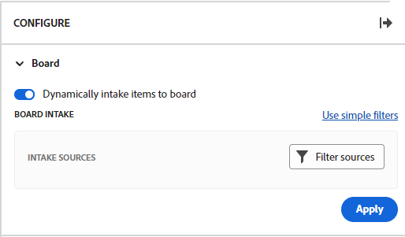

# 보드에 접수 열 추가

필요한 경우 정의한 필터에 따라 작업 및 문제를 [!DNL Workfront]에 추가할 때 연결된 카드로 자동으로 가져오는 접수 열을 보드에 추가할 수 있습니다. 접수 열은 Kanban 팀의 백로그 열, 지원 팀이 요청 대기열에 추가될 때 문제를 확인할 수 있는 접수 위치 또는 필요한 다른 용도로 사용할 수 있습니다.

접수 열은 보드에 하나만 허용되며 항상 맨 왼쪽 열로 표시됩니다.

접수 열은 동적 보드에서 사용할 수 없습니다. 그러나 동적 보드로 가져올 카드를 정의하는 필터를 업데이트할 수 있습니다. 동적 보드에서 이러한 필터를 변경하면 Workfront 작업 또는 문제의 일부가 아닌 카드 설정(예: 태그)이 재설정됩니다.

>[!NOTE]
>
>보안상의 이유로 보드 소유자만 구성 패널에서 보드 필터를 변경할 수 있습니다.

접수 열은 300개의 작업과 300개의 문제로 제한됩니다. 접수 열의 기본 항목 순서는 다음과 같습니다.

작업:

* 기본 순서: 프로젝트 이름
* 2차 순서: 작업 분할 구조

문제:

* 기본 순서: 프로젝트 이름
* 2차 순서: 참조 번호

>[!IMPORTANT]
>
>여러 사용자가 동시에 보드에서 작업하는 경우 보드를 자주 새로 고치는 것이 좋습니다. 페이지를 새로 고치면 보드의 시각적 변경 사항을 최신 상태로 유지하는 데 도움이 되며 중복 카드가 접수 열에서 보드로 이동하는 것과 같은 문제가 방지됩니다.

열에 대한 자세한 내용은 [보드 열 관리](/help/quicksilver/agile/get-started-with-boards/manage-board-columns.md)를 참조하십시오. 연결된 카드에 대한 자세한 내용은 [보드에 연결된 카드 사용](/help/quicksilver/agile/get-started-with-boards/connected-cards.md)을 참조하세요.

## 액세스 요구 사항

+++ 을 확장하여 이 문서의 기능에 대한 액세스 요구 사항을 봅니다.

이 문서의 단계를 수행하려면 다음 액세스 권한이 있어야 합니다.

<table style="table-layout:auto"> 
 <col> 
 <col> 
 <tbody> 
  <tr> 
   <td role="rowheader">[!DNL Adobe Workfront]</td> 
   <td> 
임의
 </td> 
  </tr> 
  <tr> 
   <td role="rowheader">[!DNL Adobe Workfront] 라이센스</td> 
   <td> 
   
새로운 기능: [!UICONTROL Contributor] 이상
 
   
또는

   
현재: [!UICONTROL Request] 이상

   </td> 
  </tr> 
 </tbody> 
</table>

이 표의 정보에 대한 자세한 내용은 [Workfront 설명서의 액세스 요구 사항](/help/quicksilver/administration-and-setup/add-users/access-levels-and-object-permissions/access-level-requirements-in-documentation.md)을 참조하십시오.

+++

## 단순 필터를 사용하여 접수 열 만들기

{{step1-to-boards}}

1. 보드에 액세스합니다. 자세한 내용은 [게시판 만들기 또는 편집](../../agile/get-started-with-boards/create-edit-board.md)을 참조하세요.
1. 보드 오른쪽의 **[!UICONTROL 구성]**&#x200B;을 클릭하여 구성 패널을 엽니다.
1. **[!UICONTROL 게시판]**&#x200B;을 확장합니다.
1. **[!UICONTROL 보드에 항목을 동적으로 접수]**&#x200B;합니다.

   

   접수 열이 보드 왼쪽에 추가됩니다. 필터를 적용할 때까지 비어 있습니다.

1. (선택 사항) [!DNL Workfront]개의 [!UICONTROL **프로젝트**]&#x200B;를 검색하고 선택합니다.
1. (선택 사항) 사용자 또는 팀 [!UICONTROL **할당**]&#x200B;을 검색하고 선택합니다.
1. 접수 열에 완료 상태의 작업 및 문제를 표시하려면 [!UICONTROL **완료된 작업 포함**]&#x200B;을 선택하십시오.

   >[!NOTE]
   >
   >이 옵션을 선택하지 않으면 다른 상태의 카드가 완료로 표시되면 보드에서 &quot;떨어져&quot; 더 이상 표시되지 않습니다.

1. [!UICONTROL **적용**]&#x200B;을 클릭합니다.

   모든 오브젝트는 보드 접수 열에 연결된 카드로 나타납니다.

   

## 고급 필터를 사용하여 접수 열 만들기

{{step1-to-boards}}

1. 보드에 액세스합니다. 자세한 내용은 [게시판 만들기 또는 편집](../../agile/get-started-with-boards/create-edit-board.md)을 참조하세요.
1. 보드 오른쪽의 **[!UICONTROL 구성]**&#x200B;을 클릭하여 구성 패널을 엽니다.
1. **[!UICONTROL 게시판]**&#x200B;을 확장합니다.
1. **[!UICONTROL 보드에 항목을 동적으로 접수]**&#x200B;합니다.

   접수 열이 보드 왼쪽에 추가됩니다. 필터를 적용할 때까지 비어 있습니다.

1. [!UICONTROL **고급 필터 사용**]&#x200B;을 클릭합니다.
1. **[!UICONTROL 필터 원본 추가]**&#x200B;를 클릭하고 **[!UICONTROL 작업]** 또는 **[!UICONTROL 문제]**&#x200B;를 선택하십시오.

   

   >[!NOTE]
   >
   >작업 및 문제를 모두 포함하도록 접수 열을 필터링할 수 있지만 각 객체 유형에 대해 별도로 필터를 설정해야 합니다.
   >
   >또한 저장된 필터 및 시스템 기본 필터를 사용하여 선택할 수 있습니다.

1. 시작하려면 필터 패널에서 **[!UICONTROL 새 필터]**&#x200B;을 클릭하세요.

   

1. 필터를 빌드하고 **[!UICONTROL 새 이름으로 저장]**&#x200B;을 클릭합니다.

   

   이 예제에서는 [!UICONTROL 새로 만들기] 또는 [!UICONTROL 진행 중] 상태인 특정 프로젝트의 작업에 대한 필터를 보여 줍니다.

   >[!NOTE]
   >
   >로그인한 사용자에 대한 작업 또는 문제를 항상 표시할 수는 없으므로 보드 필터에 &quot;Me&quot;(로그인한 사용자) 와일드카드를 사용하지 않는 것이 좋습니다. 보드를 올바른 작업 및 문제로 설정한 후 보드를 필터링하여 특정 피할당자에 대한 항목을 표시할 수 있습니다. 자세한 내용은 [보드에서 필터링 및 검색](/help/quicksilver/agile/get-started-with-boards/filter-search-in-board.md)을 참조하십시오.

   필터 작성에 대한 자세한 내용은 문서 [필터 만들기 또는 편집 [!DNL Adobe Workfront]](/help/quicksilver/reports-and-dashboards/reports/reporting-elements/create-filters.md)의 &quot;표준 빌더에서 필터 만들기 또는 편집&quot; 섹션을 참조하십시오.

1. 필터 이름을 지정하고 **[!UICONTROL 저장]**&#x200B;을 클릭합니다.

   

   필터에 고유한 이름을 지정하면 나중에 검색할 수 있습니다.

1. 저장된 필터 목록에 필터가 나타나며 접수 열에 자동으로 적용됩니다. 필터 패널 상단에 있는 X 를 클릭하여 닫습니다.

   

1. (선택 사항) 필터를 다른 사람과 공유하려면 저장된 필터 위에 마우스를 놓고 **[!UICONTROL 자세히]** 메뉴 을 클릭한 다음 **[!UICONTROL 공유]**&#x200B;를 선택합니다. 필터 공유 상자에서 공유할 사용자 또는 팀을 선택합니다. 자세한 내용은 [필터 공유, 보기 또는 그룹화](/help/quicksilver/reports-and-dashboards/reports/reporting-elements/share-filter-view-grouping.md)를 참조하세요.
1. (선택 사항) 접수 열에 작업과 문제를 모두 포함하려면 **[!UICONTROL 소스 필터링]**&#x200B;을 클릭하고 다른 개체를 선택하여 다른 필터를 만듭니다.
1. 필터 추가가 끝나면 접수 열을 검토하여 올바른 작업 및 문제가 표시되는지 확인합니다.

   

   >[!NOTE]
   >
   >언제든지 구성 패널을 열고 **[!UICONTROL 필터 원본]**&#x200B;을 클릭한 다음 **[!UICONTROL 작업]** 또는 **[!UICONTROL 문제]**&#x200B;를 선택하여 필터를 업데이트할 수 있습니다.

## 접수 열 사용

접수 열의 카드는 다른 보드 열로 이동할 때까지 편집할 수 없습니다. 카드를 클릭하여 읽기 전용 보기로 열거나 를 클릭하여 새 브라우저 탭에서 작업 또는 문제를 열 수 있습니다.

접수 열의 항목을 수동으로 재정렬할 수 있습니다.

접수 열의 오른쪽 상단에 있는 아이콘은 현재 열에 있는 카드 수와 적용된 필터 수를 보여 줍니다.

1. (선택 사항) intake 열에서 항목을 검색하려면 열에서 을 클릭합니다.
1. (선택 사항) 카드를 접수 열에서 다른 열로 이동하려면 카드를 표시할 위치로 드래그 앤 드롭합니다.

   또는

   카드에서 **[!UICONTROL 자세히]** 메뉴 을 클릭하고 **[!UICONTROL 이동]**&#x200B;을 선택합니다. 그런 다음 **[!UICONTROL 항목 이동]** 상자에서 다른 열을 선택하고 **[!UICONTROL 이동]**&#x200B;을 선택합니다.

1. (선택 사항) 접수 열을 삭제하려면 **[!UICONTROL 자세히]** 메뉴 을 클릭하고 **[!UICONTROL 삭제]**&#x200B;를 선택합니다.
