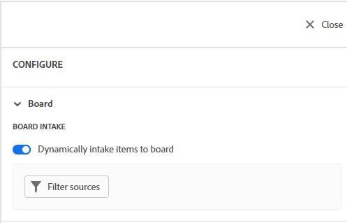
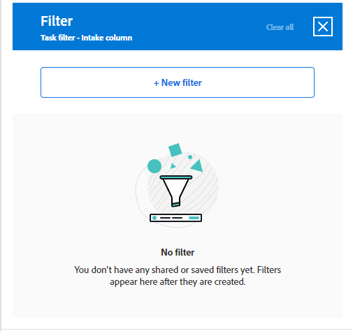
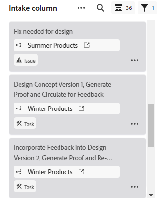

# 보드에 흡기 열 추가

작업 및 문제가 추가되었을 때 연결된 카드로 자동으로 가져오는 가져오기 열을 보드에 선택적으로 추가할 수 있습니다 [!DNL Workfront], 사용자가 정의한 필터를 기반으로 합니다. 취입 열은 간판 팀의 백로그 열, 지원 팀의 취입 위치로 기능하여 요청 대기열에 추가될 때 문제를 보거나 필요한 다른 용도로 처리할 수 있습니다.

한 보드에는 한 개의 취침 열만 허용되며 항상 맨 왼쪽 열로 표시됩니다.

동적 보드에서 취침 열을 사용할 수 없습니다.

취수열은 300개의 작업과 300개의 문제로 제한됩니다. 항목에 정의된 우선 순위를 기준으로 정렬됩니다. 우선 순위에 대한 자세한 내용은 [작업 우선 순위 업데이트](/help/quicksilver/manage-work/tasks/task-information/task-priority.md) 및 [문제 우선 순위 업데이트](/help/quicksilver/manage-work/issues/issue-information/update-issue-priority.md).

열에 대한 자세한 내용은 [보드 열 관리](/help/quicksilver/agile/get-started-with-boards/manage-board-columns.md). 연결된 카드에 대한 자세한 내용은 [보드에서 연결된 카드 사용](/help/quicksilver/agile/get-started-with-boards/connected-cards.md).

## 액세스 요구 사항

이 문서의 절차를 수행하려면 다음 액세스 권한이 있어야 합니다.

<table style="table-layout:auto"> 
 <col> 
 </col> 
 <col> 
 </col> 
 <tbody> 
  <tr> 
   <td role="rowheader"><strong>[!DNL Adobe Workfront] 플랜*</strong></td> 
   <td> 
모든
 </td> 
  </tr> 
  <tr> 
   <td role="rowheader"><strong>[!DNL Adobe Workfront] 라이센스*</strong></td> 
   <td> 
[!DNL Request] 이상
 </td> 
  </tr> 
 </tbody> 
</table>

&#42;어떤 계획, 라이센스 유형 또는 액세스 권한을 보유하고 있는지 확인하려면 [!DNL Workfront] 관리자

## 가져오기 열 만들기

1. 을(를) 클릭합니다. **[!UICONTROL 기본 메뉴]** 아이콘  Adobe Workfront의 오른쪽 위 모서리에서 을(를) 클릭하고 **[!UICONTROL 보드]**.
1. 보드 액세스. 자세한 내용은 [보드 만들기 또는 편집](../../agile/get-started-with-boards/create-edit-board.md).
1. 클릭 **[!UICONTROL 구성]** 보드 오른쪽의 구성 패널을 엽니다.
1. 확장 **[!UICONTROL 보드]**.
1. 켜기 **[!UICONTROL 동적으로 보드에 항목 가져오기]**.

   

   보드 왼쪽에 취수열이 추가됩니다. 필터를 적용할 때까지 비어 있는 상태로 유지됩니다.

1. 클릭 **[!UICONTROL 필터 소스]** 을(를) 선택합니다. **[!UICONTROL 작업]** 또는 **[!UICONTROL 문제]**.

   >[!NOTE]
   >
   >작업 및 문제를 모두 포함하도록 가져오기 열을 필터링할 수 있지만 각 개체 유형에 대해 필터를 별도로 설정해야 합니다.
   >
   >또한 저장된 필터 및 시스템 기본 필터를 선택할 수 있습니다.

1. 필터 패널에서 **[!UICONTROL 새 필터]** 시작하기

   

1. 필터를 빌드하고 를 클릭합니다. **[!UICONTROL 새 이름으로 저장]**.

   

   이 예는 다음 상태에 있는 특정 프로젝트의 작업에 대한 필터를 보여줍니다. [!UICONTROL 새로 만들기] 또는 [!UICONTROL 진행 중], 및에 할당됩니다.

   필터 만들기에 대한 자세한 내용은 문서의 &quot;표준 빌더에서 필터 만들기 또는 편집&quot; 섹션을 참조하십시오 [에서 필터 만들기 또는 편집 [!DNL Adobe Workfront]](/help/quicksilver/reports-and-dashboards/reports/reporting-elements/create-filters.md).

1. 필터 이름을 지정하고 **[!UICONTROL 저장]**.

   

   필터에 고유한 이름을 지정하면 나중에 검색할 수 있습니다.

1. 저장한 필터 목록에 필터가 나타나며, 이 필터는 흡입 열에 자동으로 적용됩니다. 필터 패널 위쪽에 있는 X 를 클릭하여 닫습니다.

   

1. (선택 사항) 필터를 다른 사용자와 공유하려면 저장된 필터를 마우스로 가리킨 다음, **[!UICONTROL 자세히]** 메뉴 , 을(를) 선택하고 을(를) 선택합니다. **[!UICONTROL 공유]**. 필터 공유 상자에서 공유할 사용자 또는 팀을 선택합니다. 자세한 내용은 [필터, 보기 또는 그룹화 공유](/help/quicksilver/reports-and-dashboards/reports/reporting-elements/share-filter-view-grouping.md).
1. (선택 사항) 가져오기 열에 작업과 문제를 모두 포함하려면 **[!UICONTROL 필터 소스]** 다른 필터를 만들 다른 개체를 선택합니다.
1. 필터 추가가 완료되면 흡입량 열을 검토하여 올바른 작업 및 문제가 표시되는지 확인하십시오.

   

   가져오기 열의 카드는 다른 보드 열로 이동할 때까지 편집할 수 없습니다. 카드를 클릭하여 읽기 전용 보기로 열거나  새 브라우저 탭에서 작업이나 문제를 열려면 다음을 수행하십시오.

   취입 열의 항목을 수동으로 다시 정렬할 수 있습니다.

   흡입량 열의 오른쪽 위에 있는 아이콘은 현재 열에 있는 카드 수와 적용된 필터 수를 보여줍니다.

   >[!NOTE]
   >
   >구성 패널을 열고 을 클릭하여 언제든지 필터를 업데이트할 수 있습니다 **[!UICONTROL 필터 소스]**, 및 선택 **[!UICONTROL 작업]** 또는 **[!UICONTROL 문제]**.

1. (선택 사항) 흡입량 열에서 항목을 검색하려면  추가 정보.
1. (선택 사항) 카드를 흡입 열에서 다른 열로 이동하려면 카드를 표시할 위치로 끌어다 놓습니다.

   또는

   을(를) 클릭합니다. **[!UICONTROL 자세히]** 메뉴  카드에서 을 선택하고 을 선택합니다. **[!UICONTROL 이동]**. 그런 다음 **[!UICONTROL 항목 이동]** 상자에서 다른 열을 선택하고 **[!UICONTROL 이동]**.

1. (선택 사항) 흡입량 열을 삭제하려면 **[!UICONTROL 자세히]** 메뉴  을(를) 선택합니다. **[!UICONTROL 삭제]**.
