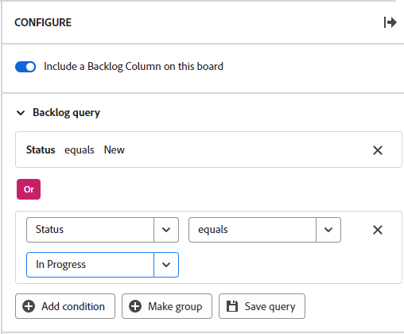

# 워크스트림 보드에서 백로그 구성

>[!IMPORTANT]
>
>작업 스트림은 특정 고객 그룹만 사용할 수 있습니다.

워크스트림의 보드에 백로그 열을 표시하도록 선택하고, 워크스트림 카드 목록에서 보드 백로그로 가져온 카드에 대한 질의를 정의할 수 있습니다.

>[!NOTE]
>
>쿼리 기준과 일치하지 않는 새 카드를 백로그 열에 추가하면 보드를 새로 고칠 때 카드가 백로그에서 사라지고 카드 목록에서만 사용할 수 있습니다. 언제든지 쿼리를 변경하여 백로그 열에 표시되는 카드를 조정할 수 있습니다.

독립형 보드에서 백로그 열 및 쿼리를 사용할 수 없습니다. 독립 실행형 보드에 접수 열을 추가하는 방법에 대한 자세한 내용은 [보드에 접수 열 추가](/help/quicksilver/agile/use-boards-agile-planning-tools/add-intake-column-to-board.md)를 참조하십시오.

## 액세스 요구 사항

+++ 을 확장하여 이 문서의 기능에 대한 액세스 요구 사항을 봅니다.

<table style="table-layout:auto"> 
 <col> 
 <col> 
 <tbody> 
  <tr> 
   <td role="rowheader">Adobe Workfront 패키지</td> 
   <td> 
임의
 </td> 
  </tr> 
  <tr> 
   <td role="rowheader">Adobe Workfront 라이선스</td> 
   <td> 
   
기여자 이상
 
   
요청 이상

   </td> 
  </tr> 
 </tbody> 
</table>

이 표의 정보에 대한 자세한 내용은 [Workfront 설명서의 액세스 요구 사항](/help/quicksilver/administration-and-setup/add-users/access-levels-and-object-permissions/access-level-requirements-in-documentation.md)을 참조하십시오.

+++

## 워크스트림 보드에서 백로그 구성

{{step1-to-boards}}

1. 작업할 워크스트림을 엽니다. 작업 스트림을 열려면 [!UICONTROL **작업 스트림 보기**]&#x200B;를 클릭합니다.
1. 작업 스트림에서 보드를 클릭하여 엽니다.
1. 보드 오른쪽의 [!UICONTROL **구성**]&#x200B;을 클릭하여 구성 패널을 엽니다.
1. [!UICONTROL **이 게시판에 백로그 열을 포함**]&#x200B;합니다.

   백로그 열이 보드 왼쪽에 추가됩니다. 쿼리를 적용할 때까지 비어 있습니다.

1. [!UICONTROL **백로그 쿼리**]&#x200B;를 확장합니다.

   >[!NOTE]
   >
   >상태가 완료가 아닌 카드 목록의 모든 작업 항목을 표시하는 기본 쿼리가 이미 백로그에 적용되었을 수 있습니다.

1. [!UICONTROL **조건 추가**]&#x200B;를 클릭하고 &quot;빈&quot; 필드를 클릭합니다.
1. 쿼리할 필드를 선택합니다.

   선택할 수 있는 필드는 카드의 기본 필드입니다.

1. 쿼리 수정자를 선택합니다.

   수정자 옵션은 적용할 수 있는 필드에 따라 다릅니다. 예를 들어 &quot;name&quot; 필드에는 &quot;greater than&quot; 또는 &quot;less than&quot;이 수정자 선택 항목으로 지정되어 있지 않습니다. 해당 수정자는 숫자에만 적용되기 때문입니다.

1. 값을 선택합니다.

   한정자로 &quot;exists&quot; 또는 &quot;not exists&quot;를 사용하는 경우에는 값을 사용할 수 없습니다.

   예를 들어 &quot;만기일&quot; 및 &quot;존재함&quot;을 선택하면 백로그에는 만기일이 지정된 카드가 표시됩니다. 기한이 없는 카드는 백로그에 가져오지 않습니다.

1. (선택 사항) [!UICONTROL **조건 추가**]&#x200B;를 클릭하여 쿼리에 다른 조건을 추가합니다.

   

1. (선택 사항) OR 연산자를 사용하여 첫 번째 조건에 연결된 조건 그룹을 추가하려면 [!UICONTROL **그룹 만들기**]&#x200B;를 클릭합니다.
1. [!UICONTROL **쿼리 저장**]&#x200B;을 클릭합니다.

   쿼리가 적용되고 기준을 충족하는 카드가 백로그 열에 나타납니다.
