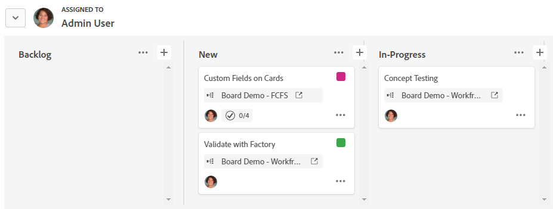

# 게시판에서 그룹 사용

카드에 있는 카드는 담당자나 태그로 그룹화할 수 있습니다. 그룹화 기준 옵션을 선택하면 카드가 스윔레인 형식으로 표시됩니다. 할당되지 않은 카드나 태그가 없는 카드는 자체 수영장에 나타납니다.

>[!NOTE]
>
>섭취 열의 카드는 그룹에 포함되지 않으며, 그룹을 적용하면 섭취 열이 숨겨집니다. 접수 열에 대한 자세한 내용은 [게시판에 접수 열 추가](/help/quicksilver/agile/use-boards-agile-planning-tools/add-intake-column-to-board.md)를 참조하십시오.

## 액세스 요구 사항

+++ 이 문서의 기능에 대한 액세스 요구 사항을 보려면 확장하십시오.

<table style="table-layout:auto"> 
 <col> 
 <col> 
 <tbody> 
  <tr> 
   <td role="rowheader">Adobe Workfront 패키지</td> 
   <td> 
Any
 </td> 
  </tr> 
  <tr> 
   <td role="rowheader">Adobe Workfront 라이선스</td> 
   <td> 
   
콘텐츠 작가 이상
 
   
요청 이상

   </td> 
  </tr> 
 </tbody> 
</table>

이 표의 정보에 대한 자세한 내용은 [Workfront 설명서의 액세스 요구 사항](/help/quicksilver/administration-and-setup/add-users/access-levels-and-object-permissions/access-level-requirements-in-documentation.md)을 참조하십시오.

+++

## 보드에 카드 그룹화

{{step1-to-boards}}

1. 게시판에 액세스합니다. 자세한 내용은 [보드 만들기 또는 편집](../../agile/get-started-with-boards/create-edit-board.md)을 참조하세요.
1. **[!UICONTROL 그룹]**&#x200B;을 클릭하여 보드 왼쪽에 있는 그룹 패널을 엽니다.

   >[!NOTE]
   >
   >그룹화 기준의 기본 설정은 **[!UICONTROL 없음]**&#x200B;입니다. 언제든지 이 옵션을 선택하여 그룹을 제거하고 보드의 열만 표시할 수 있습니다.

1. 카드를 그룹화하려면 **[!UICONTROL 담당자]** 또는 **[!UICONTROL 태그]**&#x200B;를 선택하세요.

   카드는 자동으로 그룹화됩니다. 그룹 이름 옆에 있는 화살표를 클릭하여 그룹을 축소하고 확장합니다.

   

1. 카드를 다른 그룹으로 이동하면 어떻게 되는지 선택합니다.

   * **[!UICONTROL 담당자에 추가]/[!UICONTROL 태그에 추가]:** 새 그룹의 담당자 또는 태그가 기존 담당자 또는 카드 태그에 추가됩니다.
   * **[!UICONTROL 담당자 재정의] / [!UICONTROL 태그 재정의]:** 새 그룹의 담당자 또는 태그는 다른 모든 담당자 또는 태그를 재정의하고 카드에서 유일한 담당자 또는 태그가 됩니다.

   ![[!UICONTROL 그룹화 기준 옵션]](assets/group-by-rail.png)

1. **[!UICONTROL 그룹 숨기기]**&#x200B;를 클릭하여 그룹 패널을 숨기고 전체 보드를 표시합니다.
