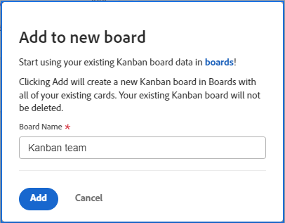

# 애자일 팀 Kanban 카드를 Workfront 보드로 마이그레이션

애자일 팀 Kanban 보드에서 신규 또는 기존 Workfront 보드로 작업 항목을 마이그레이션할 수 있습니다. 마이그레이션을 실행하면 Kanban 보드의 모든 카드가 Workfront 보드에 복사됩니다. 특정 카드를 선택할 수 없습니다.

Workfront 보드의 카드 배치는 열 정책을 기반으로 합니다. (예를 들어, 정책이 &quot;진행 중&quot; 상태의 모든 카드를 특정 열로 이동할 수 있습니다. 열 정책에 대한 자세한 내용은 [보드 열 관리](/help/quicksilver/agile/get-started-with-boards/manage-board-columns.md).) 정책이 없거나 카드가 정책과 일치하지 않으면 카드는 보드의 맨 왼쪽 열에 배치됩니다. 현재 레거시 보드의 백로그 열에 있는 카드는 Workfront 보드에 추가되지 않습니다.

카드는 애자일 팀 Kanban 보드에서 제거되지 않으며 카드 상태 변경 사항은 두 보드에 모두 동기화됩니다. Workfront 보드로 전환할 준비가 될 때까지 두 보드를 모두 활성 상태로 유지할 수 있습니다.

## 액세스 요구 사항

이 문서의 단계를 수행하려면 다음 액세스 권한이 있어야 합니다.

<table style="table-layout:auto">
 <col>
 </col>
 <col>
 </col>
 <tbody>
  <tr>
   <td role="rowheader"><strong>[!DNL Adobe Workfront] 플랜*</strong></td>
   <td> 
모든
 </td>
  </tr>
  <tr>
   <td role="rowheader"><strong>[!DNL Adobe Workfront] 라이센스*</strong></td>
   <td> 
[!UICONTROL Request] 이상
 </td>
  </tr>
 </tbody>
</table>

&#42;보유 중인 플랜, 라이선스 유형 또는 액세스 권한을 알아보려면 [!DNL Workfront] 관리자.

## 칸반 카드를 새 보드로 마이그레이션

{{step1-to-team}}

1. 칸반 보드에 액세스합니다.
1. 클릭 [!UICONTROL **보드에 추가**] 및 선택 [!UICONTROL **새 게시판**].
1. 다음에서 [!UICONTROL 새 보드에 추가] 대화 상자에서 새 보드의 이름(현재 보드 이름)을 입력합니다 [!UICONTROL 칸반] 보드가 자동으로 표시됨)을 클릭하고 [!UICONTROL **추가**].

   

1. (선택 사항) 표시되는 성공 메시지에서 링크를 클릭하여 새 보드를 엽니다.

## Kanban 카드를 기존 보드로 마이그레이션

{{step1-to-team}}

1. 칸반 보드에 액세스합니다.
1. 클릭 [!UICONTROL **보드에 추가**] 및 선택 [!UICONTROL **기존 게시판**].
1. 다음에서 [!UICONTROL 기존 보드에 추가] 대화 상자에서 카드를 마이그레이션할 보드를 검색하여 선택하십시오. 그런 다음 을 클릭합니다. [!UICONTROL **추가**].

   

1. (선택 사항) 표시되는 성공 메시지에서 링크를 클릭하여 보드를 엽니다.
