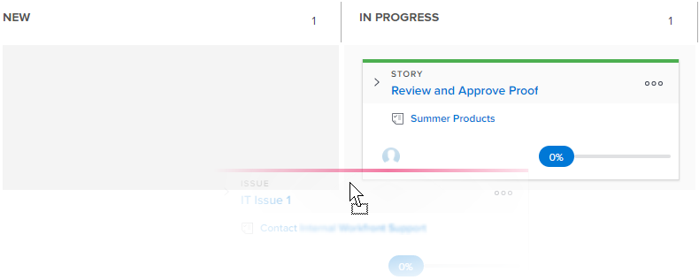

# [!UICONTROL Kanban] 보드에서 스토리 상태 업데이트

스토리의 진행 상황을 반영하기 위해 [!UICONTROL Kanban] 보드에서 직접 스토리의 상태를 변경할 수 있습니다.

>[!NOTE]
>
>[!UICONTROL 팀 설정] 영역의 [!UICONTROL 스토리 보드] 섹션에서 선택한 상태만 [!UICONTROL Kanban] 보드와 상태 드롭다운 메뉴에서 사용할 수 있습니다. 자세한 내용은 [Kanban 구성](../../agile/get-started-with-agile-in-workfront/configure-kanban.md)을 참조하십시오.

## 액세스 요구 사항

이 문서의 단계를 수행하려면 다음 액세스 권한이 있어야 합니다.

<table style="table-layout:auto"> 
 <col> 
 <col> 
 <tbody> 
  <tr> 
   <td role="rowheader"><strong>[!DNL Adobe Workfront] 플랜*</strong></td> 
   <td> 
임의
 </td> 
  </tr> 
  <tr> 
   <td role="rowheader"><strong>[!DNL Adobe Workfront] 라이센스*</strong></td> 
   <td> 
[!UICONTROL Work] 이상
 </td> 
  </tr> 
  <tr> 
   <td role="rowheader"><strong>액세스 수준 구성*</strong></td> 
   <td> 
[!UICONTROL Worker] 이상
 
참고: 여전히 액세스 권한이 없는 경우 [!DNL Workfront] 관리자에게 액세스 수준에 추가 제한을 설정했는지 문의하십시오. [!DNL Workfront] 관리자가 액세스 수준을 변경하는 방법에 대한 자세한 내용은 <a href="../../administration-and-setup/add-users/configure-and-grant-access/create-modify-access-levels.md" class="MCXref xref">사용자 지정 액세스 수준 만들기 또는 수정</a>을 참조하십시오.
 </td> 
  </tr> 
 </tbody> 
</table>

&#42;플랜, 라이선스 유형 또는 액세스 권한을 확인하려면 [!DNL Workfront] 관리자에게 문의하세요.

## 칸반 보드에서 스토리 상태 업데이트

1. [!DNL Adobe Workfront]의 오른쪽 상단에 있는 **[!UICONTROL 주 메뉴]** 아이콘 을(를) 클릭한 다음 **[!UICONTROL 팀]**&#x200B;을(를) 클릭합니다.

1. (선택 사항) **[!UICONTROL 팀 전환]** 아이콘 을 클릭한 다음 드롭다운 메뉴에서 새 [!UICONTROL Kanban] 팀을 선택하거나 검색 창에서 팀을 검색합니다.

1. 스토리 상태를 업데이트할 [!UICONTROL Kanban] 보드로 이동합니다.
1. [!UICONTROL Kanban] 보드의 한 상태 열에서 다른 열로 스토리를 끌어옵니다.\
   스토리가 추가된 후 2주 동안 [!UICONTROL 완료] 열에 남아 있습니다.\
   
