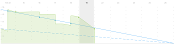
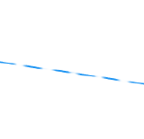
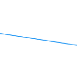
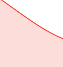
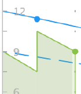

# 애자일 번다운 차트 개요

번다운 차트는 스토리가 반복을 통해 진행되는 방식을 시각적으로 보여 줍니다. 실제 번다운 속도는 반복 타임라인에 대한 이상적인 번다운 속도에 대해 측정된다.

번다운 차트는 선택한 날짜에 따라 조정됩니다. 현재 날짜가 기본값입니다. 이전 날짜를 선택하면 번다운 차트의 모든 데이터와 번다운 차트 위의 [!UICONTROL 완료 상태] 섹션의 모든 값이 다시 계산되어 선택한 날짜가 끝날 때의 데이터를 나타냅니다. (지난 일 수 또는 현재 일을 선택할 수 있으며 미래 일은 선택할 수 없습니다.)

## 시각 표시기

번다운 차트에는 다음과 같은 시각적 표시기가 포함되어 있습니다.

<table style="table-layout:auto"> 
 <col> 
 <col> 
 <tbody> 
  <tr> 
   <td role="rowheader">  </td> 
   <td> 
반복이 시작된 시기를 기준으로 이상적인 번다운 비율.
 
이 선은 반복 범위가 변경되지 않는 경우(시간이나 포인트가 추가 또는 제거되지 않음) 표시되지 않습니다.
 
이 선은 휴무일에 작업을 마치면 평평하게 표시됩니다. 자세한 내용은 <a title="애자일 번다운 차트 사용" href="#how-days-off-affect-the-burndown-chart" class="MCXref xref">휴무가 번다운 차트에 미치는 영향</a>을 참조하십시오.
 </td> 
  </tr> 
  <tr> 
   <td role="rowheader">  </td> 
   <td> 
현재 스토리 또는 작업을 기반으로 이상적인 번다운 속도.
 
반복이 시작된 후 반복에 시간 또는 점을 추가하거나 제거할 때 현재의 이상적인 번다운 속도(단색 파란색 선)는 원래의 이상적인 번다운 속도(점선 파란색 선)와 다릅니다.
 
이 라인은 쉬는 날 작업이 완료되면 평면으로 표시됩니다.
 
자세한 내용은 <a title="애자일 번다운 차트 사용" href="#how-days-off-affect-the-burndown-chart" class="MCXref xref">휴무가 번다운 차트에 미치는 영향</a>을 참조하십시오.
 </td> 
  </tr> 
  <tr> 
   <td role="rowheader">  </td> 
   <td> 
번다운 비율이 이상보다 낮을 때 실제 번다운 비율은 빨간색으로 표시됩니다(이상적인 번다운 계산보다 하루 더 많은 포인트 또는 남은 시간).
 
다음 공식을 사용하여 실제 번다운 비율을 계산합니다.
 
[SUM(진행 중인 작업의 포인트 또는 시간 값 * 완료율) + 완료된 작업의 포인트 또는 시간 값]
 </td> 
  </tr> 
  <tr> 
   <td role="rowheader">  </td> 
   <td> 
실제 번다운 비율은 번다운 비율이 이상적 이상일 때(이상적인 번다운 계산보다 하루 남은 포인트 같거나 적은 경우) 녹색으로 표시됩니다.
 
다음 공식을 사용하여 실제 번다운 비율을 계산합니다.
 
[SUM(진행 중인 작업의 포인트 또는 시간 값 * 완료율) + 완료된 작업의 포인트 또는 시간 값]
 </td> 
  </tr> 
  <tr> 
   <td role="rowheader">  </td> 
   <td> 
범위 변경(시간 또는 포인트가 반복에서 추가 또는 제거됨).
 
범위 변경은 항상 한 낮에 세로선으로 표시됩니다. 또한 범위 변경이 발생한 모든 날의 중간에 파란색 점이 표시됩니다.
 
번다운 차트의 세로 축은 스토리 포인트 또는 시간을 보여 줍니다.
 </td> 
  </tr> 
  <tr> 
   <td role="rowheader">  </td> 
   <td> 
날짜 범위 변경(반복 기간이 증가하거나 감소함).
 
이터레이션 지속 시간이 변경된 모든 날의 중간에 파란색 점이 표시됩니다.
 </td> 
  </tr> 
  <tr> 
   <td role="rowheader">  </td> 
   <td> 
작업을 소각할 때마다 실제 소각률에는 녹색 또는 빨간색 점이 표시됩니다. (그 날의 실제 소진률이 빨간색인 경우 점은 빨간색이고, 그 날의 실제 소진률이 녹색인 경우 점은 녹색입니다.)
 
다음 중 하나가 발생하면 작업이 구워집니다.
 
    <ul> 
     <li> 스토리에서 [!UICONTROL Percent Complete]가 증가합니다. [!UICONTROL Percent Complete]는 다음과 같은 경우 증가합니다. 
      <ul> 
       <li> 
수동으로 변경됨
 </li> 
       <li> 
스토리에 포인트 또는 시간이 업데이트됩니다
 </li> 
      </ul></li>  
     <li>스토리의 상태가 [!UICONTROL Complete](으)로 변경되었습니다.</li> 
    </ul> </td> 
  </tr> 
 </tbody> 
</table>

## 휴무가 번다운 차트에 미치는 영향 {#how-days-off-affect-the-burndown-chart}

[!DNL Workfront]에 정의된 기본 일정은 번다운에서 휴일(주말 및 휴일)을 제외하여 번다운 차트에 영향을 줍니다. 번다운 차트는에 설명된 대로 기본 일정을 사용하여 근무일을 정의합니다  [일정 만들기](../../../administration-and-setup/set-up-workfront/configure-timesheets-schedules/create-schedules.md)).

민첩한 팀은 대체 일정을 정의하여 팀별 비근무일을 통합할 수 있습니다([번다운 차트에 대체 팀 일정 사용](../../../agile/use-scrum-in-an-agile-team/burndown/use-alt-team-schedule-burndown-charts.md)에 설명된 대로). 그런 다음 이 대체 일정이 팀에 할당된 모든 반복의 번다운 차트에 반영됩니다. 대체 예약은 번다운 차트에만 영향을 줍니다.

휴무일은 다음과 같은 경우에만 번다운 차트에 반영됩니다.

* 이전에는 휴무일에 작업이 기록되었습니다. (작업이 기록된 날짜가 표시됩니다.)

  휴무일에 작업이 기록되는 경우:

   * 팀이 어떤 작업도 하기로 예정되어 있지 않으므로 이상적인 번다운 계산에 기록된 모든 작업은 포함되지 않습니다.
   * 번다운 차트에서 작업이 수행된 날이나 번다운 차트를 보고 있는 날(휴무일에 보는 경우)에 대한 이상적인 번다운 선(단색 파란색 선 및 파선 파란색 선)은 평면으로 표시됩니다.
   * 기록된 작업은 예상 완료 및 일별 평균 포인트 또는 시간 등 기타 번다운 통계를 계산할 때 포함됩니다.

* 쉬는 날 번다운 차트를 보고 있습니다. (보고 있는 날짜가 번다운 차트에 표시됩니다.)
* 쉬는 날 반복에 대해 남은 총 작업을 완료합니다.

  사용자가 휴일에 반복에 대한 남은 총 작업을 완료하면 [!UICONTROL 예상 완료] 필드에 반복이 완료된 날짜가 표시됩니다.

  반복을 계획할 때 비작업 날짜에 대한 반복 종료 날짜를 설정하고 반복이 제때 완료되도록 추적하는 경우, [!UICONTROL 예상 완료] 날짜는 사용자가 설정한 반복 종료 날짜 이전의 마지막 작업 날짜에 대해 설정됩니다(작업이 비작업 날짜에 구상되도록 예약되어 있지 않기 때문).

  [반복 만들기](../../../agile/use-scrum-in-an-agile-team/iterations/create-an-iteration.md) 문서에 설명된 대로 반복을 계획하면 반복 종료 날짜가 지정됩니다.
