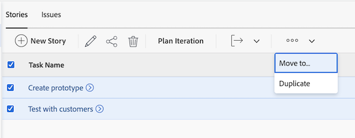

# 반복 만들기

반복은 작업 용량 계획에서 스크럼 애자일 팀의 주요 구성 요소입니다. [!DNL Adobe Workfront]을(를) 사용하면 스크럼 애자일 팀이 팀 요구 사항에 맞게 여러 반복을 만들어 작업을 관리할 수 있습니다.

## 액세스 요구 사항

+++ 을 확장하여 이 문서의 기능에 대한 액세스 요구 사항을 봅니다.

<table style="table-layout:auto"> 
 <col> 
 </col> 
 <col> 
 </col> 
 <tbody> 
  <tr> 
   <td role="rowheader">Adobe Workfront 패키지</td> 
   <td> 
임의
 </td> 
  </tr> 
  <tr> 
   <td role="rowheader">Adobe Workfront 라이선스</td> 
   <td> 
밝거나 높음
 
   
검토 이상
 </td> 
  </tr>
 </tbody> 
</table>

이 표의 정보에 대한 자세한 내용은 [Workfront 설명서의 액세스 요구 사항](/help/quicksilver/administration-and-setup/add-users/access-levels-and-object-permissions/access-level-requirements-in-documentation.md)을 참조하십시오.

+++

## 반복 추가

목록에 반복을 추가하여 반복을 신속하게 만들고 작업 및 문제를 나중에 추가할 수 있습니다.

{{step1-to-team}}

1. (선택 사항) **[!UICONTROL 팀 전환]** 아이콘 을 클릭한 다음 드롭다운 메뉴에서 새 스크럼 팀을 선택하거나 검색 창에서 팀을 검색합니다.

1. **[!UICONTROL 반복]** 탭에서 **[!UICONTROL 반복 추가]**&#x200B;를 클릭합니다.

   

1. 다음을 지정합니다.

   <table style="table-layout:auto">
    <col> 
    <col> 
    <tbody> 
     <tr> 
      <td role="rowheader"><strong>[!UICONTROL 반복 이름]</strong></td> 
      <td>반복의 이름을 입력합니다.</td> 
     </tr> 
     <tr> 
      <td role="rowheader"><strong>[!UICONTROL 목표]</strong></td> 
      <td>반복에 대한 목표를 추가합니다.</td> 
     </tr> 
     <tr> 
      <td role="rowheader"><strong>[!UICONTROL 시작 날짜]</strong></td> 
      <td>반복이 시작될 날짜를 입력합니다.</td> 
     </tr> 
     <tr> 
      <td role="rowheader"><strong>[!UICONTROL 종료 날짜]</strong></td> 
      <td>
반복이 종료되어야 하는 날짜를 입력합니다. [!DNL Workfront]에서는 시작 날짜로부터 4주를 넘지 않도록 종료 날짜를 설정할 것을 권장합니다.

팁: 종료일로 근무일을 선택해야 합니다. 번다운 차트는 계산에 작업일만 사용합니다. 기본적으로 번다운 차트는 <a href="../../../administration-and-setup/set-up-workfront/configure-timesheets-schedules/create-schedules.md" class="MCXref xref">일정 만들기</a>에 설명된 대로 기본 일정을 사용하여 작업일을 정의합니다. 또는 팀별 휴무일을 통합하기 위해 애자일 팀은 <a href="../../../agile/get-started-with-agile-in-workfront/create-an-agile-team.md" class="MCXref xref">애자일 팀 만들기</a>의 "번다운 차트에 대한 대체 팀 일정 정의"에 설명된 대로 대체 일정을 사용하도록 선택할 수 있습니다.
</td> 
     </tr> 
     <tr> 
      <td role="rowheader"><strong>[!UICONTROL Capacity]</strong></td> 
      <td> 반복에 사용할 용량을 지정합니다. 팀이 반복에서 달성할 수 있는 포인트 또는 시간 수입니다. 입력한 숫자는 반복에 있는 모든 스토리의 합계에서 나온 포인트 또는 시간 수보다 크거나 같아야 합니다. [!DNL Workfront]은(는) 기본적으로 이 필드를 50개 용량으로 미리 채웁니다. </td> 
     </tr> 
     <tr> 
      <td role="rowheader"><strong>[!UICONTROL Focus]</strong></td> 
      <td>팀의 포커스 비율을 지정합니다. 팀의 모든 구성원이 이 반복에 완전히 집중하게 되면 포커스는 100%가 됩니다. [!DNL Workfront]이(가) 기본적으로 이 필드를 100%로 미리 채웁니다. </td> 
     </tr> 
    </tbody> 
   </table>

1. **[!UICONTROL 반복 추가]**&#x200B;를 클릭합니다. 반복을 만들었으므로 이제 스토리를 추가해야 합니다. 자세한 내용은 [기존 반복에 스토리 추가](../../../agile/use-scrum-in-an-agile-team/iterations/add-stories-to-existing-iteration.md)를 참조하십시오.

## [!UICONTROL 백로그] 탭에서 반복을 계획합니다

백로그에 있는 작업을 사용하여 반복을 만들려면 [!UICONTROL 반복 계획] 기능을 사용하십시오.

{{step1-to-team}}

1. (선택 사항) **[!UICONTROL 팀 전환]** 아이콘 을 클릭한 다음 드롭다운 메뉴에서 새 스크럼 팀을 선택하거나 검색 창에서 팀을 검색합니다.

1. 왼쪽 패널에서 **[!UICONTROL 백로그]**&#x200B;를 선택합니다.

1. **스토리** 또는 **문제** 탭에서 반복에 추가할 작업 항목을 선택한 다음 **[!UICONTROL 반복 계획]**&#x200B;을 클릭합니다.

>[!NOTE]
>
> 백로그 탭에서 반복을 계획할 때 스토리 또는 문제 탭 간을 전환하거나 추가 작업을 추가할 수 없습니다. 반복이 생성되면 기존 스토리 또는 문제를 추가할 수 있습니다. 자세한 내용은 아래의 [백로그 탭에서 기존 반복에 작업 또는 문제 추가](#add-tasks-or-issues-to-an-existing-iteration-on-the-backlog-tab)를 참조하십시오.

1. 다음 정보를 지정합니다.

   <table style="table-layout:auto"> 
    <col> 
    <col> 
    <tbody> 
     <tr> 
      <td role="rowheader"><strong>[!UICONTROL 반복 이름]</strong></td> 
      <td>반복의 이름을 지정합니다.</td> 
     </tr> 
     <tr> 
      <td role="rowheader"><strong>[!UICONTROL 시작 날짜]</strong></td> 
      <td> 반복을 시작해야 하는 날짜를 지정합니다.</td> 
     </tr> 
     <tr> 
      <td role="rowheader"><strong>[!UICONTROL 종료 날짜]</strong> </td> 
      <td>
반복이 종료되어야 하는 날짜를 지정합니다. [!DNL Workfront]에서는 시작 날짜로부터 4주를 넘지 않도록 종료 날짜를 설정할 것을 권장합니다.

팁: 종료일로 근무일을 선택해야 합니다. 번다운 차트는 계산에 작업일만 사용합니다. 기본적으로 번다운 차트는 <a href="../../../administration-and-setup/set-up-workfront/configure-timesheets-schedules/create-schedules.md" class="MCXref xref">일정 만들기</a>에 설명된 대로 기본 일정을 사용하여 작업일을 정의합니다. 또는 팀별 휴무일을 통합하기 위해 애자일 팀은 대체 일정을 사용하도록 선택할 수 있습니다(<a href="../../../agile/use-scrum-in-an-agile-team/burndown/use-alt-team-schedule-burndown-charts.md" class="MCXref xref">번다운 차트에 대체 팀 일정을 사용</a>에 설명된 대로).
</td> 
     </tr> 
     <tr> 
      <td role="rowheader"><strong>[!UICONTROL Focus]</strong></td> 
      <td>팀의 포커스 비율을 지정합니다. 팀의 모든 구성원이 이 반복에 완전히 집중하게 되면 포커스는 100%가 됩니다. [!DNL Workfront]이(가) 이 필드를 팀의 과거 반복 횟수의 평균 값으로 미리 채웁니다. 팀의 첫 번째 반복인 경우 이 필드 값은 기본적으로 0입니다.</td> 
     </tr> 
     <tr> 
      <td role="rowheader"> <strong>[!UICONTROL Capacity]</strong></td> 
      <td> 반복에 사용할 용량을 지정합니다. 팀이 반복에서 달성할 수 있는 포인트 또는 시간 수입니다. 입력한 숫자는 반복에 있는 모든 스토리의 합계에서 나온 포인트 또는 시간 수보다 크거나 같아야 합니다. [!DNL Workfront]이(가) 이 필드를 팀의 과거 반복 횟수의 평균 값으로 미리 채웁니다. 팀의 첫 번째 반복인 경우 이 필드 값은 기본적으로 0입니다.</td> 
     </tr> 
     <tr> 
      <td role="rowheader"> <strong>[!UICONTROL 목표]</strong></td> 
      <td> 반복에 대한 목표를 지정합니다. 이 필드는 필수가 아닙니다.</td> 
     </tr> 
    </tbody> 
   </table>

1. **[!UICONTROL 저장]을 클릭합니다.** 반복이 만들어집니다.

## 백로그 탭의 기존 반복에 작업 또는 문제 추가

1. **백로그** 탭에서 **스토리** 또는 **문제** 탭을 클릭합니다.

1. 반복에 추가할 스토리 또는 문제를 선택합니다. 백로그 상단에 있는 스토리가 더 높은 우선 순위입니다.

   

   >[!NOTE]
   >
   >  반복에 작업을 추가하면 [[!UICONTROL 작업 시작 날짜가 반복에 추가될 때 계산되는 방법 이해]에 설명된 대로 작업의 시작 날짜가 계산됩니다](#understand-how-task-start-dates-are-calculated-when-added-to-an-iteration).

## 반복에 추가할 때 작업 시작 일자를 계산하는 방법 이해 {#understand-how-task-start-dates-are-calculated-when-added-to-an-iteration}

작업을 반복에 스토리로 추가할 때 각 스토리에 대해 [!UICONTROL 작업을 완료해야 함] 제한이 사용됩니다. 대부분의 경우 작업의 계획된 시작 일자는 다음 공식을 기반으로 계산됩니다.

[!UICONTROL 반복 종료 날짜]에서 [!UICONTROL 작업 기간]을 뺀 값은 [!UICONTROL 작업 계획 시작 날짜]입니다.

프로젝트 시작 날짜가 반복 시작 날짜 이후이고 프로젝트 종료 날짜가 반복 종료 날짜 이후인 경우 [!UICONTROL 프로젝트 종료 날짜]이(가) 반복 종료 날짜 대신 사용됩니다.

개별 스크럼 팀이 반복 날짜가 아닌 프로젝트 날짜를 기본적으로 사용하도록 구성할 수 있습니다. 자세한 내용은 [스크럼 구성](../../../agile/get-started-with-agile-in-workfront/configure-scrum.md#configure-how-dates-are-applied-when-adding-work-items-to-an-iteration) 문서의 [반복에 작업 항목을 추가할 때 날짜가 적용되는 방법 구성](../../../agile/get-started-with-agile-in-workfront/configure-scrum.md) 섹션을 참조하십시오.
