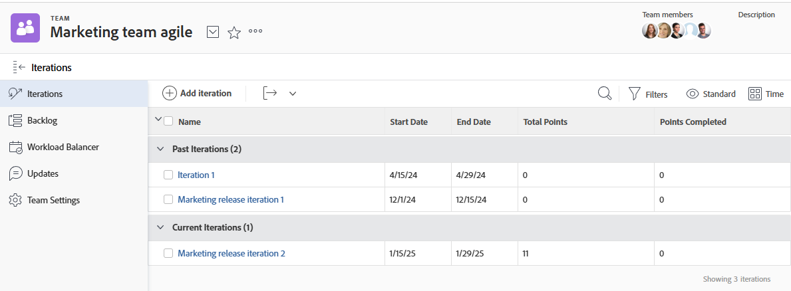

# 반복 보기

주어진 팀에 대한 모든 이터레이션을 보거나 개별 이터레이션을 볼 수 있습니다. 반복에는 반복에 포함된 스토리, 문제 및 문서에 대한 데이터가 표시됩니다.

## 액세스 요구 사항

+++ 을 확장하여 이 문서의 기능에 대한 액세스 요구 사항을 봅니다.

<table style="table-layout:auto"> 
 <col> 
 </col> 
 <col> 
 </col> 
 <tbody> 
  <tr> 
   <td role="rowheader">Adobe Workfront 패키지</td> 
   <td> 
임의
 </td> 
  </tr> 
  <tr> 
   <td role="rowheader">Adobe Workfront 라이선스</td> 
   <td> 
밝거나 높음
 
   
검토 이상
 </td> 
  </tr>
 </tbody> 
</table>

이 표의 정보에 대한 자세한 내용은 [Workfront 설명서의 액세스 요구 사항](/help/quicksilver/administration-and-setup/add-users/access-levels-and-object-permissions/access-level-requirements-in-documentation.md)을 참조하십시오.

+++

## 주어진 팀에 할당된 반복 보기

{{step1-to-team}}

1. (선택 사항) **[!UICONTROL 팀 전환]** 아이콘 을 클릭한 다음 드롭다운 메뉴에서 새 스크럼 팀을 선택하거나 검색 창에서 팀을 검색합니다.

1. 왼쪽 패널에서 **[!UICONTROL 반복]**&#x200B;을 선택하여 특정 반복을 선택하거나 **[!UICONTROL 현재 반복]**&#x200B;을 선택합니다.

   

   >[!NOTE]
   >
   >**[!UICONTROL 현재 반복]**&#x200B;은(는) 레이아웃 템플릿에 할당되고 반복에 하나 이상의 작업 또는 문제가 있는 경우에만 왼쪽 패널에 표시됩니다. 자세한 내용은 [레이아웃 템플릿을 사용하여 왼쪽 패널 사용자 지정](/help/quicksilver/administration-and-setup/customize-workfront/use-layout-templates/customize-left-panel.md)을 참조하십시오.

1. (선택 사항) 보려는 특정 이터레이션의 이름을 클릭합니다.
반복 스토리가 표시됩니다.

   ![[!UICONTROL 반복의 스토리]](assets/iteration-stories-list.png)
