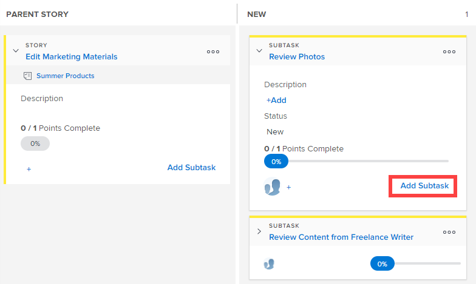

# [!UICONTROL Scrum] 게시판의 기존 스토리에 하위 작업 추가

기존 스토리에 대한 하위 작업을 만들 때는 다음 사항에 유의하십시오.

**프로젝트의 [!UICONTROL 완료 모드] 설정이 [!UICONTROL 수동]:**(으)로 설정된 경우

* 하위 작업이 있는 상위 스토리를 [!UICONTROL 완료]&#x200B;(으)로 이동하면 상위 스토리가 100%로 업데이트되고 [!UICONTROL 상태]이 [!UICONTROL 완료]&#x200B;(으)로 업데이트됩니다. 하위 작업은 업데이트되지 않습니다.
* 스토리에 대한 [!UICONTROL 완료율]을 업데이트하려면 개체의 [!UICONTROL 스토리] 탭 또는 [!UICONTROL 세부 정보] 페이지에서 업데이트해야 합니다.

**프로젝트에 대한 [!UICONTROL 완료 모드] 설정이 [!UICONTROL 자동]**(으)로 설정된 경우:

* 하위 작업이 있는 상위 스토리를 [!UICONTROL 완료]&#x200B;(으)로 이동하면 상위 스토리가 100%로 업데이트되고 [!UICONTROL 상태]이 [!UICONTROL 완료]&#x200B;(으)로 업데이트됩니다. 하위 작업도 100%로 업데이트되고 [!UICONTROL 상태]가 [!UICONTROL 완료]&#x200B;(으)로 업데이트됩니다.
* 스토리에 대한 [!UICONTROL 완료율]을 업데이트하려면 하위 작업에 대해 [!UICONTROL 완료율]을 업데이트해야 합니다. 스토리에 대한 [!UICONTROL 완료율]은(는) 모든 하위 작업의 [!UICONTROL 완료율]을(를) 기반으로 계산됩니다.

## 액세스 요구 사항

+++ 을 확장하여 이 문서의 기능에 대한 액세스 요구 사항을 봅니다.

이 문서의 단계를 수행하려면 다음 액세스 권한이 있어야 합니다.

<table style="table-layout:auto"> 
 <tbody> 
  <tr> 
   <td role="rowheader">[!DNL Adobe Workfront] 플랜</td> 
   <td> 
임의
 </td> 
  </tr> 
  <tr> 
   <td role="rowheader">[!DNL Adobe Workfront] 라이센스</td> 
   <td> 
새로운 기능: [!UICONTROL Standard]
 
   또는
   
현재: [!UICONTROL Work] 이상
 </td> 
  </tr>
   <tr> 
   <td role="rowheader">개체 권한</td> 
   <td>하위 작업이 있는 작업에 대한 [!UICONTROL 기여] 또는 [!UICONTROL 관리] 액세스 권한 </td> 
  </tr>
 </tbody> 
</table>

이 표의 정보에 대한 자세한 내용은 [Workfront 설명서의 액세스 요구 사항](/help/quicksilver/administration-and-setup/add-users/access-levels-and-object-permissions/access-level-requirements-in-documentation.md)을 참조하십시오.

+++

## 스크럼 보드의 기존 스토리에 하위 작업 추가

{{step1-to-team}}

1. (선택 사항) **[!UICONTROL 팀 전환]** 아이콘 을 클릭한 다음 드롭다운 메뉴에서 새 스크럼 팀을 선택하거나 검색 창에서 팀을 검색합니다.

1. 하위 작업을 추가하려는 스토리가 포함된 애자일 반복 또는 프로젝트로 이동합니다. 반복으로 이동하는 방법에 대한 자세한 내용은 [반복 보기](../../../agile/use-scrum-in-an-agile-team/iterations/view-iteration.md)를 참조하십시오.
1. 하위 작업을 추가할 스토리 보드의 스토리 타일로 이동합니다.
1. 스토리에 하위 작업을 만들려면 기본 스토리 카드에서 **[!UICONTROL 하위 작업 추가]**&#x200B;를 클릭하십시오.

   

   또는

   하위 작업 타일에서 **[!UICONTROL 하위 작업 추가]**&#x200B;를 클릭하여 하위 작업에 대한 하위 작업을 만듭니다.

   [!DNL Workfront]에서 무제한 수준의 하위 작업을 지원하지만 애자일 스토리 보드에는 두 수준(하위 작업의 하위 작업)만 표시됩니다.

   

   현재 수영장이 없는 스토리에 하위 작업을 추가하면 상위 작업이 [!UICONTROL 상위 스토리] 열로 승격되고 하위 작업이 수영장 내부로 이동합니다.

1. 다음 정보를 지정합니다.

   <table style="table-layout:auto">
    <col>
    <col>
    <tbody>
     <tr>
      <td role="rowheader"><strong>[!UICONTROL 하위 작업 이름]</strong></td>
      <td> 하위 작업의 이름을 지정합니다.</td>
     </tr>
     <tr>
      <td role="rowheader"><strong>[!UICONTROL 설명]</strong></td>
      <td>하위 작업에 대한 설명을 지정합니다.</td>
     </tr>
     <tr>
      <td role="rowheader"><strong>[!UICONTROL Estimate]</strong></td>
      <td>하위 작업에 대한 예상 값을 지정합니다. 
예상 값을 생성할 때는 다음 사항에 유의하십시오.

       <ul>
        <li>애자일 팀이 스토리를 포인트 단위로 추정하도록 구성된 경우 기본적으로 1포인트는 8시간입니다. 예상 시간이 스토리에 [!UICONTROL 계획된 시간]으로 추가됩니다.</li>
        <li>모든 하위 작업에 대한 예상 값을 조합하면 상위 스토리의 예상 값이 결정됩니다. 자세한 내용은 <a href="../../../agile/use-scrum-in-an-agile-team/scrum-board/update-status-of-stories-and-subtasks.md" class="MCXref xref">스크럼 보드에서 스토리 및 하위 작업 상태 업데이트</a>를 참조하십시오.</li>
        <li>새 하위 작업을 만들 때 [!UICONTROL 예상] 필드가 이미 설정되어 있습니다. 하위 작업에 대한 예측을 재설정하면 상위 스토리에 대한 예측이 재설정됩니다(상위 스토리가 모든 하위 작업의 합계이므로).</li>
       </ul> </td>
     </tr>
     <tr>
      <td role="rowheader"><strong>[!UICONTROL 계획된 시간]</strong></td>
      <td> (프로젝트에서만 사용 가능) 작업의 계획된 시간을 지정합니다.</td>
     </tr>
     <tr>
      <td role="rowheader"><strong>[!UICONTROL Assignment]</strong></td>
      <td>하위 작업을 지정할 팀의 이름을 입력한 다음 드롭다운 목록에 나타나면 해당 이름을 클릭합니다.</td>
     </tr>
    </tbody>
   </table>

1. Click **[!UICONTROL Create]**.
