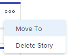

# [!UICONTROL 스크럼] 게시판에서 스토리 및 문제 관리

[!UICONTROL 스크럼] 보드에서 다른 반복이나 백로그로 스토리 또는 문제를 이동하거나 [!UICONTROL 스크럼] 보드에서 삭제할 수 있습니다. 스토리나 문제를 삭제하면 30일 동안 휴지통으로 이동되며 시스템 관리자만 복구할 수 있습니다.

작업 또는 문제를 삭제하거나 백로그로 보내지 않고 반복에서 제거하려면 프로젝트로 이동하여 할당 열에서 애자일 팀을 제거합니다. 스크럼 보드에서 작업 또는 문제가 제거되지만 프로젝트에는 유지됩니다.

## 액세스 요구 사항

+++ 을 확장하여 이 문서의 기능에 대한 액세스 요구 사항을 봅니다.

이 문서의 단계를 수행하려면 다음 액세스 권한이 있어야 합니다.

<table style="table-layout:auto"> 
 <tbody> 
  <tr> 
   <td role="rowheader">[!DNL Adobe Workfront] 플랜</td> 
   <td> 
임의
 </td> 
  </tr> 
  <tr> 
   <td role="rowheader">[!DNL Adobe Workfront] 라이센스</td> 
   <td> 
새로운 기능: [!UICONTROL Standard]
 
   또는
   
현재: [!UICONTROL Work] 이상
 </td> 
  </tr>
   <tr> 
   <td role="rowheader">개체 권한</td> 
   <td>작업 또는 문제에 대한 [!UICONTROL 관리] 액세스 권한 </td> 
  </tr>
 </tbody> 
</table>

이 표의 정보에 대한 자세한 내용은 [Workfront 설명서의 액세스 요구 사항](/help/quicksilver/administration-and-setup/add-users/access-levels-and-object-permissions/access-level-requirements-in-documentation.md)을 참조하십시오.

+++

## [!UICONTROL 스크럼] 보드에서 스토리 또는 문제 이동

{{step1-to-team}}

1. **[!UICONTROL 팀 전환]** 아이콘 을 클릭한 다음 드롭다운 메뉴에서 스크럼 팀을 선택하거나 검색 막대에서 팀을 검색합니다.
1. 왼쪽 패널에서 **[!UICONTROL 반복]**&#x200B;을 선택하여 특정 반복을 선택하거나 **[!UICONTROL 현재 반복]**&#x200B;을 선택합니다.
1. 스토리 또는 문제에 대한 **[!UICONTROL 자세히]** 아이콘을 클릭한 다음 **[!UICONTROL 이동]**&#x200B;을 선택합니다.

   

1. 확인 메시지에서 다음 중 하나를 선택합니다.

   <table style="table-layout:auto">
    <tr>
        <td><strong>[!UICONTROL 다른 반복]</strong></td>
        <td>항목을 다른 반복으로 이동하려면 를 선택한 다음 스토리 또는 문제가 이동할 반복을 선택합니다. 미래 이터레이션이 정의되지 않은 경우 항목을 이동할 수 없습니다.</td>
    </tr>
    <tr>
        <td><strong>[!UICONTROL 백로그]</strong></td>
        <td>스토리 또는 문제를 팀의 백로그로 이동하려면 선택하십시오.</td>
    </tr>
   </table>

   >[!NOTE]
   >
   >작업 항목 [!UICONTROL 계획된 시작 일자] 및 [!UICONTROL 계획된 완료 일자]가 [!UICONTROL 팀 편집] 페이지의 설정에 영향을 받습니다. 자세한 내용은 문서 [[!UICONTROL 스크럼 구성]에서 ](../../../agile/get-started-with-agile-in-workfront/configure-scrum.md#configur5)구성[, 작업 항목을 반복에 추가할 때 날짜가 적용되는 방법](../../../agile/get-started-with-agile-in-workfront/configure-scrum.md) 섹션을 참조하십시오.

1. **[!UICONTROL 이동]**&#x200B;을 클릭합니다.

## [!UICONTROL 스크럼] 보드에서 스토리 또는 문제를 삭제하십시오.

{{step1-to-team}}

1. **[!UICONTROL 팀 전환]** 아이콘 을 클릭한 다음 드롭다운 메뉴에서 스크럼 팀을 선택하거나 검색 막대에서 팀을 검색합니다.
1. 왼쪽 패널에서 **[!UICONTROL 반복]**&#x200B;을 선택하여 특정 반복을 선택하거나 **[!UICONTROL 현재 반복]**&#x200B;을 선택합니다.
1. 스토리 또는 문제에 대한 **[!UICONTROL 자세히]** 아이콘을 클릭한 다음 **[!UICONTROL 스토리 삭제]** 또는 **[!UICONTROL 문제 삭제]**&#x200B;를 선택하십시오.

   

1. 확인 메시지에서 **[!UICONTROL 예, 삭제]**&#x200B;을(를) 클릭합니다.
