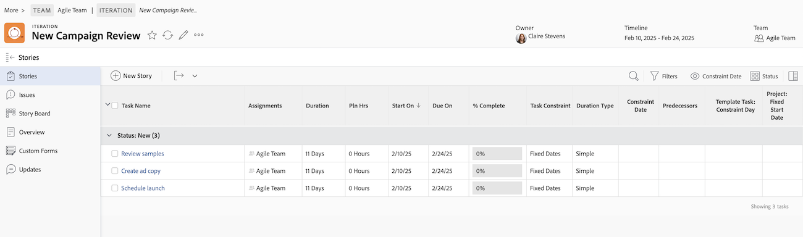

# 애자일 스토리 만들기

다양한 방법으로 반복에 대한 애자일 스토리를 만들 수 있습니다. 애자일 스토리를 만든 후 스토리에 하위 작업을 추가할 수 있습니다.

반복에 스토리 또는 하위 작업을 추가하면 기간 유형이 [!UICONTROL 단순]&#x200B;(으)로 설정되고 작업 제한 사항이 고정 날짜로 설정되며, 날짜가 반복 내에서 잠깁니다. 반복에서는 기간 유형 또는 작업 제한을 수정할 수 없습니다. 또한 작업 기간은 0분 이상이어야 합니다.

스토리가 반복에 추가된 후 관리하는 방법에 대한 자세한 내용은 [반복](../../agile/use-scrum-in-an-agile-team/iterations/iterations.md)을 참조하세요.

## 액세스 요구 사항

+++ 을 확장하여 이 문서의 기능에 대한 액세스 요구 사항을 봅니다.

<table style="table-layout:auto"> 
 <col> 
 </col> 
 <col> 
 </col> 
 <tbody> 
  <tr> 
   <td role="rowheader">Adobe Workfront 패키지</td> 
   <td> 
임의
 </td> 
  </tr> 
  <tr> 
   <td role="rowheader">Adobe Workfront 라이선스</td> 
   <td> 
표준
 
   
작업 이상
 </td> 
  </tr>
  <tr> 
   <td role="rowheader">개체 권한</td> 
   <td>스토리가 있는 프로젝트에 대한 액세스 관리 </td> 
  </tr> 
 </tbody> 
</table>

이 표의 정보에 대한 자세한 내용은 [Workfront 설명서의 액세스 요구 사항](/help/quicksilver/administration-and-setup/add-users/access-levels-and-object-permissions/access-level-requirements-in-documentation.md)을 참조하십시오.

+++

## 반복에서 애자일 스토리 만들기

1. 스토리를 만들려는 애자일 반복으로 이동합니다.

   {{step1-to-team}}

   1. (선택 사항) **[!UICONTROL 팀 전환]** 아이콘 을 클릭한 다음 드롭다운 메뉴에서 새 스크럼 팀을 선택하거나 검색 창에서 팀을 검색합니다.

   1. 왼쪽 패널에서 **[!UICONTROL 반복]**&#x200B;을 선택하여 특정 반복을 선택하거나 **[!UICONTROL 현재 반복]**&#x200B;을 선택합니다.
   1. 스토리를 만들 특정 이터레이션의 이름을 클릭합니다.

   

1. **[!UICONTROL 새 스토리]을(를) 클릭합니다.**
1. 다음 정보를 지정합니다.

   <table style="table-layout:auto">
    <col>
    <col>
    <tbody>
     <tr>
      <td role="rowheader"><strong>[!UICONTROL Story Name]</strong></td>
      <td>스토리의 이름을 입력합니다.</td>
     </tr>
     <tr>
      <td role="rowheader"><strong>[!UICONTROL 설명]</strong></td>
      <td>스토리에 대한 설명을 입력합니다.</td>
     </tr>
     <tr>
      <td role="rowheader"><strong>[!UICONTROL 준비]</strong></td>
      <td>스토리를 반복에 추가할 준비가 되면 이 옵션을 선택합니다. 이 옵션을 선택하면 백로그의 스토리를 반복에 추가할 준비가 되었음을 사용자에게 표시합니다. 스토리가 <strong>[!UICONTROL 준비]로 표시되었는지 여부에 관계없이 반복에 추가할 수 있습니다.</strong></td>
     </tr>
     <tr>
      <td role="rowheader"><strong>[!UICONTROL Estimate](포인트)</strong></td>
      <td>스토리의 예상 값을 지정합니다. 애자일 팀이 스토리를 포인트 단위로 추정하도록 구성된 경우 기본적으로 1포인트는 8시간입니다. 예상 시간이 스토리에 [!UICONTROL 계획된 시간]으로 추가됩니다. 예를 들어 스토리를 3점으로 예상하면 기본적으로 스토리에 24개의 [!UICONTROL 계획된 시간]을 추가합니다. 스토리에 하위 작업이 포함된 경우 모든 하위 작업에 대한 전체 예상 값이 상위 스토리의 예상 값을 결정합니다. 자세한 내용은 <a href="../../agile/use-scrum-in-an-agile-team/iterations/add-stories-to-existing-iteration.md" class="MCXref xref">기존 반복에 스토리 추가</a>를 참조하십시오.</td>
     </tr>
     <tr>
      <td role="rowheader"><strong>[!UICONTROL 상위 프로젝트]</strong></td>
      <td>이 스토리와 연결할 프로젝트의 이름을 입력하세요. 기본적으로 스토리 색상은 이 프로젝트의 다른 스토리와 같은 색으로 표시됩니다. 프로젝트의 상태를 [!UICONTROL Current]로 설정해야 합니다. 프로젝트의 상태가 [!UICONTROL Current]가 아니면 드롭다운 메뉴에 표시되지 않습니다.</td>
     </tr>
     <tr>
      <td role="rowheader"><strong>[!UICONTROL 상위 작업]</strong></td>
      <td>상위 프로젝트를 선택하면 상위 작업을 선택할 수 있습니다. 상위 작업을 선택하면 스토리가 선택한 프로젝트에서 상위 작업의 하위 작업으로 만들어집니다. 스토리에 대한 상위 작업의 이름을 입력한 다음 드롭다운 목록에 나타나면 해당 작업을 클릭합니다.</td>
     </tr>
     <tr>
      <td role="rowheader"><strong>[!UICONTROL 사용자 지정 Forms]</strong></td>
      <td>스토리에 추가할 사용자 정의 양식을 선택하십시오.</td>
     </tr>
    </tbody>
   </table>

1. **[!UICONTROL 스토리 저장]**&#x200B;을 클릭합니다.

## 백로그에 애자일 스토리 만들기

애자일 백로그 관리[ 문서 ](../../agile/work-in-an-agile-environment/manage-the-agile-backlog.md#creating-new-stories)관리[[!UICONTROL 의 ]백로그에 새 스토리 만들기](../../agile/work-in-an-agile-environment/manage-the-agile-backlog.md) 섹션에 설명된 대로 애자일 백로그에서 애자일 스토리를 만들 수 있습니다.

## 작업 또는 문제를 애자일 스토리로 추가

기존 작업 또는 문제를 반복에 스토리로 추가할 수 있습니다. 자세한 내용은 [기존 반복에 스토리 추가](../../agile/use-scrum-in-an-agile-team/iterations/add-stories-to-existing-iteration.md) 또는 [[!UICONTROL 스크럼] 보드에서 스토리 및 문제 추가](../../agile/use-scrum-in-an-agile-team/scrum-board/add-story-from-scrum-board.md)를 참조하십시오.

## 애자일 스토리에 하위 작업 만들기

다음 방법 중 하나를 사용하여 애자일 스토리에 대한 하위 작업을 만들 수 있습니다.

* **[!UICONTROL 하위 작업 만들기]**&#x200B;의 [하위 작업 만들기](../../manage-work/tasks/create-tasks/create-subtasks.md#creating-subtasks)에 설명된 대로 [하위 작업](../../manage-work/tasks/create-tasks/create-subtasks.md) 탭을 사용합니다.

* [반복 만들기](../../agile/use-scrum-in-an-agile-team/iterations/create-an-iteration.md)에 설명된 대로 스토리 보드에서 직접 가져옵니다.
