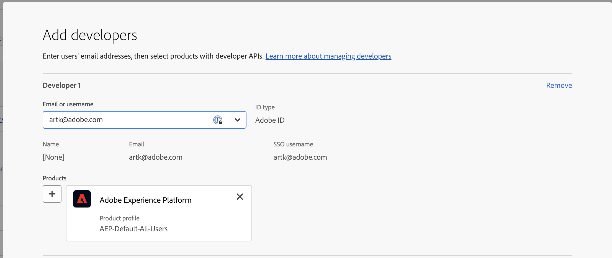
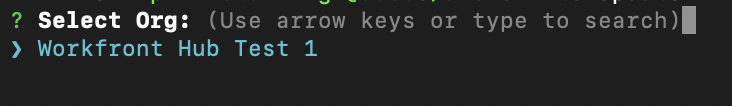
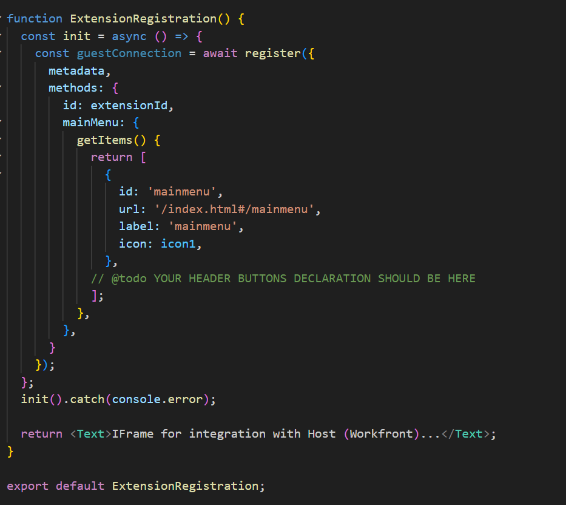
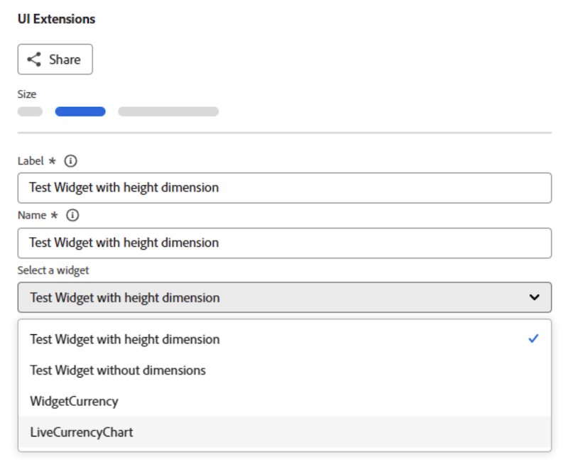

# Adobe App Builder을 사용하여 Workfront에 대한 맞춤형 애플리케이션 만들기

Adobe App Builder에서 제공하는 Workfront UI 확장을 사용하면 고객 및 파트너가 사용자 지정된 사용자 경험을 만들 수 있습니다. 이러한 도구를 통해 효율성을 높이고 원활하고 연결된 경험을 제공하며 사용자 만족도를 크게 향상시킬 수 있을 뿐만 아니라 기업이 고유한 비전을 실현하는 데 도움이 됩니다.

예를 들어 Workfront UI 확장이 없는 경우 프로젝트 관리자는 시간을 기록하기 위해 Workfront과 별도의 시간 추적 시스템 간을 전환해야 할 수 있습니다. UI 확장을 사용하면 시간 추적을 Workfront 환경에 직접 통합할 수 있으므로 워크플로를 간소화하고 시간을 절약할 수 있습니다. 또한 사용자 지정 구성 요소를 추가하여 유용성을 개선하고, 반복적인 작업을 자동화하고, 메타데이터 태그 지정 및 콘텐츠 미리 보기와 같은 기능을 통해 콘텐츠 관리를 향상시킬 수 있습니다. 또한 Adobe App Builder은 확장성과 강력한 IMS(ID 관리)를 제공하여 규모에 관계없이 안전하고 효율적인 사용자 지정을 보장합니다.

Workfront UI 확장은 다음과 같은 몇 가지 주요 이점을 제공합니다.

* 정확한 맞춤형 구성: 표준 소프트웨어 인터페이스는 대부분의 경우 모든 비즈니스 요구 사항을 충족하지 못합니다. UI 확장을 사용하면 개발자가 특정 비즈니스 요구 사항을 해결하기 위해 기본 사용자 인터페이스를 수정하고 확장할 수 있습니다.
* 시스템 통합: UI 확장을 사용하면 다른 시스템의 통합을 용이하게 하여 원활한 워크플로우와 데이터 일관성을 보장할 수 있습니다.
* 확장성: 비즈니스 성장에 따라 UI 확장을 개발하여 시스템을 완전히 정비하지 않고도 새로운 기능을 추가할 수 있습니다.
* 개발 시간 단축: 사전 구축된 확장 지점 및 도구를 통해 사용자 정의 기능을 구현하는 데 필요한 시간과 노력을 크게 줄일 수 있습니다.
* 향상된 사용자 채택: 최적화된 사용자 경험을 통해 소프트웨어 채택을 크게 향상시킬 수 있습니다. 사용자 환경 설정에 맞게 디자인된 사용자 정의 UI 요소를 통해 채택률과 전반적인 만족도를 향상시킬 수 있습니다.
* Workfront UI 확장 기능을 활용하여 기업은 효율성, 통합 및 사용자 만족도를 높이는 맞춤형 사용자 경험을 만들 수 있습니다.

Adobe App Builder에서 애플리케이션을 만든 후 Workfront 관리자가 레이아웃 템플릿을 사용하여 Workfront 메인 메뉴 및 왼쪽 탐색 패널에 추가할 수 있습니다. 애플리케이션을 클릭한 레이아웃 템플릿을 사용하는 사용자는 애플리케이션을 별도로 열지 않고도 Workfront에 임베드된 애플리케이션을 볼 수 있습니다.

이 문서에서는 App Builder에 액세스하고 템플릿을 사용하여 애플리케이션을 만드는 방법을 설명합니다.

레이아웃 템플릿에 사용자 지정 응용 프로그램을 추가하는 방법에 대한 자세한 내용은 [레이아웃 템플릿을 사용하여 기본 메뉴 사용자 지정](/help/quicksilver/administration-and-setup/customize-workfront/use-layout-templates/customize-main-menu.md) 및 [레이아웃 템플릿을 사용하여 왼쪽 패널 사용자 지정](/help/quicksilver/administration-and-setup/customize-workfront/use-layout-templates/customize-left-panel.md)을 참조하십시오.

## 전제 조건

다음 항목이 있어야 합니다.

* IMS 지원 Workfront 계정
* 노드 v18 및 npm이 있는 개발 시스템
* App Builder 라이선스

## Adobe App Builder 액세스

UI 확장을 만들려면 Adobe Developer Console에서 Adobe App Builder에 액세스할 수 있어야 합니다.

추가 지침은 [Adobe Developer 사이트](https://developer.adobe.com/uix/docs/guides/get-access/)에서 확인할 수 있습니다.

### Adobe Admin Console에 개발자 추가

>[!IMPORTANT]
>
>다음 모든 단계에 대해 올바른 IMS 조직을 선택했는지 확인하십시오. 여러 조직에 속해 있는 경우 잘못된 조직을 선택할 수 있습니다. 일반적으로 오른쪽 상단 모서리에 나열되어 있는 올바른 조직 아래에서 작업하고 있는지 확인합니다.

1. 프로덕션으로 이동: https://adminconsole.adobe.com/

1. **사용자** 섹션에서 **개발자** > **개발자 추가**&#x200B;를 클릭합니다.

   

   >[!NOTE]
   >
   >개발자를 관리하는 옵션이 표시되지 않으면 개발자 액세스를 허용하는 제품이 없는 것입니다.

1. 사용자 이메일을 추가합니다. Admin Console 내에서 이미 추가된 기존 사용자를 검색해야 합니다.

1. 필요한 제품을 개발자 프로필에 추가하고 **저장**&#x200B;을 클릭합니다.\
   

### App Builder 액세스 권한 얻기

조직이 App Builder을 구매하려면 계정 관리자와 협력해야 합니다.

AppBuilder가 제대로 구성된 경우 새 프로젝트를 만드는 과정의 일부로 템플릿에서 프로젝트 만들기 가 표시됩니다.

## Adobe Developer Console에서 새 프로젝트 만들기

Adobe Developer Console을 사용하여 UI 확장을 빌드해야 합니다.

추가 지침은 [Adobe Developer 사이트](https://developer.adobe.com/uix/docs/guides/creating-project-in-dev-console/)에서 확인할 수 있습니다.

1. Adobe ID을 사용하여 Adobe Developer Console에 로그인합니다.

1. 계정, 프로필 또는 조직을 선택합니다.

1. 빠른 시작 영역에서 **템플릿으로 프로젝트 만들기**&#x200B;를 클릭하거나 **새 프로젝트 만들기 > 템플릿으로 프로젝트**&#x200B;를 클릭합니다.

   >[!IMPORTANT]
   >
   >템플릿에서 프로젝트를 만드는 옵션이 표시되지 않으면 Admin Console에서 잘못 구성된 것이므로 App Builder 카탈로그에 액세스할 수 없습니다. 이 옵션은 AppBuilder에 액세스할 수 있는 경우에만 표시됩니다.

   

1. **App Builder**&#x200B;을(를) 선택합니다.

1. **프로젝트 제목** 및 **앱 이름**&#x200B;을 입력하십시오. 두 가지 모두 기본값이 있지만 값을 사용자 지정하면 나중에 원하는 프로젝트를 더 쉽게 식별할 수 있습니다.

1. **런타임 포함**&#x200B;을 선택한 상태로 둡니다.

1. **저장**&#x200B;을 클릭합니다.

## Adobe Developer(aio) CLI 사용

Adobe에서는 App Builder 애플리케이션을 만드는 데 사용할 수 있는 오픈 소스 CLI를 제공합니다.

추가 지침은 GitHub 및 Adobe Developer 사이트에서 확인할 수 있습니다.

* https://github.com/adobe/aio-cli
* https://developer.adobe.com/app-builder/docs/getting_started/first_app/

1. 도구를 설치하려면(먼저 노드 v18에 있는지 확인) `npm install -g @adobe/aio-cli`을(를) 실행합니다.
1. 터미널을 시작하고 `aio login` 명령을 사용하여 AIO에 로그인합니다. 올바른 IMS 조직에 로그인하는 데 문제가 있는 경우 `aio login -f`을(를) 시도하여 로그인 프롬프트를 강제로 표시하십시오. 올바른 IMS 조직에 로그인한 조직을 보려면 `aio where`을(를) 사용하십시오. 자세한 내용은 `aio config`을(를) 사용하십시오.
1. `aio app init example-app`을(를) 실행하여 앱 설정을 시작하려면 &quot;example-app&quot;을 앱 이름으로 바꾸십시오. 앱 이름을 잘 모를 경우 `aio console project list` 명령을 사용하여 앱 이름 목록을 볼 수 있습니다.
1. 제공된 옵션에서 조직 및 프로젝트를 선택합니다.

   
   

1. 사용 가능한 모든 템플릿을 탐색하고 프로젝트의 **@adobe/workfront-ui-ext-tpl**&#x200B;을(를) 선택하십시오.

   

1. Adobe Developer Console에서 만든 프로젝트 이름을 선택하고 입력합니다.

   

1. 응용 프로그램에 대한 프롬프트에 응답합니다.

   * 확장 이름을 지정합니다.
   * 확장 기능에 대한 설명 요약을 제공합니다.
   * 시작할 초기 버전 번호를 선택합니다.
   * &quot;다음 작업&quot; 메시지가 표시될 때 &quot;메인 메뉴 항목에 사용자 지정 단추 추가&quot;를 선택하면 템플릿에서 기본 탐색 단추에 대한 코드를 만듭니다.

   

1. 완료 를 선택하여 완료를 확인합니다. 템플릿에서 코드 생성이 진행 중입니다.

   

1. 앱 초기화가 완료되었다는 메시지가 표시될 때까지 기다립니다. 그런 다음 IDE(Visual Studio Code 권장)에서 프로젝트를 열고 src 폴더에 액세스할 수 있습니다.

   프로젝트의 폴더 및 파일에 대한 자세한 내용은 [Adobe 개발자 사이트](https://developer.adobe.com/app-builder/docs/get_started/app_builder_get_started/first-app#anatomy-of-an-app-builder-application)를 참조하십시오.

프로젝트의 폴더 및 파일에 대한 자세한 내용은 [Adobe Developer 사이트](https://developer.adobe.com/app-builder/docs/get_started/app_builder_get_started/first-app#anatomy-of-an-app-builder-application)를 참조하세요.

## VSCode에서 확장 빌드

Workfront 기본 메뉴 또는 보조 탐색(왼쪽 패널)을 통해 탐색을 활성화하려면 App.js 파일 구성이 필요합니다.

Workfront 레이아웃 템플릿에 확장을 표시하려면 ExtensionRegistration.js 파일 구성이 필요합니다.

다음 예는 UI 확장을 사용하여 Workfront 기본 메뉴 및 오브젝트의 왼쪽 패널에 사용자 정의 애플리케이션을 추가하는 방법을 보여줍니다.

### ExtensionRegistration.js 구성

Workfront 기본 메뉴에서 사용자 지정 응용 프로그램을 허용하려면 다음을 수행하십시오.

1. ExtensionRegistration.js로 이동합니다.

ExtensionRegistration 함수에는 다음 코드가 표시됩니다. 이 코드는 템플릿에서 만들었습니다. 이 코드를 추가하여 추가 메뉴 항목을 만들 수 있습니다. ID 및 URL을 바꾸십시오.

    &quot;
    mainMenu: {
    
    getItems() {
    
    반환 [
    
    {
    
    id: &#39;main-menu-label&#39;,
    
    url: &#39;/index.html#/main-menu-label&#39;,
    
    label: &#39;Main menu label&#39;,
    
    icon: icon1,
    
    },
    
    ];
    
    },
    
    }
    &quot;

1. 다음 코드 조각을 추가합니다.

   

   이 예에서는 메인 메뉴 항목을 보여 줍니다. ID, 레이블, 아이콘 및 URL을 애플리케이션에 적합한 이름으로 업데이트해야 합니다. 여러 항목을 추가할 때 ID가 고유한지 확인합니다.

1. 작업 내용을 저장합니다.

### Workfront 왼쪽 패널 탐색에서 사용자 정의 애플리케이션 허용

Workfront 왼쪽 패널 탐색에서 사용자 정의 애플리케이션을 허용하려면 다음 작업을 수행하십시오.

1. ExtensionRegistration.js로 이동합니다.
1. ExtensionRegistration 함수에서 다음 코드 조각을 추가합니다.

   ```
   secondaryNav: {
   
   TASK: {  
   
       getItems() {       return [         {           id: "TASK", 
   
   label: "My TASK",           icon: metricsIcon,           url: "/myTask",  
   
           },  
   
       ];  
   
       },  
   
   },  
   
   },  
   ```

   

   * 이 예에서는 내 작업이라는 왼쪽 패널 탐색 항목을 보여 줍니다. ID, 레이블, 아이콘 및 URL을 애플리케이션에 적합한 이름으로 업데이트해야 합니다.
   * 이 예제에서는 프로젝트 객체 유형에 대한 왼쪽 패널 탐색 항목을 보여 줍니다. Workfront에서 이러한 항목이 지원되는 각 개체에 대해 별도로 만들어야 합니다. 프로젝트, 작업, 문제, 포트폴리오 및 프로그램 등의 개체를 사용할 수 있습니다.

1. 작업 내용을 저장합니다.

### Workfront 사용자 정의 양식을 사용하여 앱 포함

양식 위젯 확장 포인트는 Workfront 사용자 정의 양식 내에 임베드할 수 있는 사용자 정의 위젯을 만들 수 있는 Adobe Workfront의 UI 확장 기능입니다. 탐색 항목이나 메뉴 옵션을 추가하는 다른 확장 지점과 달리 위젯은 사용자 정의 양식 필드 내의 전용 패널에 사용자 정의 콘텐츠를 표시하는 방법을 제공합니다.

위젯은 양식 필드로 Workfront 사용자 정의 양식에 추가할 수 있는 모듈식 UI 구성 요소입니다. 사용자 정의 기능, 데이터 시각화 또는 외부 콘텐츠를 사용자 정의 양식 인터페이스 내에 직접 표시하는 방법을 제공하므로 사용자가 양식을 작성하는 동안 사용자 정의 논리와 상호 작용할 수 있습니다.

#### 위젯 확장 구성

기본 메뉴 및 보조 탐색에 대한 UI 확장 포인트와 마찬가지로 &quot;위젯&quot; 확장 포인트는 일반적으로 `ExtensionRegistration` 필드에 있는 `ExtensionRegistration.js` 구성 요소의 메서드 개체 내에 구성됩니다. 즉, 양식 위젯을 사용하려면 app.js에서 올바른 경로를 사용하여 `extesionregistration`의 &quot;위젯&quot; 항목만 추가해야 합니다.

```
javascript 


Apply to ExtensionReg... 

widgets: { 

  getItems() { 

    return [ 

      { 

        id: "test2", 

        url: "/index.html#/widgets1", 

        label: "Test Widget with dimensions", 

        dimensions: { 

          height: 450, 

          width: 300, 

          maxHeight: 600, 

          maxWidth: 400, 

        }, 

      }, 

      { 

        id: "test", 

        url: "/index.html#/widgets1", 

        label: "Test Widget without dimensions", 

      }, 

    ]; 

  }, 

}, 
```

#### 위젯 구성 속성

**필수 속성**

* id(문자열): 위젯에 대한 고유 식별자입니다. 확장의 모든 위젯에서 고유해야 합니다.

* url(문자열): 위젯 콘텐츠의 URL 경로입니다. 위젯 구성 요소를 렌더링하는 확장의 경로를 가리켜야 합니다.

* label(string): 사용자 정의 양식 필드 선택 인터페이스에 나타나는 위젯의 표시 이름입니다.

**선택적 속성**

* dimensions(object): 위젯의 표시 차원을 지정합니다. 모든 등록 정보는 선택 사항이며 가능한 유일한 차원입니다.

* height (숫자): 위젯 높이(픽셀)

* width (number): 위젯 너비(픽셀 단위)

* maxHeight(숫자): 위젯의 최대 높이(픽셀)

* maxWidth(숫자): 위젯의 최대 너비(픽셀)

**Dimension 속성**

차원 객체를 사용하여 위젯의 크기 및 레이아웃 제한을 제어할 수 있습니다.

* 높이 및 너비: 위젯의 초기/기본 설정 크기 설정

* maxHeight 및 maxWidth: 위젯이 너무 커지지 않도록 상한을 설정합니다.

* 반응형 동작: 위젯은 이러한 제한 내에서 반응할 수 있습니다

* 양식 통합: 차원을 통해 위젯이 양식 필드 레이아웃에 잘 맞습니다.

#### Dimension 구성 예

```
// Fixed size widget 

dimensions: { 

  height: 300, 

  width: 250, 

} 

// Flexible height with width constraint 

dimensions: { 

  width: 300, 

  maxHeight: 500, 

} 

// Height constraint only 

dimensions: { 

  height: 400, 

  maxWidth: 350, 

} 

// No dimensions - uses default sizing 

{} 
```

#### 컨텍스트 데이터

위젯은 다음을 포함하여 다른 확장 포인트와 동일한 공유 컨텍스트에 액세스할 수 있습니다.

* auth: IMS 토큰을 포함한 인증 정보

* objCode: 개체 유형 코드(TASK, PROJECT, ISSUE 등)

* objID: 개체 식별자

* 호스트 이름: Workfront 인스턴스 호스트 이름

* 프로토콜: 연결 프로토콜

* 사용자: 현재 사용자 정보

* isLoginAs: 사용자가 다른 사용자로 로그인했는지 여부

* isInBulkEditing: 양식이 현재 벌크 편집 모드에 있는 경우. 이 경우 컨텍스트에는 개체 ID에 대한 여러 값이 포함됩니다.

#### Workfront 사용자 정의 양식에 위젯 추가

앱은 &quot;UI 확장&quot; 필드 유형을 사용하여 Workfront 사용자 정의 양식에 임베드할 수 있습니다. 필드를 추가한 후에는 양식 위젯을 선택하십시오. 위젯 목록은 IMS 조직의 활성 앱 또는 `extensionoverride=TRUE` 시 로컬 활성 응용 프로그램을 기반으로 합니다.

사용자 정의 양식의 

### App.js 구성

1. App.js로 이동합니다.

1. 템플릿에서 메인 메뉴 옵션의 경로를 지정합니다. 경로는 URL 경로와 이러한 경로에 대해 렌더링된 구성 요소 간의 매핑을 정의합니다. 경로를 추가하려면 다음 코드 조각을 사용하십시오. 정확한 경로와 요소를 자신의 경로로 바꾸십시오.

   ```
       <Route 
   
               exact path="custom-application" 
   
               element={<Customapplication />} 
   
           /> 
   ```

   
1. 작업 내용을 저장합니다.

응용 프로그램 개발 및 실행에 대한 자세한 내용은 [Adobe 개발자 사이트](https://developer.adobe.com/app-builder/docs/get_started/app_builder_get_started/first-app#develop-the-application)를 참조하십시오.


## 공유 컨텍스트

공유 컨텍스트는 Workfront의 데이터를 UI 확장에 공유하는 데 사용됩니다. 공유 컨텍스트를 통해 사용 가능한 데이터는 사용자 데이터와 애플리케이션 컨텍스트를 포함한다.


### 사용자

Workfront의 UI 확장 기능은 사용자 데이터를 공유합니다. 공유 컨텍스트를 통해 사용할 수 있는 사용자 개체에는 Workfront 사용자 ID와 사용자의 이메일 주소가 포함됩니다.

`user = (conn?.sharedContext?.get("user")); // {ID: '1', email: 'test@aaa.com'} userID = user.ID userEmail = user.email`

### 애플리케이션 컨텍스트

보조 탐색 확장 포인트를 사용하여 사용자 정의 응용 프로그램을 추가할 때 사용자 정의 응용 프로그램에서 프로젝트 ID 또는 문서 ID와 같은 컨텍스트 데이터를 사용하는 것이 일반적입니다. 이러한 데이터의 경우 공유 컨텍스트에는 개체 코드와 개체 ID가 포함됩니다.

다음은 문서에 대한 응용 프로그램 컨텍스트를 가져오는 예제입니다.

`context = conn?.sharedContext; // Using the connection created above, grab the document details from the host tunnel. // conn?.host?.document?.getDocumentDetails().then(setDocDetails);`

## Workfront에서 앱 테스트

Workfront용 App Builder 애플리케이션을 개발하는 동안 앱을 게시하지 않고 Workfront 내에서 테스트해야 할 수 있습니다.

App Builder 앱 내에서 로컬 개발을 위해 `aio app run`을(를) 시작할 수 있습니다. URL은 일반적으로 `https://localhost:9080`과(와) 같습니다. 또는 `aio app deploy`을(를) 실행하여 정적 Adobe 도메인을 가져올 수 있습니다. 나중에 사용할 수 있도록 이 URL을 메모해 두십시오.

그런 다음 브라우저에서 개발할 특정 페이지로 이동합니다. 개발자 도구를 열고 workfront.com 또는 workfront.adobe.com용 로컬 저장소에 액세스합니다. 여기에서 항목을 추가해야 합니다. 키로 `extensionOverride`을(를) 사용하고 값으로 이전에 언급된 App Builder URL을 사용하십시오.

구성이 올바르게 완료된 경우 Workfront에서 레이아웃 템플릿 페이지를 다시 로드하면 App Builder 애플리케이션의 버튼이 표시됩니다. 오브젝트의 기본 메뉴 및 왼쪽 패널에 앱 버튼을 추가하고 해당 영역에 앱 버튼이 올바르게 표시되는지 확인합니다.

추가 지침은 Adobe Developer 사이트에서 AEM의 예를 사용하여 확인할 수 있습니다. https://developer.adobe.com/uix/docs/guides/preview-extension-locally/

### Chrome 버전 142 이상에서 로컬 테스트를 허용하는 플래그 비활성화

Chrome 버전 142에는 로컬 네트워크 액세스 제한이 도입되었습니다. 이러한 제한 사항은 로컬 테스트 환경을 방해할 수 있습니다.

문제를 해결하려면 Chrome 설정에서 해당 플래그를 해제하여 로컬 네트워크 액세스 검사를 비활성화해야 합니다. `chrome://flags/#local-network-access-check`.

플래그를 비활성화하려면

1. Chrome을 열고 주소 표시줄에 `chrome://flags`을(를) 입력한 다음 **Enter**&#x200B;를 누릅니다.
1. 맨 위에 있는 검색 창에서 **로컬 네트워크 액세스 확인**&#x200B;을 입력하십시오.
1. **로컬 네트워크 액세스 확인** 플래그 옆에 있는 드롭다운 메뉴를 클릭하고 사용 안 함을 선택합니다.
1. 변경 내용을 적용하려면 화면 하단에 나타나는 **다시 실행** 단추를 클릭하십시오.

## 애플리케이션 게시 및 제출 승인

응용 프로그램을 게시하고 승인하려면 [Adobe Developer 사이트](https://developer.adobe.com/uix/docs/guides/publication/)의 지침을 따르십시오.
