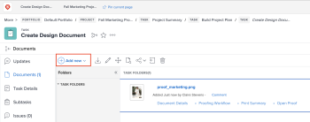

# 파일 시스템에서 Adobe Workfront에 문서 추가

Adobe Workfront의 다음 영역에서 프로젝트, 작업 또는 문제에 문서를 추가할 수 있습니다.

* 전역 문서 영역
* Workfront 개체의 문서 영역

또한 새 버전의 문서를 업로드하고 Google 드라이브, Dropbox 및 Microsoft OneDrive와 같은 타사 클라우드 공급업체의 문서에 대한 링크를 추가할 수도 있습니다. 새 버전의 문서 추가에 대한 내용은 [문서의 새 버전 업로드](../../documents/managing-documents/upload-new-document-version.md). 타사 클라우드 공급업체의 문서 추가에 대한 자세한 내용은 [외부 응용 프로그램에서 문서 연결](../../documents/adding-documents-to-workfront/link-documents-from-external-apps.md).

Workfront에 업로드할 수 있는 파일 형식 및 크기에 제한이 없습니다. 그러나 성공적으로 업로드하려면 5분 이내에 완료해야 하며 충분한 저장 공간이 있어야 합니다.

새 버전의 문서를 Workfront에 업로드하는 방법에 대한 정보가 필요한 경우 [문서의 새 버전 업로드](../../documents/managing-documents/upload-new-document-version.md).

## 액세스 요구 사항

다음 항목이 있어야 합니다.

<table style="table-layout:auto"> 
 <col> 
 <col> 
 <tbody> 
  <tr> 
   <td role="rowheader">Adobe Workfront 플랜*</td> 
   <td> 
 모든
 </td> 
  </tr> 
  <tr> 
   <td role="rowheader">Adobe Workfront 라이선스*</td> 
   <td> 
요청 이상
 </td> 
  </tr> 
  <tr> 
   <td role="rowheader">액세스 수준 구성*</td> 
   <td> 
문서 액세스 편집
 
참고: 여전히 액세스 권한이 없는 경우 Workfront 관리자에게 액세스 수준에서 추가 제한 사항을 설정하는지 문의하십시오. Workfront 관리자가 액세스 수준을 수정하는 방법에 대한 자세한 내용은 <a href="../../administration-and-setup/add-users/configure-and-grant-access/create-modify-access-levels.md" class="MCXref xref">사용자 정의 액세스 수준 만들기 또는 수정</a>.
 </td> 
  </tr> 
 </tbody> 
</table>

&#42;어떤 계획, 라이선스 유형 또는 액세스 권한을 보유하고 있는지 알아보려면 Workfront 관리자에게 문의하십시오.

## Workfront에 문서 추가

워크스테이션의 파일 시스템에서 Workfront에 새 문서를 추가할 수 있습니다. Google 드라이브 및 SharePoint과 같은 타사 애플리케이션의 문서를 연결할 수도 있습니다.

>[!NOTE]
>
>문서 업로드에 대한 크기 제한은 없지만 문서 다운로드는 4GB로 제한됩니다.

문서를 추가하려면 다음을 수행합니다.

1. 새 문서를 추가할 프로젝트, 작업 또는 문제로 이동합니다.
1. 을(를) 클릭합니다. **문서** 탭을 클릭한 다음 **새로 추가** 드롭다운 메뉴

   

1. 추가할 문서 유형에 따라 다음 중 하나를 수행합니다.

   <table style="table-layout:auto"> 
    <col> 
    <col> 
    <tbody> 
     <tr> 
      <td role="rowheader">워크스테이션의 파일 시스템에서 문서 업로드</td> 
      <td> 
       <ol> 
        <li value="1">에서 <strong>새로 추가</strong> 드롭다운 메뉴에서 <strong>문서.</strong></li> 
        <li value="2"> 
워크스테이션의 파일 시스템에서 추가할 문서를 찾아보고 선택합니다. 
 
추가 파일을 선택할 때 Shift 키를 눌러 여러 문서를 선택할 수 있습니다.
 </li> 
        <li value="3">클릭 <strong>열기</strong>.</li> 
       </ol> </td> 
     </tr> 
     <tr> 
      <td role="rowheader">Google 드라이브 또는 SharePoint과 같은 타사 애플리케이션에서 문서를 업로드합니다</td> 
      <td> 
       <ol> 
        <li value="1"> 
에서 <strong>새로 추가</strong> 드롭다운 메뉴에서 <strong>From &lt;name_of_third-party_application&gt;</strong>.
 
예를 들어 Google 드라이브에서 문서를 업로드하려면 <strong>Google 드라이브에서</strong>.
 </li> 
        <li value="2"> 
화면의 지침에 따라 타사 애플리케이션에서 문서를 선택합니다. 
 
연결된 문서에 대한 자세한 내용은 <a href="../../documents/adding-documents-to-workfront/link-documents-from-external-apps.md" class="MCXref xref">외부 응용 프로그램에서 문서 연결</a>.
 </li> 
       </ol> </td> 
     </tr> 
     <tr> 
      <td role="rowheader">다른 Workfront 사용자로부터 문서 요청</td> 
      <td> 
       <ol> 
        <li value="1">에서 <strong>새로 추가</strong> 드롭다운 메뉴에서 <strong>문서 요청</strong>.</li> 
        <li value="2">에서 <strong>누구에게 요청하십니까</strong> 상자에서 문서를 요청하는 사용자의 이름을 입력합니다.</li> 
        <li value="3">에서 <strong>원하는 내용을 알려주십시오</strong> 상자에 문서의 이름을 입력합니다.</li> 
        <li value="4"> 
클릭 <strong>요청 보내기</strong>.
 
요청이 문서 탭에 표시됩니다.
 
  
 
문서 요청에 대한 자세한 내용은 <a href="../../documents/adding-documents-to-workfront/request-a-document.md" class="MCXref xref">문서 요청</a>.
 </li> 
       </ol> </td> 
     </tr> 
    </tbody> 
   </table>

## 문서 보안

Workfront 사이트에서는 다음과 같은 방법으로 문서를 통해 바이러스 및 기타 악성 컨텐츠가 사이트에 들어오지 못하도록 합니다.

* [Workfront에서 손상된 파일을 감지하는 방법](#how-workfront-detects-corrupted-files)
* [파일 이름 제한](#file-name-restrictions)

### Workfront에서 손상된 파일을 감지하는 방법 {#how-workfront-detects-corrupted-files}

요청 시에만 조직에 대해 문서 검색을 사용할 수 있습니다.

문서 스캔이 활성화되면 25MB 이하의 파일을 업로드할 때 스캔됩니다. 25MB가 넘는 파일은 검사되지 않습니다.

Workfront에서 손상된 문서를 발견하면 Workfront에서 업로드 프로세스를 중단하고 파일이 손상되었음을 나타내는 메시지가 나타납니다. 또한 Workfront에서 잠재적으로 악의적인 콘텐츠를 감지하고 파일이 제거될 때 이메일 알림을 받을 수 있습니다.

손상된 파일은 수동으로 제거하지 않으면 검색 후 24시간 이내에 제거됩니다. 손상된 파일을 삭제하면 Workfront은 이 작업을 업데이트로 추적합니다. Workfront에서 제거할 수 있도록 허용하는 경우 업데이트가 기록되지 않습니다.

### 파일 이름 제한 {#file-name-restrictions}

Workfront에 업로드되는 파일은 파일 이름에 특정 문자를 포함할 수 없습니다. 파일 이름에 다음 문자가 포함되어 있으면 파일을 업로드할 때 파일 이름에서 문자가 제거됩니다. `< > { }`.
