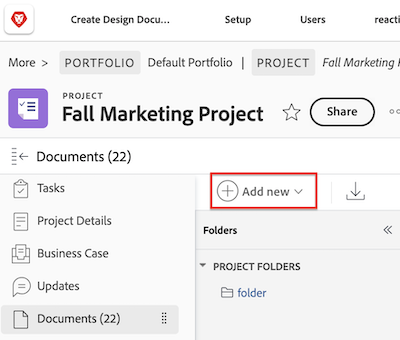

# 파일 시스템에서 Adobe Workfront에 문서 추가

Workfront에는 현재 기존 문서 영역과 새 문서 영역의 두 가지 버전이 있습니다. 조직에서 사용하는 버전은 조직이 기존 Workfront 스토리지를 사용하는지 아니면 엔터프라이즈 스토리지를 사용하는지에 따라 다릅니다. 이러한 저장소 유형에 대한 자세한 내용은 [Adobe 엔터프라이즈 저장소 개요](/help/quicksilver/review-and-approve-work/esm-overview.md)를 참조하십시오.

Workfront에 문서를 추가하는 방법은 조직에서 사용하는 문서 영역의 버전에 따라 다릅니다.

* [이전 문서 영역의 파일 시스템에서에 문서 추가](#add-documents-from-your-file-system-in-the-legacy-documents-area)
* [새 문서 영역에서 Workfront에 문서 추가](#add-documents-to-workfront-in-the-new-documents-area)

## 액세스 요구 사항

+++ 이 문서의 기능에 대한 액세스 요구 사항을 보려면 확장하십시오.

<table style="table-layout:auto"> 
 <col> 
 <col> 
 <tbody> 
  <tr> 
   <td role="rowheader">Adobe Workfront 패키지</td> 
   <td> 
 Any
 </td> 
  </tr> 
  <tr> 
   <td role="rowheader">Adobe Workfront 라이센스*</td> 
   <td> 
   
기여자 이상
 
   
요청 이상
 </td> 
  </tr> 
  <tr> 
   <td role="rowheader">액세스 수준 구성</td> 
   <td> 
레거시 Workfront 스토리지: 문서에 대한 액세스 편집
 
   
엔터프라이즈 스토리지: 문서에 대한 편집 액세스는 기본적으로 활성화되어 있으며 변경할 수 없습니다

   </td> 
  </tr> 
 </tbody> 
</table>

자세한 내용은 [Workfront 설명서의 액세스 요구 사항](/help/quicksilver/administration-and-setup/add-users/access-levels-and-object-permissions/access-level-requirements-in-documentation.md)을 참조하십시오.

+++

## 기존 문서 영역에 파일 시스템의 문서 추가

조직이 기존 Workfront 스토리지를 사용하고 있는 경우 Workfront의 문서에 액세스하면 기존 문서 영역이 표시됩니다. Workfront 스토리지에 대한 자세한 내용은 [Adobe 엔터프라이즈 스토리지와 레거시 Workfront 스토리지의 차이점](/help/quicksilver/review-and-approve-work/esm-overview.md#differences-between-adobe-enterprise-storage-and-legacy-workfront-storage)을 참조하십시오.

Adobe Workfront의 다음 영역에서 프로젝트, 작업 또는 문제에 문서를 추가할 수 있습니다.

* 글로벌 문서 영역
* Workfront 객체의 문서 영역
* Workfront 보드에 연결된 카드

새 버전의 문서를 업로드하고 Google 드라이브, Dropbox 및 Microsoft OneDrive와 같은 서드파티 클라우드 공급업체의 문서에 대한 링크를 추가할 수도 있습니다. 새 문서 버전 추가에 대한 자세한 내용은 [새 문서 버전 업로드](../../documents/managing-documents/upload-new-document-version.md)를 참조하십시오. 타사 클라우드 공급업체의 문서를 추가하는 방법에 대한 자세한 내용은 [외부 응용 프로그램에서 문서 연결](../../documents/adding-documents-to-workfront/link-documents-from-external-apps.md)을 참조하십시오.

Workfront에 업로드할 수 있는 파일의 유형과 크기에는 제한이 없습니다. 그러나 업로드가 성공하려면 5분 이내에 완료되어야 하며 사용 가능한 저장 공간이 충분해야 합니다.

새 버전의 문서를 Workfront에 업로드하는 방법에 대한 자세한 내용은 [새 버전의 문서 업로드](../../documents/managing-documents/upload-new-document-version.md)를 참조하십시오.

### 기존 문서 영역에서 Workfront에 문서 추가

워크스테이션의 파일 시스템에서 Workfront에 새 문서를 추가할 수 있습니다. Google 드라이브 및 SharePoint과 같은 서드파티 애플리케이션에서 문서를 연결할 수도 있습니다.

>[!IMPORTANT]
>
>* 한 번에 최대 150개의 문서를 업로드할 수 있습니다.
>* 파일 크기에는 제한이 없습니다.
>* 문서 다운로드는 4GB로 제한됩니다.

문서를 추가하려면 다음 작업을 수행하십시오.

1. 새 문서를 추가할 프로젝트, 작업 또는 문제로 이동합니다.
1. **문서** 탭을 클릭한 다음 **새로 추가** 드롭다운 메뉴를 클릭합니다.

   

1. 추가할 문서의 유형에 따라 다음 중 하나를 수행합니다.

   <table style="table-layout:auto"> 
    <col> 
    <col> 
    <tbody> 
     <tr> 
      <td role="rowheader">워크스테이션의 파일 시스템에서 문서 업로드</td> 
      <td> 
       <ol> 
        <li value="1"><strong>새로 추가</strong> 드롭다운 메뉴에서 <strong>문서</strong>를 선택합니다.</li> 
        <li value="2"> 
워크스테이션의 파일 시스템에서 추가할 문서를 찾아 선택합니다. 
 
추가 파일을 선택할 때 Shift 키를 누르면 여러 문서를 선택할 수 있습니다.
 </li> 
        <li value="3"><strong>열기를 클릭합니다</strong>.</li> 
       </ol> 
       
<b>참고</b>: 파일 관리자에서 문서 목록으로 직접 파일을 끌어다 놓을 수도 있습니다.</td> 
     </tr> 
     <tr> 
      <td role="rowheader">Google 드라이브 또는 SharePoint과 같은 서드파티 애플리케이션에서 문서 업로드</td> 
      <td> 
       <ol> 
        <li value="1"> 
<strong>새로 추가</strong> 드롭다운 메뉴에서 <strong>From &lt;name_of_third-party_application&gt;</strong>을(를) 선택합니다.
 
예를 들어 Google 드라이브에서 문서를 업로드하려면 <strong>Google 드라이브에서</strong>을(를) 클릭합니다.
 </li> 
        <li value="2"> 
화면의 지침에 따라 서드파티 애플리케이션에서 문서를 선택합니다. 
 
연결된 문서에 대한 자세한 내용은 <a href="../../documents/adding-documents-to-workfront/link-documents-from-external-apps.md" class="MCXref xref">외부 응용 프로그램에서 문서 연결</a>을 참조하세요.
 </li> 
       </ol> </td> 
     </tr> 
     <tr> 
      <td role="rowheader">다른 Workfront 사용자로부터 문서 요청</td> 
      <td> 
       <ol> 
        <li value="1"><strong>새로 추가</strong> 드롭다운 메뉴에서 <strong>문서 요청</strong>을 선택합니다.</li> 
        <li value="2"><strong>요청한 사용자 이름</strong> 상자에 문서를 요청한 사용자의 이름을 입력합니다.</li> 
        <li value="3"><strong>요청한 내용 전달</strong> 상자에 문서 이름을 입력합니다.</li> 
        <li value="4"> 
<strong>요청 보내기</strong>를 클릭합니다.
 
요청이 문서 탭에 표시됩니다.
 
문서 요청에 대한 자세한 내용은 <a href="../../documents/adding-documents-to-workfront/request-a-document.md" class="MCXref xref">문서 요청</a>을 참조하십시오.
 </li> 
       </ol> </td> 
     </tr> 
    </tbody> 
   </table>

## 새 문서 영역에서 Workfront에 문서 추가

엔터프라이즈 스토리지 모델을 사용하여 프로젝트, 작업 또는 문제에 문서를 추가할 수 있습니다. 엔터프라이즈 스토리지에 대한 자세한 내용은 [Adobe 엔터프라이즈 스토리지 개요](/help/quicksilver/review-and-approve-work/esm-overview.md)를 참조하십시오.

새 문서 영역에서 현재 지원되지 않는 기능:

* 글로벌 문서 영역에 문서 업로드
* Google 드라이브, Dropbox 및 Microsoft OneDrive와 같은 서드파티 클라우드 공급업체의 문서에 대한 링크를 추가합니다.
* 문서 요청 중
* 폴더에 링크 복사
* 문서 체크 아웃
* 클립보드에서 이미지 붙여넣기
* 스마트 폴더 추가

### 새 문서 영역에서 Workfront에 문서 추가

조직에서 엔터프라이즈 스토리지를 사용하는 경우 Workfront의 문서에 액세스할 때 새 문서 영역이 표시됩니다. 엔터프라이즈 스토리지에 대한 자세한 내용은 [Adobe 엔터프라이즈 스토리지 개요](/help/quicksilver/review-and-approve-work/esm-overview.md)를 참조하십시오.

<!--
>[!IMPORTANT]
>
>* You can upload up to 150 documents at one time.
>* There is no limit on the file size. 
>* Document downloads are limited to 4GB.
-->

문서를 추가하려면 다음 작업을 수행하십시오.

1. 새 문서를 추가할 프로젝트, 작업 또는 문제로 이동합니다.
1. 왼쪽 패널에서 **문서**&#x200B;를 클릭합니다.
1. 페이지 오른쪽의 **새로 만들기**&#x200B;를 클릭하거나 파일을 표시되는 드롭 영역으로 끌어다 놓습니다. 여러 문서를 한 번에 추가할 수 있습니다.

   

새 버전의 문서를 Workfront에 업로드하는 방법에 대한 자세한 내용은 [새 버전의 문서 업로드](../../documents/managing-documents/upload-new-document-version.md)를 참조하십시오.

## 엔터프라이즈 스토리지를 위한 문서 보안

Workfront은 다음과 같은 방법으로 문서를 통해 바이러스 및 기타 악성 콘텐츠가 사이트로 유입되는 것을 방지합니다.

**Workfront에서 손상된 파일을 검색하는 방법**

엔터프라이즈 스토리지 모델을 사용하는 객체에 대해 문서 검색이 자동으로 활성화됩니다.

500MB 이하의 모든 파일은 업로드 시 스캔됩니다. 500MB가 넘는 파일은 검사되지 않습니다. Workfront에서 손상된 문서를 감지하면 자동으로 제거됩니다.

**파일 이름 제한**

이 통합은 Adobe 엔터프라이즈 스토리지를 사용하여 구축되므로 프로젝트 및 문서를 관리할 때 알아야 하는 일부 강제 구조 및 이름 지정 규칙이 있습니다.

* 오브젝트 이름은 고유해야 하며 복제할 수 없습니다.
* Adobe 엔터프라이즈 스토리지에는 계층 트리에서 상위 항목이 동일한 피어 개체에 대한 고유한 이름이 필요합니다
* 문서가 동일한 프로젝트에 속하는 경우 문서에 동일한 이름을 사용할 수 없습니다.
* 문서 이름에는 다음 특수 문자를 사용할 수 없습니다. `\ / : * ? " | < >`
* 문서 이름은 최대 255자로 제한됩니다.

이러한 제한 사항을 고려하여 Workfront은 충돌을 방지하기 위해 필요에 따라 개체나 문서의 이름을 자동으로 변경합니다.

## 레거시 Workfront 스토리지에 대한 문서 보안

Workfront 사이트는 다음과 같은 방법으로 문서를 통해 바이러스 및 기타 악성 콘텐츠가 사이트로 들어오는 것을 방지합니다.

**Workfront에서 손상된 파일을 검색하는 방법**

문서 스캔은 요청이 있을 때만 활성화됩니다.

문서 스캔이 활성화된 경우 25MB 이하의 파일을 업로드할 때 스캔됩니다. 25MB가 넘는 파일은 검사되지 않습니다.

Workfront에서 손상된 문서를 감지하면 파일이 손상되었음을 나타내는 메시지가 나타납니다. 또한 Workfront에서 잠재적인 악성 콘텐츠를 탐지하고 파일을 제거할 예정이 되면 이메일 알림을 받게 됩니다.

수동으로 제거하지 않는 한 검색 후 24시간 이내에 손상된 파일이 제거됩니다. 손상된 파일을 삭제하면 Workfront이 이 작업을 업데이트로 추적합니다. Workfront에서 제거하도록 허용하면 업데이트가 기록되지 않습니다.

**파일 이름 제한**

Workfront에 업로드된 파일은 파일 이름에 특정 문자를 포함할 수 없습니다. 파일에 파일 이름에 다음 문자가 포함되어 있으면 파일을 업로드할 때 파일 이름에서 해당 문자가 제거됩니다. `! # % * \ | ' " / ? < > { } [ ]`.
