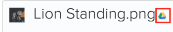

# 외부 애플리케이션에서 문서 연결

<!-- Audited: 01/2024 -->

다음 소스에서 문서 및 폴더를 Adobe Workfront에 연결할 수 있습니다.

<table style="table-layout:auto"> 
 <col> 
 <col> 
 <tbody> 
  <tr> 
   <td role="rowheader">기존 타사 클라우드 문서 공급자</td> 
   <td>여기에는 다음이 포함됩니다. 
    <ul> 
     <li>확인란</li> 
     <li>Dropbox</li> 
     <li>Dropbox Business</li> 
     <li>WebDAM</li> 
     <li>Microsoft OneDrive</li> 
     <li>Microsoft SharePoint</li> 
     <li>Google 드라이브</li> 
     <li>Quip</li>
    </ul></td> 
  </tr> 
  <tr> 
   <td role="rowheader">Workfront Proof </td> 
   <td>원래 Workfront Proof 내에서 만들어진 증명을 Workfront 내에서 사용할 수 있도록 만들 수 있습니다.</td> 
  </tr> 
  <tr data-mc-conditions="QuicksilverOrClassic.Quicksilver"> 
   <td role="rowheader">Experience Manager Assets Essentials </td> 
   <td>Experience Manager Assets Essentials에서 문서를 Workfront에 연결할 수 있습니다. 자세한 내용은 Experience Manager Assets Essentials용 Adobe Workfront <a href="../../documents/adobe-workfront-for-experience-manager-assets-essentials/workfront-for-aem-asset-essentials.md" class="MCXref xref">을(를) 참조하십시오</a>.</td> 
  </tr>

<tr> 
   <td role="rowheader">기타 문서 공급자(사용자 지정 문서 통합을 통해)</td> 
   <td> 
이러한 통합은 설정 영역에서 구성할 수 있습니다.
 </td>
  </tr> 
 </tbody> 
</table>

문서 또는 폴더를 연결하기 전에 Workfront 관리자는 [문서 통합 구성](../../administration-and-setup/configure-integrations/configure-document-integrations.md)에 설명된 대로 각 문서 공급자 또는 사용자 지정 문서 통합에 대해 이 기능을 활성화해야 합니다.

Workfront에 직접 업로드한 문서를 사용하는 것과 동일한 방식으로 외부 클라우드 공급자에 연결된 문서를 증명하고 승인할 수 있습니다.

>[!NOTE]
>
>이 기능은 새 문서 영역에서 사용할 수 없습니다. 
>조직에서 엔터프라이즈 스토리지를 사용하는 경우 Workfront의 문서에 액세스할 때 새 문서 영역이 표시됩니다. 엔터프라이즈 스토리지에 대한 자세한 내용은 [Adobe 엔터프라이즈 스토리지 개요](/help/quicksilver/review-and-approve-work/esm-overview.md)를 참조하십시오.

## 액세스 요구 사항

+++ 이 문서의 기능에 대한 액세스 요구 사항을 보려면 확장하십시오.

<table style="table-layout:auto"> 
 <col> 
 <col> 
 <tbody> 
  <tr> 
   <td role="rowheader">Adobe Workfront 패키지</td>
   <td> 
Any
 </td>
  </tr> 
  <tr> 
   <td role="rowheader">Adobe Workfront 라이선스</td>
   <td>
기여자 이상

    
요청 이상
 </td>
  </tr> 
  <tr> 
   <td role="rowheader">액세스 수준 구성</td> 
   <td> 
문서에 대한 액세스 편집
 </td> 
  </tr> 
 </tbody> 
</table>

자세한 내용은 [Workfront 설명서의 액세스 요구 사항](/help/quicksilver/administration-and-setup/add-users/access-levels-and-object-permissions/access-level-requirements-in-documentation.md)을 참조하십시오.

+++

## 문서 스토리지

외부 애플리케이션에서 Workfront에 연결된 문서는 Workfront 내부가 아니라 외부 클라우드 공급자와 함께 저장됩니다.

The following exceptions apply:

* When provided by the document service, thumbnails and preview images might be stored on Workfront servers.
* When you use proofing in Workfront, the document is copied and added to the proofing servers.

## File size limits

Third-party cloud providers:

* Single file: 5 GB or less
* Multiple file: 1 GB or less (total of all files)

## Link a document from an external application to Workfront

You can link existing documents with an external cloud provider. This includes any shared documents.

### 전제 조건 {#prerequisites}

문서 또는 폴더를 연결하기 전에 Workfront 관리자는 [문서 통합 구성](../../administration-and-setup/configure-integrations/configure-document-integrations.md)에 설명된 대로 각 문서 공급자 또는 사용자 지정 문서 통합에 대해 이 기능을 활성화해야 합니다.

### Link an external document to Workfront {#link-an-external-document-to-workfront}

You can link documents to Workfront from an external application such as Google and Microsoft OneDrive.

>[!IMPORTANT]
>
>Dropbox stores documents based on the file path. Because of this, if a file linked from Dropbox is moved, renamed, or deleted, it becomes inaccessible in Workfront.

1. Go to the **Documents** area in Workfront where you want the document.
1. Click **Add New**, then click the external document provider where you want to link documents to Workfront.

   For example, to link documents from Dropbox, click **From Dropbox**.

   External providers that you have already authorized appear at the top of the list.

1. (Conditional) If you are prompted to log into the external service, type your login credentials for the service in the box that appears, then click **Sign in**.
1. (Conditional) If you are prompted to authorize the external application, click the **Authorize** button.

   You need to do this only once.

1. In the search box of the **Link External Files and Folders** box that appears, type the name of the item you want to search for, then press **Enter** to see all results from the external application, regardless of which folder they are storied in.

   또는

   Browse to and select the documents you want to link.

   Though you can select multiple documents, only documents that are selected in the current view are linked. For example, if you select a document, then go into a folder, the document you originally selected is not linked.

1. (Conditional) If you are a Workfront DAM customer, click the **Thumbnail** icon to display files as thumbnail images.

   >[!NOTE]
   >
   >Workfront DAM customers can view thumbnails when linking documents from Workfront DAM. Thumbnails might also be displayed for Workfront DAM customers for other services such as Dropbox and Box. However, viewing thumbnails for services other than Workfront DAM within Workfront is not supported, and thumbnails are never displayed when linking documents from SharePoint or Google Drive.

1. Click **Link**.

   In Workfront, the cloud provider&#39;s icon appears next to the documents.

   >[!NOTE]
   >
   >* If the download URL that is used to link the document exceeds 2048 characters, the file cannot link.
   >* For documents that are linked to Box, the link to the document in Box does not display until you refresh the page.

### Add a new version of a linked document {#add-a-new-version-of-a-linked-document}

You can add a new version of a document linked to Workfront from an external application.

1. Go to the **Documents** area where the document is linked, then select the linked document.

   >[!IMPORTANT]
   >
   >The document must be outside of a linked folder to create a new version.

1. Click **Add New** > **Version**, then click the external document provider.

   For example, to link a new version of a document from Dropbox, click **From Dropbox**.

   External providers that you have already authorized appear at the top of the list.

1. (Conditional) If you are prompted to log into the external service, type your login credentials for the service in the box that appears, then click **Sign in**.
1. (Conditional) If you are prompted to authorize the external application, click **Authorize**.

   You need to do this only once.

1. In the search box of the **Link External Files and Folders** box that appears, type the name of the item you want to search for, then press **Enter** to see all results from the external application, regardless of which folder they are stored in.

   또는

   Browse to and select the documents you want to link.

   You can select multiple documents; however, only documents that are selected in the current view are linked. For example, if you select a document, then go into a folder, the document you originally selected is not linked.

1. (Conditional) If you are a Workfront DAM customer, click the **Thumbnail** icon to display files as thumbnail images.

   >[!NOTE]
   >
   >Workfront DAM customers can view thumbnails when linking documents from Workfront DAM. Dropbox 및 Box와 같은 다른 서비스에 대해 Workfront DAM 고객을 위해 썸네일이 표시될 수도 있습니다. 그러나 Workfront 내에서 Workfront DAM 이외의 서비스에 대한 축소판 보기는 지원되지 않으며 SharePoint 또는 Google 드라이브의 문서를 연결할 때에는 축소판이 표시되지 않습니다.

1. **링크**&#x200B;를 클릭합니다.

   Workfront에서 문서 옆에 클라우드 공급자의 아이콘이 표시되어 외부 클라우드 공급자에 연결되어 있음을 나타냅니다.

   >[!NOTE]
   >
   >Box에 연결된 문서의 경우 페이지를 새로 고칠 때까지 Box에 있는 문서에 대한 링크가 표시되지 않습니다.

파일 시스템에서 Workfront에 업로드한 새 버전의 문서를 추가하는 방법에 대한 자세한 내용은 [파일 시스템에서 Adobe Workfront에 문서 추가](../../documents/adding-documents-to-workfront/add-documents-from-file-system.md)에서 [Adobe Workfront에 문서 추가](../../documents/adding-documents-to-workfront/add-documents-from-file-system.md#add-documents-to-workfront)를 참조하십시오.

### Workfront Proof 문서 연결 {#link-workfront-proof-documents}

Workfront Proof에 원래 있었던 Workfront에 증명을 연결할 수 있습니다. Workfront Proof에서 증명을 연결할 때 증명과 연결된 모든 댓글과 기타 메타데이터를 Workfront에서 사용할 수 있습니다.

Workfront Proof에서 보기 액세스 권한이 있는 증명만 연결할 수 있습니다.

1. 문서를 원하는 Workfront의 **문서** 영역으로 이동합니다.
1. **새로 추가**&#x200B;를 클릭한 다음 **Workfront Proof에서**&#x200B;를 클릭합니다.

   >[!NOTE]
   >
   >이 메뉴의 옵션은 환경에 구성된 서드파티 공급자에 따라 달라질 수 있습니다.

1. 표시되는 **Workfront Proof에서 증명 연결** 상자에서 Workfront에서 사용할 수 있게 하려는 증명의 이름을 입력하세요.

   입력한 대로 목록이 필터링됩니다.

1. 연결할 증명을 최대 10개까지 선택하십시오.

   증명이 Workfront의 문서와 이미 연결되어 있으므로 흐리게 표시된 모든 증명 이름을 연결할 수 없습니다.

1. **링크**&#x200B;를 클릭합니다.

   가장 최신 버전의 증명이 Workfront에 연결되어 있습니다. 증명을 열면 증명 뷰어에서 모든 버전을 사용할 수 있습니다.

### Workfront 내에서 Google 문서 만들기 {#create-a-google-document-from-within-workfront}

Workfront 내에서 새 Google 문서를 만들 수 있습니다. Workfront 내에서 다른 클라우드 공급자에 대한 새 문서를 만들 수 없습니다.

1. 문서를 원하는 Workfront의 **문서** 영역으로 이동합니다.
1. **새로 추가** > **Google 파일**&#x200B;을 클릭한 다음 만들려는 Google 문서의 유형을 선택합니다.
1. **Google 드라이브 계정 추가** 상자가 나타나면 **Google 드라이브 승인**&#x200B;을 클릭합니다.

   Google 문서가 **문서** 탭에 추가됩니다.

   >[!NOTE]
   >
   > 내 드라이브 및 나와 공유 에는 두 가지 다른 결과가 표시됩니다. 내 드라이브에서 파일을 찾을 수 없는 경우 나와 공유 폴더를 확인합니다.

## Workfront에서 외부 클라우드 공급자로 문서 업로드 및 연결

Workfront에서 외부 클라우드 공급자로 문서를 업로드하고 연결할 수 있습니다. 이렇게 하면 문서 저장소가 Workfront에서 외부 클라우드 공급자로 이동합니다. 외부 애플리케이션에서 문서가 변경되면 Workfront에서 자동으로 업데이트됩니다.

>[!NOTE]
>
>에셋을 외부 문서 공급자에게 보내면 에셋의 새 버전이 만들어집니다.

Workfront 액세스 권한이 없는 사용자는 애플리케이션에 액세스할 수 있는 경우 외부 애플리케이션에서 문서를 볼 수 있습니다.

1. Workfront에서 업로드된 문서를 선택합니다.
1. **자세히** >**보내기**&#x200B;를 클릭한 다음 연결된 문서를 저장할 클라우드 공급자를 선택하십시오.

   문서 세부 정보 페이지에서 기타 메뉴 를 사용하여 이 작업을 수행할 수도 있습니다.

1. 공급자 응용 프로그램에서 문서를 저장할 폴더를 선택합니다.

   공유 폴더를 포함하여 공급자 응용 프로그램의 모든 폴더가 될 수 있습니다.

1. **저장**&#x200B;을 클릭합니다.

   문서 이름 옆에 외부 공급자의 로고가 표시되어 이제 문서가 Workfront에 연결되고 외부 클라우드 공급자가 저장했음을 나타냅니다.

   

## 링크 폴더

Workfront과 외부 클라우드 공급자 간에 폴더를 연결하면 폴더와 해당 폴더의 모든 컨텐츠가 연결됩니다. Workfront 액세스 권한이 없는 사용자가 외부 문서 애플리케이션에서 파일을 추가, 제거 및 수정하는 경우 해당 변경 사항이 Workfront에 동기화됩니다.

### 폴더 액세스 권한 {#folder-access-rights}

외부 문서 애플리케이션에서 폴더 콘텐츠를 동기화할 때 Workfront은 원래 폴더를 연결한 사용자의 자격 증명을 사용합니다. 그 결과 다음과 같은 사용자 환경이 만들어집니다.

* 사용자가 외부 애플리케이션에서 파일 및 폴더를 볼 수 있는 액세스 권한이 없지만 Workfront을 통해 연결된 폴더를 볼 수 있는 액세스 권한이 있는 경우 Workfront의 파일 및 폴더 이름만 볼 수 있고 콘텐츠는 볼 수 없습니다.
* 다른 사용자가 Workfront에 연결한 연결된 폴더(예: 연결된 폴더의 하위 폴더) 내의 컨텐츠에 액세스하면 컨텐츠가 컨텐츠에 액세스하는 사용자의 자격 증명이 아니라 해당 폴더를 원래 연결한 사용자의 Workfront 로그인 자격 증명을 사용하여 Workfront에 동기화됩니다.

>[!IMPORTANT]
>
>* 원래 폴더를 연결한 사용자가 Workfront 시스템에서 제거되면 사용자는 더 이상 Workfront을 통해 연결된 폴더의 콘텐츠에 액세스할 수 없습니다. 이 경우 외부 애플리케이션에서 폴더에 대한 권한이 있는 활성 Workfront 사용자가 폴더를 다시 연결해야 합니다.
>* 폴더를 연결한 사용자에게 더 이상 외부 애플리케이션에 액세스할 수 없는 경우 Workfront은 더 이상 폴더의 콘텐츠에 액세스할 수 없습니다. 예를 들어 원래 폴더를 연결한 사용자가 회사를 그만두는 경우 이러한 상황이 발생할 수 있습니다. 계속 액세스하려면 폴더에 대한 액세스 권한이 있는 사용자가 폴더를 다시 연결해야 합니다.

### 하나 이상의 외부 폴더 연결 {#link-one-or-more-external-folders}

1. Workfront에서 폴더를 원하는 영역으로 이동한 다음 왼쪽 패널에서 **문서** 을 클릭합니다.

1. **새로 추가**&#x200B;를 클릭한 다음 폴더를 Workfront에 연결할 외부 문서 공급자를 클릭합니다.
1. (조건부) 외부 서비스를 아직 승인하지 않은 경우 외부 공급자에 대한 로그인 자격 증명을 지정한 다음 **로그인**&#x200B;을 클릭합니다.

   이미 승인한 외부 공급자는 목록의 맨 위에 나타납니다.

1. 표시되는 **외부 파일 및 폴더 연결** 상자에서 연결할 폴더를 찾아 선택합니다.

   또는

   검색할 폴더 이름을 입력한 다음 **Enter**&#x200B;를 누릅니다.

   여러 폴더를 선택할 수 있지만 현재 보기에서 선택한 폴더만 연결됩니다. 예를 들어, 폴더를 선택한 다음 폴더로 이동하면 원래 선택한 폴더가 연결되지 않습니다.

   >[!NOTE]
   >
   >Google 드라이브에서 폴더를 연결할 때 개인 드라이브(내 드라이브) 및 Team Drive 내에 있는 폴더만 연결할 수 있습니다. 나와 공유 영역에서 폴더를 연결할 수 없습니다.

1. **링크**&#x200B;를 클릭합니다.

   Workfront에서 폴더 옆에 외부 클라우드 공급자에 연결되어 있음을 나타내는 클라우드 공급자의 로고가 표시됩니다.

1. (선택 사항) Workfront의 폴더 이름이 외부 문서 응용 프로그램의 폴더 이름과 달라지도록 폴더 이름을 바꾸려면 **폴더** 섹션에서 폴더를 선택하고 폴더 이름 옆에 표시되는 기타 메뉴 를 클릭한 다음 **이름 바꾸기**&#x200B;를 클릭합니다.

   

이렇게 해도 외부 애플리케이션에서 폴더의 이름은 변경되지 않습니다.

### 연결된 폴더에 하위 폴더 추가  {#add-subfolders-to-a-linked-folder}

기존의 연결된 폴더 내에 새 폴더를 만들 수 있습니다. 다른 폴더를 연결된 기존 폴더로 드래그할 수도 있습니다.

1. 연결된 기존 폴더에 새 폴더를 만들려면 기존 폴더로 이동한 다음 [문서 폴더 만들기](../../documents/organizing-documents/create-documents-folder.md)의 설명에 따라 새 폴더를 만듭니다.

   또는

   기존 폴더를 연결된 기존 폴더로 드래그하려면 하위 폴더를 원하는 문서 영역으로 이동한 다음 연결된 폴더로 드래그합니다.

   

   >[!NOTE]
   >
   >기존 Workfront 폴더를 연결된 폴더로 드래그하면 다음 제한 사항이 적용됩니다.
   >
   >* 드래그하는 폴더는 이미 연결되어 있을 수 없으며 이미 연결된 콘텐츠를 포함할 수 없습니다.
   >* 드래그하는 폴더(해당 콘텐츠 포함)는 50MB를 초과할 수 없습니다.

## 연결된 폴더에 문서 추가

Workfront을 통해 연결된 폴더에 문서를 추가하면 자동으로 연결된 문서로 추가됩니다.

1. 문서를 넣을 연결된 폴더를 선택하고 **새로 추가 > 문서**&#x200B;를 클릭한 다음 문서를 찾아 폴더에 추가합니다.

   또는

   문서를 넣을 **문서** 영역에서 문서를 연결된 폴더로 드래그합니다.

   문서의 새 버전이 외부 애플리케이션에서 자동으로 생성되고 Workfront에 연결됩니다.

>[!NOTE]
>
> * 문서를 이동하는 동안에는 문서 옵션을 사용할 수 없습니다.
>
> * 문서가 Experience Manager Assets으로 이동되면 은 더 이상 Workfront의 문서 목록에 표시되지 않습니다.
>
> * 문서를 이동하는 동안 문서에 대해 수행한 작업이나 편집 내용은 Experience Manager Assets의 문서에 표시되지 않으므로 손실됩니다.

## 연결된 문서 또는 폴더 삭제

외부 애플리케이션에서 링크된 문서 또는 폴더를 삭제하면 해당 문서 또는 폴더는 Workfront에서도 삭제될 때까지 Workfront 시스템에 남아 있습니다.

1. 연결된 문서 또는 폴더를 선택한 다음 **삭제**&#x200B;를 클릭합니다.
1. 표시되는 확인란에서 **예, 연결 해제**&#x200B;를 클릭합니다.

   Workfront 사이트에서 문서의 링크가 해제되었습니다. 외부 애플리케이션에서는 영향을 받지 않습니다.

## 연결된 문서 및 폴더 이름 바꾸기 정보

연결된 문서나 폴더의 이름을 바꾸면 변경한 내용이 만든 응용 프로그램에서만 표시됩니다. 예를 들어 Workfront에서 연결된 문서의 이름을 바꾸는 경우 새 이름은 Workfront에서만 볼 수 있습니다.

Workfront과 외부 애플리케이션에서 이름을 일치시키려면 두 위치 모두에서 이름을 변경해야 합니다.

>[!IMPORTANT]
>
>Workfront에서 Dropbox에 연결된 문서의 이름을 바꾸지 마십시오. 그렇게 하면 Workfront의 파일에 액세스할 수 없게 됩니다. 대신 Dropbox에서 파일 이름을 변경한 다음 파일을 다시 동기화합니다.
