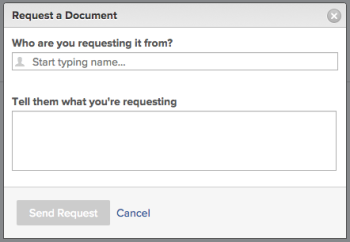

# 문서 요청

Documents를 지원하는 모든 객체에 대한 문서를 요청할 수 있습니다.

## 액세스 요구 사항

다음 항목이 있어야 합니다.

<table style="table-layout:auto"> 
 <col> 
 <col> 
 <tbody> 
  <tr> 
   <td role="rowheader">Adobe Workfront 플랜*</td> 
   <td> 
 모든
 </td> 
  </tr> 
  <tr> 
   <td role="rowheader">Adobe Workfront 라이센스*</td> 
   <td> 
요청 이상
 </td> 
  </tr> 
  <tr> 
   <td role="rowheader">액세스 수준 구성*</td> 
   <td> 
문서에 대한 액세스 편집
 
참고: 여전히 액세스 권한이 없는 경우 Workfront 관리자에게 액세스 수준에서 추가 제한을 설정하는지 문의하십시오. Workfront 관리자가 액세스 수준을 수정하는 방법에 대한 자세한 내용은 <a href="../../administration-and-setup/add-users/configure-and-grant-access/create-modify-access-levels.md" class="MCXref xref">사용자 정의 액세스 수준 만들기 또는 수정</a>.
 </td> 
  </tr> 
 </tbody> 
</table>

&#42;보유 중인 플랜, 라이선스 유형 또는 액세스 권한을 확인하려면 Workfront 관리자에게 문의하십시오.

## 문서 요청

1. 요청하려는 문서가 있는 영역으로 이동합니다.
1. 다음을 클릭합니다. **문서** 탭. 
1. 다음을 클릭합니다. **새로 추가** 드롭다운 메뉴.

1. 클릭 **문서 요청**.

   문서 요청 대화 상자가 표시됩니다.

   

1. 문서를 요청하는 사용자의 이름을 입력한 다음 드롭다운 목록에 나타나면 해당 이름을 선택합니다. 라이센스가 부여된 Adobe Workfront 사용자만 드롭다운 목록에 옵션으로 나타납니다.

   >[!NOTE]
   >
   >다음 항목이 있는 경우 [기존 라이선스 개요](../../administration-and-setup/add-users/access-levels-and-object-permissions/wf-licenses.md) 귀하의 계정에서 활성화하면 모든 이메일 주소로 요청을 보낼 수 있습니다. 에 설정이 있습니다. [시스템 보안 환경 설정 구성](../../administration-and-setup/manage-workfront/security/configure-security-preferences.md) 이는 Workfront과 상호 작용하기 전에 이러한 외부 이메일 사용자가 암호를 만들어야 하는지 여부를 결정합니다. 

1. 문서를 요청하는 이유를 설명하십시오.
1. 클릭 **요청 보내기**.

   사용자에게 요청하면 문서 영역에 자리 표시자가 추가됩니다. 이 자리 표시자에서 사용자에게 알림을 보내거나 요청을 취소할 수 있습니다. 사용자는 Workfront 알림 및 요청에 대한 이메일을 수신합니다.

   이 환경 설정이 활성화된 경우 이메일 알림과 인앱 알림을 받습니다. 이메일 알림에 대한 자세한 내용은 [이메일 알림 수정](../../workfront-basics/using-notifications/activate-or-deactivate-your-own-event-notifications.md).

   이메일 알림에 있는 링크를 클릭한 다음 문서를 업로드할 수 있습니다. 또는 인앱 알림을 클릭할 수 있습니다. 각 옵션은 요청한 문서를 업로드할 수 있는 사용자 프로필 페이지로 안내합니다.

1. 문서를 업로드한 후에는 요청한 사람이 개인적으로 문서에 액세스할 수 있습니다 **문서** 영역입니다.

   개인 정보에 액세스할 수 있습니다. **문서** Workfront 페이지의 오른쪽 위 모서리에서 사용자 프로필 사진을 클릭하고 이름을 클릭한 다음, **문서** 탭.
