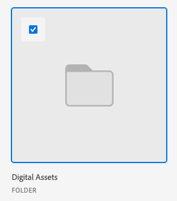

# Experience Manager Assets Essentials에서 에셋 및 폴더 연결

Experience Manager Assets Essentials의 에셋 또는 폴더를 문서를 지원하는 모든 Adobe Workfront 개체에 연결할 수 있습니다.

Content Advisor를 사용하여 Experience Manager Assets에서 에셋 및 폴더를 연결하려면 [Experience Manager Assets에서 제공하는 Content Advisor와 에셋 및 폴더 연결](/help/quicksilver/documents/adobe-workfront-for-experience-manager-assets-essentials/link-to-aem.md)을 참조하십시오.

## 액세스 요구 사항

+++ 이 문서의 기능에 대한 액세스 요구 사항을 보려면 확장하십시오.

<table style="table-layout:auto"> 
 <col> 
 <col> 
 <tbody> 
  <tr> 
   <td role="rowheader">Adobe Workfront 패키지</td> 
   <td> 
 Any
 </td> 
  </tr> 
  <tr> 
   <td role="rowheader">Adobe Workfront 라이선스</td> 
   <td> 
   
기여자 이상
 
   
요청 이상
 </td> 
  </tr> 
  <tr> 
   <td role="rowheader">추가 제품</td> 
   <td>Experience Manager as a Cloud Service 또는 Assets Essentials가 있어야 하며 Admin Console에서 사용자로 제품에 추가되어야 합니다.</td> 
  </tr> 
   <tr> 
    <td role="rowheader">Experience Manager 권한</td> 
    <td>폴더에 대한 쓰기 액세스 권한이 있어야 합니다.</td> 
   </tr>
  <tr> 
   <td role="rowheader">액세스 수준 구성</td> 
   <td> 
문서에 대한 액세스 편집
 </td> 
  </tr> 
  <tr> 
   <td role="rowheader">개체 권한</td> 
   <td> 
액세스 권한 이상 보기
 </td> 
  </tr> 
 </tbody> 
</table>

이 표의 정보에 대한 자세한 내용은 [Workfront 설명서의 액세스 요구 사항](/help/quicksilver/administration-and-setup/add-users/access-levels-and-object-permissions/access-level-requirements-in-documentation.md)을 참조하십시오.

+++

## 전제 조건

시작하기 전에:

* Workfront 관리자는 Experience Manager 통합을 구성해야 합니다. 자세한 내용은 [Experience Manager Assets Essentials 통합 구성](/help/quicksilver/documents/adobe-workfront-for-experience-manager-assets-essentials/setup-asset-essentials.md)을 참조하십시오.

## Experience Manager Assets Essentials에서 에셋 연결

1. 문서를 추가할 Workfront의 **문서** 영역으로 이동합니다.
1. **새로 추가**&#x200B;를 선택한 다음 관리자가 설정한 Experience Manager 통합을 선택하십시오.

   >[!NOTE]
   >
   >Workfront 관리자는 이 통합에 사용할 이름을 선택할 수 있으므로 Experience Manager Assets Essentials에 대해 구체적으로 언급하지 않을 수 있습니다.

1. 원하는 자산을 선택합니다.

   

1. **선택**&#x200B;을 클릭합니다.

## Experience Manager Assets Essentials에서 새 버전 연결

Experience Manager Assets Essentials에서 새 에셋을 가져와서 기존 에셋에 새 버전으로 추가할 수 있습니다. 문서가 이미 연결되어 있고 Experience Manager Assets Essentials에 새 버전이 추가되어 있는 경우 새 버전이 Workfront에 자동으로 표시됩니다.

새 버전을 연결하려면 다음을 수행하십시오.

1. 문서를 추가할 Workfront의 **문서** 영역으로 이동합니다.
1. 새 버전으로 바꿀 자산을 선택합니다. 연결된 폴더에 자산의 새 버전을 만들 수 없습니다.
1. **새로 추가** > **버전**&#x200B;을 선택한 다음 관리자가 설정한 Experience Manager 통합을 선택합니다.

   >[!NOTE]
   >
   >Workfront 관리자는 이 통합에 사용할 이름을 선택할 수 있으므로 Experience Manager Assets Essentials에 대해 특별히 언급하지 않을 수 있습니다.

1. 연결할 자산을 선택합니다.

1. **선택**&#x200B;을 클릭합니다.

## Experience Manager Assets Essentials에서 폴더 연결

폴더 내의 개별 에셋을 볼 수 있는 권한은 Experience Manager Assets Essentials 권한을 기반으로 합니다.

1. 폴더를 원하는 Workfront의 **문서** 영역으로 이동합니다.
1. **새로 추가**&#x200B;를 선택한 다음 관리자가 설정한 Experience Manager 통합을 선택하십시오.

   >[!NOTE]
   >
   >Workfront 관리자는 이 통합에 사용할 이름을 선택할 수 있으므로 Experience Manager Assets Essentials에 대해 특별히 언급하지 않을 수 있습니다.

1. 원하는 폴더를 선택합니다.

   

1. **선택**&#x200B;을 클릭합니다.

## 고려 사항

* Assets Essentials에는 콘텐츠 관리자 기능을 사용할 수 없습니다. Content Advisor를 사용하여 에셋 및 폴더를 연결하려면 [Experience Manager Assets에서 제공하는 Content Advisor와 에셋 및 폴더 연결](/help/quicksilver/documents/adobe-workfront-for-experience-manager-assets-essentials/link-to-aem.md)을 참조하십시오.

* Assets Essentials에서 전송된 Assets은 Workfront의 전체 문서 스토리지에 포함되지 않습니다. Workfront에서 Assets Essentials로 업로드되고 전송되는 문서는 전체 스토리지에 포함됩니다.

* 메타데이터 필드는 Workfront에서 Experience Manager Assets Essentials로 에셋을 전송할 때 먼저 매핑됩니다. Workfront 관리자가 오브젝트 메타데이터 동기화를 활성화한 경우 두 애플리케이션에서 변경된 필드가 최신 상태로 유지됩니다.
