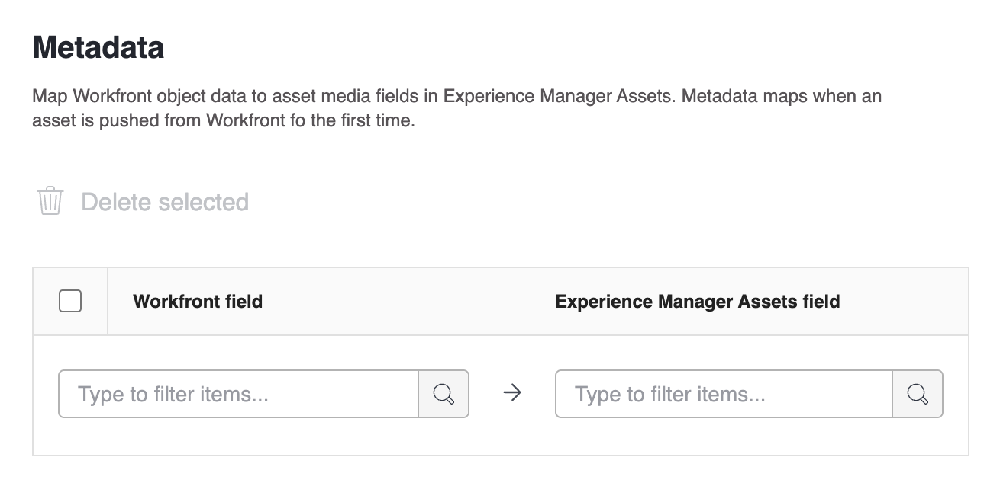

# Experience Manager Assets Essentials 통합 구성

Experience Manager Assets Essentials의 콘텐츠와 작업 연결&#x200B;:

* Adobe Workfront에서 Experience Manager Assets Essentials로 에셋 및 메타데이터 &#x200B; 푸시
* Experience Manager Assets Essentials의 에셋을 Workfront의 프로젝트 및 작업에 &#x200B; 연결
* Experience Manager Assets Essentials로 푸시된 에셋의 워크플로우 버전 관리 촉진

>[!NOTE]
>
>여러 Experience Manager Assets 저장소를 조직 ID를 통해 하나의 Workfront 환경에 연결하거나 여러 Workfront 환경을 하나의 Experience Manager Assets 저장소에 연결할 수도 있습니다. 설정하려는 각 통합에 대해 이 문서의 구성 지침을 따르십시오.

## 액세스 요구 사항

다음 항목이 있어야 합니다.

<table>
  <tr>
   <td><strong>Adobe Workfront 플랜*</strong>
   </td>
   <td>임의
   </td>
  </tr>
  <tr>
   <td><strong>Adobe Workfront 라이선스*</strong>
   </td>
   <td>플랜
   </td>
  </tr>
  <tr>
   <td><strong>Experience Manager 라이선스</strong>
   </td>
   <td>표준
   </td>
  </tr>
  <tr>
   <td><strong>제품</strong>
   </td>
   <td>Experience Manager Assets Essentials가 있어야 하며 Admin Console에서 사용자로 제품에 추가되어야 합니다.
   </td>
  </tr>
  <tr>
   <td><strong>액세스 수준 구성</strong>
   </td>
   <td>Workfront 관리자여야 합니다. Workfront 관리자에 대한 자세한 내용은 <strong>사용자에게 전체 관리 액세스 권한 부여</strong>를 참조하십시오.
   </td>
  </tr>
</table>

*보유 중인 플랜, 라이선스 유형 또는 액세스 권한을 확인하려면 Workfront 관리자에게 문의하십시오.

## 통합 설정

1. Adobe Workfront의 오른쪽 상단에 있는 **기본 메뉴** 아이콘을 클릭한 다음 **설정**&#x200B;을 클릭합니다.
1. 왼쪽 패널에서 **문서** 을 선택한 다음 **Experience Manager 통합**&#x200B;을 선택합니다.
1. **Experience Manager 통합 추가**&#x200B;를 선택합니다.
1. 다음을 지정합니다.

   <table>
   <tr>
      <td><strong>이름</strong>
      </td>
      <td>문서 영역의 새로 추가 단추에 표시할 이름을 입력합니다.
      </td>
   </tr>
   <tr>
      <td><strong>탐색 URL</strong>
      </td>
      <td>탐색 URL이 자동으로 채워집니다. 이 URL은 빠른 액세스를 위해 메인 메뉴에서 조직의 Assets Essentials 인스턴스에 연결하는 데 사용됩니다.
      </td>
   </tr>
   <tr>
      <td>
      <strong>Experience Manager Assets 저장소</strong>
      </td>
      <td>
      조직 ID와 연결된 Experience Manager 저장소가 자동으로 채워집니다.
      </td>
   </tr>
   </table>

1. **저장**&#x200B;을 클릭하거나 이 문서의 [메타데이터 설정(선택 사항)](#set-up-metadata-optional) 섹션으로 이동하십시오.

## 메타데이터 설정(선택 사항)

Workfront 개체 데이터를 Experience Manager Assets의 에셋 미디어 필드에 매핑합니다. 메타데이터는 에셋이 Workfront에서 처음으로 전달될 때 매핑됩니다.

### 전제 조건

시작하기 전에 다음을 수행해야 합니다

* [Experience Manager Assets과 Experience Manager Assets 간의 에셋 메타데이터 매핑 구성](https://experienceleague.adobe.com/docs/experience-manager-cloud-service/content/assets/integrations/configure-asset-metadata-mapping.html?lang=en)에 설명된 대로 Adobe Workfront Essentials에서 메타데이터 스키마를 구성합니다.
* (선택 사항) Workfront에서 사용자 정의 양식 필드를 구성합니다. Workfront에는 사용할 수 있는 많은 내장 사용자 정의 필드가 있습니다. 하지만 자신만의 사용자 지정 필드를 만들 수도 있습니다. 자세한 내용은 [양식 디자이너를 사용하여 양식 디자인](/help/quicksilver/administration-and-setup/customize-workfront/create-manage-custom-forms/form-designer/design-a-form/design-a-form.md)을 참조하십시오.

## 지원되는 Workfront 및 Experience Manager Assets 필드

### AEM 키워드

Workfront 지원 필드를 Experience Manager Assets Essentials의 키워드에 매핑할 수 있습니다.

필드를 키워드에 연결하려면 메타데이터 매핑 영역의 Experience Manager Assets 필드 드롭다운에서 `xcm:keywords`을(를) 선택합니다.

여러 한 줄 텍스트 필드를 키워드에 매핑하려면 메타데이터 매핑의 Workfront 쪽에 쉼표로 구분된 키워드 값 목록을 입력하고 Experience Manager Assets 쪽에 `xcm:keywords`을(를) 입력하십시오. 각 필드 값은 별도의 키워드에 매핑됩니다. 계산된 필드를 사용하여 여러 Workfront 필드를 쉼표로 구분된 단일 텍스트 필드로 결합할 수 있습니다.

<!--
Look for essentials article
For more information on keywords in Experience Manager Assets, including how to create and manage keywords, see [Administering Tags]( https://experienceleague.adobe.com/docs/experience-manager-64/administering/contentmanagement/tags.html?lang=en).
-->

+++

### 자산

메타데이터는 에셋이 Workfront에서 처음으로 전달될 때 매핑됩니다. 기본 제공 필드 또는 사용자 지정 필드가 있는 문서는 에셋을 Experience Manager Assets Essentials로 처음 전송할 때 지정된 필드에 자동으로 매핑됩니다.

1. **Workfront 필드** 열에서 기본 제공 또는 사용자 지정 Workfront 필드를 선택합니다.
   >[!NOTE]
   >
   >단일 Workfront 필드를 여러 Experience Manager Assets 필드에 매핑할 수 있습니다. 여러 Workfront 필드를 단일 Experience Manager Assets 필드에 매핑할 수 없습니다.
1. **Experience Manager** 필드에서 Experience Manager Assets 필드를 선택합니다.

   Workfront 필드를 Experience Manager Assets 태그에 매핑하려면 `xcm:keywords`을(를) 선택합니다.
1. 필요에 따라 1단계와 2단계를 반복합니다.
   
1. **저장**&#x200B;을 클릭하거나 이 문서의 [연결된 폴더 설정(선택 사항)](#set-up-linked-folders-optional) 섹션으로 이동하십시오.

## 연결된 폴더 설정(선택 사항)

{{setup-linked-folder}}
