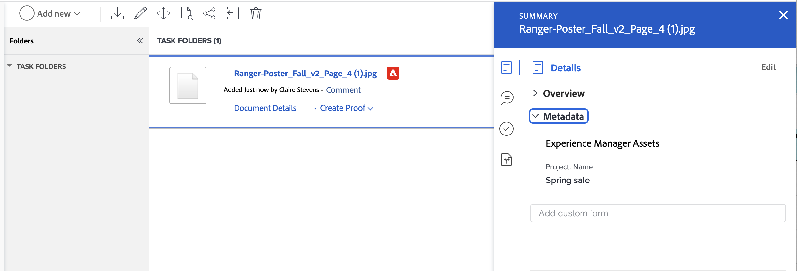

# Experience Manager Assets 또는 Assets Essentials에 대해 매핑된 메타데이터 보기

매핑된 메타데이터의 실시간 보기는 [문서의 세부 정보 및 요약] 패널에서 확인할 수 있습니다. 메타데이터 필드는 에셋을 Workfront에서 Experience Manager Assets 또는 Assets Essentials으로 보낼 때 먼저 매핑됩니다. Workfront 관리자가 오브젝트 메타데이터 동기화를 활성화한 경우 두 애플리케이션에서 변경된 필드가 최신 상태로 유지됩니다.

## 액세스 요구 사항

다음 항목이 있어야 합니다.

<table>
  <tr>
   <td><strong>Adobe Workfront 플랜*</strong>
   </td>
   <td>임의
   </td>
  </tr>
  <tr>
   <td><strong>Adobe Workfront 라이선스*</strong>
   </td>
   <td>요청 이상
   </td>
  </tr>
  <tr>
   <td><strong>제품</strong>
   </td>
   <td>Experience Manager Assets as a Cloud Service 또는 Assets Essentials이 있어야 하며 Admin Console에서 사용자로 제품에 추가되어야 합니다.
   </td>
  </tr>
  <tr>
   <td><strong>액세스 수준 구성*</strong>
   </td>
   <td>문서에 대한 액세스 편집

<strong>참고: </strong>아직 액세스 권한이 없는 경우 Workfront 관리자에게 액세스 수준에 추가 제한을 설정했는지 문의하세요. Workfront 관리자가 액세스 수준을 수정하는 방법에 대한 자세한 내용은 <strong>사용자 지정 액세스 수준 만들기 또는 수정</strong>을 참조하십시오.
   </td>
  </tr>
  <tr>
   <td><strong>개체 권한</strong>
   </td>
   <td>액세스 권한 이상 보기

추가 액세스 요청에 대한 자세한 내용은 <strong>개체 </strong>에 대한 액세스 요청 을 참조하십시오.
   </td>
  </tr>
</table>

*보유 중인 플랜, 라이선스 유형 또는 액세스 권한을 확인하려면 Workfront 관리자에게 문의하십시오.

## 전제 조건

시작하기 전에,

* Workfront 관리자는 Experience Manager 통합을 구성해야 합니다. 자세한 내용은 [Experience Manager Assets as a Cloud Service 통합 구성](/help/quicksilver/administration-and-setup/configure-integrations/configure-aacs-integration.md) 또는 [Experience Manager Assets Essentials 통합 구성](/help/quicksilver/documents/adobe-workfront-for-experience-manager-assets-essentials/setup-asset-essentials.md)을 참조하십시오.

## 문서 세부 정보

문서 세부 정보에서 메타데이터 패널을 열려면 다음을 수행합니다.

1. 문서가 포함된 프로젝트, 작업 또는 문제로 이동한 다음 **문서**&#x200B;을(를) 선택합니다.
1. 필요한 문서를 마우스로 가리킨 다음 **문서 세부 정보**&#x200B;를 선택합니다.
1. **메타데이터** 섹션을 찾아 확장합니다.
   >[!NOTE]
   >
   >이 섹션에서 필드를 편집할 수 없습니다. 보기 전용입니다.

## 문서에 대한 요약

요약 패널에서 메타데이터 패널을 열려면 다음을 수행합니다.

1. 문서가 포함된 프로젝트, 작업 또는 문제로 이동한 다음 **문서**&#x200B;을(를) 선택합니다.
1. 필요한 문서를 찾습니다.
1. **요약 아이콘** 을 클릭한 다음 **메타데이터** 섹션을 확장합니다.
   >[!NOTE]
   >
   >이 섹션에서 필드를 편집할 수 없습니다. 보기 전용입니다.

