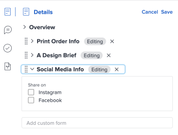

# 문서에 사용자 정의 양식 추가 또는 편집

사용자 정의 양식을 문서 또는 문서 버전에 추가하여 에셋과 관련된 추가 정보 또는 메타데이터를 캡처할 수 있습니다.

## 액세스 요구 사항

+++ 이 문서의 기능에 대한 액세스 요구 사항을 보려면 확장하십시오.

<table style="table-layout:auto"> 
 <col> 
 <col> 
 <tbody> 
  <tr> 
   <td role="rowheader">Adobe Workfront 패키지</td> 
   <td> 
 Any
 </td> 
  </tr> 
  <tr> 
   <td role="rowheader">Adobe Workfront 라이선스</td> 
   <td> 
   
기여자 이상

   
요청 이상
 </td> 
  </tr> 
  <tr> 
   <td role="rowheader">액세스 수준 구성</td> 
   <td> 
문서에 대한 액세스 편집
 </td> 
  </tr> 
  <tr> 
   <td role="rowheader">개체 권한</td> 
   <td> 
문서에 대한 액세스 관리
 </td> 
  </tr> 
 </tbody> 
</table>

이 표의 정보에 대한 자세한 내용은 [Workfront 설명서의 액세스 요구 사항](/help/quicksilver/administration-and-setup/add-users/access-levels-and-object-permissions/access-level-requirements-in-documentation.md)을 참조하십시오.

+++

## 전제 조건

* 사용자 정의 양식을 사용자와 공유해야 합니다.

## 이전 문서 영역에 사용자 정의 양식 추가

조직이 기존 Workfront 스토리지를 사용하고 있는 경우 Workfront의 문서에 액세스하면 기존 문서 영역이 표시됩니다. Workfront 스토리지에 대한 자세한 내용은 [Adobe 엔터프라이즈 스토리지와 레거시 Workfront 스토리지의 차이점](/help/quicksilver/review-and-approve-work/esm-overview.md#differences-between-adobe-enterprise-storage-and-legacy-workfront-storage)을 참조하십시오.

문서에 사용자 정의 양식을 추가하려면 다음과 같이 하십시오.

1. 문서가 포함된 프로젝트, 작업 또는 문제로 이동한 다음 **문서**&#x200B;을(를) 선택합니다.
1. 필요한 문서를 찾습니다.

1. **요약** 아이콘 을 클릭한 다음 **세부 정보** 섹션을 찾습니다.
1. **사용자 정의 양식 추가** 상자에서 입력을 시작하고 사용자 정의 양식을 선택합니다. 양식이 문서에 자동으로 저장됩니다.

   >[!NOTE]
   >
   >드롭다운 메뉴에 활성 사용자 정의 양식만 표시됩니다. 문서당 최대 10개의 사용자 정의 양식을 추가할 수 있습니다. 사용자 정의 양식을 만들어야 하는 경우 [사용자 정의 양식 만들기](/help/quicksilver/administration-and-setup/customize-workfront/create-manage-custom-forms/form-designer/design-a-form/design-a-form.md)를 참조하십시오.

## 이전 문서 영역에서 사용자 정의 양식 편집

1. 문서가 포함된 프로젝트, 작업 또는 문제로 이동한 다음 **문서**&#x200B;을(를) 선택합니다.
1. 필요한 문서를 찾습니다.

1. **요약** 아이콘 을 클릭한 다음 상단 근처에서 **세부 정보** 섹션을 찾습니다.
1. 오른쪽 상단에서 **편집**&#x200B;을 클릭한 다음 원하는 양식을 확장합니다.
1. 필요한 사항을 변경한 다음 **저장**&#x200B;을 클릭합니다.

   

## 새 문서 영역에 사용자 정의 양식 추가

조직에서 엔터프라이즈 스토리지를 사용하는 경우 Workfront의 문서에 액세스할 때 새 문서 영역이 표시됩니다. 엔터프라이즈 스토리지에 대한 자세한 내용은 [Adobe 엔터프라이즈 스토리지 개요](/help/quicksilver/review-and-approve-work/esm-overview.md)를 참조하십시오.

문서에 사용자 정의 양식을 추가하려면 다음과 같이 하십시오.

1. 문서가 포함된 프로젝트, 작업 또는 문제로 이동한 다음 **문서**&#x200B;을(를) 선택합니다.
1. 필요한 문서를 선택합니다.
1. 오른쪽의 **세부 정보** 섹션에서 **편집**을 클릭합니다.
   
1. **사용자 지정 Forms** 필드에서 입력을 시작하고 사용자 지정 양식을 선택합니다.
1. **저장**&#x200B;을 클릭합니다. 사용자 정의 양식이 세부 정보 섹션에 표시됩니다.

## 새 문서 영역에서 사용자 정의 양식 편집

1. 문서가 포함된 프로젝트, 작업 또는 문제로 이동한 다음 **문서**&#x200B;을(를) 선택합니다.
1. 필요한 문서를 선택합니다.
1. 오른쪽의 **세부 정보** 섹션에서 **편집**을 클릭합니다.
   
1. **사용자 지정 Forms** 섹션에서 편집할 양식을 찾습니다.
1. 필요한 사항을 변경한 다음 **저장**&#x200B;을 클릭합니다.
