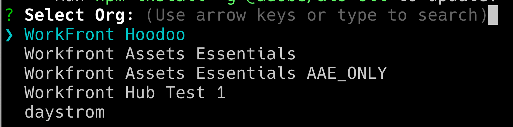
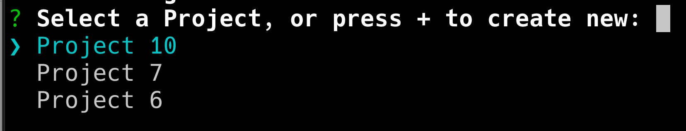

# Workfront 문서 세부 정보 내의 AppBuilder

문서 세부 정보 내에서 AppBuilder를 설치할 수 있습니다.

## 전제 조건

다음 항목이 있어야 합니다.

* IMS 지원 Workfront 계정
* 노드 v18 및 npm이 있는 개발 시스템

## Admin Console에 개발자 추가

>[!IMPORTANT]
>
>다음 모든 단계에 대해 올바른 IMS 조직을 선택했는지 확인하십시오. 여러 조직에 속해 있는 경우 잘못된 조직을 선택할 수 있습니다. 일반적으로 오른쪽 상단 모서리에 나열되어 있는 올바른 조직 아래에서 작업하고 있는지 확인합니다.


1. 다음 중 하나로 이동합니다.

* 단계: [https://stage.adminconsole.adobe.com/](https://stage.adminconsole.adobe.com/)
* 프로덕션: [https://adminconsole.adobe.com/](https://adminconsole.adobe.com/)

1. 사용자 섹션에서 **개발자** > **개발자 추가**&#x200B;를 클릭합니다.

   

   >[!NOTE]
   >
   >개발자 관리 옵션이 표시되지 않으면 개발 액세스를 허용하는 제품이 없는 것입니다. Workfront은 개발자 액세스를 제공하지 않지만 AEM은 제공합니다. 이 메시지가 표시되지 않으면 개발자가 사용할 수 있는 앱 목록에 Workfront을 포함하는 방법을 찾아야 합니다.

1. 사용자 이메일을 추가합니다. Admin Console 내에서 이미 추가된 기존 사용자를 검색해야 합니다.

1. 필요한 제품을 개발자 프로필에 추가하고 **저장**&#x200B;을 클릭합니다.


## AppBuilder 액세스 권한 얻기

조직은 계정 관리자와 협력하여 AppBuilder를 구매해야 합니다. POC를 위해서 이렇게 할 필요가 없었기 때문에 이에 대한 정확한 프로세스는 이해가 되지 않습니다.

AppBuilder 통합을 테스트하려면 여기에서 IMS 조직에 대한 무료 평가판을 요청할 수 있습니다.
[https://developer.adobe.com/app-builder/docs/overview/getting_access/#](https://developer.adobe.com/app-builder/docs/get_started/app_builder_get_started/set-up#access-and-credentials)

30일 무료 체험판인데도 그 시간이 지나면 실제로 체험판이 비활성화되지 않을 거라는 인상을 받고 있다.

AppBuilder가 제대로 구성된 경우 새 프로젝트 만들기의 일부로 &quot;템플릿으로 프로젝트 만들기&quot;가 표시됩니다(다음 섹션에서 다룹니다).

## 개발 콘솔에서 새 프로젝트 만들기

1. **템플릿에서 프로젝트 만들기**&#x200B;를 클릭합니다.

   >[!IMPORTANT]
   >
   >이 옵션이 표시되지 않으면 Admin Console에서 잘못 구성되었으며 App Builder 카탈로그에 액세스할 수 없습니다. 이 옵션은 AppBuilder에 액세스할 수 있는 경우에만 표시됩니다.

   

1. **App Builder**&#x200B;을(를) 선택합니다.

1. **프로젝트 제목** 및 **앱 이름**&#x200B;을 입력하십시오. 둘 다 기본값이 있지만 값을 사용자 지정하는 경우 나중에 원하는 프로젝트를 더 쉽게 식별할 수 있습니다.

   >[!NOTE]
   >
   >이 단계에서는 작업 공간을 추가할 수 있습니다. 각 개발자를 위한 작업 영역을 만드는 것이 좋습니다. 이렇게 하면 개발자가 작업할 때 비밀과 배포가 서로 분리됩니다. 작업 공간의 이름을 을 사용하는 개발자의 이름으로 지정해야 합니다. AIO cli에는 작업 공간 전환을 위한 옵션이 있으며, 이 옵션은 나중에 살펴보겠습니다.


1. **런타임 포함**&#x200B;을 선택한 상태로 둡니다.

1. **저장**&#x200B;을 클릭합니다.

## Adobe IO(aio) CLI

Adobe은 App Builder 애플리케이션을 만드는 데 사용할 수 있는 오픈 소스 CLI를 제공합니다. 설명서는 [https://github.com/adobe/aio-cli](https://github.com/adobe/aio-cli) 및 Adobe App Builder 지침 [https://developer.adobe.com/app-builder/docs/getting_started/first_app/](https://developer.adobe.com/app-builder/docs/get_started/app_builder_get_started/first-app)에서 찾을 수 있습니다.

1. 설치

   1. 도구를 설치하려면(먼저 노드 v18에 있는지 확인) `npm install -g @adobe/aio-cli`을(를) 실행합니다.

1. 터미널에서 인증

   1. 터미널을 시작하고 `aio login` 명령을 사용하여 AIO에 로그인합니다.

1. 응용 프로그램 초기화

   1. `aio app init example-app`을(를) 실행하여 앱 설정을 시작합니다.

1. 구성 선택

   1. 제공된 옵션에서 조직 및 프로젝트를 계속 선택합니다.

      

      

1. 템플릿 선택 및 설정

   1. 사용 가능한 모든 템플릿을 탐색하고 프로젝트의 **@adobe/aem-cf-editor-ui-ext-tpl** 템플릿을 선택합니다.

      

      

1. 확장 정의

   1. 확장 이름을 지정합니다.
   1. 확장 기능에 대한 설명 요약을 제공합니다.
   1. 시작할 초기 버전 번호를 선택합니다.
   1. **완료**&#x200B;를 선택하여 완료를 확인합니다.

   

1. 프로젝트 폴더로 이동

   1. src 폴더에 액세스

   1. `aem-cf-editor-1` 폴더의 이름을 `workfront-doc-details-1`(으)로 바꾸십시오.

1. 구성 파일 수정

   1. app.config.yaml 열기
   1. 줄을 `aem/cf-editor/1`에서 `workfront/doc-details/1`(으)로 업데이트합니다.
   1. 포함 경로를 `src/aem-cf-editor-1/ext.config.yaml`에서 `src/workfront-doc-details-1/ext.config.yaml`(으)로 조정합니다.

1. Extension Registration 구성 요소 편집

   1. `src/workfront-doc-details-1/web-src/src/components/ExtensionRegistration.js` 열기
   1. 메서드 섹션에서 비동기 함수 `secondaryNav`이(가) 포함된 함수 `getButtons`을(를) 추가합니다.
   1. `getButtons`은(는) 다음 구조의 개체를 받아야 합니다.

      ```
          {
          docId: "String",  // Document ID
          docvId: "String", // Document version ID
          sharedContext: {
              hostname: "String",
              protocol: "String",
              auth: {
              imsOrgID: "String",    // Customer's IMS Org ID
              imsToken: "String",    // User's IMS token
              imsClientId: "String"
              }
          }
          }
      ```

1. 이 함수는 탐색에 나타날 단추 개체의 배열을 반환합니다.

   ```
       methods: {
       secondaryNav: {
           async getButtons({docId, docvId, sharedContext}) {
           return [
               { label: 'Registration', url: '/index.html' },
               { label: 'Review', url: '/index.html#review' }
           ];
           }
       }
       }
   ```

1. 응용 프로그램 라우팅 구성
   1. App.js 파일을 열고 새로 개발된 기능을 포함하도록 경로를 구성합니다. 기본 보기 및 검토 페이지와 같은 추가 보기에 대한 경로를 설정해야 합니다. 다음은 이러한 경로를 정의하는 방법입니다.

      ```
          <Route index element={<ExtensionRegistration />} />
          <Route exact path="index.html" element={<ExtensionRegistration />} />
          <Route exact path="review" element={<Review />} />
      ```

1. 문서 세부 정보 액세스
   1. 응용 프로그램 내에서 제공된 함수 `document.getDocumentDetails`을(를) 구현하여 필수 문서 세부 정보를 가져옵니다. 이 함수는 `docId`, `docvId` 및 인증 세부 정보가 있는 `sharedContext` 개체와 함께 `hostname` 및 `protocol`을(를) 포함하는 개체를 검색합니다. 애플리케이션이 이 데이터를 적절히 처리하는지 확인합니다.

1. 구성 요소에서 데이터 가져오기 통합
   1. 응용 프로그램의 구성 요소 폴더에 새 구성 요소를 추가합니다. 이 구성 요소 내에서 Workfront에 대한 연결을 설정하여 호스트 애플리케이션과 연결된 연결을 사용하여 문서 정보 및 인증 데이터를 검색합니다. 다음은 이러한 문제를 해결하기 위해 구성 요소를 구성하는 방법의 예입니다.

      ```
          import { useEffect, useState } from 'react';
          import { attach } from "@adobe/uix-guest";
          import { extensionId } from "./Constants";
      
          function Review() {
              const [conn, setConn] = useState();
      
              useEffect(() => {
              const iife = async () => {
                  // "attach" the guest application to the host. This creates a "tunnel" from the host app that allows data to be passed to the iframe running this app.
                  const connection = await attach({
                  id: extensionId,
                  });
                  setConn(connection);
              };
      
              iife();
              }, []);
      
              useEffect(() => {
                  if (conn) {
                      // Using the connection created above, grab the document details from the host tunnel.
                      conn?.host?.document?.getDocumentDetails().then(setDocDetails);
                      // Pull the auth tokens from the sharedContext (see host app for details)
                      setAuth(conn?.sharedContext?.get("auth"));
                      setHostname(conn?.sharedContext?.get("hostname"));
                      setProtocol(conn?.sharedContext?.get("protocol"));
                  }
              }, [conn]);
      
          return (<>Text</>);
          }
      
          export default Review;
      ```

## 기존 AIO 프로젝트에 대한 구성

1. 구성 파일 업데이트
   1. `app.config.yaml` 열기
   1. 참조를 `aem/cf-editor/1`에서 `workfront/doc-details/1`(으)로 업데이트하여 구성을 수정합니다. 이렇게 조정하면 파일 경로가 현재 프로젝트 구조에 맞게 조정됩니다.

1. Extension Registration 구성 요소 수정
   1. 이름이 `ExtensionRegistration.js`인 파일을 찾아 엽니다.
   1. 메서드 섹션에서 비동기 함수 `secondaryNav`이(가) 포함된 함수 `getButtons`을(를) 추가합니다.
   1. `getButtons`은(는) 다음 구조의 개체를 받아야 합니다.

      ```
          {
          docId: "String",  // Document ID
          docvId: "String", // Document version ID
          sharedContext: {
              hostname: "String",
              protocol: "String",
              auth: {
              imsOrgID: "String",    // Customer's IMS Org ID
              imsToken: "String",    // User's IMS token
              imsClientId: "String"
              }
          }
          }
      ```

1. 이 함수는 탐색에 나타날 단추 개체의 배열을 반환합니다.

   ```
       methods: {
       secondaryNav: {
           async getButtons({docId, docvId, sharedContext}) {
           return [
               { label: 'Registration', url: '/index.html' },
               { label: 'Review', url: '/index.html#review' }
           ];
           }
       }
       }
   ```

1. 응용 프로그램 라우팅 구성
   1. `App.js`파일을 열고 새로 개발된 기능을 포함하도록 경로를 구성합니다. 기본 보기 및 검토 페이지와 같은 추가 보기에 대한 경로를 설정해야 합니다. 다음은 이러한 경로를 정의하는 방법입니다.

      ```
          <Route index element={<ExtensionRegistration />} />
          <Route exact path="index.html" element={<ExtensionRegistration />} />
          <Route exact path="review" element={<Review />} />
      ```

1. 문서 세부 정보 액세스
   1. 응용 프로그램 내에서 제공된 함수 `document.getDocumentDetails`을(를) 구현하여 필수 문서 세부 정보를 가져옵니다. 이 함수는 `docId`, `docvId` 및 인증 세부 정보가 있는 `sharedContext` 개체와 함께 `hostname` 및 `protocol`을(를) 포함하는 개체를 검색합니다. 애플리케이션이 이 데이터를 적절히 처리하는지 확인합니다.

1. 구성 요소에서 데이터 가져오기 통합
   1. 응용 프로그램의 구성 요소 폴더에 새 구성 요소를 추가합니다. 이 구성 요소 내에서 Workfront에 대한 연결을 설정하여 호스트 애플리케이션과 연결된 연결을 사용하여 문서 정보 및 인증 데이터를 검색합니다. 다음은 이러한 문제를 해결하기 위해 구성 요소를 구성하는 방법의 예입니다.

      ```
          import { useEffect, useState } from 'react';
          import { attach } from "@adobe/uix-guest";
          import { extensionId } from "./Constants";
      
          function Review() {
              const [conn, setConn] = useState();
      
              useEffect(() => {
              const iife = async () => {
                  // "attach" the guest application to the host. This creates a "tunnel" from the host app that allows data to be passed to the iframe running this app.
                  const connection = await attach({
                  id: extensionId,
                  });
                  setConn(connection);
              };
      
              iife();
              }, []);
      
              useEffect(() => {
                  if (conn) {
                      // Using the connection created above, grab the document details from the host tunnel.
                      conn?.host?.document?.getDocumentDetails().then(setDocDetails);
                      // Pull the auth tokens from the sharedContext (see host app for details)
                      setAuth(conn?.sharedContext?.get("auth"));
                      setHostname(conn?.sharedContext?.get("hostname"));
                      setProtocol(conn?.sharedContext?.get("protocol"));
                  }
              }, [conn]);
      
          return (<>Text</>);
          }
      
          export default Review;
      ```

## 애플리케이션 게시

>[!IMPORTANT]
>
>다음 각 단계에 대해 올바른 IMS 조직을 선택했는지 확인하십시오.

게스트 애플리케이션을 Workfront 내에 로드하려면 애플리케이션을 프로덕션 작업 영역으로 푸시하고 승인을 위해 제출해야 합니다.

1. 프로덕션 작업 영역에 애플리케이션 배포

   1. `aio app use -w Production`
   1. `aio app deploy`

1. [https://developer-stage.adobe.com/](https://developer-stage.adobe.com/) 또는 [https://developer.adobe.com/](https://developer.adobe.com/)&#x200B;(으)로 이동합니다.

   1. 오른쪽 상단의 **콘솔**&#x200B;을 클릭합니다.

1. AppBuilder 애플리케이션을 만드는 데 사용한 프로젝트를 찾습니다.
1. 프로덕션 Workspace을 선택합니다.

   

1. 비공개 검토를 위해 애플리케이션을 제출하십시오. 앱 교환 마켓플레이스에 게시하지 않는다는 경고가 표시되며, 이는 적절합니다.
1. 양식(제목, 설명, 아이콘 및 검토자 참고 사항)을 채웁니다.

   

>[!IMPORTANT]
>
>제출되면 조직의 시스템 관리자가 제출을 승인해야 합니다.

## 제출 승인

1. 시스템 관리자의 경우 [https://stage.exchange.adobe.com/](https://stage.exchange.adobe.com/) 또는 [https://exchange.adobe.com/](https://exchange.adobe.com/)&#x200B;(으)로 이동합니다.

1. **관리** > **Experience Cloud 응용 프로그램**을 클릭합니다. 제출된 앱에는 승인/거부 옵션이 표시됩니다.
승인되면 게시된 애플리케이션 확장은 Workfront 환경에 자동으로 로드됩니다.

   

## 추가 도움말

Adobe에는 AppBuilder용 앱 빌드를 시작하고 배포하는 방법에 대한 훌륭한 설명서가 있습니다.

다음은 몇 가지 유용한 링크입니다.

* [https://developer.adobe.com/app-builder/docs/getting_started/first_app/#4-bootstrapping-new-app-using-the-cli](https://developer.adobe.com/app-builder/docs/get_started/app_builder_get_started/first-app#bootstrap-the-new-app-using-the-cli)

* [https://developer.adobe.com/uix/docs/guides/publication/](https://developer.adobe.com/uix/docs/guides/publication/)

* [https://developer.adobe.com/uix/docs/services/aem-cf-console-admin/extension-development/](https://developer.adobe.com/uix/docs/services/aem-cf-console-admin/extension-development/)

## 로컬 개발

Workfront용 App Builder 애플리케이션을 개발하는 동안 앱을 게시하지 않고 Workfront 내에서 테스트해야 할 수도 있습니다. 다행히도, 우리는 이에 대한 해결책을 가지고 있습니다.

App Builder 앱 내에서 로컬 개발을 위해 `aio app run`을(를) 시작할 수 있습니다. URL은 일반적으로 `https://localhost:9080`과(와) 같습니다. 또는 `aio app deploy`을(를) 실행하여 정적 Adobe 도메인을 가져올 수 있습니다. 나중에 사용할 수 있도록 이 URL을 메모해 두십시오.

그런 다음 브라우저에서 개발하려는 특정 문서 세부 정보 페이지로 이동합니다. 개발자 도구를 열고 workfront.com 또는 workfront.adobe.com용 로컬 저장소에 액세스합니다. 여기에서 항목을 추가해야 합니다. 키로 `appBuilderDocDetailsOverride`을(를) 사용하고 값으로 이전에 언급된 App Builder URL을 사용합니다.

페이지를 다시 로드하면 App Builder 애플리케이션의 버튼이 표시되는 것을 볼 수 있습니다. 이 버튼을 클릭하면 작동 중인 앱을 볼 수 있습니다.
