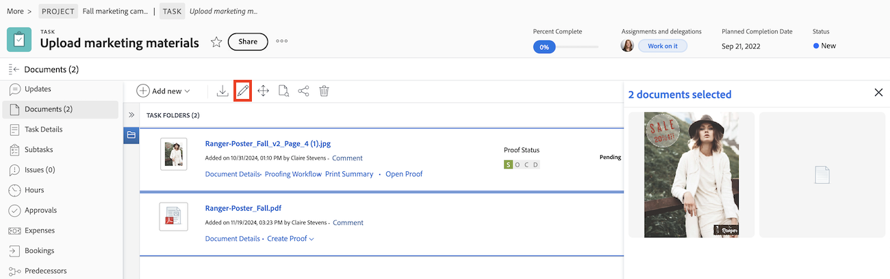

# 문서 일괄 편집

한 번에 여러 문서에서 설명을 편집하고, 사용자 정의 양식을 추가하고, 사용자 정의 양식을 편집할 수 있습니다.

## 사용자 정의 양식 편집 시 고려 사항

문서 사용자 정의 양식을 대량으로 편집할 때 다음 사항을 고려하십시오.

* 선택한 모든 문서에서 변경할 정보는 개별 문서의 기존 정보를 덮어씁니다.
* 동일한 필드에 대해 다른 값이 있는 문서를 선택하면 필드에 &quot;여러 값&quot; 표시기가 표시됩니다. 확인란, 라디오 버튼 및 토글 필드의 옆에 &quot;여러 값&quot; 표시기가 있습니다.
* 여러 옵션 필드(예: 일련의 전환 또는 확인란으로 표시되는 필드)에서 한 옵션을 업데이트하는 경우 선택한 문서 간에 다른 모든 옵션이 일치해야 합니다.

>[!BEGINSHADEBOX]

**예**
세 개의 확인란(옵션1, 옵션2 및 옵션3)과 옵션1이 선택된 모든 문서에 대해 선택 취소되어 있는 확인란 필드가 있는 사용자 정의 양식이 있을 수 있으며, 일부 문서에는 옵션2와 옵션3이 선택되어 있고 선택한 다른 문서에는 선택 취소되어 있습니다. 모든 문서에 대해 옵션 1을 선택하려는 경우 변경 사항을 저장하기 전에 선택한 모든 프로젝트에 대해 옵션 2와 옵션 3을 일치시켜야 합니다. 따라서 선택한 모든 프로젝트에서 일치시킬 수 있도록 선택하거나 선택을 해제해야 합니다. 옵션을 변경하지 않으면 필드를 그대로 저장할 수 있으며 모든 옵션에 대해 문서가 현재 선택된 상태로 유지됩니다.

>[!ENDSHADEBOX]

## 액세스 요구 사항

+++ 이 문서의 기능에 대한 액세스 요구 사항을 보려면 확장하십시오.

<table style="table-layout:auto"> 
 <col> 
 <col> 
 <tbody> 
  <tr> 
   <td role="rowheader">Adobe Workfront 패키지</td> 
   <td> 
기존 Workfront 스토리지를 사용하여 문서를 관리하는 모든 Workfront 패키지

Adobe 엔터프라이즈 스토리지를 사용하여 문서를 관리하는 모든 워크플로 패키지
</td> 
  </tr> 
  <tr> 
   <td role="rowheader">Adobe Workfront 라이센스*</td> 
   <td>
기여자 이상
 
   
요청 이상
 </td> 
  </tr> 
  <tr> 
   <td role="rowheader">액세스 수준 구성</td> 
   <td> 
문서에 대한 액세스 편집
</td> 
  </tr> 
  <tr> 
   <td role="rowheader">개체 권한</td> 
   <td> 
문서에 대한 액세스 관리
</td> 
  </tr> 
 </tbody> 
</table>

이 표의 정보에 대한 자세한 내용은 [Workfront 설명서의 액세스 요구 사항](/help/quicksilver/administration-and-setup/add-users/access-levels-and-object-permissions/access-level-requirements-in-documentation.md)을 참조하십시오.

+++

## 이전 문서 영역에서 문서를 일괄적으로 편집

조직이 기존 Workfront 스토리지를 사용하고 있는 경우 Workfront의 문서에 액세스하면 기존 문서 영역이 표시됩니다. Workfront 스토리지에 대한 자세한 내용은 [Adobe 엔터프라이즈 스토리지와 레거시 Workfront 스토리지의 차이점](/help/quicksilver/review-and-approve-work/esm-overview.md#differences-between-adobe-enterprise-storage-and-legacy-workfront-storage)을 참조하십시오.

문서를 일괄적으로 편집하려면

1. 프로젝트의 문서 탭이나 기본 메뉴에서 문서 영역으로 이동합니다.
1. 키보드에서 ctrl 또는 cmd를 누르고 편집할 문서를 선택합니다.
1. 편집 아이콘 을 클릭합니다.
   
1. (선택 사항) **설명**&#x200B;을 추가하거나 편집합니다. 각 문서에 대한 설명이 다른 경우 설명 상자에 _여러 값_&#x200B;이 표시됩니다. 모든 문서에 대해 동일한 설명을 추가할 수 있지만 일괄 편집 시 개별 문서 설명을 편집할 수는 없습니다.
1. 사용자 정의 양식을 사용하여 다음과 같이 변경합니다.

   <table>
    <tr>
    <td><strong>양식 추가</strong></td>
    <td><strong>사용자 정의 양식 추가</strong>에서 추가할 첨부된 양식과 양식을 선택할 수 있습니다. 첨부된 양식이 선택한 문서 중 일부에 있지만 전부에 없습니다. 선택한 모든 문서에 첨부된 양식이 편집 창에 자동으로 표시됩니다.  </td>
    </tr>
    <tr>
    <td><strong>양식 편집</strong></td>
    <td>첨부된 사용자 정의 양식을 편집합니다. 변경하는 정보는 개별 문서의 기존 정보를 덮어씁니다. 문서 간에 서로 다른 값이 있는 필드는 "여러 값"으로 표시됩니다. </td>
    </tr>
    <tr>
    <td><strong>양식 재정렬</strong></td>
    <td>재배열할 사용자 정의 양식을 클릭하고 드래그합니다.</td>
    </tr>
    </table>
1. **저장**&#x200B;을 클릭합니다.

## 새 문서 영역에서 문서를 일괄적으로 편집

조직에서 엔터프라이즈 스토리지를 사용하는 경우 Workfront의 문서에 액세스할 때 새 문서 영역이 표시됩니다. 엔터프라이즈 스토리지에 대한 자세한 내용은 [Adobe 엔터프라이즈 스토리지 개요](/help/quicksilver/review-and-approve-work/esm-overview.md)를 참조하십시오.

문서를 일괄적으로 편집하려면

1. 문서가 포함된 프로젝트, 작업 또는 문제로 이동한 다음 **문서**&#x200B;을(를) 선택합니다.
1. 키보드에서 ctrl 또는 cmd를 누르고 편집할 문서를 선택합니다.
1. 페이지 하단에서 편집 을 클릭합니다.
   
1. (선택 사항) **설명**&#x200B;을 추가하거나 편집합니다. 각 문서에 대한 설명이 다른 경우 설명 상자에 _여러 값_&#x200B;이 표시됩니다. 모든 문서에 대해 동일한 설명을 추가할 수 있지만 일괄 편집 시 개별 문서 설명을 편집할 수는 없습니다.
1. 사용자 정의 양식을 사용하여 다음과 같이 변경합니다.

   <table>
    <tr>
    <td><strong>양식 추가</strong></td>
    <td><strong>사용자 정의 양식</strong> 섹션에서 선택한 문서에 새 사용자 정의 양식을 추가할 수 있습니다. 선택한 모든 문서에 첨부된 사용자 정의 양식은 <strong>공통 사용자 정의 양식</strong> 섹션에 표시됩니다.  </td>
    </tr>
    <tr>
    <td><strong>양식 편집</strong></td>
    <td>첨부된 사용자 정의 양식을 편집합니다. 변경하는 정보는 개별 문서의 기존 정보를 덮어씁니다. 문서 간에 서로 다른 값이 있는 필드는 "여러 값"으로 표시됩니다. </td>
    </tr>
    </table>
1. **저장**&#x200B;을 클릭합니다.

## 문서 보고서에서 문서를 일괄적으로 편집

1. 기존 문서 보고서로 이동합니다.
또는
[사용자 지정 보고서 만들기](/help/quicksilver/reports-and-dashboards/reports/creating-and-managing-reports/create-custom-report.md)에 설명된 대로 문서 보고서를 만듭니다.
1. 편집할 문서를 선택합니다.
1. 편집 아이콘 을 클릭합니다.
1. (선택 사항) **설명**&#x200B;을 추가하거나 편집합니다. 각 문서에 대한 설명이 다른 경우 설명 상자에 _여러 값_&#x200B;이 표시됩니다. 모든 문서에 대해 동일한 설명을 추가할 수 있지만 일괄 편집 시 개별 문서 설명을 편집할 수는 없습니다.
1. 사용자 정의 양식을 사용하여 다음과 같이 변경합니다.

   <table>
    <tr>
    <td><strong>양식 추가</strong></td>
    <td><strong>사용자 정의 양식 추가</strong>에서 추가할 첨부된 양식과 양식을 선택할 수 있습니다. 첨부된 양식이 선택한 문서 중 일부에 있지만 전부에 없습니다. 선택한 모든 문서에 첨부된 양식이 편집 창에 자동으로 표시됩니다.  </td>
    </tr>
    <tr>
    <td><strong>양식 편집</strong></td>
    <td>첨부된 사용자 정의 양식을 편집합니다. 변경하는 정보는 개별 문서의 기존 정보를 덮어씁니다. 문서 간에 서로 다른 값이 있는 필드는 "여러 값"으로 표시됩니다. </td>
    </tr>
    <tr>
    <td><strong>양식 재정렬</strong></td>
    <td>재배열할 사용자 정의 양식을 클릭하고 드래그합니다.</td>
    </tr>
    </table>
1. **저장**&#x200B;을 클릭합니다.
