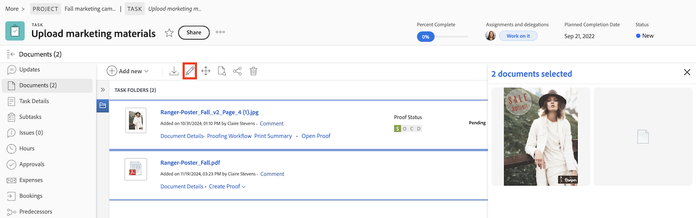

# 문서 일괄 편집

한 번에 여러 문서에서 설명을 편집하고, 사용자 정의 양식을 추가하고, 사용자 정의 양식을 편집할 수 있습니다.

## 사용자 정의 양식 편집 시 고려 사항

문서 사용자 정의 양식을 대량으로 편집할 때 다음 사항을 고려하십시오.

* 선택한 모든 문서에서 변경할 정보는 개별 문서의 기존 정보를 덮어씁니다.
* 동일한 필드에 대해 다른 값이 있는 문서를 선택하면 필드에 &quot;여러 값&quot; 표시기가 표시됩니다. 확인란, 라디오 버튼 및 토글 필드의 옆에 &quot;여러 값&quot; 표시기가 있습니다.
* 여러 옵션 필드(예: 일련의 전환 또는 확인란으로 표시되는 필드)에서 한 옵션을 업데이트하는 경우 선택한 문서 간에 다른 모든 옵션이 일치해야 합니다.

>[!BEGINSHADEBOX]

**예**
세 개의 확인란(옵션1, 옵션2 및 옵션3)과 옵션1이 선택된 모든 문서에 대해 선택 취소되어 있는 확인란 필드가 있는 사용자 정의 양식이 있을 수 있으며, 일부 문서에는 옵션2와 옵션3이 선택되어 있고 선택한 다른 문서에는 선택 취소되어 있습니다. 모든 문서에 대해 옵션 1을 선택하려는 경우 변경 사항을 저장하기 전에 선택한 모든 프로젝트에 대해 옵션 2와 옵션 3을 일치시켜야 합니다. 따라서 선택한 모든 프로젝트에서 일치시킬 수 있도록 선택하거나 선택을 해제해야 합니다. 옵션을 변경하지 않으면 필드를 그대로 저장할 수 있으며 모든 옵션에 대해 문서가 현재 선택된 상태로 유지됩니다.

>[!ENDSHADEBOX]

## 액세스 요구 사항

+++ 을 확장하여 이 문서의 기능에 대한 액세스 요구 사항을 봅니다.

다음 항목이 있어야 합니다.

<table style="table-layout:auto"> 
 <col> 
 <col> 
 <tbody> 
  <tr> 
   <td role="rowheader">Adobe Workfront 플랜*</td> 
   <td> 
 임의
 </td> 
  </tr> 
  <tr> 
   <td role="rowheader">Adobe Workfront 라이센스*</td> 
   <td>
 새로운 기능: 기여자 이상
 
   
 현재: 요청 이상
 </td> 
  </tr> 
  <tr> 
   <td role="rowheader">액세스 수준 구성*</td> 
   <td> 
문서에 대한 액세스 편집
 
참고: 여전히 액세스 권한이 없는 경우 Workfront 관리자에게 액세스 수준에서 추가 제한을 설정하는지 문의하십시오. Workfront 관리자가 액세스 수준을 수정하는 방법에 대한 자세한 내용은 <a href="../../administration-and-setup/add-users/configure-and-grant-access/create-modify-access-levels.md" class="MCXref xref">사용자 지정 액세스 수준 만들기 또는 수정</a>을 참조하십시오.
 </td> 
  </tr> 
  <tr> 
   <td role="rowheader">개체 권한</td> 
   <td> 
문서에 대한 액세스 관리
 
추가 액세스 요청에 대한 자세한 내용은 <a href="../../workfront-basics/grant-and-request-access-to-objects/request-access.md" class="MCXref xref">개체 </a>에 대한 액세스 요청 을 참조하십시오.
 </td> 
  </tr> 
 </tbody> 
</table>

&#42;보유 중인 플랜, 라이선스 유형 또는 액세스 권한을 확인하려면 Workfront 관리자에게 문의하십시오.

+++

## 문서 일괄 편집

문서를 일괄적으로 편집하려면

1. 프로젝트의 문서 탭이나 기본 메뉴에서 문서 영역으로 이동합니다.
1. 키보드에서 ctrl 또는 cmd를 누르고 편집할 문서를 선택합니다.
1. 편집 아이콘 을 클릭합니다.
   
1. (선택 사항) **설명**&#x200B;을 추가하거나 편집합니다. 각 문서에 대한 설명이 다른 경우 설명 상자에 _여러 값_&#x200B;이 표시됩니다. 모든 문서에 대해 동일한 설명을 추가할 수 있지만 일괄 편집 시 개별 문서 설명을 편집할 수는 없습니다.
1. 사용자 정의 양식을 사용하여 다음과 같이 변경합니다.

   <table>
    <tr>
    <td><strong>양식 추가</strong></td>
    <td><strong>사용자 정의 양식 추가</strong>에서 추가할 첨부된 양식과 양식을 선택할 수 있습니다. 첨부된 양식이 선택한 문서 중 일부에 있지만 전부에 없습니다. 선택한 모든 문서에 첨부된 양식이 편집 창에 자동으로 표시됩니다.  </td>
    </tr>
    <tr>
    <td><strong>양식 편집</strong></td>
    <td>첨부된 사용자 정의 양식을 편집합니다. 변경하는 정보는 개별 문서의 기존 정보를 덮어씁니다. 문서 간에 서로 다른 값이 있는 필드는 "여러 값"으로 표시됩니다. </td>
    </tr>
    <tr>
    <td><strong>양식 재정렬</strong></td>
    <td>재배열할 사용자 정의 양식을 클릭하고 드래그합니다.</td>
    </tr>
    </table>
1. **저장**&#x200B;을 클릭합니다.

## 문서 보고서에서 문서를 일괄적으로 편집

1. 기존 문서 보고서로 이동합니다.
또는
[사용자 지정 보고서 만들기](/help/quicksilver/reports-and-dashboards/reports/creating-and-managing-reports/create-custom-report.md)에 설명된 대로 문서 보고서를 만듭니다.
1. 편집할 문서를 선택합니다.
1. 편집 아이콘 을 클릭합니다.
   
1. (선택 사항) **설명**&#x200B;을 추가하거나 편집합니다. 각 문서에 대한 설명이 다른 경우 설명 상자에 _여러 값_&#x200B;이 표시됩니다. 모든 문서에 대해 동일한 설명을 추가할 수 있지만 일괄 편집 시 개별 문서 설명을 편집할 수는 없습니다.
1. 사용자 정의 양식을 사용하여 다음과 같이 변경합니다.

   <table>
    <tr>
    <td><strong>양식 추가</strong></td>
    <td><strong>사용자 정의 양식 추가</strong>에서 추가할 첨부된 양식과 양식을 선택할 수 있습니다. 첨부된 양식이 선택한 문서 중 일부에 있지만 전부에 없습니다. 선택한 모든 문서에 첨부된 양식이 편집 창에 자동으로 표시됩니다.  </td>
    </tr>
    <tr>
    <td><strong>양식 편집</strong></td>
    <td>첨부된 사용자 정의 양식을 편집합니다. 변경하는 정보는 개별 문서의 기존 정보를 덮어씁니다. 문서 간에 서로 다른 값이 있는 필드는 "여러 값"으로 표시됩니다. </td>
    </tr>
    <tr>
    <td><strong>양식 재정렬</strong></td>
    <td>재배열할 사용자 정의 양식을 클릭하고 드래그합니다.</td>
    </tr>
    </table>
1. **저장**&#x200B;을 클릭합니다.
