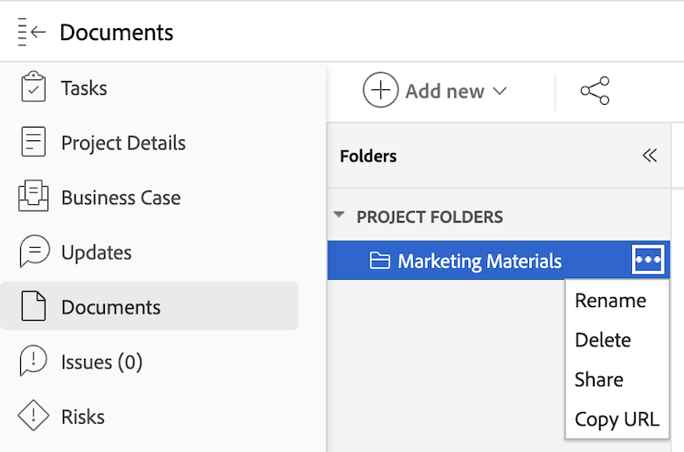

# 문서 폴더에 링크 복사 및 공유

[!DNL Workfront]프로그램[!UICONTROL , ]Portfolio[!UICONTROL , ]프로젝트[!UICONTROL , ]작업[!UICONTROL  또는 ]문제[!UICONTROL  개체에 포함된 문서 폴더에 대한 직접 링크를 복사할 수 있습니다. ] [!UICONTROL 문서] 영역에 포함된 폴더는 사용자 프로필에 직접 연결되어 다른 사용자와 공유할 수 없으므로 기본 메뉴에서 해당 폴더에 대한 링크를 복사할 수 없습니다.

## 액세스 요구 사항

+++ 을 확장하여 이 문서의 기능에 대한 액세스 요구 사항을 봅니다.

<table style="table-layout:auto"> 
 <col> 
 <col> 
 <tbody> 
  <tr> 
   <td role="rowheader">Adobe Workfront 패키지</td> 
   <td> 
임의
 </td> 
  </tr> 
  <tr> 
   <td role="rowheader">Adobe Workfront 라이선스</td> 
   <td> 
   
표준

   
작업 이상
 </td> 
  </tr> 
  <tr> 
   <td role="rowheader">액세스 수준 구성</td> 
   <td> 
문서에 대한 액세스 보기
 </td> 
  </tr> 
  <tr> 
 </tbody> 
</table>

이 표의 정보에 대한 자세한 내용은 [Workfront 설명서의 액세스 요구 사항](/help/quicksilver/administration-and-setup/add-users/access-levels-and-object-permissions/access-level-requirements-in-documentation.md)을 참조하십시오.

+++

## 문서 폴더에 링크 복사 및 공유

문서 폴더에 링크를 복사하려면 다음을 수행합니다.

1. 문서 폴더가 포함된 [!DNL Workfront] 개체로 이동합니다.
1. **[!UICONTROL 자세히]** 메뉴를 클릭한 다음 **[!UICONTROL URL 복사]**를 선택합니다. 이 링크를 공유하여 폴더에 대한 빠른 액세스를 제공할 수 있습니다. 폴더를 보려면 사용자에게 객체에 대한 보기 액세스 권한이 적어도 있어야 합니다.
   
