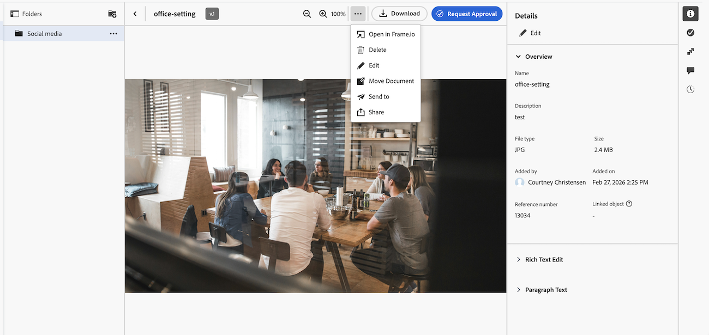

# 문서 세부 정보 개요

{{highlighted-preview}}

문서 세부 정보 페이지에서는 Adobe Workfront 객체에 첨부된 문서의 속성을 보고, 전달하고, 관리할 수 있습니다.

## 레거시 문서 영역

조직이 기존 Workfront 스토리지에 있는 경우 Workfront의 문서에 액세스할 때 기존 문서 영역이 표시됩니다. 기존 Workfront 저장소에 대한 자세한 내용은 [기존 Workfront 저장소와 Adobe 클라우드 저장소 간의 차이점](/help/quicksilver/review-and-approve-work/esm-overview.md)을 참조하십시오.

### 문서 및 증명에 대한 기본 작업 수행

문서 세부 정보 페이지에서 문서와 증명 모두에 대해 다음 작업을 수행할 수 있습니다.

* 단순 또는 고급 증명 만들기
* 새 버전 만들기
* 승인 결정
* 문서 미리보기
* 문서 설명 편집
* 문서 체크인 또는 체크아웃

또한 문서 이름 옆에 있는 기타 아이콘 를 사용하여 다음 작업을 수행할 수 있습니다.

* 공유
* 이동
* 삭제
* 다운로드
* 전송

### 증명에 대한 작업 수행

증명 워크플로를 사용하는 경우 문서 세부 정보 페이지에서 다음 작업을 수행할 수 있습니다.

* 전송됨, 열림, 댓글, 결정 (SOCD) 세부 정보 보기
* 증명 열기
* 인쇄 요약 열기
* 증명 잠금 또는 잠금 해제
* 증명 사용자 정의 필드 편집

  증명 사용자 정의 필드는 Workfront Proof에서 설정해야 합니다. 자세한 내용은 [Workfront Proof에서 사용자 지정 필드 만들기 및 관리](../../workfront-proof/wp-acct-admin/account-settings/create-and-manage-custom-fields.md)를 참조하십시오.

### 기존 문서 영역에서 문서 세부 정보 페이지를 엽니다

{{step1-to-documents}}

1. 문서를 마우스로 가리킨 다음 **문서 세부 정보**&#x200B;를 클릭합니다.

   

## 새 문서 영역

조직에서 Adobe 클라우드 스토리지를 사용하는 경우 Workfront의 문서에 액세스할 때 새 문서 영역이 표시됩니다. Adobe 클라우드 저장소에 대한 자세한 내용은 [Adobe 클라우드 저장소 개요](/help/quicksilver/review-and-approve-work/esm-overview.md)를 참조하십시오.

문서 세부 정보 페이지에서 문서에 대해 다음 작업을 수행할 수 있습니다.

<table style="border: none; width: 80%; margin: 0 auto;">
<tr style="border: none;">
<td style="border: none; width: 50%; padding-right: 20px;">
<ul>
<li>Frame.io에서 엽니다.  이 기능을 사용하려면 Frame.io Enterprise 라이선스가 있어야 합니다.</li>
<li>문서 삭제</li>
<li>문서 편집</li>
</ul>
</td>
<td style="border: none; width: 50%; padding-left: 20px;">
<ul>
<li>문서 이동</li>
<li>Experience Manager Access로 문서 보내기</li>
<li>문서 공유</li>
</ul>
</td>
</tr>
</table>

### 새 문서 영역에서 문서 세부 정보 패널을 엽니다

1. 문서가 포함된 프로젝트, 작업 또는 문제로 이동한 다음 왼쪽 패널에서 **문서**&#x200B;을(를) 선택합니다.
1. 문서를 선택한 다음 왼쪽 사이드바에서 **세부 정보 표시**&#x200B;를 클릭합니다.

   

### 새 문서 영역에서 인쇄 요약 보기

문서에 승인이 있으면 Frame.io 주석 인쇄 페이지를 열어 인쇄 가능한 형식으로 에셋 미리보기, 주석 및 승인 결정을 볼 수 있습니다.

1. 문서가 포함된 프로젝트, 작업 또는 문제로 이동한 다음 왼쪽 패널에서 **문서**&#x200B;을(를) 선택합니다.
1. 문서를 선택한 다음 왼쪽 사이드바에서 **세부 정보 표시**&#x200B;를 클릭합니다.

   

1. **개요** 섹션에서 **인쇄 요약 열기**&#x200B;를 클릭합니다.

>[!NOTE]
>
>인쇄 요약 링크는 문서에 승인이 추가된 후에만 나타납니다.

