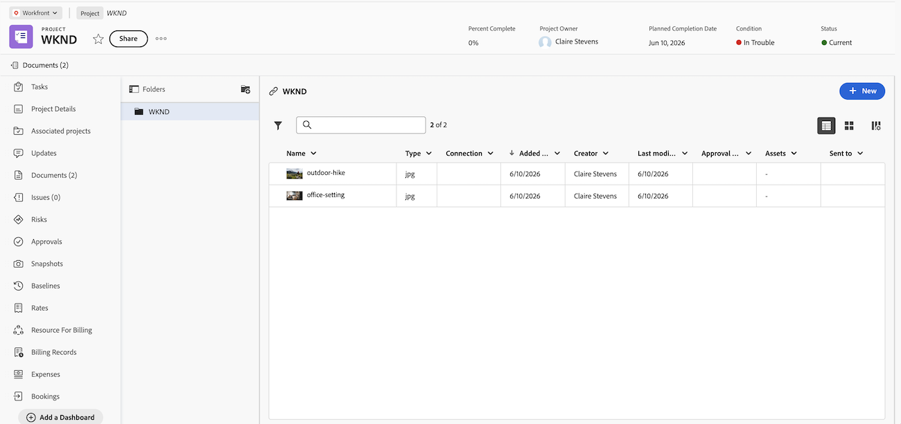
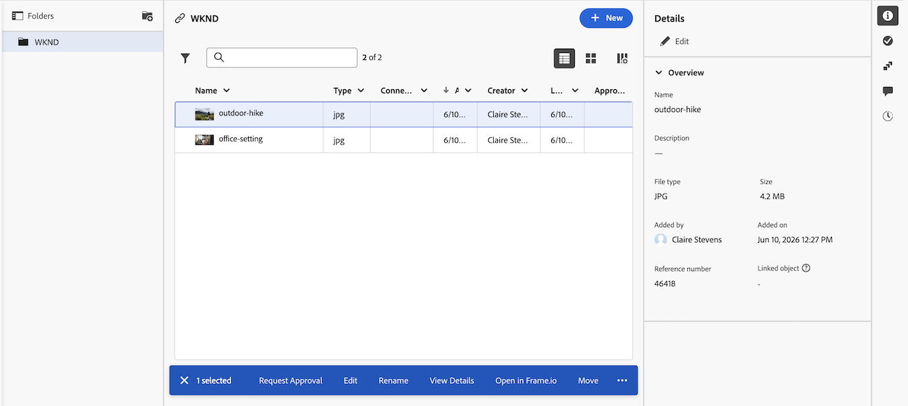

# 문서 영역

문서 영역에서는 Adobe Workfront에 업로드된 문서의 메타데이터를 구성, 관리 및 볼 수 있습니다. 증명 결정도 볼 수 있습니다.

Workfront에는 현재 기존 문서 영역과 새 문서 영역의 두 가지 버전이 있습니다. 조직에서 사용하는 버전은 조직이 레거시 Workfront 스토리지 또는 Adobe 클라우드 스토리지를 사용하고 있는지 여부에 따라 다릅니다. 이러한 저장소 유형에 대한 자세한 내용은 [Adobe 클라우드 저장소 개요](/help/quicksilver/review-and-approve-work/esm-overview.md)를 참조하십시오.

## 레거시 문서 영역

문서 영역에는 두 가지 유형이 있습니다. 기능 및 기능은 다음 두 항목에 대해 동일합니다.

* **프로그램, 포트폴리오, 템플릿, 프로젝트, 작업 또는 문제의 문서 영역:** 특정 프로젝트, 작업 또는 문제에 대한 액세스 권한이 있는 모든 문서를 나열합니다. 이 영역에 액세스하려면 프로젝트, 작업 또는 문제를 볼 때 왼쪽 패널의 **문서** 을 클릭하십시오.

* **전역 문서 영역:** Workfront에서 액세스할 수 있는 모든 문서를 나열합니다. 이 영역에 액세스하려면 주 메뉴 에서 **문서** 을 클릭하세요.

Workfront에 문서를 업로드하는 방법에 대한 자세한 내용은 [파일 시스템에서 Adobe Workfront에 문서 추가](../../documents/adding-documents-to-workfront/add-documents-from-file-system.md)를 참조하십시오.

문서 영역에는 다음 항목의 수가 기록됩니다.

* Workfront 폴더
* 파일 시스템에서 업로드된 파일
* 통합에서 Workfront에 추가된 파일
* 연결된 Experience Manager Assets

### 요약 패널

문서 영역에서 문서를 선택하면 오른쪽의 요약을 사용하여 문서 세부 정보를 보고, 문서 업데이트 및 승인을 관리하고, 문서 버전을 보고, 문서에 대한 사용자 지정 Forms을 추가 및 편집할 수 있습니다.

문서에 대해 증명이 설정된 경우 세부 정보 섹션에 증명 기한 및 현재 증명 진행률 등의 정보가 포함됩니다.

문서에 대한 모든 정보가 필요한 경우 세부 정보 머리글을 클릭하여 전체 문서 세부 정보 영역으로 이동할 수 있습니다.

요약에 대한 자세한 내용은 [문서에 대한 요약 개요](../../documents/managing-documents/summary-for-documents.md)를 참조하십시오.

### 증명 결정

증명 결정이 내려지면 문서 목록에 표시됩니다.

### 폴더

폴더를 설정하여 문서를 구성할 수 있습니다. 자세한 내용은 [문서 폴더 만들기](../../documents/organizing-documents/create-documents-folder.md)를 참조하십시오.

전역 문서 영역에서 액세스 권한이 있는 문서를 구성할 수 있도록 두 가지 유형의 폴더를 설정할 수 있습니다.

* **스마트 폴더:** 보려는 문서만 표시합니다. 자세한 내용은 [스마트 폴더 만들기 및 관리](../../documents/organizing-documents/create-manage-smart-folders.md)를 참조하십시오.

* **내 폴더:** 원하는 방식으로 문서를 구성합니다. 자세한 내용은 [문서 폴더 만들기](../../documents/organizing-documents/create-documents-folder.md)를 참조하십시오.

### 확장된 문서 세부 정보

문서 세부 정보 페이지는 오른쪽에 있는 요약에 문서 세부 정보의 보다 자세한 전체 버전을 제공합니다.

## 새 문서 영역

새 문서 영역은 조직이 Adobe 클라우드 스토리지에 있는 경우에만 사용할 수 있습니다. Adobe 클라우드 저장소에 대한 자세한 내용은 [Adobe 클라우드 저장소 개요](/help/quicksilver/review-and-approve-work/esm-overview.md)를 참조하십시오.

### 요약 패널 사용

문서 영역에서 문서를 선택하면 오른쪽의 요약 패널을 사용하여 문서에 대한 세부 정보를 보고, 첨부된 사용자 정의 양식을 추가 및 편집하고, 승인 워크플로를 만들고 관리하고, 문서 버전을 보는 등의 작업을 할 수 있습니다.

#### Frame.io로 검토 및 승인

Frame.io 뷰어를 사용하여 새 문서 영역에서 문서를 검토하고 승인할 수 있습니다.

자세한 내용은 [통합 검토 및 승인 시작](/help/quicksilver/review-and-approve-work/get-started-with-unified-approvals.md)을 참조하세요.

#### 버전 관리

새 문서 영역에서 문서의 새 버전을 업로드할 수 있습니다. 새 버전을 업로드할 때 이전 버전이 유지되며 요약 패널에서 액세스할 수 있습니다. 버전은 업로드 날짜 및 시간을 사용하여 자동으로 이름이 지정되지만, 필요에 따라 이름을 변경할 수 있습니다.

문서의 특정 버전에 대한 새 승인 워크플로를 시작할 수도 있습니다.

#### 문서 기록 보기

새 문서 영역에서 문서 기록을 볼 수 있습니다. 기록에는 다음과 같은 유형의 정보가 포함됩니다.

* 문서가 업로드된 시간
* 새 버전을 업로드한 경우
* 문서에 대한 승인 워크플로가 시작되면
* 기타

### 문서 사용 권한을 위한 시스템 수준 폴더

첫 번째 문서가 작업 또는 문제에 업로드되면 Workfront에서 시스템 수준 폴더를 자동으로 생성합니다. 이러한 폴더는 작업 또는 문제에서 권한을 상속하며 프로젝트 수준의 문서 영역에 표시됩니다. 해당 작업 또는 문제에 업로드된 모든 문서는 해당 폴더에 저장되며 이 폴더에서 권한을 상속합니다. 이것이 새 문서 영역의 문서에 대한 권한을 관리하는 기본 방법입니다. 자세한 내용은 [Adobe 클라우드 저장소 모델에 대한 개체 권한 및 액세스 수준 개요](/help/quicksilver/review-and-approve-work/esm-access-permissions.md#how-document-permissions-work)를 참조하십시오.

### 데스크탑에서 문서에 액세스

조직에서 Adobe 클라우드 스토리지를 사용하는 경우 Adobe Cloud Drive를 사용하여 Mac 또는 Windows 데스크톱에서 문서에 액세스할 수도 있습니다. Adobe Cloud Drive는 Adobe 클라우드 저장소 프로젝트를 컴퓨터의 드라이브로 탑재하므로 변경 사항을 Workfront과 동기화하면서 모든 애플리케이션에서 파일을 열고 편집할 수 있습니다. 자세한 내용은 [Adobe Cloud Drive 개요](/help/quicksilver/documents/adobe-cloud-drive/adobe-cloud-drive-overview.md)를 참조하세요.

## 고려 사항

* 새 문서 영역은 1024픽셀 이상의 화면에 최적화되었습니다. 화면이 더 작은 경우 요약 패널에 액세스하는 데 문제가 있을 수 있습니다.

* 글로벌 문서 영역은 새 문서 영역 경험에서 사용할 수 없습니다. 프로그램, 포트폴리오, 프로젝트, 작업 또는 문제의 문서에만 액세스할 수 있습니다.
