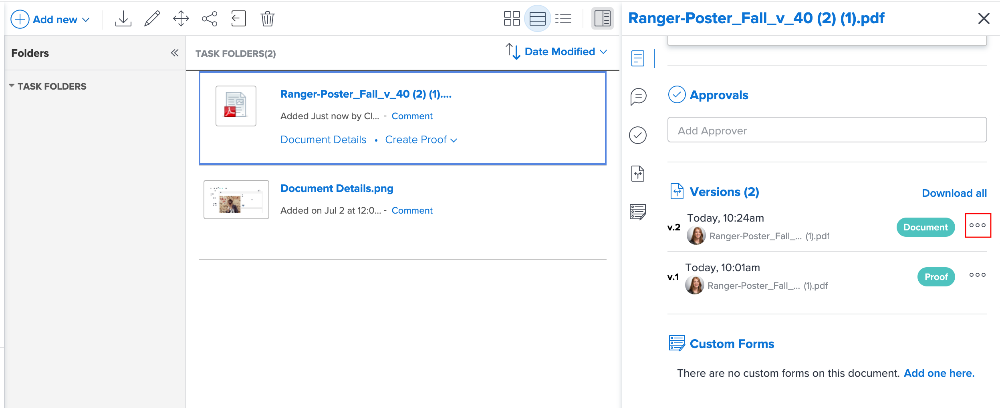

# 문서 버전 관리

<!-- Audited: 5/2025 -->

You can manage multiple versions of a document in Workfront.

## 액세스 요구 사항

+++ 이 문서의 기능에 대한 액세스 요구 사항을 보려면 확장하십시오.

<table style="table-layout:auto"> 
 <col> 
 <col> 
 <tbody> 
  <tr> 
   <td role="rowheader">Adobe Workfront 패키지</td> 
   <td> 
기존 Workfront 스토리지를 사용하여 문서를 관리하는 모든 Workfront 패키지

Adobe 엔터프라이즈 스토리지를 사용하여 문서를 관리하는 모든 워크플로 패키지
</td> 
  </tr> 
  <tr> 
   <td role="rowheader">Adobe Workfront 라이선스</td> 
   <td> 
   
기여자 이상

   
요청 이상 

   </td> 
  </tr> 
  <tr> 
   <td role="rowheader">액세스 수준 구성</td> 
   <td> 
View access to Documents
 </td> 
  </tr> 
  <tr> 
   <td role="rowheader">개체 권한</td> 
   <td> 
View access to the Document
</td> 
  </tr> 
 </tbody> 
</table>

이 표의 정보에 대한 자세한 내용은 [Workfront 설명서의 액세스 요구 사항](/help/quicksilver/administration-and-setup/add-users/access-levels-and-object-permissions/access-level-requirements-in-documentation.md)을 참조하십시오.

+++

## 전제 조건

* This article assumes that the document has multiple versions.

  새 버전의 문서를 Workfront에 업로드하는 방법에 대한 자세한 내용은 [새 버전의 문서 업로드](../../documents/managing-documents/upload-new-document-version.md)를 참조하십시오.

## View a list of all versions of a document

{{step1-to-documents}}

1. On the **Documents** page, select a document in the list.

1. In the upper-right corner of the page, click the **Open Summary** icon . The **Document Summary** side panel opens.

1. Scroll down to the **Versions** section to view all the document versions.

## View and manage details for a previous document version

{{step1-to-documents}}

1. Hover over the document, then click **Document Details**.

1. Near the top of the **Document Details** page, click the drop-down menu next to the name, then click the name of the version you want to view and manage.

   

   Along with viewing the version&#39;s details, you can make changes to the version, such as its name, metadata, and proofing settings (if it&#39;s a document proof).

## 단일 문서 버전 다운로드

{{step1-to-documents}}

1. **문서** 페이지에서 목록에서 문서를 선택합니다.

1. 페이지의 오른쪽 상단 모서리에서 **요약 열기** 아이콘 을 클릭합니다. **문서 요약** 사이드 패널이 열립니다.

1. **버전** 섹션에서 버전 오른쪽에 있는 **자세히** 메뉴 를 클릭한 다음 표시되는 드롭다운 목록에서 **다운로드**&#x200B;를 클릭합니다.

   

## 문서의 모든 버전 다운로드

{{step1-to-documents}}

1. **문서** 페이지에서 목록에서 문서를 선택합니다.

1. 페이지의 오른쪽 상단 모서리에서 **요약 열기** 아이콘 을 클릭합니다. **문서 요약** 사이드 패널이 열립니다.

1. **버전** 섹션까지 아래로 스크롤한 다음 **모두 다운로드**&#x200B;를 클릭합니다.

## 문서 버전 삭제

실수로 문서 버전을 업로드하거나 더 이상 버전이 필요하지 않으면 버전을 삭제하고 원본 문서를 유지할 수 있습니다.

>[!IMPORTANT]
>
>개별적으로 삭제한 문서 버전은 복구할 수 없습니다.

문서 버전을 삭제할 때는 다음 사항을 염두에 두십시오.

* 한 번에 하나의 버전만 삭제할 수 있습니다. 버전을 삭제하면 이 작업이 문서의 업데이트 섹션에 나타납니다.
* 버전을 삭제한 후 새 버전을 업로드하면 새 버전이 다음 일련 번호를 받습니다. 예를 들어, 문서의 버전이 3개인 경우 버전 3을 삭제하면 업로드되는 다음 문서는 버전 4가 됩니다.
* 버전에 대한 시스템 업데이트 및 주석은 버전이 삭제된 후 Workfront에 유지됩니다.

  <!--
  <li data-mc-conditions="QuicksilverOrClassic.Draft mode">Deleting a document version in Workfront does not delete the Proof version.&nbsp;</li>
  -->

문서 버전을 삭제하려면 다음을 수행합니다.

{{step1-to-documents}}

1. **문서** 페이지의 목록에서 문서를 선택합니다.

1. 페이지의 오른쪽 상단 모서리에서 **요약 열기** 아이콘 을 클릭합니다. **문서 요약** 사이드 패널이 열립니다.

1. **버전** 섹션까지 아래로 스크롤하여 모든 문서 버전을 봅니다.
1. **버전** 섹션에서 버전 오른쪽에 있는 **자세히** 메뉴 를 클릭한 다음 나타나는 드롭다운 목록에서 **삭제**&#x200B;를 클릭합니다.

   >[!NOTE]
   >
   >* **삭제** 옵션은 버전이 2개 이상인 경우에만 표시됩니다.
   >* 문서가 외부 소스에 연결된 경우 해당 링크가 삭제되고 Workfront을 통해 문서에 더 이상 액세스할 수 없습니다.

   
