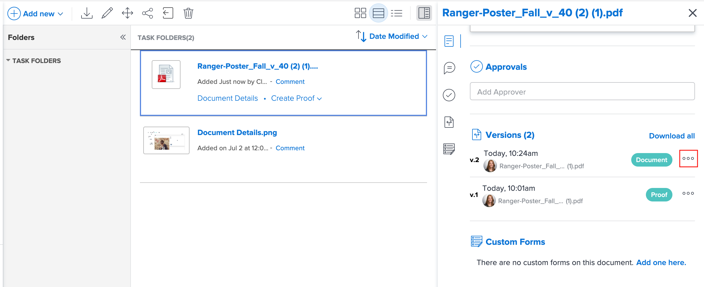

# 문서 버전 관리

<!-- Audited: 5/2025 -->

{{highlighted-preview}}

Workfront에서 여러 버전의 문서를 관리할 수 있습니다.

## 액세스 요구 사항

+++ 이 문서의 기능에 대한 액세스 요구 사항을 보려면 확장하십시오.

<table style="table-layout:auto"> 
 <col> 
 <col> 
 <tbody> 
  <tr> 
   <td role="rowheader">Adobe Workfront 패키지</td> 
   <td> 
기존 Workfront 스토리지를 사용하여 문서를 관리하는 모든 Workfront 패키지

Adobe 클라우드 스토리지를 사용하여 문서를 관리하는 모든 워크플로우 패키지
</td> 
  </tr> 
  <tr> 
   <td role="rowheader">Adobe Workfront 라이선스</td> 
   <td> 
   
기여자 이상

   
요청 이상 

   </td> 
  </tr> 
  <tr> 
   <td role="rowheader">액세스 수준 구성</td> 
   <td> 
문서에 대한 액세스 보기
 </td> 
  </tr> 
  <tr> 
   <td role="rowheader">개체 권한</td> 
   <td> 
문서에 대한 액세스 보기
</td> 
  </tr> 
 </tbody> 
</table>

이 표의 정보에 대한 자세한 내용은 [Workfront 설명서의 액세스 요구 사항](/help/quicksilver/administration-and-setup/add-users/access-levels-and-object-permissions/access-level-requirements-in-documentation.md)을 참조하십시오.

+++

## 전제 조건

* 이 문서에서는 문서에 여러 버전이 있다고 가정합니다.

  새 버전의 문서를 Workfront에 업로드하는 방법에 대한 자세한 내용은 [새 버전의 문서 업로드](../../documents/managing-documents/upload-new-document-version.md)를 참조하십시오.

## 기존 문서 영역에서 문서 버전 관리

### 문서의 모든 버전 목록 보기

{{step1-to-documents}}

1. **문서** 페이지에서 목록에서 문서를 선택합니다.

1. 페이지의 오른쪽 상단 모서리에서 **요약 열기** 아이콘 을 클릭합니다. **문서 요약** 사이드 패널이 열립니다.

1. **버전** 섹션까지 아래로 스크롤하여 모든 문서 버전을 봅니다.

### 이전 문서 버전에 대한 세부 정보 보기 및 관리

{{step1-to-documents}}

1. 문서를 마우스로 가리킨 다음 **문서 세부 정보**&#x200B;를 클릭합니다.

1. **문서 세부 정보** 페이지의 맨 위에서 이름 옆에 있는 드롭다운 메뉴를 클릭한 다음 보고 관리할 버전의 이름을 클릭합니다.

   

   버전의 세부 사항을 볼 수 있을 뿐만 아니라 이름, 메타데이터 및 증명 설정(문서 증명인 경우)과 같은 버전을 변경할 수도 있습니다.

### 단일 문서 버전 다운로드

{{step1-to-documents}}

1. **문서** 페이지에서 목록에서 문서를 선택합니다.

1. 페이지의 오른쪽 상단 모서리에서 **요약 열기** 아이콘 을 클릭합니다. **문서 요약** 사이드 패널이 열립니다.

1. **버전** 섹션에서 버전 오른쪽에 있는 **자세히** 메뉴 를 클릭한 다음 표시되는 드롭다운 목록에서 **다운로드**&#x200B;를 클릭합니다.

   

### 문서의 모든 버전 다운로드

{{step1-to-documents}}

1. **문서** 페이지에서 목록에서 문서를 선택합니다.

1. 페이지의 오른쪽 상단 모서리에서 **요약 열기** 아이콘 을 클릭합니다. **문서 요약** 사이드 패널이 열립니다.

1. **버전** 섹션까지 아래로 스크롤한 다음 **모두 다운로드**&#x200B;를 클릭합니다.

### 문서 버전 삭제

실수로 문서 버전을 업로드하거나 더 이상 버전이 필요하지 않으면 버전을 삭제하고 원본 문서를 유지할 수 있습니다.

>[!IMPORTANT]
>
>개별적으로 삭제한 문서 버전은 복구할 수 없습니다.

문서 버전을 삭제할 때는 다음 사항을 염두에 두십시오.

* 한 번에 하나의 버전만 삭제할 수 있습니다. 버전을 삭제하면 이 작업이 문서의 업데이트 섹션에 나타납니다.
* 버전을 삭제한 후 새 버전을 업로드하면 새 버전이 다음 일련 번호를 받습니다. 예를 들어, 문서의 버전이 3개인 경우 버전 3을 삭제하면 업로드되는 다음 문서는 버전 4가 됩니다.
* 버전에 대한 시스템 업데이트 및 주석은 버전이 삭제된 후 Workfront에 유지됩니다.

  <!--
  <li data-mc-conditions="QuicksilverOrClassic.Draft mode">Deleting a document version in Workfront does not delete the Proof version.&nbsp;</li>
  -->

문서 버전을 삭제하려면 다음을 수행합니다.

{{step1-to-documents}}

1. **문서** 페이지의 목록에서 문서를 선택합니다.

1. 페이지의 오른쪽 상단 모서리에서 **요약 열기** 아이콘 을 클릭합니다. **문서 요약** 사이드 패널이 열립니다.

1. **버전** 섹션까지 아래로 스크롤하여 모든 문서 버전을 봅니다.
1. **버전** 섹션에서 버전 오른쪽에 있는 **자세히** 메뉴 를 클릭한 다음 나타나는 드롭다운 목록에서 **삭제**&#x200B;를 클릭합니다.

   >[!NOTE]
   >
   >* **삭제** 옵션은 버전이 2개 이상인 경우에만 표시됩니다.
   >* 문서가 외부 소스에 연결된 경우 해당 링크가 삭제되고 Workfront을 통해 문서에 더 이상 액세스할 수 없습니다.

   

## 미리보기의 새 문서 영역에서 문서 버전 관리

조직에서 Adobe 클라우드 스토리지를 사용하는 경우 Workfront의 문서에 액세스할 때 새 문서 영역이 표시됩니다. Adobe 클라우드 저장소에 대한 자세한 내용은 [Adobe 클라우드 저장소 개요](/help/quicksilver/review-and-approve-work/esm-overview.md)를 참조하십시오.

Workfront은 Frame.io의 버전 번호와 일치하도록 업로드한 순서대로 각 버전에 번호를 매깁니다(예: V1, V2, V3).

### 문서의 모든 버전 목록 보기

{{step1-to-documents}}

1. **문서** 페이지에서 목록에서 문서를 선택합니다.

1. 페이지 오른쪽의 **버전** 아이콘 을 클릭합니다. 버전(Versions) 패널이 열리고 버전 기록(Version history) 아래에 문서의 모든 버전이 나열됩니다.

   >[!NOTE]
   >
   >버전에 승인 워크플로가 있는 경우 그 상태(예: &quot;승인됨&quot; 또는 &quot;철회됨&quot;)가 옆에 표시됩니다. 승인 워크플로가 없는 버전은 상태가 표시되지 않습니다.

### 버전에 대한 승인 요청

{{step1-to-documents}}

1. **문서** 페이지에서 목록에서 문서를 선택합니다.
1. 페이지 오른쪽의 **버전** 아이콘 을 클릭합니다.
1. 버전 옆의 **자세히** 메뉴를 클릭한 다음 **승인 요청**&#x200B;을 클릭합니다.
1. 승인 워크플로를 구성합니다. 자세한 내용은 [문서 승인 워크플로 만들기](/help/quicksilver/review-and-approve-work/document-reviews-and-approvals/manage-document-approvals/create-a-document-approval.md)를 참조하십시오.

   >[!NOTE]
   >
   >이전 버전에 이미 승인 워크플로가 열려 있는 경우 이 버전에 대한 승인을 요청하면 취소됩니다. 이전 버전은 버전 번호와 승인 내역이 유지되지만 상태는 &quot;철회됨&quot;으로 변경됩니다.

### 이전 문서 버전에 대한 세부 정보 보기 및 관리

{{step1-to-documents}}

1. **문서** 페이지에서 목록에서 문서를 선택합니다.
1. 페이지 오른쪽의 **버전** 아이콘 을 클릭합니다.
1. 버전 옆의 **자세히** 메뉴를 클릭한 다음 **세부 정보 보기**&#x200B;를 클릭합니다.

### 단일 문서 버전 다운로드

{{step1-to-documents}}

1. **문서** 페이지에서 목록에서 문서를 선택합니다.

1. 페이지 오른쪽의 **버전** 아이콘 을 클릭합니다.

1. 버전 옆의 **자세히** 메뉴를 클릭한 다음 **다운로드**&#x200B;를 클릭합니다.

### 문서의 모든 버전 다운로드

{{step1-to-documents}}

1. **문서** 페이지에서 목록에서 문서를 선택합니다.

1. 페이지 오른쪽의 **버전** 아이콘 을 클릭합니다.

1. [버전] 패널의 맨 위에서 **모두 다운로드**&#x200B;를 클릭합니다.

   

### 문서 버전 삭제

{{step1-to-documents}}

1. **문서** 페이지에서 목록에서 문서를 선택합니다.

1. 페이지 오른쪽의 **버전** 아이콘 을 클릭합니다.

1. 버전 옆의 **자세히** 메뉴를 클릭한 다음 **삭제**&#x200B;를 클릭합니다.

   >[!NOTE]
   >
   >버전을 삭제해도 다른 버전의 번호는 변경되지 않습니다. 예를 들어 버전 V1에서 V5까지의 문서에서 V3을 삭제하면 나머지 버전은 원래 번호를 유지하고 이후에 V3이 없습니다. 업로드하는 다음 버전은 V6이 됩니다.

