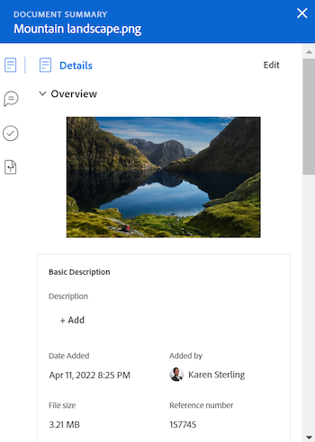

# 문서에 대한 요약 개요

<!--Audited: April, 2024-->

요약 패널을 사용하여 문서 목록에서 직접 중요한 정보에 액세스하고 업데이트할 수 있습니다.

+++ 을 확장하여 이 문서의 기능에 대한 액세스 요구 사항을 봅니다.

## 액세스 요구 사항

이 문서의 단계를 수행하려면 다음 액세스 권한이 있어야 합니다.

<table style="table-layout:auto"> 
 <col> 
 </col> 
 <col> 
 </col> 
 <tbody> 
  <tr> 
   <td role="rowheader">Adobe Workfront 플랜</td> 
   <td> 
 임의
 </td> 
  </tr> 
  <tr> 
   <td role="rowheader">Adobe Workfront 라이선스</td> 
   <td> 
새로운 기능: 기여자 이상
 
   
현재: 요청 이상

   </td> 
  </tr> 
  <tr data-mc-conditions=""> 
   <td role="rowheader">액세스 수준 구성</td> 
   <td> 
문서에 대한 액세스 편집
  </td> 
  </tr> 
  <tr data-mc-conditions=""> 
   <td role="rowheader">개체 권한</td> 
   <td> 
문서와 연관된 객체에 대한 액세스 보기
 </td> 
  </tr> 
 </tbody> 
</table>

이 표의 정보에 대한 자세한 내용은 [Workfront 설명서의 액세스 요구 사항](/help/quicksilver/administration-and-setup/add-users/access-levels-and-object-permissions/access-level-requirements-in-documentation.md)을 참조하십시오.

+++

## 요약 보기 열기

{{step1-to-documents}}

1. **문서** 페이지에서 목록에서 문서를 선택합니다.

1. 페이지의 오른쪽 상단 모서리에서 **요약 열기** 아이콘 을 클릭합니다. **문서 요약** 사이드 패널이 열립니다.

   

   요약을 연 후에는 수동으로 닫을 때까지 다른 문서를 클릭해도 이 페이지에서 열려 있는 상태로 유지됩니다.

## 세부 사항

세부 정보 섹션을 사용하여 높은 수준의 개요 정보를 보고 사용자 정의 양식과 상호 작용할 수 있습니다. 섹션 상단의 세부 정보 를 클릭하여 전체 문서 세부 정보 페이지로 이동합니다.

* [개요](#overview)
* [사용자 정의 양식](#custom-forms)

### 개요 {#overview}

개요 섹션을 확장하여 이미지 썸네일을 보거나 다운로드하고, 증명을 열고, 기본 설명을 업데이트하고, 문서를 체크 아웃하는 등의 작업을 수행합니다.

### 사용자 정의 양식 {#custom-forms}

사용자 정의 Forms 섹션을 사용하여 문서와 연결된 모든 사용자 정의 양식을 추가, 편집 또는 볼 수 있습니다. 사용자 정의 양식의 이름을 입력하여 문서에 추가하십시오. 자세한 내용은 [문서에 사용자 정의 양식 추가 또는 편집](../../documents/managing-documents/add-custom-form-documents.md)을 참조하십시오.

## 업데이트

업데이트 섹션을 사용하여 문서 또는 증명에서 수행한 업데이트 내용을 볼 수 있습니다. 요약에는 처음 두 개의 주석이 표시됩니다. 업데이트에 대한 자세한 내용은 [증명에 대한 댓글](../../review-and-approve-work/proofing/reviewing-proofs-within-workfront/comment-on-a-proof/comment-on-proof.md)을 참조하세요.

요약 패널의 

## 승인

승인 섹션을 사용하여 문서 승인을 요청합니다. 승인에 대해 다른 사람에게 알리거나, 승인을 다시 제출하고, 이전 결정을 취소하거나, 승인을 삭제할 수도 있습니다. 문서 승인자는 요약을 사용하여 결정할 수 있습니다.

증명 워크플로에 증명 승인을 추가해야 합니다. 승인에 대한 자세한 내용은

* [작업 승인](../../review-and-approve-work/manage-approvals/approving-work.md)
* [문서 승인 요청](../../review-and-approve-work/manage-approvals/request-document-approvals.md)

## 버전

버전 섹션을 사용하여 특정 문서에 대해 작성된 버전 수를 볼 수 있습니다. 다음을 수행하려면 **자세히** 아이콘 을 클릭하십시오.

* 증명을 엽니다.
* 증명 또는 문서를 다운로드합니다.
* 브라우저에서 지원하는 문서를 미리 봅니다.
* 문서 세부 정보로 이동합니다.
* 증명 또는 문서를 삭제합니다.

