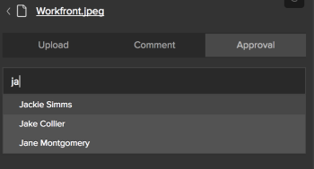

# Illustrator 및 InDesign용 Workfront 확장 사용

>[!IMPORTANT]
>
>Illustrator 및 InDesign용 Workfront 확장을 [업데이트된 Creative Cloud 플러그인](/help/quicksilver/workfront-integrations-and-apps/adobe-workfront-for-creative-cloud/wf-cc-install-toc.md). 2022년 말부터 이 확장은 더 이상 지원되지 않으며 현재 상태로 사용할 수 있습니다.

Workfront 확장을 사용하여 Adobe Illustrator 및 Adobe InDesign에서 저장하고 만든 디지털 컨텐츠를 Workfront으로 내보낼 수 있습니다. 이를 통해 문서 검토 및 승인 프로세스를 가속화할 수 있습니다.

Workfront 확장은 다음 애플리케이션에서 Adobe Creative Cloud 2017 이상에서 지원됩니다.

* InDesign
* Illustrator
* Photoshop

   >[!NOTE]
   >
   >새로운 기능을 사용하는 것이 좋습니다 [Adobe Workfront for Photoshop](/help/quicksilver/workfront-integrations-and-apps/adobe-workfront-for-creative-cloud/wf-cc-install-ps.md) 플러그인.

## 액세스 요구 사항

이 문서의 절차를 수행하려면 다음 액세스 권한이 있어야 합니다.

<table style="table-layout:auto"> 
 <col> 
 <col> 
 <tbody> 
  <tr> 
   <td role="rowheader">Adobe Workfront 플랜*</td> 
   <td> 
Pro 이상
 </td> 
  </tr> 
  <tr data-mc-conditions=""> 
   <td role="rowheader">Adobe Workfront 라이선스*</td> 
   <td> 
작업 이상
 </td> 
  </tr> 
  <tr> 
   <td role="rowheader">제품</td> 
   <td>Workfront 라이선스 외에 Adobe Creative Cloud 라이센스가 있어야 합니다.</td> 
  </tr> 
  <tr> 
   <td role="rowheader">개체 권한</td> 
   <td> 
상호 작용할 개체에 대한 액세스를 편집합니다.
 
추가 액세스 요청에 대한 자세한 내용은 <a href="../../workfront-basics/grant-and-request-access-to-objects/request-access.md" class="MCXref xref">개체에 대한 액세스 요청 </a>.
 </td> 
  </tr> 
 </tbody> 
</table>

&#42;어떤 계획, 라이선스 유형 또는 액세스 권한을 보유하고 있는지 알아보려면 Workfront 관리자에게 문의하십시오.

## Illustrator 또는 InDesign에서 Workfront Extension에 로그인합니다 {#log-in-to-workfront-extension-from-illustrator-or-indesign}

지원되는 Adobe 애플리케이션 중 하나에서 Workfront에 로그인하면 지원되는 모든 Adobe 애플리케이션에 로그인됩니다.

1. Workfront 확장을 사용할 Adobe 애플리케이션으로 이동합니다.

   지원되는 각 응용 프로그램에 대해 지원되는 형식 목록을 보려면 [지원되는 내보낸 파일 형식](#supported-exported-file-formats) 참조하십시오.

1. 클릭 **창** > **확장** > Workfront.

1. (선택 사항) Workfront 패널을 Adobe 애플리케이션에 표시할 위치로 드래그합니다.
1. 화면의 지침에 따라 Workfront에 로그인합니다.

   >[!NOTE]
   >
   >* Workfront은 사용자 인증 및 권한 부여를 위해 대부분의 웹 기반 통합에서 사용하는 보안 표준인 OAuth 2.0을 사용하여 Adobe Creative Cloud에 연결합니다.
   >* 을 입력하라는 메시지가 표시되면 [도메인 또는 호스트] Workfront 계정 중에서 다음 형식으로 입력합니다. *yourCompany&#39;sDomain.my.workfront.com*. 일반적으로 회사의 도메인은 회사의 이름입니다.

   프로젝트에 현재 상태인 경우 사용자에게 할당된 작업 항목 목록이 표시됩니다. 목록이 표시되지 않으면 Workfront에 로그인합니다.

   개인 작업은 다음과 같습니다 **프로젝트 없음**.

## Workfront 프로젝트, 작업 또는 문제에 파일 업로드 {#upload-a-file-to-a-workfront-project-task-or-issue}

컴퓨터 파일 시스템에서 파일을 업로드하거나 Adobe Creative Cloud 애플리케이션에서 현재 열려 있는 파일을 Workfront 프로젝트, 작업 또는 문제로 내보낼 수 있습니다. 

Adobe Creative Cloud에서 파일을 업로드하거나 내보낼 때 다음 사항을 고려하십시오.

* 액세스 수준에서 Workfront에 문서 업로드를 허용해야 합니다. 자세한 내용은 [문서에 대한 액세스 권한 부여](../../administration-and-setup/add-users/configure-and-grant-access/grant-access-documents.md).
* 문서를 원하는 항목에 업로드할 권한이 있어야 합니다. 자세한 내용은 [개체에 대한 권한 공유 개요](../../workfront-basics/grant-and-request-access-to-objects/sharing-permissions-on-objects-overview.md).
* 선택한 Workfront 객체의 문서 영역에 파일이 업로드됩니다.
* 주 메뉴의 문서 영역으로 문서를 내보낼 수 없습니다  Adobe Creative Cloud 애플리케이션 사용.

이 섹션에서는 다음 사항에 대해 설명합니다.

* [파일 업로드](#upload-a-file)
* [Illustrator 또는 InDesign에서 현재 열려 있는 파일 내보내기](#export-a-file-currently-open-in-illustrator-or-indesign)
* [Illustrator 또는 InDesign에서 새 파일 버전 업로드](#upload-a-new-version-of-a-file-from-illustrator-or-indesign)

### 파일 업로드 {#upload-a-file}

Adobe Creative Cloud 애플리케이션을 종료하지 않고 프로젝트, 작업 또는 문제에 파일을 업로드할 수 있습니다.

1. Adobe Creative Cloud 애플리케이션을 열 때 Workfront 확장이 표시되지 않으면 **창** > **확장** > Workfront.

   프로젝트에 현재 상태인 경우 사용자에게 할당된 작업 항목 목록이 표시됩니다. 목록이 표시되지 않으면 Workfront에 로그인합니다.

   개인 작업은 다음과 같습니다 **프로젝트 없음**.

1. 파일을 업로드할 프로젝트, 작업 또는 문제의 이름을 클릭합니다.

   에 이름을 입력하여 검색할 수 있습니다. **검색** 상자 및 선택 **프로젝트**, **작업**, 또는 **문제** 오른쪽 드롭다운 메뉴에서 **검색** 상자. 작업 항목의 이름이 목록에 표시되지 않으면 **Enter 키** 볼 수 있는 액세스 권한이 있는 모든 Workfront 항목을 검색하려면 다음을 수행하십시오.

1. 클릭 **선택** Workfront 확장의 오른쪽 아래 모서리에 있습니다.
1. 에서 **형식을 선택하려면 클릭하십시오.** 드롭다운 메뉴에서 Workfront에 파일을 저장할 형식을 클릭합니다.

   지원되는 각 응용 프로그램에 대해 지원되는 형식 목록을 보려면 [지원되는 내보낸 파일 형식](#supported-exported-file-formats) 참조하십시오.

1. (조건부) 파일을 업로드할 작업 항목에 문서 폴더가 있는 경우&#x200B;**문서 폴더를 선택하려면 클릭합니다** 필드를 클릭한 다음 **선택**.

1. 클릭 **로컬 파일 업로드**.
1. 에서 **파일 열기** 상자가 나타나면 파일 시스템에서 파일을 찾은 다음 를 클릭합니다. **열기**.

1. (선택 사항) 파일의 새 이름을 입력합니다. 

   

1. 클릭 **업로드**.

   이제 Workfront에서 지정한 프로젝트, 작업 또는 문제에 대한 문서 영역에 문서가 나열됩니다.  

1. (선택 사항) 문서의 이름을 클릭하여 Workfront에서 문서 세부 정보 페이지를 엽니다.

   Workfront이 새 브라우저 탭에서 열립니다.

### Illustrator 또는 InDesign에서 현재 열려 있는 파일 내보내기 {#export-a-file-currently-open-in-illustrator-or-indesign}

1. 지원되는 Adobe Creative Cloud 애플리케이션에서 Workfront으로 내보낼 파일을 엽니다. 
1. Workfront 확장이 표시되지 않으면 **창** > **확장** > Workfront.

   프로젝트에 현재 상태인 경우 사용자에게 할당된 작업 항목 목록이 표시됩니다. 목록이 표시되지 않으면 Workfront에 로그인합니다.

   개인 작업은 다음과 같습니다 **프로젝트 없음**.

1. 파일을 내보낼 프로젝트, 작업 또는 문제의 이름을 클릭합니다.

   에 이름을 입력하여 검색할 수 있습니다. **검색** 상자 및 선택 **프로젝트**, **작업**, 또는 **문제** 오른쪽 드롭다운 메뉴에서 **검색** 상자. 작업 항목의 이름이 목록에 표시되지 않으면 **Enter 키** 볼 수 있는 액세스 권한이 있는 모든 Workfront 항목을 검색하려면 다음을 수행하십시오.

1. 에서 **형식을 선택하려면 클릭하십시오.** 드롭다운 메뉴에서 Workfront에 파일을 저장할 형식을 클릭합니다.

   지원되는 각 응용 프로그램에 대해 지원되는 형식 목록을 보려면 [지원되는 내보낸 파일 형식](#supported-exported-file-formats) 참조하십시오.

1. (조건부) 파일을 업로드할 작업 항목에 문서 폴더가 있는 경우&#x200B;**문서 폴더를 선택하려면 클릭합니다** 필드를 클릭한 다음 **선택**.
1. (선택 사항) 문서의 이름을 변경하려면 문서 이름을 클릭하고 새 이름을 입력합니다.

   

1. 클릭 **내보내기**. 

   문서를 Workfront으로 성공적으로 내보냈음을 확인하는 메시지가 표시됩니다.

   Workfront에서 이 문서는 Workfront에 지정한 개체의 문서 영역에 나열됩니다.

1. (선택 사항) 문서 이름을 클릭하여 Workfront에서 액세스합니다.

   

   Workfront이 새 브라우저 탭에서 열립니다.

### Illustrator 또는 InDesign에서 새 파일 버전 업로드 {#upload-a-new-version-of-a-file-from-illustrator-or-indesign}

1. 지원되는 Adobe 애플리케이션에서 작업 중인 파일을 Workfront에서 새 버전의 파일로 내보내려면 Adobe 애플리케이션에서 파일을 엽니다. 
1. Workfront 확장이 표시되지 않으면 **창** > **확장** > Workfront.

   프로젝트에 현재 상태인 경우 사용자에게 할당된 작업 항목 목록이 표시됩니다. 목록이 표시되지 않으면 Workfront에 로그인합니다.

   개인 작업은 다음과 같습니다 **프로젝트 없음**.

1. 기존 문서가 나열된 프로젝트, 작업 또는 문제의 이름을 클릭합니다.

   에 이름을 입력하여 검색할 수 있습니다. **검색** 상자 및 선택 **프로젝트**, **작업**, 또는 **문제** 오른쪽 드롭다운 메뉴에서 **검색** 상자. 작업 항목의 이름이 목록에 표시되지 않으면 **Enter 키** 볼 수 있는 액세스 권한이 있는 모든 Workfront 항목을 검색하려면 다음을 수행하십시오.

   프로젝트, 작업 또는 문제에 업로드된 모든 문서는 Adobe 애플리케이션에서 업로드되었는지 여부에 관계없이 목록에 표시됩니다.

1.  
1. 에서 **형식을 선택하려면 클릭하십시오.** 드롭다운 메뉴에서 Workfront에 파일을 저장할 형식을 클릭합니다.

   Adobe 응용 프로그램에서 연 파일을 내보내는 경우 필요합니다. 지원되는 각 응용 프로그램에 대해 지원되는 형식 목록을 보려면 [지원되는 내보낸 파일 형식](#supported-exported-file-formats) 참조하십시오.

1. Adobe 응용 프로그램에서 연 파일을 선택한 Workfront 문서의 새 버전으로 내보내는 경우 **내보내기**.

   또는

   선택한 Workfront 문서의 새 버전으로 컴퓨터 파일 시스템의 파일을 업로드하려면 **로컬 파일 업로드**&#x200B;표시되는 상자에서 파일을 찾은 다음 **열기**&#x200B;를 클릭한 다음 **업로드**.

1. (선택 사항) 문서의 이름을 클릭하여 Workfront에서 새 버전을 확인합니다. 

   >[!NOTE]
   >
   >Workfront의 문서 이름은 기본적으로 채워져 있으므로 편집할 수 없습니다. 업로드하거나 새 버전으로 내보내는 파일의 이름도 변경되지 않습니다.
   >
   >
   >

## Illustrator 또는 InDesign에서 Workfront 문서에 대한 댓글 {#comment-on-a-workfront-document-from-illustrator-or-indesign}

Adobe 애플리케이션 내에서 Workfront 문서에 직접 주석을 추가할 수 있습니다. Workfront에서 주석이 문서의 업데이트 영역에 표시되고 문서가 저장된 Workfront 항목의 업데이트 영역에 표시됩니다. 

1. 지원되는 Adobe 응용 프로그램 중 하나를 엽니다.
1. Workfront 확장이 표시되지 않으면 **창** > **확장** > Workfront.

   프로젝트에 현재 상태인 경우 사용자에게 할당된 작업 항목 목록이 표시됩니다. 목록이 표시되지 않으면 Workfront에 로그인합니다.

   개인 작업은 다음과 같습니다 **프로젝트 없음**.

1. 프로젝트, 작업 또는 기존 문서가 나열된 문제를 클릭합니다.

   에 이름을 입력하여 검색할 수 있습니다. **검색** 상자 및 선택 **프로젝트**, **작업**, 또는 **문제** 오른쪽 드롭다운 메뉴에서 **검색** 상자. 작업 항목의 이름이 목록에 표시되지 않으면 **Enter 키** 볼 수 있는 액세스 권한이 있는 모든 Workfront 항목을 검색하려면 다음을 수행하십시오.

1. 기존 문서의 이름을 클릭한 다음 **선택** Workfront 확장의 오른쪽 아래 모서리에 있습니다.
1. 을(를) 클릭합니다. **댓글** 탭을 클릭한 다음 표시되는 상자에 업데이트를 입력합니다.

1. (선택 사항) 주석에 다른 Workfront 사용자 또는 팀을 포함하려면 **사람 또는 팀에 알림** 상자를 클릭한 다음 드롭다운 목록에 이 이름이 나타나면 이름을 클릭합니다.
1. (선택 사항) 문서에 대한 승인을 요청하려면 **승인 요청**.
1. 클릭 **업데이트**.

   업데이트는 문서의 업데이트 탭에 게시됩니다. 주석에 포함하는 Workfront 사용자는 인앱 알림을 받으며, Workfront 구성 방식에 따라 이메일 알림을 받을 수도 있습니다.

   Workfront 내의 알림에 대한 자세한 내용은 [인앱 알림 보기 및 관리](../../workfront-basics/using-notifications/view-and-manage-in-app-notifications.md). 

   이메일 알림 수신에 대한 자세한 내용은 [Adobe Workfront 알림](../../workfront-basics/using-notifications/wf-notifications.md).

## Illustrator 또는 InDesign에서 문서 승인 요청

Adobe 애플리케이션에서 직접 Workfront 문서 승인을 요청할 수 있습니다.

다음 엔티티로부터 문서 승인을 요청할 수 있습니다.

* Workfront 사용자
* Workfront 계정이 없는 외부 사용자

다음 방법으로 Adobe 응용 프로그램에서 문서에 대한 승인을 요청할 수 있습니다.

* 문서에 승인자를 첨부함으로써.
* 문서에 댓글을 달거나 댓글을 달 때 사용자에게 알립니다. 문서에 승인자로 첨부합니다.

   문서에 주석을 달 때 승인 요청에 대한 자세한 내용은 [Illustrator 또는 InDesign에서 Workfront 문서에 대한 댓글](#comment-on-a-workfront-document-from-illustrator-or-indesign) 참조하십시오.

Adobe 응용 프로그램에서 문서에 대한 승인을 요청하려면

1. 지원되는 Adobe 응용 프로그램 중 하나를 엽니다.
1. Workfront 확장이 표시되지 않으면 **창** > **확장** > Workfront.

   프로젝트에 현재 상태인 경우 사용자에게 할당된 작업 항목 목록이 표시됩니다. 목록이 표시되지 않으면 Workfront에 로그인합니다.

   개인 작업은 다음과 같습니다 **프로젝트 없음**.

1. 기존 문서가 나열된 프로젝트, 작업 또는 문제를 클릭한 다음 기존 문서의 이름을 클릭합니다.

   에 이름을 입력하여 검색할 수 있습니다. **검색** 상자 및 선택 **프로젝트**, **작업**, 또는 **문제** 오른쪽 드롭다운 메뉴에서 **검색** 상자. 작업 항목의 이름이 목록에 표시되지 않으면 **Enter 키** 볼 수 있는 액세스 권한이 있는 모든 Workfront 항목을 검색하려면 다음을 수행하십시오.

1. 기존 문서의 이름을 클릭한 다음 **선택** Workfront 확장의 오른쪽 아래 모서리에 있습니다.
1. 을(를) 클릭합니다. **승인** 탭.
1. 승인자를 추가하려면 **이름 상자 입력 시작** 다음 중 하나를 수행합니다.

   * 승인자 이름을 입력한 다음 목록에 표시될 때 선택합니다.

      

   * 외부 사용자의 이메일 주소를 입력합니다.

1. 클릭 **승인 요청**.

   주석에 포함하거나 승인자로 추가하는 Workfront 사용자는 인앱 알림을 받게 되며, Workfront 구성 방식에 따라 이메일 알림도 받을 수 있습니다.\
   외부 사용자는 승인을 결정할 수 있는 위치로부터 이메일 알림을 받습니다.

   Workfront의 알림에 대한 자세한 내용은 [인앱 알림 보기 및 관리](../../workfront-basics/using-notifications/view-and-manage-in-app-notifications.md). 이메일 알림 수신에 대한 자세한 내용은 [Adobe Workfront 알림](../../workfront-basics/using-notifications/wf-notifications.md).

## Illustrator 또는 InDesign에서 증명 생성 {#generate-a-proof-from-illustrator-or-indesign}

조직에서 자동 워크플로우 템플릿을 사용하는 경우 애플리케이션을 종료하지 않고 Adobe 애플리케이션에서 생성하는 문서에 대한 증명을 생성할 수 있습니다. 증명 만들기에 대한 자세한 내용은 [증명 만들기](../../review-and-approve-work/proofing/creating-proofs-within-workfront/create-proofs--in-wf.md). 자동화된 워크플로우 템플릿에 대한 자세한 내용은 [자동화된 워크플로우 템플릿](../../review-and-approve-work/proofing/proofing-overview/automated-workflow.md#automate) in [자동화된 워크플로우 개요](../../review-and-approve-work/proofing/proofing-overview/automated-workflow.md).

1. 지원되는 Adobe 응용 프로그램 중 하나를 엽니다.
1. Workfront 확장이 표시되지 않으면 **창** > **확장** > Workfront.

   프로젝트에 현재 상태인 경우 사용자에게 할당된 작업 항목 목록이 표시됩니다. 목록이 표시되지 않으면 Workfront에 로그인합니다.

   개인 작업은 다음과 같습니다 **프로젝트 없음**.

1. 문서가 Workfront에 이미 업로드된 경우 문서가 나열된 Workfront 확장에서 프로젝트, 작업 또는 문제를 선택한 다음 문서 이름을 클릭합니다.

   또는

   섹션에 설명된 대로 Workfront 객체에 Adobe 문서를 업로드합니다 [Workfront 프로젝트, 작업 또는 문제에 파일 업로드](#upload-a-file-to-a-workfront-project-task-or-issue) 이 문서에서 문서의 이름을 클릭합니다.

1. 에서 **형식을 선택하려면 클릭하십시오.** 드롭다운 메뉴에서 Workfront에 파일을 저장할 형식을 클릭합니다.

   일부 형식은 다음 단계에서 언어 교정 기능을 활성화한 후에는 사용할 수 없습니다. 자세한 내용은 [지원되는 내보낸 파일 형식](#supported-exported-file-formats) 참조하십시오.

1. 클릭 **새 증명으로 업로드** 활성화하십시오.
1. 을(를) 선택합니다 **워크플로우 템플릿** 사용자가 문서를 검토할 때 사용할 수 있습니다.

   Workfront 관리자는에 설명된 대로 자동화된 워크플로우 템플릿을 설정합니다. 질문이 있는 경우 관리자에게 문의하십시오.

   1. 하나 이상의 추가 **새 수신자** 워크플로우 템플릿의 모든 단계에 연결할 수 있습니다.

      이름 입력을 시작하고 표시되는 드롭다운 목록에 표시되면 이름을 선택할 수 있습니다.

   1. 을(를) 지정합니다. **증명 역할** 및 빈도 **이메일 경고** 추가할 각 수신자에 대해

   1. (선택 사항)에서 **이메일 알림** 섹션에서 추가한 모든 증명 수신자에게 증명에 대한 사용자 지정 메시지(옵션)가 포함된 이메일 알림을 전송할지 여부를 선택합니다.

1. 클릭 **증명 만들기**.

   증명 작성 프로세스의 진행 상황을 볼 수 있습니다. 경고가 생성을 완료하면 나타납니다. 증명을 만든 작업을 열 수 있으며, 그 위에 나열됩니다.

## Illustrator 또는 InDesign을 종료하지 않고 새로운 버전의 증명 업로드

1. 증명서가 있는 기존 문서를 클릭한 다음 **선택** 오른쪽 아래 모퉁이에 있습니다.
1. 클릭 **새로운 증명 버전으로 업로드** 활성화하십시오.
1. (선택 사항) **워크플로우 템플릿** 사람들이 새 버전을 검토할 때 사용할 수 있도록 합니다.

   다른 템플릿을 선택하지 않으면 이전 버전에 대해 선택한 템플릿이 계속 적용됩니다. 또한 이전 버전의 템플릿을 수정한 경우 새 버전에 적용됩니다.

   Workfront 관리자는에 설명된 대로 자동화된 워크플로우 템플릿을 설정합니다. 질문이 있는 경우 관리자에게 문의하십시오.

   1. 하나 이상의 추가 **새 수신자** 워크플로우 템플릿의 모든 단계에 연결할 수 있습니다.

      이름 입력을 시작하고 표시되는 드롭다운 목록에 표시되면 이름을 선택할 수 있습니다.

   1. 을(를) 지정합니다. **증명 역할** 및 빈도 **이메일 경고** 추가할 각 수신자에 대해
   1. (선택 사항)에서 **이메일 알림** 섹션에서 추가한 모든 증명 수신자에게 증명에 대한 사용자 지정 메시지(옵션)가 포함된 이메일 알림을 전송할지 여부를 선택합니다.

1. 클릭 **새 증명 버전 만들기**.

   증명 작성 프로세스의 진행 상황을 볼 수 있습니다. 경고가 생성을 완료하면 나타납니다. 증명을 만든 작업을 열 수 있으며, 그 위에 나열됩니다.

## Workfront 확장에서 로그아웃합니다

1. Adobe 응용 프로그램에서 **창** > **확장** > Workfront.

1. 을(를) 클릭합니다. **자세히** 메뉴  패널 오른쪽 위 모서리에서 을 클릭합니다.

1. (선택 사항) **피드백** 간단한 설문 조사를 열고 Workfront for Adobe Creative Cloud에 대한 피드백을 Workfront에 보내려면 
1. 클릭 **로그아웃**.\
   로그인 화면이 표시됩니다. 로그인에 대한 자세한 내용은 [Illustrator 또는 InDesign에서 Workfront Extension에 로그인합니다](#log-in-to-workfront-extension-from-illustrator-or-indesign) 참조하십시오.

## 지원되는 내보낸 파일 형식 {#supported-exported-file-formats}

* [Adobe InDesign에 대해 지원되는 내보낸 파일 형식](#supported-exported-file-formats-for-adobe-indesign)
* [Adobe Illustrator에 대해 지원되는 내보낸 파일 형식](#supported-exported-file-formats-for-adobe-illustrator)

### Adobe InDesign에 대해 지원되는 내보낸 파일 형식  {#supported-exported-file-formats-for-adobe-indesign}

Workfront은 InDesign에서 Workfront으로 파일을 내보내기 위해 다음 파일 형식을 지원합니다.

* EPS - 캡슐화된 PostScript
* ePub - 고정 레이아웃 전자 게시
* ePub - 리플로우 가능한 전자 게시 &#42;
* HTML - HyperText Markup 언어
* IDML - InDesign 마크업 언어 &#42;
* JPG, JPEG - 공동 사진 전문가 그룹
* PDF - Adobe 휴대용 문서 파일
* PNG - 휴대용 네트워크 그래픽
* SWF - Flash Player &#42;
* XML - 확장 가능한 마크업 언어 &#42;

&#42; 이 파일 형식은 **새 증명 업로드** 활성화됨(이 옵션에 대한 자세한 내용은 [Illustrator 또는 InDesign에서 증명 생성](#generate-a-proof-from-illustrator-or-indesign) 참조). 이 파일 형식을 사용하기 전에 이미 선택한 경우 **새 증명 업로드**&#x200B;로 지정하는 경우, 시스템에서 파일 형식을 PDF으로 변경합니다. 목록에서 다른 형식을 선택할 수 있습니다.

### Adobe Illustrator에 대해 지원되는 내보낸 파일 형식  {#supported-exported-file-formats-for-adobe-illustrator}

Workfront은 Illustrator에서 Workfront으로 파일을 내보내기 위해 다음 파일 형식을 지원합니다.

* DWG - AutoCAD 드로잉, AutoCAD Interchange 파일 &#42;
* JPG, JPEG - 공동 사진 전문가 그룹
* PNG - 휴대용 네트워크 그래픽
* PSD - Photoshop 문서
* SWF - Flash Player &#42;
* TIFF - 태그가 지정된 이미지 파일 형식

&#42; 이 파일 형식은 **새 증명 업로드** 활성화됨(이 옵션에 대한 자세한 내용은 [Illustrator 또는 InDesign에서 증명 생성](#generate-a-proof-from-illustrator-or-indesign) 참조). 이 파일 형식을 사용하기 전에 이미 선택한 경우 **새 증명 업로드**&#x200B;로 지정하는 경우, 시스템에서 파일 형식을 PNG로 변경합니다. 목록에서 다른 형식을 선택할 수 있습니다.
