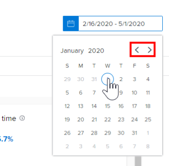

# 향상된 분석에서 프로젝트 활동 시각화 보기

>[!IMPORTANT]
>
>향상된 Analytics는 5월 26일이 있는 주에 Workfront에서 제거됩니다. Workfront Data Connect는 새로운 대체 솔루션이며 현재 사용하는 향상된 Analytics 시각화를 복제하는 데 사용할 수 있습니다.  자세한 내용은 [향상된 Analytics 사용 중단](/help/quicksilver/product-announcements/announcements/enhanced-analytics-deprecation.md) 안내서를 참조하십시오.

<!-- Audited: 12/2023 -->

프로젝트 활동 시각화는 특정 기간 동안 발생한 프로젝트 수준의 활동(프로젝트에 할당된 각 사용자의 활동)에 대한 집계 보기를 표시합니다. 포커스를 좁혀 프로젝트 내의 활동을 이해하거나 프로젝트 활동을 Adobe Workfront의 다른 프로젝트와 비교할 수 있습니다.

>[!NOTE]
>
>팀 시각화에 의한 활동은 이 시각화와 유사하게 동작하지만, 팀 시각화에 의한 활동은 모든 프로젝트에 대한 홈 팀 활동을 보여줍니다.\
>팀 시각화별 활동에 대한 자세한 내용은 [향상된 분석에서 팀별 활동 보기](../enhanced-analytics/activity-by-team-overview.md)를 참조하십시오.

## 액세스 요구 사항

다음 항목이 있어야 합니다.

<table style="table-layout:auto"> 
 <col> 
 <col> 
 <tbody> 
  <tr> 
   <td role="rowheader"><a href="https://www.workfront.com/plans" target="_blank">Workfront 플랜</a></td> 
   <td> 
비즈니스 이상
 </td> 
  </tr> 
  <tr> 
   <td role="rowheader"><a href="../administration-and-setup/add-users/access-levels-and-object-permissions/wf-licenses.md" class="MCXref xref">Adobe Workfront 라이선스 개요</a></td> 
   <td>   
신규:
 
   <ul><li>밝은 색 이상</li></ul>
   
현재:

   <ul><li>검토 이상</li></ul>
 </td> 
  </tr> 
  <tr> 
   <td role="rowheader">액세스 수준 구성</td> 
   <td> 
프로젝트에 대한 액세스 보기
 <!--
Note: If you still don't have access, ask your Workfront administrator if they set additional restrictions in your access level. For information on how a Workfront administrator can change your access level, see <a href="../administration-and-setup/add-users/configure-and-grant-access/create-modify-access-levels.md" class="MCXref xref">Create or modify custom access levels</a>.
--> </td> 
  </tr> 
  <tr> 
   <td role="rowheader">개체 권한</td> 
   <td> 
보기
 <!--
For information on requesting additional access, see <a href="../workfront-basics/grant-and-request-access-to-objects/request-access.md" class="MCXref xref">Request access to objects </a>.
--> </td> 
  </tr> 
 </tbody> 
</table>

이 표의 정보에 대한 자세한 내용은 [Workfront 설명서의 액세스 요구 사항](/help/quicksilver/administration-and-setup/add-users/access-levels-and-object-permissions/access-level-requirements-in-documentation.md)을 참조하십시오.

## 전제 조건

향상된 Analytics를 사용하기 위한 전제 조건은 [향상된 Analytics 개요](../enhanced-analytics/enhanced-analytics-overview.md)의 &quot;전제 조건&quot; 섹션을 참조하십시오.

## 프로젝트 활동 시각화 이해

프로젝트 활동은 일정 기간 동안 프로젝트의 특정 이벤트를 요약하기 위해 다양한 색상으로 표시됩니다.

* **로그인한 사용자**: 자주색 상자에 해당 프로젝트에 할당된 사용자가 해당 날짜에 로그인했음을 보여 줍니다. 어두운 음영은 더 많은 수의 로그인 사용자를 나타냅니다.

  

* **작업 상태 변경**: 분홍색 상자에 표시된 경우 해당 날짜의 프로젝트 작업 상태가 변경되었습니다. 어두운 음영은 더 많은 수의 작업 상태가 변경됨을 나타냅니다.

  

* **작업 완료됨**: 파란색 상자에 프로젝트의 작업을 완료했음을 표시됩니다. 어두운 음영은 더 많은 수의 작업이 완료되었음을 나타냅니다.

  

상자 위로 마우스를 가져가면 지정된 날짜에 작업이 완료된 정확한 횟수를 볼 수 있습니다. 프로젝트를 선택하여 프로젝트에 대한 각 개별 기여자의 이러한 활동 분류를 볼 수 있습니다.

이 정보를 보면 다음과 같은 사항을 확인할 수 있습니다.

* 특정 프로젝트에 대한 활동.
* 다른 프로젝트와 비교한 하나의 프로젝트 활동.
* 프로젝트 작업을 하는 사용자 및 빈도

이 시각화에 가장 적합한 데이터를 얻는 방법에 대해 알아보려면 [향상된 분석 개요](../enhanced-analytics/enhanced-analytics-overview.md)를 참조하십시오.

## 프로젝트 활동 시각화 보기

1. 주 메뉴 아이콘 을 클릭한 다음 **분석**&#x200B;을 선택합니다.
1. (선택 사항) 다른 날짜 범위를 사용하려면 날짜 범위 필터에서 새 시작 날짜와 종료 날짜를 선택합니다.

   

   날짜 범위 필터 사용에 대한 자세한 내용은 [향상된 분석에서 필터 적용](../enhanced-analytics/use-enhanced-analytics-filters.md)을 참조하십시오.

   >[!NOTE]
   >
   >3개월 이상의 기간에 대해 날짜 범위를 선택하면 프로젝트 활동 시각화에 데이터가 표시되지 않습니다.

1. (조건부) 프로젝트 데이터 세트를 제한해야 하는 경우 사용할 필터를 선택하고 적용합니다.

   향상된 분석에서 필터를 추가하는 방법에 대한 자세한 내용은 [향상된 분석에서 필터 적용](../enhanced-analytics/use-enhanced-analytics-filters.md)을 참조하십시오.

   필터를 추가하면 최대 50개의 프로젝트에 대한 데이터가 표시되고 페이지를 떠나거나 Workfront에서 로그아웃한 후에도 필터가 활성 상태로 유지됩니다.

1. (선택 사항) 날짜 범위를 확대하려면 날짜 범위 시작에 대한 시각화의 한 지점을 선택하고 날짜 범위의 끝으로 드래그합니다.

   다른 모든 시각화는 동일한 날짜 범위로 업데이트되며 일정 필터가 만들어집니다.

   

1. (선택 사항) 프로젝트 정렬 방법을 변경하려면 **정렬 기준** 메뉴를 클릭한 다음, 새 정렬 옵션을 선택하십시오.

   * **A - Z**
   * **Z - A**
   * **계획된 완료 일자**
   * **계획된 시작 일자**

   페이지의 다른 모든 시각화는 정렬 선택 사항과 일치하도록 업데이트됩니다.

1. (조건부) 데이터 세트에 50개가 넘는 프로젝트가 있는 경우 시각화의 왼쪽 하단 모서리에 있는 화살표를 사용하여 50개의 프로젝트 그룹 중 하나에서 다음 그룹으로 이동합니다.

   페이지의 다른 모든 시각화는 페이지 선택 사항과 일치하도록 업데이트됩니다.

   

1. 프로젝트에 대한 자세한 내용을 보려면 시각화에서 프로젝트를 클릭하십시오.

   목록이 확장되어 프로젝트에 대한 각 개별 기여자의 활동이 표시됩니다.

1. 사용자가 작업을 완료한 날짜와 해당 날짜에 대한 작업이 완료된 횟수를 보려면 상자 위로 마우스를 가져갑니다.

   

1. (선택 사항) 시각화 데이터를 내보내려면 시각화의 오른쪽 상단에 있는 **내보내기 아이콘** 을 클릭한 다음 내보내기 형식을 선택합니다.

   * **차트(PNG)**
   * **데이터 테이블(XSLX)**

