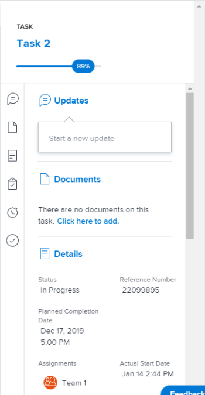

# 향상된 분석에서 진행 중인 작업 시각화 보기

진행 중인 작업 시각화는 프로젝트에 대해 진행 중인 작업 수(적용된 필터 기준 내), 각 작업에 대해 완료된 작업의 비율 및 작업을 예약하는 방법을 보여 줍니다.

## 액세스 요구 사항

다음 항목이 있어야 합니다.

<table style="table-layout:auto"> 
 <col> 
 <col> 
 <tbody> 
  <tr> 
   <td role="rowheader"><a href="https://www.workfront.com/plans" target="_blank">Adobe Workfront 플랜</a>*</td> 
   <td> 
비즈니스 이상
 </td> 
  </tr> 
  <tr> 
   <td role="rowheader"><a href="../administration-and-setup/add-users/access-levels-and-object-permissions/wf-licenses.md" class="MCXref xref">Adobe Workfront 라이선스 개요</a>*</td> 
   <td> 
검토 이상
 </td> 
  </tr> 
  <tr> 
   <td role="rowheader">액세스 수준 구성*</td> 
   <td> 
프로젝트에 대한 액세스 보기
 
작업에 대한 액세스 보기(작업을 업데이트하려면 작업에 대한 편집 액세스 권한이 필요합니다.)
 
참고: 여전히 액세스 권한이 없는 경우 Workfront 관리자에게 액세스 수준에서 추가 제한을 설정하는지 문의하십시오. Workfront 관리자가 액세스 수준을 수정하는 방법에 대한 자세한 내용은 <a href="../administration-and-setup/add-users/configure-and-grant-access/create-modify-access-levels.md" class="MCXref xref">사용자 지정 액세스 수준 만들기 또는 수정</a>을 참조하십시오.
 </td> 
  </tr> 
  <tr> 
   <td role="rowheader">개체 권한</td> 
   <td> 
프로젝트 및 작업 개체 모두에 대한 권한 보기
 
추가 액세스 요청에 대한 자세한 내용은 <a href="../workfront-basics/grant-and-request-access-to-objects/request-access.md" class="MCXref xref">개체 </a>에 대한 액세스 요청 을 참조하십시오.
 </td> 
  </tr> 
 </tbody> 
</table>

&#42;보유 중인 플랜, 라이선스 유형 또는 액세스 권한을 확인하려면 Workfront 관리자에게 문의하십시오.

## 전제 조건

향상된 Analytics를 사용하기 위한 전제 조건은 [향상된 Analytics 개요](../enhanced-analytics/enhanced-analytics-overview.md)의 &quot;전제 조건&quot; 섹션을 참조하십시오.

## 진행 중인 작업 시각화 이해

진행 중인 작업 계획 시각화에는 다음 작업 세부 정보가 표시됩니다.

* **계획된 작업 기간**: 작업 표시줄의 길이는 작업의 시작 날짜와 완료 날짜를 기준으로 계획된 기간을 나타냅니다.

  

* **작업 노력 완료**: 작업 표시줄의 진한 파란색은 작업에 대해 완료된 작업의 양을 나타냅니다. 이 완료율은 작업 표시줄의 오른쪽에 표시됩니다.

  

* **남은 작업 노력**: 작업 표시줄의 연한 파란색은 작업에 대해 완료해야 하는 작업량을 나타냅니다.

  

이 정보를 통해 다음과 같은 사항을 확인할 수 있습니다.

* 작업 노력에 초점을 맞춘 곳.
* 프로젝트를 위험에 빠뜨릴 수 있는 작업.
* 작업 완료에 대한 근접치.
* 특정 작업에 대해 이야기해야 하는 사람.

이 시각화에 가장 적합한 데이터를 얻는 방법에 대해 알아보려면 [향상된 분석 개요](../enhanced-analytics/enhanced-analytics-overview.md)를 참조하십시오.

## 진행 중인 작업 시각화 보기

1. 메인 메뉴 아이콘 을(를) 클릭한 다음 **분석**&#x200B;을(를) 선택합니다.
1. (선택 사항) 다른 날짜 범위를 사용하려면 날짜 범위 필터에서 새 시작 날짜와 종료 날짜를 선택합니다.

   

   날짜 범위 필터 사용에 대한 자세한 내용은 [향상된 분석에서 필터 적용](../enhanced-analytics/use-enhanced-analytics-filters.md)을 참조하십시오.

1. (조건부) 프로젝트 데이터 세트를 제한해야 하는 경우 사용할 필터를 선택하고 적용합니다.

   향상된 분석에서 필터를 추가하는 방법에 대한 자세한 내용은 [향상된 분석에서 필터 적용](../enhanced-analytics/use-enhanced-analytics-filters.md)을 참조하십시오.

   필터를 추가하면 최대 50개의 프로젝트에 대한 데이터가 표시되고 페이지를 떠나거나 Workfront에서 로그아웃한 후에도 필터가 활성 상태로 유지됩니다.

1. 플라이트 계획 또는 프로젝트 트리맵 시각화에서 프로젝트를 클릭하여 자세한 정보를 봅니다.

   번다운 및 진행 중인 작업 시각화가 표시됩니다.

   >[!NOTE]
   >
   >이러한 다른 시각화에 대한 자세한 내용은 다음을 참조하십시오.
   >
   >   
   >   
   >   * [향상된 분석에서 플라이트 플랜 시각화 보기](../enhanced-analytics/flight-plan-overview.md)
   >   * [향상된 분석에서 프로젝트 트리맵 시각화 보기](../enhanced-analytics/project-treemap-overview.md)
   >   * [향상된 분석에서 번다운 시각화 보기](../enhanced-analytics/burndown-overview.md)
   >   
   >

1. (선택 사항) 날짜 범위를 확대하려면 날짜 범위 시작에 대한 시각화의 한 지점을 선택하고 날짜 범위의 끝으로 드래그합니다.

   다른 모든 시각화는 동일한 날짜 범위로 업데이트되며 일정 필터가 만들어집니다.

   

1. (선택 사항) 작업 정렬 방법을 변경하려면 **정렬 기준** 메뉴를 클릭한 다음, 새 정렬 옵션을 선택하십시오.

   * **완료 날짜**
   * **알파벳순 A-Z**
   * **작업 분류 구조**(이 옵션은 작업이 프로젝트에 표시되는 순서와 일치합니다.)

   페이지의 다른 모든 시각화는 정렬 선택 사항과 일치하도록 업데이트됩니다.

1. 선택한 프로젝트에서 작업 진행 상황을 검토한 다음 특정 작업을 마우스로 가리키면 계획된 시간 수, 계획된 납기 일자 및 완료 비율이 표시됩니다.

   

1. 작업을 클릭하여 화면 오른쪽에 있는 작업 세부 정보 를 엽니다. 이 화면에서 작업에 대한 자세한 내용을 보거나, 업데이트를 보거나, 입력하거나, 작업을 변경할 수 있습니다.

   

1. (선택 사항) 시각화 데이터를 내보내려면 시각화의 오른쪽 상단 모서리에 있는 **내보내기 아이콘** 을(를) 클릭한 다음 내보내기 형식을 선택합니다.

   * **차트(PNG)**
   * **데이터 테이블(XSLX)**

