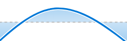

# 향상된 분석에서 팀 용량 시각화 보기

<!-- Audited: 01/2024 -->

팀 수용작업량 시각화는 홈 팀이 보유한 총 수용작업량, 초과 할당되었는지 또는 과소 할당되었는지 여부 및 시간이 지남에 따라 수용작업량이 얼마나 동적인지를 보여 줍니다.

## 액세스 요구 사항

이 문서의 단계를 수행하려면 다음 액세스 권한이 있어야 합니다.

<table style="table-layout:auto"> 
 <col> 
 <col> 
 <tbody> 
  <tr> 
   <td role="rowheader">Adobe Workfront 플랜</td> 
   <td>
      
새로 만들기: 모두

      
또는

      
현재: 비즈니스 이상
</td>
  </tr> 
  <tr> 
   <td role="rowheader">Adobe Workfront 라이선스</td>
   <td>
      
새로운 기능: 밝게 또는 높음

      
또는

      
현재: 검토 이상

   </td>
  </tr> 
  <tr> 
   <td role="rowheader">액세스 수준 구성</td> 
   <td>프로젝트에 대한 액세스 보기</td> 
  </tr> 
  <tr> 
   <td role="rowheader">개체 권한</td> 
   <td>보기 </td> 
  </tr> 
 </tbody> 
</table>

이 표의 정보에 대한 자세한 내용은 [Workfront 설명서의 액세스 요구 사항](/help/quicksilver/administration-and-setup/add-users/access-levels-and-object-permissions/access-level-requirements-in-documentation.md).

## 전제 조건

Enhanced Analytics를 사용하기 위한 사전 요구 사항은 의 &quot;사전 요구 사항&quot; 섹션을 참조하십시오. [향상된 분석 개요](../enhanced-analytics/enhanced-analytics-overview.md).

## 팀 수용작업량 시각화 이해

팀 수용작업량 시각화는 주어진 일자에 홈 팀에 할당된 작업량을 표시합니다.

* **번아웃**: 짙은 파란색 채우기 색상이 점선 위에 있는 경우 홈 팀에는 팀이 작업할 수 있는 시간 내에 완료할 수 있는 시간보다 많은 작업 시간이 할당됩니다. 이는 팀이 초과 할당되어 전력 소진에 근접하고 있을 수 있음을 나타낸다.

  

* **도전 없음**: 짙은 파란색 채우기 색상이 점선 아래에 있는 경우 홈 팀에 할당된 작업량보다 작업에 사용 가능한 시간이 더 많습니다. 이는 팀이 과소 할당되어 있으며 도전을 받지 못할 수 있다는 것을 나타낸다.

  

* **잔고**: 더 밝거나 더 투명한 파란색 채우기 색상이 바로 위, 바로 아래 또는 점선에 있는 경우 홈 팀에는 사용 가능한 작업 시간 내에 완료할 수 있도록 할당된 작업 시간이 있습니다. 구단의 업무량이 더 균형을 이루고 있다는 의미다.

  

시각화의 아무 지점이나 마우스를 가져가면 지정된 날짜에 대해 다음 세부 정보가 표시됩니다.

* **예약된 시간**: 팀이 완료해야 하는 계획된 작업 시간입니다.
* **사용 가능한 시간**: 팀이 작업할 수 있는 작업 시간입니다.
* **용량**: 능력 퍼센트 외에 능력 시점, 능력 미만 또는 능력 초과 지정도 표시됩니다.

이 정보를 보면 다음을 확인할 수 있습니다.

* 홈 팀이 초과 할당되거나 과소 할당된 경우.
* 홈 팀이 매일 초과 할당되거나 과소 할당된 경우.
* 매일 홈 팀 워크로드의 일관도.
* 새 작업으로 용량 문제를 만드는 경우.

이 시각화에 대한 최상의 데이터를 얻는 방법에 대해 알아보려면 다음을 참조하십시오. [향상된 분석 개요](../enhanced-analytics/enhanced-analytics-overview.md).

## 팀 수용작업량 시각화 보기

{{step1-to-analytics}}

1. 왼쪽 패널에서 을 선택합니다 **사람**.

   

1. (선택 사항) 다른 날짜 범위를 사용하려면 날짜 범위 필터에서 새 시작 날짜와 종료 날짜를 선택합니다.

   

   날짜 범위 필터 사용에 대한 자세한 내용은 [향상된 분석에서 필터 적용](../enhanced-analytics/use-enhanced-analytics-filters.md).

1. (조건부) 팀 필터를 설정하지 않은 경우 팀 필터를 추가하고 데이터를 보려는 각 팀을 선택합니다.

   향상된 분석에서 필터를 추가하는 방법에 대한 자세한 내용은 [향상된 분석에서 필터 적용](../enhanced-analytics/use-enhanced-analytics-filters.md).

   필터를 추가하면 최대 50개의 프로젝트에 대한 데이터가 표시되고 페이지를 떠나거나 Workfront에서 로그아웃한 후에도 필터가 활성 상태로 유지됩니다.

1. 리소스 용량 시각화에서 팀을 클릭하여 자세한 정보를 확인합니다.

   팀 수용작업량 시각화가 표시됩니다.

   리소스 용량 시각화에 대한 자세한 내용은 [향상된 분석에서 리소스 용량 시각화 보기](../enhanced-analytics/resource-capacity-overview.md).

1. (선택 사항) 날짜 범위를 확대하려면 날짜 범위 시작에 대한 시각화의 한 지점을 선택하고 날짜 범위의 끝으로 드래그합니다.

   다른 모든 시각화는 동일한 날짜 범위로 업데이트되며 일정 필터가 만들어집니다.

   

1. 그래프로 표시된 선의 한 지점을 마우스로 가리키면 지정된 날짜에 대한 계획된 시간 및 계획된 시간과 용량 백분율 및 홈 팀이 해당 시간에 초과, 미만 또는 용량이었는지 여부를 확인할 수 있습니다.

   

1. (선택 사항) 시각화 데이터를 내보내려면 **내보내기** 아이콘  시각화의 오른쪽 상단 모서리에서 내보내기 형식을 선택합니다.

   * 차트(PNG)
   * 데이터 테이블(XSLX)

