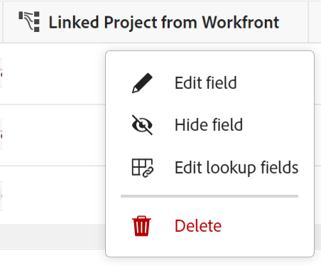

<!-----
title: Connect record types
description: A way to indicate how individual record types relate to one another is to connect them. Also, you can connect Maestro record types with object types from other applications to enhance your users' experience and keep their focus in one application.
hidefromtoc: yes
hide: yes
feature: Work management
role: User
author: Alina
--->

<!--update the metadata with real information when making this avilable in TOC and in the left nav-->
<!--************ THIS MIGHT NO LONGER BE A 'RELATIONSHIP' TYPE FIELD, BECAUSE THEY WILL SHOW IT IN THE CONNECTION TAB*****************************-->

# 레코드 유형 연결

>[!IMPORTANT]
>
>이 문서의 정보는 Adobe의 새로운 서비스인 Adobe 마에스트로를 참조합니다.
>
>현재 Adobe 마에스트로는 제한된 수의 고객에게 제공되는 베타 프로그램의 일부입니다.
>
>Maestro용 Beta 프로그램 가입에 대한 자세한 내용은 계정 담당자에게 문의하십시오.
>
>자세한 내용은 [Adobe 마에스트로 개요](../maestro-overview.md).

Adobe Maestro를 사용하여 조직에 필요한 레코드 유형이 포함된 사용자 정의 가능한 작업 공간을 디자인할 수 있습니다. 개별 레코드 종류가 서로 관련되는 방식을 나타내는 방법은 해당 레코드 종류를 연결하는 것입니다. 또한 Maestro 레코드 유형을 다른 애플리케이션의 객체 유형과 연결하여 사용자 경험을 향상시키고 한 애플리케이션에서 집중력을 유지할 수 있습니다.

다음을 연결할 수 있습니다.

* Maestro 운영 레코드 유형
* Maestro 운영 레코드 유형과 분류 레코드 유형
* 운영 레코드 유형에 대한 Maestro 분류 유형
* 다른 응용 프로그램의 Maestro 작업 레코드 유형 및 개체 유형.

이렇게 하면 연결된 레코드나 오브젝트 유형의 필드를 다른 Maestro 레코드에 표시할 수 있습니다.

이 문서에서는 두 가지 Maestro 레코드 유형 또는 Maestro 레코드 유형을 다른 응용 프로그램의 오브젝트와 연결하는 방법에 대해 설명합니다.

레코드나 개체 유형 간의 연결이 설정되면 개별 레코드를 서로 연결할 수 있습니다.

다른 응용 프로그램의 개체에 Maestro 레코드를 연결하는 방법에 대한 자세한 내용은 [레코드 연결](../records/connect-records.md).

레코드 종류 연결에 대한 예는 [레코드 종류 및 레코드 연결의 예](../architecture-and-fields/example-connect-record-types-and-records.md).

<!--ensure this last linked article is right; the title and the link should have changed-->

## 액세스 요구 사항

이 문서의 단계를 수행하려면 다음 액세스 권한이 있어야 합니다.

<table style="table-layout:auto">
 <col>
 </col>
 <col>
 </col>
 <tbody>
    <tr>
<tr>
<td>
   
 Adobe 제품
 </td>
   <td>
   
 Adobe Workfront
 </td>
  </tr>  
 <td role="rowheader">
Adobe Workfront 계약
</td>
   <td>

Adobe Maestro Closed Beta 프로그램에 조직을 등록해야 합니다. 이 새 제품에 대해 문의하려면 계정 담당자에게 문의하십시오. 

   </td>
  </tr>
  <tr>
   <td role="rowheader">
Adobe Workfront 플랜
</td>
   <td>

모든

   </td>
  </tr>
  <tr>
   <td role="rowheader">
Adobe Workfront 라이선스
</td>
   <td>
   
모든
 
  </td>
  </tr>

<tr>
   <td role="rowheader">액세스 수준</td>
   <td> 
모든
  
</td>
  </tr>

<tr>
   <td role="rowheader">레이아웃 템플릿</td>
   <td> 
시스템 관리자가 레이아웃 템플릿에 마에스트로 영역을 추가해야 합니다. 자세한 내용은 <a href="../access/grant-access.md">Adobe 마에스트로에 대한 액세스 권한 부여</a>. 
  
</td>
  </tr>
 </tbody>
</table>

<!--Maybe enable this at GA - but Maestro is not supposed to have Access controls in the Workfront Access Level: 
>[!NOTE]
>
>If you don't have access, ask your Workfront administrator if they set additional restrictions in your access level. For information on how a Workfront administrator can change your access level, see [Create or modify custom access levels](../administration-and-setup/add-users/configure-and-grant-access/create-modify-access-levels.md). -->

<!-- Notes to add for the table: for the "Workfront plans" row: the above is only for closed beta; when going to GA - activate the following plans:    

Current plan: Prime and Ultimate

Legacy plan: Enterprise
-->

<!-- Notes for the table: for the "Workfront access" row: 
For more information, see <a href="../../administration-and-setup/add-users/access-levels-and-object-permissions/wf-licenses.md" class="MCXref xref">Adobe Workfront licenses overview</a>.
-->

## 레코드 유형 연결에 대한 고려 사항

* Maestro에서 다음 엔티티를 연결할 수 있습니다.

   * 두 가지 운영 레코드 유형
   * 두 가지 분류
   * 운영 레코드 유형 및 분류 체계
   * 다른 응용 프로그램의 작업 레코드 형식과 개체 형식입니다.

     >[!TIP]
     >
     >    분류 레코드 유형을 작업 레코드 유형이나 다른 응용 프로그램의 개체 유형에 연결할 수 없습니다.

* 다음 응용 프로그램에서 다음 객체를 Maestro 레코드 유형과 연결할 수 있습니다.

   * Adobe Workfront:

      * 프로젝트
      * 포트폴리오
      * 프로그램
      * 회사
      * 그룹

* 레코드 유형을 다른 레코드 유형이나 다른 응용 프로그램의 개체 유형과 연결한 후에는 다음과 같은 시나리오가 있습니다.

   * 두 개의 레코드 종류를 연결하면 연결된 레코드 종류에 연결된 레코드 필드가 만들어집니다. 연결하는 레코드 유형에 유사한 연결된 레코드 필드가 만들어집니다.

     예를 들어 &quot;캠페인&quot; 레코드 유형을 &quot;제품&quot; 레코드 유형과 연결하는 경우, 이름을 &quot;연결된 제품&quot;으로 지정한 연결된 레코드 필드가 캠페인 레코드 유형에 만들어지고 자동으로 &quot;캠페인&quot;으로 지정한 연결된 레코드 유형이 제품 레코드 유형에 만들어집니다.

   * 레코드 유형 필드를 분류법과 연결할 때: 연결된 레코드 필드는 연결할 레코드 유형에 만들어집니다. 연결 중인 분류법에 연결된 레코드 필드가 만들어지지 않습니다.

     예를 들어 &quot;캠페인&quot; 레코드 유형을 &quot;대상&quot; 분류법 레코드 유형과 연결하는 경우 이름을 &quot;연결된 대상&quot;으로 지정한 연결된 레코드 필드가 캠페인 레코드 유형에 만들어집니다. 대상 분류 레코드 유형에 자동으로 &quot;캠페인&quot;이라는 이름의 연결된 레코드 필드가 만들어지지 않습니다. <!--this might be temporary-->

   * 레코드 유형 필드를 다른 응용 프로그램의 개체 유형과 연결할 때: 연결된 레코드 필드는 연결할 레코드 유형에 만들어집니다. Workfront의 Workfront 프로젝트에서는 연결된 레코드 필드가 자동으로 만들어지지 않습니다. 연결된 레코드 필드는 실제 개체가 Maestro 레코드에 연결되어 있을 때만 Workfront 개체 레코드 유형에 만들어집니다.

     자세한 내용은 [레코드 연결](../records/connect-records.md).

* 레코드 유형을 연결한 후 한 레코드 유형에서 다른 레코드 유형으로 여러 필드를 연결할 수 있습니다. 이러한 필드를 &quot;연결된 필드&quot; 또는 &quot;조회 필드&quot;라고 합니다.
* 연결된 레코드 필드 앞에는 관계 아이콘이 표시됩니다 .
* 레코드 유형에 대한 개별 레코드를 만든 후 연결된 레코드 유형 필드에서 연결하는 레코드를 선택할 수 있습니다. 자세한 내용은 [레코드 연결](../records/connect-records.md).
* 연결된 레코드를 선택하면 해당 필드가 속한 원래 레코드 형식에서 자동으로 채워지므로, 연결된 레코드 형식에서 연결된 필드의 정보를 편집할 수 없습니다.

## 레코드 유형 연결

<!--when changes here, also update the article for "Connect records"-->

1. 다음을 클릭합니다. **메인 메뉴** 아이콘  Workfront의 오른쪽 위 모서리에서 <!---or the **Main menu** icon   in the upper-left corner, if available--> 그런 다음 을 클릭합니다. **마에스트로** .

   기본적으로 마지막으로 액세스한 작업 영역이 열립니다.

1. (선택 사항) 기존 작업 영역 이름의 오른쪽에 있는 아래쪽 방향 화살표를 확장하고 레코드 유형을 연결할 작업 영역을 선택합니다.
1. 레코드 유형의 카드를 클릭하여 레코드 유형 페이지를 엽니다.
1. 다음을 클릭합니다. **+** 아이콘을 클릭하여 테이블 보기 오른쪽 위 모서리에서 **새 연결** 탭.

   
1. 다음에서 **레코드 유형** 필드에서 다음 중 하나를 선택합니다. <!--is the field name spelled right? lowercase "t"?-->

   * 다른 작업 레코드 유형
   * 분류 체계
   * Workfront 프로젝트, Portfolio, 프로그램, 회사 또는 그룹.

   

   >[!TIP]
   >
   > 선택한 작업 영역의 레코드 유형과 분류만 선택할 수 있습니다.

1. 다음 정보를 업데이트합니다.

   * **이름**: 원래 레코드 유형의 테이블 보기 또는 세부 정보 페이지에 표시되는 연결된 필드의 이름. 이렇게 하면 원본 레코드 유형의 테이블 보기 또는 원본 레코드에 대한 연결된 레코드 필드에 연결된 레코드 열이 만들어집니다. <!--ensure they updated this; and update the screen shot: it used to be "Label"-->

   >[!TIP]
   >
   >연결된 레코드 필드의 이름에 연결하려는 레코드 이름을 포함하여 새 필드의 원본 레코드 종류를 캡처하는 것이 좋습니다. 연결된 레코드의 이름은 연결된 새 레코드 필드 또는 연결된 필드에 표시되지 않습니다.

   * **설명**: 연결된 레코드 필드에 대한 추가 정보입니다. 필드의 설명은 테이블에서 필드의 열 위로 마우스를 가져가면 표시됩니다.
   * **여러 레코드 허용**: 이 옵션을 선택하면 연결된 레코드 유형 필드가 원본 레코드에 표시될 때 사용자가 여러 레코드를 추가할 수 있음을 나타냅니다. 이 옵션은 기본적으로 선택되어 있습니다.
   * **조회 필드 선택**: 선택한 레코드 유형에서 필드를 추가하려면 이 옵션을 선택합니다. 이 옵션은 기본적으로 선택되어 있습니다.

1. Click **Create**.

1. (조건부) 이전 단계에서 조회 필드 선택 설정을 선택한 경우 **조회 필드 추가** 상자가 열립니다.

   다음을 클릭합니다. **+** 에서 필드를 추가하는 아이콘 **선택하지 않은 필드** 영역입니다.

   또는

   다음을 클릭합니다. **-** 아이콘을 클릭하여 다음에서 필드를 제거합니다 **선택된 필드** 영역

   

   >[!NOTE]
   >
   >필드를 선택하지 않으면 **이름** 원본 레코드의 테이블 보기에서 볼 수 있는 필드는 연결된 레코드뿐입니다. 다음 **이름** 필드를 제거할 수 없습니다.

1. (선택 사항 및 조건부) 숫자, 통화, 백분율 또는 날짜 유형 필드를 연결하도록 선택하는 경우 집계기 값도 선택합니다. 사용자가 연결된 레코드 필드에서 둘 이상의 연결된 레코드를 선택하면 연결된 필드의 값이 선택한 집계기에 따라 쉼표로 구분되거나 집계된 값으로 표시됩니다.

   

   다음 중에서 선택합니다.

   * **없음**: 여러 레코드에서 얻은 값을 쉼표로 구분하여 표시합니다. 이것이 기본 선택입니다.
   * **MAX**: 연결된 레코드 필드에서 선택한 여러 레코드에서 나오는 모든 값의 가장 높은 값을 표시합니다.
   * **분**: 연결된 레코드 필드에서 선택한 여러 레코드에서 나오는 모든 값의 가장 낮은 값을 표시합니다.
   * **합계**: 연결된 레코드 필드에서 선택한 여러 레코드에서 나오는 모든 값의 합계를 표시합니다.
   * **AVG**: 연결된 레코드 필드에서 선택한 여러 레코드에서 나오는 모든 값의 평균을 표시합니다.

   >[!NOTE]
   >
   >예를 들어 캠페인 레코드(원본 레코드)에서 제품 레코드(연결된 레코드)를 연결하고 이름을 &quot;제품 필드&quot;로 지정할 수 있습니다. 캠페인 레코드에서 제품 레코드의 예산 필드를 연결하고 &quot;제품 예산&quot;이라고 할 수도 있습니다. &quot;제품 필드&quot;에서 여러 레코드를 선택할 수 있도록 허용한 경우, 예산이 $120,000인 제품 1과 예산이 $100,000인 제품 2를 선택할 수 있습니다. 선택한 집계에 따라 최초 레코드의 연결된 필드에서 다음 예산 정보를 볼 수 있습니다.
   >
   >* **없음**: $120,000, $100,000
   >* **MAX**: 120,000달러
   >* **분**: $100,000
   >* **합계**: 220,000달러
   >* **AVG**: $110,000
   >

1. (선택 사항) **검색** 아이콘  필드를 검색하려면 다음을 수행하십시오.

1. (선택 사항) **건너뛰기** 연결된 레코드 유형의 필드를 추가하지 않으려면

1. 클릭 **필드 추가** 변경 사항을 저장합니다.

   다음 항목이 추가됩니다.

   * 연결된 레코드 유형의 레코드를 수동으로 추가한 후 표시할 연결된 레코드 필드입니다. 연결된 레코드 필드의 이름은 6단계에서 선택한 이름입니다. <!-- ensure this is still accurate-->

   * 연결된 레코드 필드에 레코드를 수동으로 추가한 후 연결된 레코드 유형의 필드에 있는 정보를 표시하는 연결된 필드. 연결된 필드는 **조회 필드 선택** 연결을 만들 때 설정이 선택됩니다. 연결된 필드의 이름은 다음 패턴에 따라 지정됩니다.

     `<Name of the original field on the linked record> (from <Name of your linked field>)`

   * 연결하려는 레코드 종류의 연결된 레코드 필드. 연결된 레코드 유형의 연결된 레코드 필드 이름은 연결된 레코드 유형의 이름입니다.

     예를 들어 &quot;캠페인&quot; 레코드 유형에서 &quot;제품&quot; 레코드 유형을 연결하고 캠페인의 연결된 필드 이름을 &quot;연결된 제품&quot;으로 지정하면 제품 레코드 유형에 대해 &quot;캠페인&quot; 연결된 레코드 필드가 만들어집니다.

1. (선택 사항) 원래 레코드 유형 또는 연결된 레코드 유형 테이블 보기에서 연결된 레코드 필드의 머리글에 있는 아래쪽 방향 화살표를 클릭한 다음, 다음 중 하나를 클릭합니다.

   * **필드 편집**: 다음만 업데이트할 수 있습니다. **이름** 및 **설명** 필드 정보.
   * **조회 필드 편집**: 연결된 레코드의 필드를 추가하거나 제거합니다.

   

   조회 필드를 추가하거나 제거하려면 위의 7-12단계에 있는 지침을 따르십시오. <!--ensure these step numbers stay accurate-->

1. (선택 사항) 연결하려는 레코드 종류에서 연결된 레코드 필드의 머리글에 있는 아래쪽 방향 화살표를 클릭한 다음 를 클릭합니다 **삭제**.

   레코드 필드 및 연결된 추가 조회 필드는 삭제되며 필드 및 해당 정보는 복구할 수 없습니다.

   >[!TIP]
   >
   >    연결하려는 레코드 종류의 연결된 레코드 필드는 삭제되지 않습니다. <!-- is this still accurate?! -->
