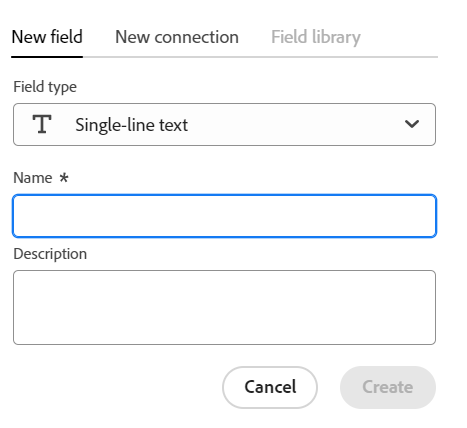

<!--udpate the metadata with real information when making this avilable in TOC and in the left nav-->

<!--Should the structure of this article be like this one: https://experienceleague.adobe.com/docs/workfront/using/administration-and-setup/customize/custom-forms/custom-form-builder/use-the-custom-form-builder/add-a-custom-field-to-a-custom-form.html?lang=en ??-->

<!--will they add a way to create fields elsewhere than in a table?! - how will that change the structure of this article? -->

# 필드 만들기

>[!IMPORTANT]
>
>현재 Adobe 마에스트로는 제한된 수의 고객에게 제공되는 비공개 베타 프로그램의 일부입니다.
>
>Maestro용 Beta 프로그램 가입에 대한 자세한 내용은 계정 담당자에게 문의하십시오.
>
>자세한 내용은 [Adobe 마에스트로 개요](../maestro-overview.md).

Adobe Maestro에서 운영 레코드 유형 또는 분류법에 대한 사용자 정의 필드를 만들 수 있습니다. 그런 다음 필드를 마에스트로 레코드와 연결하여 레코드 정보를 향상시킬 수 있습니다.

레코드 유형과 연결할 필드를 만들려면 먼저 레코드 유형을 만들어야 합니다. 자세한 내용은 [레코드 유형 만들기](../architecture-and-fields/create-record-types.md).

## 액세스 요구 사항

이 문서의 단계를 수행하려면 다음 액세스 권한이 있어야 합니다.

<table style="table-layout:auto">
 <col>
 <tbody>
<td>
   
 Adobe 제품
 </td>
   <td>
   
 Adobe Workfront
 </td>
  </tr>  
 <td role="rowheader">
Adobe Workfront 계약
</td>
   <td>

Adobe Maestro Closed Beta 프로그램에 조직을 등록해야 합니다. 이 새 제품에 대해 문의하려면 계정 담당자에게 문의하십시오. 

   </td>
  </tr>
  <tr>
   <td role="rowheader">
Adobe Workfront 플랜
</td>
   <td>

모든

   </td>
  </tr>
  <tr>
   <td role="rowheader">
Adobe Workfront 라이선스
</td>
   <td>
   
모든
 
  </td>
  </tr>

<tr>
   <td role="rowheader">액세스 수준</td>
   <td> 
모든
  
</td>
  </tr>
<tr>
   <td role="rowheader">레이아웃 템플릿</td>
   <td> 
시스템 관리자가 레이아웃 템플릿에 마에스트로 영역을 추가해야 합니다. 자세한 내용은 <a href="../access/grant-access.md">Adobe 마에스트로에 대한 액세스 권한 부여</a>. 
  
</td>
  </tr>
 </tbody>
</table>

<!--Maybe enable this at GA - but Maestro is not supposed to have Access controls in the Workfront Access Level: 
>[!NOTE]
>
>If you don't have access, ask your Workfront administrator if they set additional restrictions in your access level. For information on how a Workfront administrator can change your access level, see [Create or modify custom access levels](../administration-and-setup/add-users/configure-and-grant-access/create-modify-access-levels.md). -->

<!-- Notes to add for the table: for the "Workfront plans" row: the above is only for closed beta; when going to GA - activate the following plans:    

Current plan: Prime and Ultimate

Legacy plan: Enterprise
-->

<!-- Notes for the table: for the "Workfront access" row: 
For more information, see <a href="../../administration-and-setup/add-users/access-levels-and-object-permissions/wf-licenses.md" class="MCXref xref">Adobe Workfront licenses overview</a>.
-->

## Maestro 필드에 대한 고려 사항

* 레코드 유형 페이지의 테이블 보기에서만 필드를 만들 수 있습니다. 필드는 표 보기에서 열로 표시됩니다.

  테이블 열(또는 레코드 필드) 관리에 대한 자세한 내용은 [표 보기 관리](../views/manage-the-table-view.md).

  필드 관리에 대한 자세한 내용은 다음 문서를 참조하십시오.

   * [필드 편집](../architecture-and-fields/edit-fields.md)
   * [필드 삭제](./delete-fields.md)

* 레코드 형식과 연결된 필드는 해당 형식의 모든 레코드와 연결할 수 있습니다. <!--will this change and will the fields be available for other record types, too?! Also, the next bullet might need to change too if this one changes -->

* 레코드 형식과 연결된 필드는 다른 레코드 형식에 추가할 수 없습니다. <!-- this will change when they open the Field library tab when creating a field-->

* 다음 방법으로 필드를 수동 또는 자동으로 만들 수 있습니다.

   * 수동:

      * 레코드 유형 페이지의 표 보기에서 열을 추가합니다. 테이블의 열은 레코드 유형과 연관된 필드입니다. 레코드의 세부 정보 페이지에 표시되는 필드와 동일합니다.

        레코드의 세부 정보 페이지에서 필드를 만들 수 없습니다.

        이 문서에서는 필드를 수동으로 만드는 방법을 설명합니다.

      * 레코드 유형을 서로 연결하여 두 가지 Maestro 레코드 유형 또는 레코드 유형과 다른 응용 프로그램의 객체 유형 간에 새로운 연결을 추가할 때 연결된 레코드 필드를 만들 수 있습니다.

        <!--* Importing record types with fields using a CSV or an Excel file. - this is not available yet-->

        Maestro 레코드 유형 연결에 대한 자세한 내용은 [레코드 유형 연결](../architecture-and-fields/connect-record-types.md).

      * Excel 또는 CSV 파일을 사용하여 레코드 유형을 가져옵니다. 자세한 내용은 [레코드 유형 만들기](../architecture-and-fields/create-record-types.md).

   * 자동:

      * 레코드 유형을 만들 때마다 기본적으로 표시됩니다.

        다음은 각 새 작업 레코드 유형에 대해 기본적으로 생성되는 표준 필드입니다.

         * 이름
         * 설명
         * 시작 일자
         * 종료 일자
         * 상태. 레코드 상태의 기본값은 다음과 같습니다.
            * 개발
            * 계획됨
            * 활성
            * 완료됨
            * 보류 중

           값을 더 추가하거나 기존 값의 이름을 변경할 수 있습니다.

        다음은 각 새 분류 레코드 유형에 대해 기본적으로 생성되는 표준 필드입니다.

         * 이름 <!--will more be added? If not, consider rephrasing this bullet-->

      * 템플릿으로 작업 공간을 만들 때 템플릿에서 작업 영역을 만들 때 Maestro는 작동 기록 유형 및 분류법에 대한 필드를 만듭니다. 자세한 내용은 [작업 공간 만들기](../architecture-and-fields/create-workspaces.md).

* 사용자 또는 다른 사용자가 만든 필드의 설정을 보고 업데이트할 수 있습니다. <!--this will change with access/ permissions-->

* 하나의 레코드 유형에 대해 최대 500개의 필드가 있을 수 있습니다.

* 필드 이름은 최대 250자입니다.

* 작업 레코드 유형, 분류 또는 작업 영역을 삭제할 때 연결된 모든 필드와 필드 값도 삭제되므로 복구할 수 없습니다. <!-- this might change with a possible recycle bin solution?!-->

## 처음부터 필드 만들기 {#create-fields-from-scratch}

<!--in a table (not sure if this can be done elsewhere?!-->

1. 다음을 클릭합니다. **메인 메뉴** 아이콘  Workfront의 오른쪽 위 모서리에서 <!---or the **Main menu** icon   in the upper-left corner, if available--> 그런 다음 을 클릭합니다. **마에스트로** .

   기본적으로 마지막으로 액세스한 작업 영역이 열립니다.

1. (선택 사항) 기존 작업 영역 이름의 오른쪽에 있는 아래쪽 방향 화살표를 확장하고 필드를 만들 레코드 유형이 있는 작업 영역을 선택한 다음 레코드 유형을 클릭합니다.

   레코드 유형과 연관된 모든 기존 레코드는 테이블 뷰의 행에 표시됩니다.

   >[!TIP]
   >
   >    레코드가 표시되지 않으면 아직 레코드가 없거나 화면에 표시되는 내용을 제한하는 필터가 적용될 수 있습니다.

   레코드 유형과 연관된 모든 기존 필드가 테이블 뷰의 열에 표시됩니다. <!--caveat this for when we can hide the fields; mention that they can be hidden if they are not visible by default-->

1. 다음을 클릭합니다. **+** 아이콘을 클릭하면 새 필드가 추가됩니다.
1. 다음에서 **새 필드** 탭에서 다음 필드 유형 중에서 선택합니다.

   * [한 줄 텍스트](#single-line-text)
   * [단락](#paragraph)
   * [다중 선택](#multi-select)
   * [단일 선택](#single-select)
   * [일자](#date)
   * [숫자](#number)
   * [백분율](#percentage)
   * [통화](#currency)
   * [확인란](#checkbox)

   >[!IMPORTANT]
   >
   >    필드를 저장한 후에는 필드의 필드 유형을 변경할 수 없습니다.

1. 아래 섹션에 설명된 대로 각 필드를 계속 추가합니다.

### 한 줄 텍스트 {#single-line-text}

한 줄 텍스트 필드는 제한된 영숫자 정보를 캡처합니다. 예를 들어 소유자, 관련자, 팀 또는 조직 단위 정보를 한 줄 텍스트 필드에 캡처할 수 있습니다. 한 줄 텍스트 필드의 내용은 최대 250자까지 사용할 수 있습니다. <!-- asked Lilit if we can change this to "Single-line" since this can have numbers and text.-->

1. 섹션에 설명된 대로 필드 만들기를 시작합니다. [처음부터 필드 만들기](#create-fields-from-scratch) 이 문서에서 **한 줄 텍스트** 필드 유형입니다.

   

1. 다음 정보를 추가합니다.
   * **이름**: 테이블 또는 레코드의 세부 정보 페이지에 표시되는 필드 유형의 이름입니다. <!--ensure they updated this; and update the screen shot: it used to be "Label"-->
   * **설명**: 필드에 대한 추가 정보입니다. 테이블의 필드 열 헤더 위로 마우스를 가져가면 필드에 대한 설명이 표시됩니다.
1. Click **Create**.

   새 한 줄 필드가 레코드 유형에 열로 추가되고 해당 값을 레코드와 연결할 수 있습니다. 필드는 레코드의 세부 정보 페이지에도 표시됩니다.

### 단락 {#paragraph}

단락 필드는 설명 필드와 마찬가지로 레코드에 대한 추가 영숫자 정보를 캡처합니다. 단락 필드의 컨텐츠는 최대 1,000자까지 사용할 수 있습니다.

1. 섹션에 설명된 대로 필드 만들기를 시작합니다. [처음부터 필드 만들기](#create-fields-from-scratch) 이 문서에서 **단락** 필드 유형입니다.

   

1. 다음 정보를 추가합니다.
   * **이름**: 테이블 또는 레코드의 세부 정보 페이지에 표시되는 필드 유형의 이름입니다. <!--ensure they updated this; and update the screen shot: it used to be "Label"-->
   * **설명**: 필드에 대한 추가 정보입니다. 필드의 설명은 테이블에서 필드의 열 위로 마우스를 가져가면 표시됩니다.
1. Click **Create**.

   새 단락 필드가 레코드 유형에 열로 추가되고 해당 값을 레코드와 연결할 수 있습니다. 필드는 레코드의 세부 정보 페이지에도 표시됩니다.

### 다중 선택 {#multi-select}

다중 선택 필드를 사용하여 드롭다운 메뉴에서 두 개 이상의 옵션을 선택하여 모든 형식의 추가 정보를 캡처할 수 있습니다.

1. 섹션에 설명된 대로 필드 만들기를 시작합니다. [처음부터 필드 만들기](#create-fields-from-scratch) 이 문서에서 **다중 선택** 필드 유형입니다.

   

1. 다음 정보를 추가합니다.
   * **이름**: 테이블 또는 레코드의 세부 정보 페이지에 표시되는 필드 유형의 이름입니다. <!--ensure they updated this; and update the screen shot: it used to be "Label"-->
   * **설명**: 필드에 대한 추가 정보입니다. 필드의 설명은 테이블에서 필드의 열 위로 마우스를 가져가면 표시됩니다.
   * **선택 사항**: 필드가 저장된 후 드롭다운 메뉴에서 선택할 수 있는 옵션입니다. 각 선택 항목의 이름에 숫자와 문자를 모두 사용할 수 있습니다.
1. 클릭 **선택 항목 추가** 필요한 만큼 선택 항목을 추가합니다. 다중 선택 필드에 추가할 수 있는 선택 항목 수에는 제한이 없습니다.
1. (선택 사항) 원하는 순서로 각 선택 사항을 수동으로 끌어다 놓거나
   **선택 항목 A-Z 정렬** 선택 항목을 알파벳순으로 자동으로 나열하려면 옵션을 선택합니다. <!--Add this if they added this functionality: You cannot edit this option after you save the field.-->
1. 다음을 클릭합니다. **x** 아이콘을 클릭하여 제거합니다.
1. 선택 항목의 왼쪽에 있는 색상 견본을 클릭하여 색상 선택기를 확장하고 각 옵션의 색상을 사용자 지정합니다.
1. Click **Create**.

   새 다중 선택 필드가 레코드 유형에 열로 추가되고 해당 값을 레코드와 연결할 수 있습니다. 필드는 레코드의 세부 정보 페이지에도 표시됩니다.

### 단일 선택 {#single-select}

필드를 한 번 선택하면 드롭다운 메뉴에서 옵션 하나를 선택하여 원하는 형식으로 추가 정보를 캡처할 수 있습니다.

1. 섹션에 설명된 대로 필드 만들기를 시작합니다. [처음부터 필드 만들기](#create-fields-from-scratch) 이 문서에서 **단일 선택** 필드 유형입니다.

   

1. 다음 정보를 추가합니다.
   * **이름**: 테이블 또는 레코드의 세부 정보 페이지에 표시되는 필드 유형의 이름입니다. <!--ensure they updated this; and update the screen shot: it used to be "Label"-->
   * **설명**: 필드에 대한 추가 정보입니다. 필드의 설명은 테이블에서 필드의 열 위로 마우스를 가져가면 표시됩니다.
   * **선택 사항**: 필드가 저장된 후 드롭다운 메뉴에서 선택할 수 있는 옵션입니다. 각 선택 항목의 이름에 숫자와 문자를 모두 사용할 수 있습니다.

1. 클릭 **선택 항목 추가** 필요한 만큼 선택 항목을 추가합니다. 단일 선택 필드에 추가할 수 있는 선택 항목 수에는 제한이 없습니다.
1. (선택 사항) 원하는 순서로 각 선택 사항을 수동으로 끌어다 놓거나 **선택 항목 A-Z 정렬** 선택 항목을 알파벳순으로 자동으로 나열하려면 옵션을 선택합니다. <!--Add this if they added this functionality: You cannot edit this option after you save the field.-->
1. 다음을 클릭합니다. **x** 아이콘을 클릭하여 제거합니다.
1. 선택 항목의 왼쪽에 있는 색상 견본을 클릭하여 색상 선택기를 확장하고 각 옵션의 색상을 사용자 지정합니다.
1. Click **Create**.

   새 단일 선택 필드가 레코드 유형에 열로 추가되고 해당 값을 레코드와 연결할 수 있습니다. 필드는 레코드의 세부 정보 페이지에도 표시됩니다.

### 일자 {#date}

날짜 필드를 사용하여 날짜 및 시간 형식으로 추가 정보를 캡처할 수 있습니다.

1. 섹션에 설명된 대로 필드 만들기를 시작합니다. [처음부터 필드 만들기](#create-fields-from-scratch) 이 문서에서 **날짜** 필드 유형입니다.

   

1. 다음 정보를 추가합니다.
   * **이름**: 테이블 또는 레코드의 세부 정보 페이지에 표시되는 필드 유형의 이름입니다. <!--ensure they updated this; and update the screen shot: it used to be "Label"-->
   * **설명**: 필드에 대한 추가 정보입니다. 필드의 설명은 테이블에서 필드의 열 위로 마우스를 가져가면 표시됩니다.
   * **날짜 형식**: 이 필드에 표시할 날짜 형식의 유형입니다.

     다음 형식 중에서 선택합니다.
      * **로케일**: 브라우저의 로케일과 일치합니다.
      * **표준**: 2023/05/16
      * **길게**: 2023년 5월 16일
      * **유럽어**: 2023/16/05
      * **ISO**: 2023-05-16
   * **시간 필드 포함**: 타임스탬프를 포함하려면 이 옵션을 선택합니다. 이 옵션은 기본적으로 선택되지 않습니다.

     다음 옵션 중에서 선택합니다.

      * **24시간**: 예: 18:00
      * **12시간**: 예: 오후 6:00

1. Click **Create**.

   새 날짜 필드는 레코드 유형에 열로 추가되고 해당 값은 레코드와 연결될 수 있습니다. 필드는 레코드의 세부 정보 페이지에도 표시됩니다.

### 숫자 {#number}

숫자 필드 유형은 숫자 형식으로 정보를 캡처합니다.

1. 섹션에 설명된 대로 필드 만들기를 시작합니다. [처음부터 필드 만들기](#create-fields-from-scratch) 이 문서에서 **숫자** 필드 유형입니다.

   
1. 다음 정보를 추가합니다.

   * **이름**: 테이블 또는 레코드의 세부 정보 페이지에 표시되는 필드 유형의 이름입니다.
   * **설명**: 필드에 대한 추가 정보입니다. 필드의 설명은 테이블에서 필드의 열 위로 마우스를 가져가면 표시됩니다.
   * **정밀도**: 필드에 기록할 소수 자릿수입니다. 최대 6개의 소수를 표시할 수 있습니다.
   * **음수 허용**: 이 필드에 음수를 허용하려면 이 옵션을 선택합니다. 이 옵션은 기본적으로 선택되지 않습니다.

   >[!NOTE]
   >
   >    음수 허용을 선택하고 음수 값이 필드가 첨부된 레코드에 저장되는 경우 향후 설정을 더 이상 선택 해제할 수 없습니다.

1. Click **Create**.

   새 숫자 필드는 레코드 종류에 열로 추가되며 해당 값을 레코드와 연결할 수 있습니다. 필드는 레코드의 세부 정보 페이지에도 표시됩니다.

### 백분율 {#percentage}

백분율 필드 유형은 숫자 형식 다음에 백분율 기호가 있는 정보를 캡처합니다.

1. 섹션에 설명된 대로 필드 만들기를 시작합니다. [처음부터 필드 만들기](#create-fields-from-scratch) 이 문서에서 **백분율** 필드 유형입니다.

   

1. 다음 정보를 추가합니다.
   * **이름**: 테이블 또는 레코드의 세부 정보 페이지에 표시되는 필드 유형의 이름입니다.
   * **설명**: 필드에 대한 추가 정보입니다. 필드의 설명은 테이블에서 필드의 열 위로 마우스를 가져가면 표시됩니다.
   * **정밀도**: 필드에 기록할 소수 자릿수입니다. 최대 6개의 소수를 표시할 수 있습니다.
   * **음수 허용**: 이 필드에 음수 백분율 값을 허용하려면 이 옵션을 선택합니다. 이 옵션은 기본적으로 선택되지 않습니다.

   >[!NOTE]
   >
   >    음수 허용을 선택하고 음수 값이 필드가 첨부된 레코드에 저장되는 경우 향후 설정을 더 이상 선택 해제할 수 없습니다.

1. Click **Create**.

   새 백분율 필드가 레코드 유형에 열로 추가되고 해당 값을 레코드와 연결할 수 있습니다. 필드는 레코드의 세부 정보 페이지에도 표시됩니다.

### 통화 {#currency}

통화 필드 유형은 앞에 통화 기호가 있는 숫자 형식으로 정보를 캡처합니다.

1. 섹션에 설명된 대로 필드 만들기를 시작합니다. [처음부터 필드 만들기](#create-fields-from-scratch) 이 문서에서 **통화** 필드 유형입니다.

   

1. 다음 정보를 추가합니다.
   * **이름**: 테이블 또는 레코드의 세부 정보 페이지에 표시되는 필드 유형의 이름입니다. <!--ensure they updated this; and update the screen shot: it used to be "Label"-->
   * **설명**: 필드에 대한 추가 정보입니다. 필드의 설명은 테이블에서 필드의 열 위로 마우스를 가져가면 표시됩니다.
   * **통화**: 이 필드에 표시할 통화 유형입니다. ISO(International Organization of Standardization)에 따른 통화 목록입니다.
   * **정밀도**: 필드에 기록할 소수 자릿수입니다. 최대 6개의 소수를 표시할 수 있습니다.
   * **음수 허용**: 이 필드에 음수 통화 값을 허용하려면 이 옵션을 선택합니다. 이 옵션은 기본적으로 선택되지 않습니다.

   >[!NOTE]
   >
   >    음수 허용을 선택하고 음수 값이 필드가 첨부된 레코드에 저장되는 경우 향후 설정을 더 이상 선택 해제할 수 없습니다.

1. Click **Create**.

   새 통화 필드가 레코드 유형에 열로 추가되고 해당 값을 레코드와 연결할 수 있습니다. 필드는 레코드의 세부 정보 페이지에도 표시됩니다.

### 확인란

확인란 필드 유형을 사용하여 레코드에 단일 확인란 옵션을 추가할 수 있습니다. 이 필드를 사용하여 특정 레코드에 대한 특정 속성이나 상태를 표시할 수 있습니다. 예를 들어 각 레코드의 완료, 승인 또는 기타 모든 이진 속성을 추적하기 위한 플래그로 사용할 수 있습니다.

1. 섹션에 설명된 대로 필드 만들기를 시작합니다. [처음부터 필드 만들기](#create-fields-from-scratch) 이 문서에서 **확인란** 필드 유형입니다.

   

1. 다음 정보를 추가합니다.
   * **이름**: 테이블 또는 레코드의 세부 정보 페이지에 표시되는 필드 유형의 이름입니다. <!--ensure they updated this; and update the screen shot: it used to be "Label"-->
   * **설명**: 필드에 대한 추가 정보입니다. 필드의 설명은 테이블에서 필드의 열 위로 마우스를 가져가면 표시됩니다.
1. Click **Create**.

   새 확인란 필드가 레코드 유형에 열로 추가되고 해당 값을 레코드와 연결할 수 있습니다. 필드는 레코드의 세부 정보 페이지에도 표시됩니다.

## 레코드 유형을 함께 연결하여 필드 만들기

두 가지 Maestro 레코드 유형 또는 레코드 유형과 다른 응용 프로그램의 객체 유형 간에 새로운 연결을 추가할 때 연결된 레코드 필드를 만들 수 있습니다.

Maestro 레코드 유형 연결에 대한 자세한 내용은 [레코드 유형 연결](../architecture-and-fields/connect-record-types.md).

## Excel 및 CSV 파일을 사용하여 레코드 유형을 가져와서 필드 만들기

자세한 내용은 [레코드 유형 만들기](../architecture-and-fields/create-record-types.md).

## 레코드 유형을 만들어 필드 만들기

레코드 유형을 만들 때 새 레코드 유형과 연관된 여러 필드도 기본적으로 만들어집니다. 자세한 내용은 [레코드 유형 만들기](../architecture-and-fields/create-record-types.md).

## 템플릿으로 작업 공간을 만들어 필드 만들기

템플릿에서 작업 영역을 만들 때 Maestro는 작동 기록 유형 및 분류법에 대한 필드를 만듭니다.

자세한 내용은 [작업 공간 만들기](../architecture-and-fields/create-workspaces.md).

