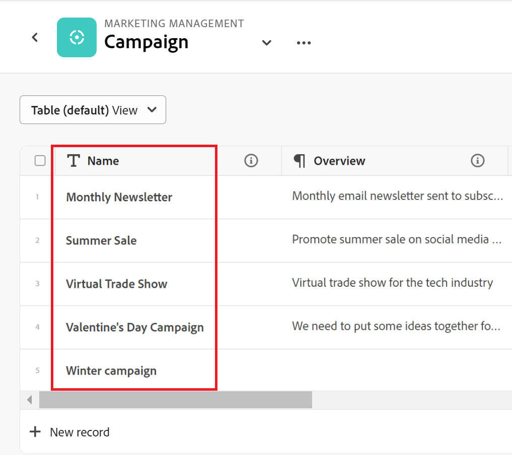
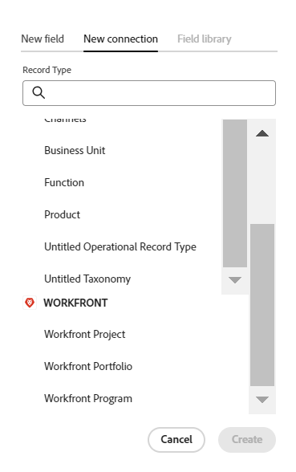

# Adobe 마에스트로 개요

<!--udpate the metadata with real information when making this avilable in TOC and in the left nav-->

<!--see the separate article I wrote to have the PMs vet it for this: https://adobe-my.sharepoint.com/personal/alinaw_adobe_com/_layouts/15/doc.aspx?sourcedoc={79f94807-3d73-4015-afc0-5c016fc63cfc}&action=edit-->

<!--all the links are hidden for now, so I can share this with customer zero. Activate the links before making this public. -->

<!-- remove the references to closed beta from the entire article-->

<!--update the video in the IMPORTANT below, when we have something better, especially after Open Beta - remove it-->

>[!IMPORTANT]
>
>이 문서의 정보는 Adobe Workfront의 새로운 오퍼링인 Adobe Maestro를 참조합니다.
>
>현재 Adobe 마에스트로는 제한된 수의 고객에게 제공되는 베타 프로그램의 일부입니다. Maestro 기능을 사용하려면 Workfront 고객이어야 합니다.
>
>Maestro용 Beta 프로그램 가입에 대한 자세한 내용은 계정 담당자에게 문의하십시오.
>[Adobe Maestro 비디오 데모 보기](https://video.tv.adobe.com/v/3424253/){target=_blank}

## Adobe 마에스트로 소개

Adobe Maestro는 Adobe Workfront의 새로운 서비스입니다. Maestro의 목적은 조직의 운영 세부 정보를 포괄적으로 파악하고 작업 관리 수명주기의 각 단계에서 중요한 비즈니스 질문에 답변하는 것입니다.

팀 및 리더쉽은 다음과 같은 질문에 대한 명확한 답변을 필요로 합니다.

* 4분기에 EMEA에서 얼마나 많은 캠페인을 실행하고 있습니까?
* 동시 캠페인 간에 대상이 겹치나요?
* 지금 의식 프로그램들은 얼마나 잘 되고 있습니까?
* 특정 Campaign의 에셋 모습은 무엇입니까? 그 중 어떤 것이 여전히 승인을 받아야 하는가?

이러한 질문에 답변하기 위해서는 리더십은 계획에서 실행, 전달에서 결과 측정에 이르기까지 모든 작업 단계를 총체적으로 파악할 수 있는 솔루션이 필요합니다. 현재 조직에는 프로세스의 일부 부분을 처리할 수 있는 도구가 있지만, 대부분의 조직에서는 모든 작업 단계에 대한 연결이 좋지 않으며, 결과를 안정적으로 제공할 수 없습니다.

다음은 Maestro의 주요 기능 중 일부입니다.

* 모든 단계에 걸쳐 작업을 관리하고 작업 과정에 참여하는 모든 이해 당사자를 위한 문제를 해결합니다.
* 조직에서 사용하는 개체 유형(또는 레코드 유형) 결정부터 이러한 개체가 서로 연결되는 방법을 구성하는 등 워크플로를 완전히 사용자 지정합니다.
* 다른 시스템의 오브젝트 유형에 연결하여 모든 프로세스에 대해 일관된 프레임워크를 만듭니다.

## 마감된 베타 프로그램 중 Maestro를 사용하기 위해 필요한 액세스 권한

>[!IMPORTANT]
>
>현재 Maestro에는 사용자 또는 정보와 연관된 액세스 수준이나 권한이 없습니다. 모든 사용자는 다른 사용자가 Maestro에 추가하는 모든 정보를 보고, 편집하고, 삭제할 수 있습니다.

Maestro를 사용하는 데 필요한 액세스 권한에 대한 자세한 내용은 [Adobe Maestro 액세스 개요](../maestro/access/access-overview.md).

<!-- hidden the table after I moved the content to the Access overview article: 

You must have the following access to use Adobe Maestro: 

<table style="table-layout:auto">
 <col>
 </col>
 <col>
 </col>
 <tbody>
    <tr>
<tr>
<td>
   
 Adobe product
 </td>
   <td>
   
 Adobe Workfront
 </td>
  </tr>  
 <td role="rowheader">
Adobe Workfront agreement
</td>
   <td>

Your organization must be enrolled in the Adobe Maestro closed beta program. Contact your account representative to inquire about this new offering. 

   </td>
  </tr>
  <tr>
   <td role="rowheader">
Adobe Workfront plan
</td>
   <td>

Any

   </td>
  </tr>
  <tr>
   <td role="rowheader">
Adobe Workfront license
</td>
   <td>
   
Any
 
  </td>
  </tr>
  
  <tr>
   <td role="rowheader">Access level</td>
   <td> 
Any
  
</td>
  </tr>

<tr>
   <td role="rowheader">Layout template</td>
   <td> 
Your system administrator must add the Maestro area in your layout template. For information, see <a href="../maestro/access/grant-access.md">Grant access to Adobe Maestro</a>. 
  
</td>
  </tr>
 </tbody>
</table>

************* Activate note when going to GA: 

>[!NOTE]
>
>If you still don't have access, ask your Workfront administrator if they set additional restrictions in your access level. For information on how a Workfront administrator can change your access level, see [Create or modify custom access levels](../administration-and-setup/add-users/configure-and-grant-access/create-modify-access-levels.md). 
-->

## Maestro 용어

Maestro는 Workfront의 일부이지만 독점 개념 및 용어와 함께 제공됩니다. 조직에 Maestro를 설정하기 전에 Maestro 개념을 잘 알고 있는지 확인하십시오.

Maestro를 위한 프레임워크는 완전히 맞춤화가 가능합니다. 조직의 정확한 요구 사항에 맞게 모든 레코드 종류, 해당 속성 및 이와 연결된 모든 필드를 만들 수 있습니다.

다음은 주요 Maestro 개체 및 개념입니다.

* **작업 영역**: 특정 조직의 운영 라이프사이클을 정의하는 레코드 유형 및 분류의 컬렉션입니다. 작업 공간은 조직 단위의 작업 프레임입니다.

  하나의 Workfront 인스턴스에는 최대 1,000개의 작업 공간이 있을 수 있습니다.

  

  자세한 내용은 [작업 공간 만들기](../maestro/architecture/create-workspaces.md).

* **레코드 유형**: Maestro 기본 오브젝트 유형.

  오브젝트 유형이 사전 정의된 Workfront과 달리 Maestro에서는 나만의 오브젝트 유형을 만들 수 있습니다.

  예를 들어 Workfront에서 프로그램, Portfolio, 프로젝트, 작업 또는 문제의 객체 유형이 이미 생성되었습니다.

  Maestro에서는 조직의 워크플로우에 맞는 레코드 유형을 만들 수 있습니다. 나중에 레코드 종류 간에 어떤 관계가 있는지 정의하거나 양식 종속성을 정의할 수 있습니다.

  자세한 내용은 [운영 레코드 유형 및 분류 개요](../maestro/architecture/overview-of-record-types-and-taxonomies.md).

  Maestro에는 다음과 같은 레코드 유형이 있습니다.

   * **운영 레코드 유형**: 전략 계획, 이니셔티브 또는 실행된 작업을 나타내는 레코드 유형입니다.

     

     예를 들어 Campaign, Activity, Program은 운영 레코드 유형일 수 있습니다.

     자세한 내용은 [레코드 유형 만들기](../maestro/architecture/create-record-types.md).

   * **분류**: 작업 레코드 유형에 대한 속성을 캡처하는 레코드 유형입니다.

     

     분류 생성은 운영 레코드 유형 생성과 동일하지만 Maestro는 운영 레코드 유형과 분류 레코드 유형을 구별합니다. 분류 체계의 목적은 운영 기록 유형을 향상시키는 것입니다. <!--this is no longer true, but might be later?!: A taxonomy is a record without dates, like a static list of attributes.-->

     예를 들어 대상, 지역 또는 주소는 분류법 유형 레코드 유형일 수 있습니다.

     자세한 내용은 [분류 레코드 유형 만들기](../maestro/architecture/create-a-taxonomy.md).

* **기록**: Maestro 레코드 유형의 인스턴스 레코드는 운영 레코드 유형 또는 분류법을 참조할 수 있습니다.

  
  

  작업 영역에 레코드 유형을 추가한 후 레코드 유형의 페이지에 해당 유형의 레코드를 추가할 수 있습니다.

  예를 들어 &quot;Campaign&quot;은 운영 레코드 유형이고 &quot;EMEA용 여름 캠페인&quot;은 캠페인 레코드 유형의 레코드입니다

  또는

  &quot;지역&quot;은 분류법 유형의 레코드 유형이지만 &quot;아메리카-라틴 아메리카&quot; 또는 &quot;EMEA - 중앙 유럽&quot;은 분류법 레코드입니다.

  자세한 내용은 [레코드 만들기](../maestro/records/create-records.md).

* **작업 공간 템플릿**: 사전 정의된 템플릿을 사용하여 작업 공간을 만들 수 있습니다. 템플릿에 제공되는 사전 정의된 레코드 유형, 분류 및 필드를 사용하거나 사용자 고유의 레코드 유형을 추가할 수 있습니다.

  

  Maestro에는 Sales, Marketing 및 Product Management 작업 영역 템플릿이 제공됩니다.

  자세한 내용은 [작업 공간 만들기](../maestro/architecture/create-workspaces.md).

* **필드**: 필드는 레코드 유형에 대한 정보가 포함된 운영 또는 분류 레코드 유형에 추가할 수 있는 속성입니다. <!--check the shot below, "Connection" needs to be in lowercase-->

  

  Maestro 필드에 대한 고려 사항:

   * 레코드 유형에 추가하는 필드는 해당 유형의 모든 레코드와 자동으로 연결되고 해당 레코드에 대한 데이터를 캡처하는 데 사용할 수 있습니다.

   * 레코드 유형 페이지에 적용된 테이블 보기에서 필드가 열로 표시됩니다. 레코드의 세부 정보 페이지에도 표시됩니다.

   * 필드는 레코드 유형에 고유하며 한 레코드 유형에서 다른 레코드 유형으로 전송되지 않습니다.

   * Maestro 필드는 사용자 정의가 가능하며 Maestro에서만 액세스할 수 있습니다. Workfront에서 Maestro 필드에 액세스할 수 없습니다.

  자세한 내용은 [필드 만들기](../maestro/fields/create-fields.md)

  새 작업 레코드 유형은 기본적으로 다음과 같은 사전 정의된 필드와 연결되어 있습니다.

   * 이름
   * 설명
   * 시작 일자
   * 종료 일자
   * 상태

  새 분류 레코드 유형은 기본적으로 이름 필드와 연결되어 있습니다.

  다음 유형의 사용자 정의 필드를 만들 수 있습니다.

   * 한 줄 텍스트
   * 단락
   * 다중 선택
   * 단일 선택
   * 일자
   * 숫자
   * 백분율
   * 통화
   * 확인란
   * 사용자
   * 제작자:
   * 제작 일자
   * 마지막 수정자
   * 마지막 수정일

* **연결된 레코드 유형**, **연결된 레코드**, 및 **연결된 레코드 필드**: 다음 엔티티 간에 연결을 만들 수 있습니다.

   * 두 가지 Maestro 레코드 유형
   * Maestro 레코드 유형 및 Workfront 프로젝트, 프로그램, 포트폴리오, 회사 또는 그룹 오브젝트 유형.

  

  레코드 종류 간에 연결을 설정한 후 해당 형식의 개별 레코드를 서로 연결할 수 있습니다. 레코드 간의 연결은 연결된 레코드 필드로 표시됩니다.

* **연결된 필드** (또는 조회 필드): 두 레코드 유형 간에 연결을 설정하고 개별 레코드를 함께 연결하면 연결 중인 레코드에서 연결된 레코드의 필드를 참조할 수 있습니다.

  

  레코드 유형, 레코드 연결 및 연결된 필드 만들기에 대한 자세한 내용은 다음 문서를 참조하십시오.

   * [레코드 유형 연결](../maestro/architecture/connect-record-types.md)
   * [레코드 연결](../maestro/records/connect-records.md)

<!--not yet:* Fields are reusable across Record Types.  -->

* **보기**: 레코드는 다양한 유형의 보기에서 해당 레코드 유형 페이지 아래에 표시됩니다.

  

  보기에는 필드 목록(열), 레코드 목록(행), 레코드 순서(정렬), 적용 또는 적용 가능한 필터 및 그룹화와 같은 특정 보기 유형의 개인화된 설정이 포함됩니다.

  다음은 레코드 유형 페이지에 적용할 수 있는 보기 유형입니다.

   * **표 보기**: 레코드와 해당 필드를 표 형식으로 표시합니다. 표의 행은 개별 레코드이고 열은 레코드 필드입니다. 기본 보기입니다.

     

   * **타임라인 보기**: 시간 표시 막대에 날짜 필드가 두 개 이상 있는 레코드를 표시합니다.

     

  자세한 내용은 [레코드 보기 관리](../maestro/views/manage-record-views.md).

## Maestro 객체 제한 사항

다음 표는 Maestro에서 만들 수 있는 객체 수에 대한 제한을 보여 줍니다. 제한 사항은 마에스트로의 다음 개발 단계로 넘어갈 때 변경될 수 있습니다.

| Maestro 오브젝트 | 제한 |
|-------------------------------------------------------------------------------|:---------------------------------------------------------------------------------------------------------------:|
| 하나의 Workfront 인스턴스에 대한 작업 공간 수 | 1,000 |
| 하나의 작업 영역에 대한 레코드 유형 수 | 1,000(작업공간에 대한 분류법 또는 서드파티 애플리케이션에서 가져오는 객체 포함) |
| 하나의 레코드 유형에 대한 레코드 수 | 10,000 |
| 하나의 레코드 유형 또는 분류법에 대한 필드 수 | 500 |
| 텍스트 필드의 문자 수 | 1,000자 |
| 레코드 종류 표에 붙여 넣을 수 있는 파일 크기 | 1MB |
| 레코드 유형 테이블에 대한 API를 통해 가져올 수 있는 파일의 크기입니다. | 1.5MB |
| API 요청을 수행할 수 있는 속도입니다 | 분당 요청 200개 |
| 표에서 가져올 수 있는 Excel 파일의 CSV 크기 | 5MB |

## Workfront 인스턴스의 사용자에 대해 Maestro 활성화

Maestro에 액세스하려면 먼저 조직이 Adobe Maestro Closed Beta 프로그램에 등록해야 합니다. Beta 프로그램 등록에 대한 자세한 내용은 계정 담당자에게 문의하십시오.

액세스 권한을 부여하고 다른 사용자가 Maestro를 사용할 수 있도록 하는 방법에 대한 자세한 내용은 [Adobe 마에스트로에 대한 액세스 권한 부여](../maestro/access/grant-access.md).

<!--hidden this after moved it to a separate article

After your organization has been enrolled in the Maestro beta program, you can add the Maestro area for other users by using a layout template. 

To share the Maestro area using a layout template: 

1. Log in to Workfront as a system administrator.  

1. Add the Maestro icon to the Main Menu using a Layout Template. For information, see [Customize the Main Menu using a layout template](../administration-and-setup/customize-workfront/use-layout-templates/customize-main-menu.md). 

1. Assign the  layout template to the users that you want to have access to Maestro.For information, see [Assign users to a layout template](../administration-and-setup/customize-workfront/use-layout-templates/assign-users-to-layout-template.md).

    All users who can access Maestro in their Main Menu can start creating workspaces, records types, records, and fields.  
  -->

## Maestro 찾기

조직에서 Maestro에 대한 액세스 권한을 받았으며 시스템 또는 그룹 관리자가 Main Menu에 Maestro 영역을 추가했는지 확인합니다.

Maestro를 찾으려면

1. Adobe Workfront에 로그인.

1. 다음을 클릭합니다. **메인 메뉴**  오른쪽 상단에서 를 클릭하거나 **메인 메뉴**  사용 가능한 경우 왼쪽 상단 모서리에 있습니다.

1. 클릭 **마에스트로** .

   Maestro Workspaces 영역이 열립니다.

1. (선택 사항 및 권장) 다음 작업 중 일부를 계속하여 Maestro에서 작업 구조를 빌드합니다.

   1. 처음부터 작업공간을 작성하거나 템플릿을 사용합니다.

   1. 새 작업 영역에 레코드 유형을 추가합니다.

   1. 새 작업 공간에 분류를 추가합니다.

   1. 레코드 종류 이름을 클릭하여 레코드 페이지를 엽니다. 기본적으로 레코드 페이지가 테이블 뷰에 열립니다.

   1. 다음 중 하나를 수행하여 테이블 뷰를 사용자 정의합니다.

      * 다음을 클릭하여 레코드 유형에 필드를 더 추가합니다. **+** 오른쪽 위 모서리에 있는 아이콘 보기의 열은 레코드 유형과 연결된 필드입니다.
      * 다음을 클릭하여 레코드 추가 **+** 왼쪽 아래에 있는 아이콘. 보기의 행은 선택한 레코드 유형의 고유한 레코드입니다.
      * 클릭 **필터** 레코드 유형 페이지에 표시하는 정보를 필터링합니다.

   1. 레코드의 세부 정보 페이지에서 자세한 내용을 보려면 레코드 이름을 클릭합니다.

   1. 에서 타임라인 보기 만들기 **보기** 레코드 유형 페이지의 오른쪽 위 모서리에 있는 드롭다운 메뉴.

   1. 필터, 그룹화 또는 설정을 업데이트하여 타임라인 보기를 사용자 지정합니다.

## 현재 Maestro에서 사용 가능한 기능

다음 표는 Maestro에서 사용할 수 있는 주요 기능과 해당 기능의 사용 가능 시간표를 보여 줍니다. 목록에 모든 기능이 포함되지 않습니다.

| 기능 | 현재 사용 가능 | 곧 사용 가능 | 연구 중 |
|----------------------------------------------------|:-----------------------------:|:--------------------------------:|:----------------:|
| 작업 공간 만들기 | ✓ 덧신 |                                  |                  |
| 운영 레코드 유형 만들기 | ✓ |                                  |                  |
| 분류 만들기 | ✓ |                                  |                  |
| 이름이 지정된 개별 레코드 및 분류 만들기 | ✓ |                                  |                  |
| 레코드 사용자 정의 필드 만들기 | ✓ |                                  |                  |
| Excel 또는 CSV 파일을 사용하여 레코드 유형 및 필드 가져오기 | ✓ |                                  |                  |
| 레코드 연결 | ✓ |                                  |                  |
| 테이블에서 레코드 보기 | ✓ |                                  |                  |
| 타임라인에서 레코드 보기 | ✓ |                                  |                  |
| 레코드 필터링 | ✓ |                                  |                  |
| 타임라인 보기에서 레코드 그룹화 | ✓ |                                  |                  |
| 표 보기에서 레코드 그룹화 | ✓ |                                 |                  |
| 테이블 보기에서 레코드 정렬 | ✓ |                                 |                  |
| 타임라인 보기에서 레코드 정렬 |                               | ✓ |                  |
| 표 보기에서 그룹화 정렬 |                               | ✓ |                  |
| 타임라인 보기에서 그룹화 정렬 |                               | ✓ |                  |
| 작업 공간 연결 |                               | ✓ |                  |
| Maestro 레코드 및 분류 연결 | ✓ |
| 표 보기에서 레코드 검색 | ✓ |   |
| Maestro 기록을 Workfront 프로젝트, 프로그램, 포트폴리오, 회사, 그룹에 연결 | ✓ |                                 |                  |
| 레코드 세부 정보 페이지 | ✓ |                                  |                  |
| 레코드 세부 정보 페이지의 레이아웃 업데이트 |                               | ✓ |                  |
| 작업 공간 권한 | | ✓ |  |
| 요청 제출 |                               |                                  | ✓ |
| 크리에이티브 개요 |                               |                                  | ✓ |
| 레코드의 색상 및 아이콘 사용자 지정 | ✓ |                                  |                 |
<!--
Add another row for Rich text formatting:

|     Rich Text formatting for Paragraph fields                                 |      ✓                         |                                  |                 |
-->

## Maestro 릴리스 활동

우리는 정기적으로 마에스트로의 새로운 기능을 출시하고 있습니다. 릴리스된 기능의 최신 목록은 을 참조하십시오. [Adobe Maestro 릴리스 활동](../maestro/release-activity.md).

<!--moved the contents of this whole section to its own article: release-activity.md, in the same folder

This section lists the features and patches that have been released after the launch of the Maestro closed beta program, on May 22, 2023. 

The features are released weekly and are listed in the order of their release, with the most recent first. Customers who are participating in the Maestro closed beta program can access all features in their Preview and Production environments. 

### Week of September 4, 2023

#### Connect Maestro records with Workfront companies and groups

Preview and production: September 5, 2023  

You can now connect a Maestro record with Workfront companies and groups. You must first create a connection between a Maestro record type and the Workfront companies and groups object types. Then, you can connect a single Maestro record of the selected record type to individual Workfront companies and groups.  

Consider the following:  

* You must create a connection between Maestro record types and Workfront companies and groups for each Workspace.  

* You cannot connect taxonomy record types with Workfront object types. 

* You can connect multiple Maestro records to the same Workfront company or group, and multiple companies or groups to the same Maestro record.  

* You cannot edit companies or groups in Maestro. All company or group changes performed in Workfront are visible in Maestro, when reviewing the Maestro linked records.  

#### URL support for single-line text fields 

Preview and production: September 7, 2023 

For better visibility when working with links in the Table view, we have added support for URLs in single-line text fields. Using URLs to other websites or external drives when updating a single-line text field, now identifies them as links and allows you to click them from the table.  

### Week of August 28, 2023

#### Field visibility menu for the Table View toolbar

Preview and production: August 31, 2023

To display the right information on a given set of records, especially if you intend to share the view with others who need to see some but not all fields of a record type, you can now select which fields (or columns) to display and which to hide in the Table view.  

You can hide or show individual fields, from each header of the field columns, or you can manage all fields of the record type from a setting in the table view toolbar.  

### Week of August 21, 2023

#### Connect Maestro records to programs and portfolios 

Preview and production: August 24, 2023

You can now connect a Maestro record with Workfront programs and portfolios. You must first create a connection between a Maestro record type and a program or portfolio which creates a connected field. Then, you can connect any Maestro records from all other record types within the same workspace to specific programs and portfolios which will create a read-only Workfront Program or Workfront Portfolio record type in the same workspace. Consider the following:

* Workfront connector record types are unique for each workspace. 
* You can connect multiple Maestro records to the same Workfront program or portfolio, and multiple programs and portfolios to the same Maestro record. 
* You cannot edit programs and portfolios in Maestro. All program and portfolio changes performed in Workfront are visible in Maestro, when reviewing the linked records. 

#### New sorting functionality for the table view

Preview and production: August 24, 2023

You can now sort records in the table view of a record type page. 
The following capabilities are now available: 

* Sorting at the table-level, where you can sort by multiple fields at the same time. 
* Sorting at the column or field-level, where you can sort by an individual field at a time.

#### Improvements to the timeline view: new look-and-feel for groupings and the Compact/ Standard view switch

Preview and production: August 24, 2023

We have introduced the following improvements to the timeline view: 

* You can now display the timeline view in the following modes:

    * Standard: Displays records in separate lines.
    * Compact: Display the records whose dates don't intersect on the same line. 

* We have changed the look-and-feel of the grouping lines in the timeline view to display above the timeline of the records they contain. Prior to this improvement, the grouping lines displayed across the entire length of the timeline.

### Week of August 14, 2023

#### Reorder columns in the table view

You can now reorder columns in the Maestro table view. Consider the following when reordering columns: 

* The Name field is always the first field in the table view of a record type page 

* You cannot move the Name field to another position 

* The Name field is frozen and is not part of the horizontal scroll. 

#### Horizontal scroll for timeline view

You can now scroll horizontally in the timeline view of a record type. 

### Week of August 7, 2023

#### Import record types from an Excel file 

Preview and production: August 10, 2023

You can now import an Excel file to create record types in a workspace. The sheets of the file become the record types, and the columns of the file become their respective fields.  

#### Improved experience for connecting record types and projects 

Preview and production: August 10, 2023

We have improved the way you connect record types, including connecting to Workfront projects. As part of this improvement, we made the following changes when adding a field for a record type from the table view:  

* Removed the Relationship-type field from the "New field" tab.  

* Add a "New connection" tab where you can directly select the record or object type you want to connect to, eliminating the need for a Relationship-type field. 

### Week of July 10, 2023

#### Update the appearance of a record type

Preview and production: July 13, 2023

You can now select a custom icon for a record type, as well as a custom color for the record type icon.  

#### New Checkbox field type

Preview and production: July 13, 2023 

You can now add a Checkbox field type to Maestro record types. You can use the Checkbox field type to add a single checkbox option to a record. You can use this field to indicate a specific attribute or status for that particular record. For example, you can use it as a flag for tracking completion, approval, or any other binary attribute for each record.  

### Week of June 26, 2023

#### Quick activation of the contextual menu in a table

Preview and production: June 28, 2023
 
We have enabled the ability to activate the contextual menu by right-clicking anywhere in a record row, when viewing the records in the table view or a record type. You can now quickly view, delete, or copy a link to the record's Details page when you access the contextual menu from anywhere in the table view of a record type. Prior to this enhancement, the contextual menu was accessible only from the More menu in the Name column of a record.  

### Week of June 19, 2023

#### Record field names are unique

We have introduced a requirement now that the field names of a Maestro record type should have unique names. Fields that belong to different record types do not have to have unique names.  

### Week of June 5, 2023

#### Connect Maestro records with Workfront projects

Preview and production: June 5, 2023

You can now connect a Maestro record with Workfront projects. You must first create a connector Maestro record type to establish the connection between Maestro records and Workfront projects. Then, you can connect any Maestro records from all other record types to the connector record using the Relationship field. Consider the following:

* You must have a connector record type for Workfront for each Workspace. 
* You can connect multiple Maestro records to the same Workfront project, and multiple projects to the same Maestro record. 
* You cannot edit projects in Maestro. All project changes performed in Workfront are visible in Maestro, when reviewing the linked records. 

### Week of May 29, 2023

#### Two-date requirement for creating a Timeline view

Preview and production: May 31, 2023  

You must have at least two date fields associated with a record type in order to create a Timeline view. 
-->
