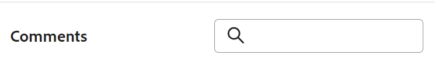

<!--update the metadata with real information when making this available in TOC and in the left nav-->

# 레코드 주석 관리

레코드의 댓글 영역에서 업데이트를 추가하고 질문하거나 답변을 요청하여 Adobe Maestro 레코드에서 협업할 수 있습니다.

## 레코드에 댓글을 달 때 고려 사항

* 레코드의 설명 섹션에서 Maestro의 작업 레코드 및 분류법에 대한 설명과 응답을 추가할 수 있습니다.

* 연결된 레코드에 추가된 댓글은 연결하려는 레코드에 표시되지 않습니다. 예를 들어 Campaign 레코드에 연결된 프로젝트에 댓글을 다는 경우 댓글은 연결하려는 캠페인 레코드가 아닌 Maestro의 프로젝트 레코드에만 표시됩니다.

* 다른 응용 프로그램의 연결된 개체에 추가된 댓글은 Maestro에서 표시되지 않습니다.
Maestro에서 연결된 오브젝트에 추가된 댓글은 다른 애플리케이션에 표시되지 않습니다.\
  예를 들어 Workfront의 프로젝트에 추가된 댓글은 Maestro의 캠페인에 연결된 동일한 프로젝트에 표시되지 않습니다.

* 사용자에 태그를 지정하여 업데이트에 주의를 기울일 수 있습니다. 태그가 지정된 사용자가 인앱 알림이나 업데이트에 대한 이메일을 받지 않습니다. Maestro 주석에서는 팀을 태그 지정할 수 없습니다.

  >[!TIP]
  >
  >* 업데이트 시 주석 소유자는 자동으로 태그되지 않습니다.
  >
  >* 회신할 때 업데이트에서 태그 지정된 사용자를 제거할 수 없습니다.

* 다음 Maestro 영역의 레코드에 업데이트를 추가할 수 있습니다.

   * 세부내용 페이지에서.

  <!--* From the table view.-->

## 액세스 요구 사항

이 문서의 단계를 수행하려면 다음 액세스 권한이 있어야 합니다.

<table style="table-layout:auto">
 <col>
 <tbody>
<td>
   
 Adobe 제품
 </td>
   <td>
   
 Adobe Workfront
 </td>
  </tr>  
 <td role="rowheader">
Adobe Workfront 계약
</td>
   <td>

Adobe Maestro Closed Beta 프로그램에 조직을 등록해야 합니다. 이 새 제품에 대해 문의하려면 계정 담당자에게 문의하십시오. 

   </td>
  </tr>
  <tr>
   <td role="rowheader">
Adobe Workfront 플랜
</td>
   <td>

임의

   </td>
  </tr>
  <tr>
   <td role="rowheader">
Adobe Workfront 라이선스
</td>
   <td>
   
임의
 
  </td>
  </tr>

<tr>
   <td role="rowheader">액세스 수준</td>
   <td> 
임의
  
</td>
  </tr>
<tr>
   <td role="rowheader">레이아웃 템플릿</td>
   <td> 
시스템 관리자가 레이아웃 템플릿에 마에스트로 영역을 추가해야 합니다. 자세한 내용은 <a href="../access/grant-access.md">Adobe 마에스트로에 대한 액세스 권한 부여</a>. 
  
</td>
  </tr>
 </tbody>
</table>

<!--
After permissions - replace the table with: **************CHECK ON THE VIEW PERMISSIONS TO THE WORKSPACE; RIGHT NOW, WE SAY THAT VIEW USERS CAN COMMENT BUT THE PAGE BLOWS OUT WHEN I TRY - ASKED PM TO CONFIRM*****************

<table style="table-layout:auto">
 <col>
 </col>
 <col>
 </col>
 <tbody>
    <tr>
<tr>
<td>
   
 Adobe product
 </td>
   <td>
   
 Adobe Workfront
 </td>
  </tr>  
 <td role="rowheader">
Adobe Workfront agreement
</td>
   <td>

Your organization must be enrolled in the Adobe Maestro closed beta program. Contact your account representative to inquire about this new offering. 

   </td>
  </tr>
  <tr>
   <td role="rowheader">
Adobe Workfront plan
</td>
   <td>

Any

   </td>
  </tr>
  <tr>
   <td role="rowheader">
Adobe Workfront license
</td>
   <td>
   
Any
 
  </td>
  </tr>
  
  <tr>
   <td role="rowheader">
Access level
</td>
   <td> 
Any
  
</td>
  </tr>
<tr>
   <td role="rowheader">
Layout template
</td>
   <td> 
Your Workfront or group administrator must add the Maestro area in your layout template. For information, see <a href="../access/grant-access.md">Grant access to Adobe Maestro</a>. 
  
</td>
  </tr>
<tr>
   <td role="rowheader">
Permissions
</td>
   <td> 
View or higher permissions to a workspace</a> 
  
   
System Administrators have permissions to all workspaces, including the ones they did not create

</td>
  </tr>
 </tbody>
</table>

-->

<!--Maybe enable this at GA - but Maestro is not supposed to have Access controls in the Workfront Access Level: 
>[!NOTE]
>
>If you don't have access, ask your Workfront administrator if they set additional restrictions in your access level. For information on how a Workfront administrator can change your access level, see [Create or modify custom access levels](../administration-and-setup/add-users/configure-and-grant-access/create-modify-access-levels.md). -->

<!-- Notes to add for the table: for the "Workfront plans" row: the above is only for closed beta; when going to GA - activate the following plans:    

Current plan: Prime and Ultimate

Legacy plan: Enterprise
-->

<!-- Notes for the table: for the "Workfront access" row: 
For more information, see <a href="../../administration-and-setup/add-users/access-levels-and-object-permissions/wf-licenses.md" class="MCXref xref">Adobe Workfront licenses overview</a>.
-->

### 레코드에 대한 댓글 관리

1. 다음을 클릭합니다. **[!UICONTROL 메인 메뉴]** 아이콘  Adobe Workfront의 오른쪽 위 모서리에서 또는 (사용 가능한 경우) **[!UICONTROL 메인 메뉴]** 아이콘  왼쪽 상단 모서리에서 을(를) 클릭하고 **[!UICONTROL 마에스트로]**.

   마지막으로 액세스한 작업 공간은 기본적으로 열립니다.
1. 다음에서 표 보기 선택 **보기** 드롭다운 메뉴.
1. 테이블 보기에서 레코드 이름을 클릭합니다.

   레코드는 **세부 사항** 페이지가 열립니다.

1. 에 주석 입력 시작 **새 댓글** 상자.

   

   >[!TIP]
   >
   >댓글을 입력하고 제출하기 전에 댓글 섹션에서 다른 곳으로 이동하면 로그오프한 후 다시 로그온한 후에도 페이지에서 댓글이 초안 모드로 유지됩니다. 주석에 추가된 모든 이미지도 초안에 저장됩니다. 초안은 7일 동안 저장되며 이후 삭제되며 복구할 수 없습니다. 초안 주석은 설명을 입력한 사용자만 볼 수 있습니다.

1. (선택 사항) 변경을 실행 취소하거나 재실행하려면 다음 단축키를 사용합니다.
   * 변경 내용을 취소하려면 CTRL+Z(Mac의 경우 ⌘+z)
   * CTRL+Y(Mac의 경우 ⌘+y) 를 눌러 변경 사항을 재실행합니다
1. (선택 사항) 추가 **@** 뒤에 업데이트의 사용자를 태깅할 사용자 이름이 옵니다.
1. (선택 사항) 리치 텍스트 도구 모음의 옵션을 사용하여 텍스트 서식을 지정하고, 업데이트에 이모지, 링크 또는 이미지를 추가하여 콘텐츠를 개선합니다. 자세한 내용은 이 문서의 &quot;Workfront 업데이트에서 리치 텍스트 사용&quot; 섹션을 참조하십시오 [작업 업데이트](../../workfront-basics/updating-work-items-and-viewing-updates/update-work.md).

   >[!TIP]
   >
   >다른 사용자가 업데이트하고 있는 동일한 항목에 주석을 제출하는 경우 새로운 주석을 알려주는 &quot;신규&quot; 표시기가 있는 빨간색 줄이 있습니다.
   >
   >표시기는 항목에 대한 댓글이 제출된 후에만 표시되며 댓글이 아직 작성된 경우에는 표시되지 않습니다.
   >
   >

1. 클릭 **제출** 를 클릭하여 레코드에 업데이트를 추가합니다.
1. (선택 사항) 주석을 편집하려면 **자세히** 메뉴  주석의 오른쪽 상단 모서리에서 을(를) 클릭한 다음 을(를) 클릭합니다 **편집**.

   >[!IMPORTANT]
   >
   >의견을 제출한 후 15분 이내에만 편집할 수 있습니다.

1. 주석의 정보를 편집하거나, 이미지를 추가 또는 제거하거나, 태그 지정된 사용자를 제거합니다. &quot;편집됨&quot; 표시기가 댓글 왼쪽에 추가됩니다.

   >[!TIP]
   >
   >현재 연도의 주석은 날짜 스탬프에 연도를 표시하지 않습니다. 타임스탬프를 마우스로 가리키면 연도를 포함한 전체 날짜가 표시됩니다.

1. (선택 사항 및 조건부) 기존 댓글을 검색하려면 의 오른쪽 위 모서리에 있는 검색 상자에 키워드를 입력하십시오. **댓글** 영역입니다.

   

1. (선택 사항) **답변** 또는에서 댓글을 입력해 보십시오. **회신 추가...** 영역을 클릭하여 기존 댓글에 응답한 다음 위의 4-8단계를 수행합니다. <!--(**************accurate??***********)-->

1. (조건부 및 선택 사항) 다른 사용자가 주석을 추가하는 동안 주석 섹션의 표시 영역 외부에 표시되는 주석을 추가한 경우 **보기** 의 내부 **새 댓글 배너** 이 설명을 표시하려면 이 단추를 클릭하십시오.

   

   추가 주석이 화면 하단에 표시됩니다.

1. (선택 사항) **좋아요** 아이콘을 클릭하여 업데이트를 좋아하거나 읽은 것을 확인합니다. 아이콘이 좋아요 수로 업데이트됩니다.
1. (조건부 및 선택 사항) 댓글에 다른 사람을 포함한 경우 업데이트에 포함된 사용자의 아바타를 클릭하여 댓글이 공유된 사용자 목록을 표시합니다.
1. (선택 사항) **자세히** 아이콘  주석의 오른쪽 상단 모서리에서 다음 옵션 중 하나를 클릭하여 주석의 정보를 복사합니다.

   * **링크 복사**: 댓글에 대한 링크를 클립보드에 복사합니다.
   * **본문 복사** t: 댓글의 텍스트를 클립보드로 복사합니다.
   * **견적 회신**: 댓글의 콘텐츠를 새 회신에 복사합니다. 이미지는 복사된 응답에 포함되지 않습니다.

   자세한 내용은 [작업 업데이트](../../workfront-basics/updating-work-items-and-viewing-updates/update-work.md).
1. (선택 사항) **자세히** 아이콘  주석의 오른쪽 상단 모서리에서 을(를) 클릭한 다음 을(를) 클릭합니다 **삭제** 주석을 삭제하려면 다음 작업을 수행하십시오.

