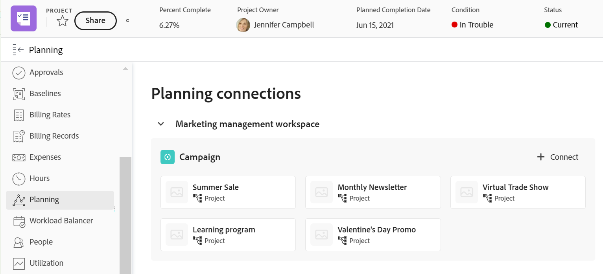

<!--update the metadata with real information when making this available in TOC and in the left nav-->

<!--add also Group and Company when they are available-->

<!-- opening the Details preview and page is not possible yet - hid those steps, but add them when released-->

# Adobe Workfront 오브젝트의 계획 섹션에서 레코드 관리

{{maestro-important-intro}}

왼쪽 패널의 Workfront 개체에 대한 계획 섹션에 Adobe Workfront 개체에 연결된 레코드를 표시할 수 있습니다.

계획 섹션은 다음 Workfront 객체에 사용할 수 있습니다.

* 프로젝트
* Portfolio
* 프로그램
<!--* Group
* Company-->

## 액세스 요구 사항

이 문서의 단계를 수행하려면 다음 액세스 권한이 있어야 합니다.

<table style="table-layout:auto">
 <col>
 </col>
 <col>
 </col>
 <tbody>
    <tr>
<tr>
<td>
   
 제품
 </td>
   <td>
   
 Adobe Workfront
 </td>
  </tr>  
 <td role="rowheader">
Adobe Workfront 계약
</td>
   <td>

조직은 Adobe Workfront Planning Beta 프로그램에 등록해야 합니다. 이 새 제품에 대해 문의하려면 계정 담당자에게 문의하십시오. 

   </td>
  </tr>
  <tr>
   <td role="rowheader">
Adobe Workfront 플랜
</td>
   <td>

임의

   </td>
  </tr>
  <tr>
   <td role="rowheader">
Adobe Workfront 라이센스*
</td>
   <td>
   
새로운 기능: 표준

   또는
   
현재: 플랜
 
  </td>
  </tr>

<tr>
   <td role="rowheader">
액세스 수준 구성
</td>
   <td> 
프로젝트, 프로그램 및 Portfolio에 대한 보기 또는 상위 액세스 권한
  
</td>
  </tr>
<tr>
   <td role="rowheader">
권한
</td>
   <td> 
Workfront에서 프로젝트, 포트폴리오 또는 프로그램에 대한 보기 이상의 권한</a> 
 
   
Workfront Planning에서 작업 공간에 대한 보기 이상의 권한</a> 
  
   
시스템 관리자는 만들지 않은 작업 영역을 포함하여 모든 Workfront Planning 작업 영역에 대한 권한을 가집니다

</td>
  </tr>
<tr>
   <td role="rowheader">
레이아웃 템플릿
</td>
   <td> 
Workfront 또는 그룹 관리자는 기본 메뉴의 계획 영역을 추가하고 왼쪽 패널의 계획 섹션을 레이아웃 템플릿에 추가해야 합니다. 자세한 내용은 <a href="../access/access-overview.md">액세스 개요</a>. 
  
</td>
  </tr>

</tbody>
</table>

*자세한 내용은 [Workfront 설명서의 액세스 요구 사항](/help/quicksilver/administration-and-setup/add-users/access-levels-and-object-permissions/access-level-requirements-in-documentation.md).

## Workfront 객체의 계획 섹션에 대한 고려 사항

* 먼저 Workfront에서 보려면 레코드 유형을 Workfront 개체 유형에 연결하고 레코드를 Workfront 개체에 연결해야 합니다.

  자세한 내용은 다음 문서를 참조하십시오.

   * [레코드 유형 연결](/help/quicksilver/maestro/architecture/connect-record-types.md)
   * [기록 연결](/help/quicksilver/maestro/records/connect-records.md)
* Workfront 객체와 연관된 레코드가 없는 경우에도 Workfront 객체에서 계획 섹션을 볼 수 있습니다.
* Workfront 객체에 연결된 레코드가 하나 이상 있는 경우 계획 섹션에서 Workfront의 Workfront 객체와 Planning 레코드를 연결할 수 있습니다.
* Workfront 개체의 레코드를 연결하려면 작업 영역에 대한 기여 이상의 권한이 있어야 합니다.

## 계획 섹션의 레코드 관리

{{step1-to-maestro}}

마지막으로 액세스한 작업 공간은 기본적으로 열립니다.

1. Workfront 프로젝트, 포트폴리오 또는 프로그램에 연결된 레코드 유형의 카드를 클릭합니다.
1. 다음에서 표 보기 선택 **보기** 드롭다운 메뉴.
1. (조건부) 테이블에서 연결된 레코드 필드로 이동하여 Workfront 개체를 추가한 다음 필드에서 Workfront 개체의 이름을 클릭합니다. 자세한 내용은 [레코드 연결](/help/quicksilver/maestro/records/connect-records.md).
개체의 페이지가 Workfront Planning에서 열립니다.
1. 클릭 **소스로 이동**&#x200B;을 클릭합니다.

   개체의 페이지가 Workfront에서 열립니다.
1. 클릭 **계획 수립** 왼쪽 패널에서

   >[!NOTE]
   >
   >   Workfront 또는 그룹 관리자는 Workfront 프로젝트, 포트폴리오 또는 프로그램에 대해 표시되기 전에 레이아웃 템플릿에 계획 섹션을 추가해야 합니다.

   계획 섹션에는 다음 정보가 표시됩니다.

   * 연결된 레코드는 다음 정보가 포함된 개별 카드에 표시됩니다.
      * 레코드 이름
      * 레코드 썸네일
      * Workfront Planning에 표시되는 연결된 레코드 필드의 이름.
   * 레코드는 해당 작업 영역에 표시됩니다.

   

1. 레코드에 대한 자세한 내용을 표시하려면 레코드 카드를 클릭합니다. 레코드 미리 보기 상자가 표시됩니다.
1. (선택 사항) 레코드의 미리 보기 상자에서 필드 수정을 시작합니다. 변경 사항은 자동으로 저장됩니다.
1. (선택 사항) **새 탭에서 열기** 아이콘  미리 보기 상자의 오른쪽 상단 모서리에서 레코드의 세부 사항 페이지를 엽니다.
1. 레코드 카드 위로 마우스를 가져간 다음 레코드 연결 끊기 아이콘을 클릭합니다 **-**&#x200B;을 클릭한 다음 을 클릭합니다 **연결 해제**.
다음과 같은 상황이 발생합니다.
   * 레코드가 더 이상 Workfront 개체에 연결되어 있지 않습니다.
   * Workfront 개체는 Workfront Planning에서 레코드의 연결된 필드에서도 제거됩니다.
   * 계획 레코드에 연결된 Workfront 조회 필드의 값도 삭제됩니다.
1. 클릭 **연결** 더 많은 레코드를 연결합니다.

   >[!NOTE]
   >
   >   연결 단추는 Contribute 권한이 있는 작업 영역에 대해서만 표시됩니다.

1. 연결할 레코드를 클릭합니다. 다음과 같은 상황이 발생합니다.

   * 레코드는 즉시 Workfront 개체에 연결되고 계획 섹션에 표시됩니다.
   * Workfront 개체가 Workfront Planning 레코드의 연결된 필드에 추가됩니다.
   * 계획 레코드에 연결된 Workfront 조회 필드의 값은 Workfront Planning에서 채워집니다.

<!--add more steps here for what happens after clicking Connect-->

