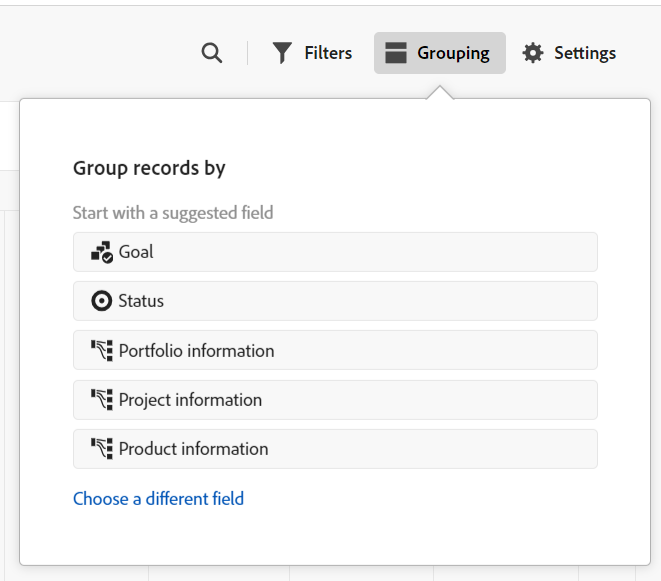

# 타임라인 보기 관리

<!--
title: Manage the timeline view in Adobe Maestro
description: You can display records in a timeline view, when accessing the record type page in Adobe Maestro. 
hidefromtoc: yes
hide: yes
author: Alina
feature: Work Management
role: User
-->

<!--update the metadata with real information when making this available in TOC and in the left nav-->

>[!IMPORTANT]
>
>현재 Adobe 마에스트로는 제한된 수의 고객에게 제공되는 베타 프로그램의 일부입니다.
>
>Maestro용 Beta 프로그램 가입에 대한 자세한 내용은 계정 담당자에게 문의하십시오.
>
>자세한 내용은 [Adobe 마에스트로 개요](../maestro-overview.md).

Adobe Maestro의 레코드 유형 페이지에 액세스할 때 타임라인 보기에서 레코드를 표시할 수 있습니다.

Maestro 보기에 대한 자세한 내용은 [Adobe Maestro에서 레코드 보기 관리](../views/manage-record-views.md).

## 액세스 요구 사항

이 문서의 단계를 수행하려면 다음 액세스 권한이 있어야 합니다.

<table style="table-layout:auto">
 <col>
 <tbody>
<td>
   
 Adobe 제품
 </td>
   <td>
   
 Adobe Workfront
 </td>
  </tr>  
 <td role="rowheader">
Adobe Workfront 계약
</td>
   <td>

Adobe Maestro Closed Beta 프로그램에 조직을 등록해야 합니다. 이 새 제품에 대해 문의하려면 계정 담당자에게 문의하십시오. 

   </td>
  </tr>
  <tr>
   <td role="rowheader">
Adobe Workfront 플랜
</td>
   <td>

모든

   </td>
  </tr>
  <tr>
   <td role="rowheader">
Adobe Workfront 라이선스
</td>
   <td>
   
모든
 
  </td>
  </tr>

<tr>
   <td role="rowheader">액세스 수준</td>
   <td> 
모든
  
</td>
  </tr>
<tr>
   <td role="rowheader">레이아웃 템플릿</td>
   <td> 
시스템 관리자가 레이아웃 템플릿에 마에스트로 영역을 추가해야 합니다. 자세한 내용은 <a href="../access/grant-access.md">Adobe 마에스트로에 대한 액세스 권한 부여</a>. 
  
</td>
  </tr>
 </tbody>
</table>

<!--Maybe enable this at GA - but Maestro is not supposed to have Access controls in the Workfront Access Level: 
>[!NOTE]
>
>If you don't have access, ask your Workfront administrator if they set additional restrictions in your access level. For information on how a Workfront administrator can change your access level, see [Create or modify custom access levels](../administration-and-setup/add-users/configure-and-grant-access/create-modify-access-levels.md). -->

<!-- Notes to add for the table: for the "Workfront plans" row: the above is only for closed beta; when going to GA - activate the following plans:    

Current plan: Prime and Ultimate

Legacy plan: Enterprise
-->

<!-- Notes for the table: for the "Workfront access" row: 
For more information, see <a href="../../administration-and-setup/add-users/access-levels-and-object-permissions/wf-licenses.md" class="MCXref xref">Adobe Workfront licenses overview</a>.
-->

## 타임라인 보기 관리 {#manage-a-timeline-view}

<!--insert screen shot of timeline view-->

타임라인 보기를 만들 때 선택한 레코드 유형의 모든 레코드가 시간 순서대로 표시됩니다.

다음 사항을 고려하십시오.

* 레코드 유형과 연결된 날짜 필드가 두 개 이상 있는 경우에만 타임라인 보기를 만들 수 있습니다. 레코드 유형과 연관된 날짜 필드가 하나 또는 하나도 없으면 타임라인 보기 옵션이 흐리게 표시됩니다.
* 레코드와 연결된 날짜에 따라 다음 시나리오에서 일부 레코드가 타임라인 보기에 표시되지 않을 수 있습니다.

   * 시작 및 종료 날짜에 값이 없는 경우
   * 시작 또는 종료 날짜에 값이 없는 경우
   * 시작 일자가 종료 일자 이후인 경우

<!--these are NOT available now because there won't be a table for the timeline view for the near future, per Andy: 
* The records displayed in the timeline view also display in a view-only table to the left of the timeline. 
* Each row in the table and each bar on the timeline represent the same record. 
* Each column in the table is a record field. The columns of this table are preconfigured and cannot be customized. 
* Only a limited number of fields (or columns) display in the timeline view table. 
* You cannot do the following in a timeline view:
     * Add rows or records
     * Add columns or fields
     * Edit record information
-->

타임라인 보기를 만들 때는 기본적으로 선택한 레코드 유형의 모든 레코드가 타임라인에 막대로 표시됩니다.

타임라인 보기를 관리하려면 다음을 수행합니다.

1. 타임라인을 보려는 레코드 유형 페이지로 이동합니다.
1. 문서에 설명된 대로 타임라인 보기를 만듭니다. [레코드 보기 관리](../views/manage-record-views.md).

   

   선택한 레코드 유형과 연관된 레코드는 시간별 타임라인에 막대로 표시됩니다.

1. 다음 중 하나를 수행하여 타임라인을 탐색합니다.

   * 왼쪽 및 오른쪽 아이콘을 클릭하거나 가로 스크롤을 사용하여 타임라인에서 앞뒤로 이동합니다.
   * 클릭 **오늘** 오늘 날짜로 타임라인을 가운데로 정렬합니다.
   * 시간 증가를 업데이트하려면 시간대 드롭다운 메뉴에서 다음 옵션 중 하나를 선택합니다.

      * 년
      * 분기
      * 월
1. 클릭 **표준으로 전환** 레코드를 별도의 줄에 표시하는 보기 <!--check to see if they updated the name of the setting here-->

   또는

   클릭 **작게 보기로 전환** 날짜가 같은 줄에 교차하지 않는 레코드를 표시합니다. <!--check to see if they updated the name of the setting here-->

   레코드는 기본적으로 작게 보기에 표시됩니다.

1. 아래 하위 섹션에 설명된 대로 다음 보기 요소를 업데이트합니다.
   * [필터](#add-filters)
   * [그룹화](#add-grouping)
     <!--* [Sort](#add-sort) not sure if this is present in timeline views?!; also check the anchor and make sure it's correct-->
   * [설정](#edit-the-timeline-view-settings)

### 필터 추가

필터는 화면에 표시되는 정보의 양을 줄이는 데 도움이 됩니다.

타임라인 보기에서 필터를 사용하여 작업할 때는 다음 사항을 고려하십시오.

<!-- this list is almost identical to the one for the table view - update both-->

* 타임라인 보기에 대해 만든 필터는 동일한 레코드 유형에 적용할 때 테이블 보기의 필터와는 독립적으로 작동합니다.

* 필터는 사용자가 선택한 보기에 고유합니다. 동일한 레코드 종류의 두 타임라인 보기에는 서로 다른 필터가 적용될 수 있습니다. 동일한 타임라인 보기를 보는 두 명의 사용자에게 현재 적용된 동일한 필터가 표시됩니다.

* 타임라인 보기에 빌드하고 적용하는 필터의 이름을 지정할 수 없습니다.

* 필터를 제거하면 사용자와 동일한 레코드 종류에 액세스하고 사용하는 것과 동일한 보기를 사용하는 모든 사용자에서 필터가 제거됩니다.

타임라인 보기에서 필터를 추가하는 것은 테이블 보기에서 필터를 추가하는 것과 동일합니다.

자세한 내용은 문서의 &quot;필터 추가&quot; 섹션을 참조하십시오 [표 보기 관리](../views/manage-the-table-view.md).

### 그룹화 추가

<!-- if groupings are identical between the table and the timeline, consider replacing this section with this: 

Adding groupings in the timeline view is identical to adding filters in the table view. 

For more information, see the "Add filters" section in the article [Manage the table view](../views/manage-the-table-view.md). -->

보기에 그룹화를 적용할 때 유사한 정보별로 레코드를 그룹화할 수 있습니다.

타임라인 보기에서 그룹화를 사용하여 작업할 때 다음 사항을 고려하십시오.

* 표 및 타임라인 보기에서 그룹화를 적용할 수 있습니다. 테이블 보기의 그룹화는 동일한 레코드 유형의 타임라인 보기의 그룹화와는 독립적입니다.
* Maestro 보기에서 3가지 수준의 그룹화를 적용할 수 있습니다. 선택한 그룹화 순서대로 레코드가 그룹화됩니다.
* API 사용 시 최대 4가지 수준의 그룹화를 적용할 수 있습니다.

그룹화를 추가하려면:

1. 문서에 설명된 대로 타임라인 보기를 만듭니다. [레코드 보기 관리](../views/manage-record-views.md).
1. 클릭 **그룹화**.

   

1. 제안된 필드 중 하나를 클릭하거나 **다른 필드 선택** 다른 필드를 검색하여 목록에 표시되면 클릭합니다.

   >[!TIP]
   >
   >연결된 필드는 선택할 수 없습니다.

   그룹화는 타임라인에 자동으로 적용되며 그룹화 상자 내에 레코드가 표시됩니다. 그룹화의 항목 수가 그룹화 행에 표시됩니다.

   <!-- add a step that you can rearrange the groupings here, when this will be possible-->

1. (선택 사항) 위의 단계를 반복하여 최대 3개의 그룹화를 추가합니다.

   적용된 그룹화 수는 도구 모음의 오른쪽 상단 모서리에 있는 그룹화 아이콘 왼쪽에 표시됩니다.

   

1. (선택 사항) **x** 그룹화 오른쪽에 있는 아이콘을 클릭하여 그룹화 제거

   또는

   클릭 **모두 지우기** 모든 그룹화를 제거합니다.

1. 바깥쪽을 클릭합니다. **레코드 그룹화 기준** 상자를 닫으십시오.

<!-- 

### Add sort

this is not possible right now; if this is the same functionality as the table view, document it there and link from here. 

-->

### 타임라인 보기 설정 편집 {#edit-the-timeline-view-settings}

타임라인 보기 설정을 업데이트하여 보기의 타임라인 섹션에 표시되는 정보를 나타냅니다.

1. 문서에 설명된 대로 타임라인 보기를 만듭니다. [레코드 보기 관리](../views/manage-record-views.md).
1. 클릭 **설정**.
1. 클릭 **날짜 및 시간** 왼쪽 패널에서 를 선택합니다. **시작일** 및 **종료일** 타임라인에 표시할 수 있습니다. 기본 시작 및 종료 날짜를 선택하거나 사용 가능한 날짜 필드를 선택할 수 있습니다. 레코드를 나타내는 막대는 시작 날짜에 해당하는 날짜에 시작하여 종료 날짜에 해당하는 날짜에 끝납니다.

   >[!NOTE]
   >
   >    시작 또는 종료 날짜에 대한 값이 없거나 시작 날짜가 종료 날짜보다 늦은 레코드는 타임라인 보기에 표시되지 않습니다.

1. 클릭 **레코드 세부 정보** 레코드 상자에 표시할 필드를 나타냅니다.

   기본적으로 이름 필드가 선택되어 있습니다.

1. 클릭 **필드 추가** 레코드 모음에 최대 4개의 필드를 추가할 수 있습니다.
1. 내부를 클릭합니다. **필드 검색** 상자를 클릭하고 추가할 필드를 클릭합니다.

   >[!TIP]
   >
   >   * 필드를 레코드 표시줄에 추가하려면 먼저 필드를 만들어야 합니다.
   > 
   >   * 하나 이상의 필드를 선택해야 합니다. **이름** 기본적으로 가 선택되어 있습니다.

   타임라인에서 막대가 어떻게 보이는지에 대한 미리보기가 오른쪽에 표시됩니다.

   

1. **저장**&#x200B;을 클릭합니다.

   선택한 사양과 함께 레코드가 타임라인 보기에 표시됩니다.

