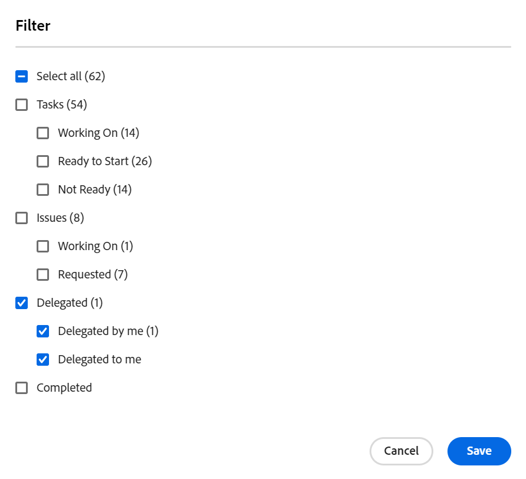

# 작업 및 문제 위임

<!-- Audited: 10/2024 -->

<!--
<NOTE: 
<you might need to change the tile to Delegate PTI, etc, when that functionality is added. Named it this so it will not conflict with the TOC article for Delegate section which was also "Delegate work"
I wrote this as a "Manage..." article and I did not add three separate articles, to match what we have for delegating approval requests)
-->

부재 중 할당된 작업을 임시로 위임할 수 있습니다.

작업 및 문제 할당을 위임하거나 승인을 위임할 수 있습니다. 이 문서에서는 작업 및 문제 할당을 위임하는 방법에 대해 설명합니다.

작업 위임에 대한 일반적인 정보는 [작업 위임 개요](../../manage-work/delegate-work/delegate-work-overview.md)를 참조하십시오.

## 액세스 요구 사항

+++ 이 문서의 기능에 대한 액세스 요구 사항을 보려면 확장하십시오.

>[!IMPORTANT]
>
>* 위임자로 선택한 사용자는 위임한 작업 및 문제에 대한 권한과 동일한 권한을 받습니다.
>* 권한은 자신의 액세스 수준 내에서 작동해야 하며 경우에 따라 액세스 수준이 본인의 액세스 수준보다 낮을 수 있습니다.
>
>   
>   예를 들어, 사용자가 자신의 액세스 수준에 있는 작업에 대한 보기 액세스만 가지고 있고 위임된 작업에 대한 관리 권한이 있는 경우, 위임한 작업에 대한 관리 권한을 받게 됩니다. 그러나 위임된 작업에 대해 사용자와 동일한 작업을 수행할 수 없습니다. 부재 중 작업을 업데이트하려면 시스템 관리자에게 작업에 대한 편집 액세스 권한을 요청해야 합니다.
>
>   
>   시스템 관리자가 액세스 수준을 수정하는 방법에 대한 자세한 내용은 [사용자 지정 액세스 수준 만들기 또는 수정](../../administration-and-setup/add-users/configure-and-grant-access/create-modify-access-levels.md)을 참조하십시오.
>
>* 위임이 이미 시작된 후 할당된 항목의 경우 [!DNL Workfront]에 대해 항목이 할당된 후 최대 1시간이 지난 후에 새로 할당된 항목을 피위임자와 공유할 수 있습니다.

이 문서의 단계를 수행하려면 다음 액세스 권한이 있어야 합니다.

<table style="table-layout:auto"> 
 <col> 
 <col> 
 <tbody> 
  <tr> 
   <td role="rowheader">Adobe Workfront 패키지</td> 
   <td> 
임의
 </td> 
  </tr> 
  <tr> 
   <td role="rowheader">Adobe Workfront 라이선스</td> 
   <td> 
기여자 이상

검토 이상

>[!NOTE]
>
>요청 라이선스가 있을 때 작업을 할당할 수 있지만 작업을 다른 사람에게 위임할 수는 없습니다. [!DNL Workfront]은(는) 검토, 요청 또는 기여자 사용자에게 작업을 할당하지 않는 것이 좋습니다.

</tr> 
  <tr> 
   <td role="rowheader">액세스 수준 구성</td> 
   <td> 
작업 및 문제에 대한 액세스 편집 
     
 </td> 
  </tr> 
  <tr> 
   <td role="rowheader">개체 권한</td> 
   <td> 
할당된 작업 또는 문제에 대한 이상의 권한 보기
 
    </td> 
  </tr> 
 </tbody> 
</table>

자세한 내용은 [Workfront 설명서의 액세스 요구 사항](/help/quicksilver/administration-and-setup/add-users/access-levels-and-object-permissions/access-level-requirements-in-documentation.md)을 참조하십시오.

+++

<!--note from the table for Object permissions:
     
Contribute or higher permissions to the projects where you are designated as the Project Owner (NOTE: you cannot delegate projects yet)

    -->

## 전제 조건

이 문서에 설명된 활동을 수행하기 전에 다음을 확인해야 합니다.

* [!DNL Workfront] 또는 그룹 관리자가 [!UICONTROL **인스턴스의**]&#x200B;설정[!UICONTROL &#x200B; 영역에 있는 &#x200B;]작업 및 문제 환경 설정[!UICONTROL &#x200B; 섹션에서 &#x200B;]사용자가 작업 및 문제를 위임하도록 허용[!DNL Workfront] 설정을 사용하도록 설정했습니다.

  자세한 내용은 [시스템 전체 작업 및 문제 환경 설정 구성](../../administration-and-setup/set-up-workfront/configure-system-defaults/set-task-issue-preferences.md)을 참조하십시오.

## 다른 사용자에게 작업 및 문제 위임

다른 사용자에게 작업을 위임하기 전에 해당 사용자에게 연락하여 작업 항목에 대한 위임자로 지정될 것임을 알리는 것이 좋습니다. 업무를 위임하기 전에 구두로 승낙을 구하여 부재중인 동안 업무를 완료하는 데 필요한 시간을 갖도록 하십시오.

작업 및 문제 위임에 대한 일반적인 정보는 [작업 및 문제 위임 개요](/help/quicksilver/manage-work/delegate-work/delegate-work-overview.md)를 참조하십시오.

작업 및 문제를 다른 사람에게 위임하려면 다음 작업을 수행하십시오.

1. [!UICONTROL **Home**] 영역으로 이동합니다.
1. [!UICONTROL **홈**]&#x200B;에 [!UICONTROL **내 작업**], [!UICONTROL **내 작업**] 또는 [!UICONTROL **내 문제**] 위젯이 추가되었는지 확인하세요.

   자세한 내용은 [홈에서 위젯 추가, 편집 또는 제거](/help/quicksilver/workfront-basics/using-home/using-the-home-area/add-edit-remove-widgets-in-new-home.md)를 참조하세요.

1. [!UICONTROL **내 작업**], [!UICONTROL **내 작업**] 또는 [!UICONTROL **내 문제**] 위젯의 왼쪽 상단 모서리에서 [!UICONTROL **위임**]&#x200B;을 클릭합니다.

   

1. 다음 내용을 업데이트합니다.

   * [!UICONTROL **작업 및 문제를 위임할 대상**]: 작업 및 문제를 위임할 사용자 이름을 입력한 다음 목록에 표시될 때 선택합니다. 한 명의 사용자만 선택할 수 있습니다.

     위임자로 선택한 사용자는 위임한 작업 및 문제에 대한 권한과 동일한 권한을 받습니다.

   * [!UICONTROL **시작 날짜**]: 작업 항목 위임을 시작해야 하는 날짜를 달력에서 선택합니다.

     >[!TIP]
     >
     >시작 날짜는 과거일 수 없습니다.

   * [!UICONTROL **종료일 없음**]: 위임에 대한 종료일을 지정하지 않으려면 이 옵션을 선택하십시오.

   * [!UICONTROL **종료 날짜**]: 위임이 중지되어야 하는 날짜를 달력에서 선택합니다.

     >[!TIP]
     >
     >종료 날짜 필드를 비워 두고 종료 날짜 없음 옵션을 선택하지 않으면 위임은 현재 날짜에만 설정됩니다.

     
     <!--check screen shot - submitted bug for casing-->

1. [!UICONTROL **저장**]&#x200B;을 클릭합니다.

   다음과 같은 상황이 발생합니다.

   * 작업이 지정된 사용자에게 위임됩니다. 선택한 시간대 내에 날짜가 있는(위임을 활성화한 후 새로 할당된 작업 포함) 모든 미완료 작업 또는 문제가 위임됩니다.

     >[!TIP]
     >
     >   위임 시간대 내에 날짜가 있는 완료된 작업 항목은 위임되지 않습니다.

   * 다른 사용자에게 작업 위임을 활성화했음을 확인하는 메시지가 화면 하단에 나타납니다. 위임 사용자의 이름이 확인 메시지에 표시됩니다.

   * 작업 및 문제가 다른 사용자에게 위임되었다는 표시는 [!DNL Workfront]에서 할당을 볼 수 있는 대부분의 영역에 표시됩니다. 대리자 이름이 포함되지 않은 영역에 대한 자세한 내용은 [위임 작업 개요](delegate-work-overview.md)를 참조하십시오.

   * 위임이 있음을 나타내기 위해 [!UICONTROL **Home**] 영역의 [!UICONTROL **Delegate**] 단추가 [!UICONTROL **위임 편집**] (으)로 변경됩니다.
     <!--
      <MadCap:conditionalText data-mc-conditions="QuicksilverOrClassic.Draft mode">
      (NOTE: is this shot correct? See UI - this is a mock)
      </MadCap:conditionalText>
      -->

     

   * 이벤트 알림 및 개인 알림이 활성화된 경우 위임에 대한 이메일 확인도 받습니다.

   * 대리인으로 선택한 사용자는 이벤트 알림이 활성화된 경우 위임에 대한 이메일을 받게 됩니다.

     개인 전자 메일 알림을 사용하는 방법에 대한 자세한 내용은 [전자 메일 알림 수정](../../workfront-basics/using-notifications/activate-or-deactivate-your-own-event-notifications.md)을 참조하세요.

## 위임 편집 또는 중지

종료 날짜를 선택하거나 수동으로 위임을 중지할 수 있습니다. 위임 날짜가 변경된 경우 위임 시간대를 수정할 수도 있습니다.

1. [!UICONTROL **홈**] 영역으로 이동한 다음 [!UICONTROL **내 작업**], **내 작업** 또는 **내 문제** 위젯에서 **위임 편집**&#x200B;을 클릭합니다.
1. [!UICONTROL 작업 및 문제 위임 중지] 상자에서 다음 중 하나를 수행합니다.
   * [!UICONTROL **시작 날짜**] 또는 [!UICONTROL **종료 날짜**]&#x200B;를 수정하세요.
   * [!UICONTROL **위임 중지**] 클릭

   >[!TIP]
   >
   >    위임이 이미 시작된 경우 위임 종료 날짜만 편집할 수 있습니다.

   

1. (조건부) 새 위임 날짜를 저장하려면 [!UICONTROL **저장**]&#x200B;을 클릭합니다

   또는

   확인 상자에서 [!UICONTROL **위임 중지**]&#x200B;를 클릭하여 위임 중지를 확인합니다.

   위임이 날짜를 업데이트하거나 중단했으며 위임된 사용자가 작업 및 문제에서 제거되었습니다. 작업 및 문제에 대한 해당 사용자의 권한은 그대로 유지됩니다.

## 위임된 작업 및 위임 정보 찾기

<!--(if this was released, make sure that viewing delegated approvals has not changed, as documented here: /Content/Review and approve work/Manage Approvals/delegate-approval-requests.html) 
-->

작업 및 문제가 위임되면 [!DNL Workfront]에서 위임된 작업 또는 위임자를 확인할 수 있는 몇 가지 영역이 있습니다.

* [지정 상자에서 위임자 찾기](#locate-delegates-in-the-assignments-box)
* [[!UICONTROL Home]에서 위임된 작업 찾기](#locate-delegated-work-in-home)

### [!UICONTROL 할당] 상자에서 대리자 찾기

시스템 또는 그룹 관리자가 시스템에서 작업 위임을 사용하도록 설정하면 [!UICONTROL 할당] 상자에 액세스할 수 있는 모든 위치에 다음 탭이 표시됩니다.

* [!UICONTROL **할당**]: 작업 또는 문제에 할당된 사용자가 여기에 표시됩니다.
* [!UICONTROL **위임**]: 작업 또는 문제에 대한 피할당자가 위임자로 지정한 사용자가 여기에 표시됩니다.

다음 영역의 [!UICONTROL 할당] 상자에 액세스할 수 있습니다.

* 작업 또는 문제 헤더

  작업 또는 문제 헤더의 [!UICONTROL 할당] 필드가 [!UICONTROL 할당 및 위임]&#x200B;(으)로 변경됩니다.

  

* 작업 또는 문제를 수동으로 할당할 때 [!UICONTROL 업무 균형자]

  

>[!NOTE]
>
> 작업 또는 문제 편집 상자의 [!UICONTROL 할당] 섹션에서 위임자를 볼 수 없습니다.

작업 또는 문제가 위임되고 [!UICONTROL 위임] 하위 탭이 비어 있는 경우 다음 시나리오 중 하나가 있을 수 있습니다.

* 작업 또는 문제에 할당되지 않았습니다.
* 작업 또는 문제 날짜가 위임 기간을 벗어났습니다.

>[!TIP]
>
>위임된 작업 및 문제에 대한 계획된 또는 실제 시간은 위임된 사용자의 [!UICONTROL 업무 균형자] 또는 [!DNL Resource Planner]과(와) 같은 리소스 관리 도구에서 고려되지 않습니다. 시간은 할당된 사용자와만 연결된 상태로 유지됩니다.

### [!UICONTROL Home]에서 위임된 작업 찾기

1. [!UICONTROL **내 작업**] 위젯의 [!UICONTROL **홈**] 영역으로 이동합니다.
1. 필터 드롭다운 메뉴를 클릭하고 다음 옵션 중 하나 이상을 선택합니다.
   * [!UICONTROL **위임됨**]: 귀하 또는 귀하가 위임한 작업 및 문제를 봅니다.
   * [!UICONTROL **내게 위임됨**]: 다른 사용자가 내게 위임한 작업 및 문제를 봅니다.
   * [!UICONTROL **내가 위임함**]: 사용자가 다른 사용자에게 위임한 작업 및 문제를 봅니다.

     

1. (선택 사항) 다음 기준으로 목록을 정렬하려면 [!UICONTROL **정렬**] 드롭다운 메뉴를 클릭합니다.
   * [!UICONTROL 기한]. 기본 정렬 옵션입니다.
   * [!UICONTROL 이름]
   * [!UICONTROL 완료율]
   * [!UICONTROL 상태]
1. (선택 사항) [!UICONTROL **내 작업**] 위젯의 오른쪽 상단에서 그룹화 드롭다운 메뉴를 확장하고 다음 기준 중 하나로 그룹화합니다.
   * 아무것도 아냐 기본 그룹화 옵션입니다.
   * [!UICONTROL 프로젝트]
   * [!UICONTROL 상태]
   * [!UICONTROL 기한]

1. 귀하가 위임했거나 귀하에게 위임된 항목을 보려면 다음 중 하나를 봅니다.

   * 다른 사람에게 위임한 항목의 경우 [!UICONTROL **위임자**] 이후 작업 또는 문제의 상태에서 위임자 이름을 찾으십시오.

   * 내게 위임된 항목의 경우 [!UICONTROL **내게 위임한 사람**] 이후 작업 또는 문제의 상태에서 피할당자의 이름을 찾으십시오.

     >[!TIP]
     >
     >    위임이 오늘 이후의 날짜에 시작되도록 설정된 경우 [!UICONTROL 작업 목록]에도 위임 시작 날짜가 표시됩니다. 위임된 항목은 그룹화 유형에 따라 [!UICONTROL 작업 목록]에 대해 선택한 그룹화에 표시됩니다. 예를 들어 [!UICONTROL 계획된 완료 일자]별로 그룹화하는 경우 위임된 항목은 계획된 완료 일자와 일치하는 그룹화에 표시됩니다.
