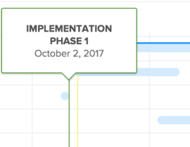

# 에 정보가 표시되는 방식을 구성합니다 [!UICONTROL 간트 차트]

작업 목록 모두에 표시되는 정보를 구성할 수 있습니다 [!UICONTROL 간트 차트] 및 프로젝트 목록 [!UICONTROL 간트 차트].

## 액세스 요구 사항

이 문서의 절차를 수행하려면 다음 사항이 있어야 합니다.

<table style="table-layout:auto"> 
 <col> 
 <col> 
 <tbody> 
  <tr> 
   <td role="rowheader">[!DNL Adobe Workfront] 플랜*</td> 
   <td> 
모든 
 </td> 
  </tr> 
  <tr> 
   <td role="rowheader">[!DNL Adobe Workfront] 라이센스*</td> 
   <td> 
[!UICONTROL Review] 이상
 </td> 
  </tr> 
  <tr> 
   <td role="rowheader">액세스 수준 구성*</td> 
   <td> 
프로젝트 및 작업에 대한 [!UICONTROL 보기] 이상 액세스
 
참고: 여전히 액세스할 수 없는 경우 [!DNL Workfront] 관리자가 액세스 수준에서 추가 제한을 설정한 경우 자세한 내용은 [!DNL Workfront] 관리자는 액세스 수준을 수정할 수 있습니다. <a href="../../../administration-and-setup/add-users/configure-and-grant-access/create-modify-access-levels.md" class="MCXref xref">사용자 정의 액세스 수준 만들기 또는 수정</a>.
 </td> 
  </tr> 
  <tr> 
   <td role="rowheader">개체 권한</td> 
   <td> 
프로젝트에 대한 [!UICONTROL 보기] 이상 액세스
 
추가 액세스 요청에 대한 자세한 내용은 <a href="../../../workfront-basics/grant-and-request-access-to-objects/request-access.md" class="MCXref xref">개체에 대한 액세스 요청 </a>.
 </td> 
  </tr> 
 </tbody> 
</table>

&#42;어떤 계획, 라이센스 유형 또는 액세스 권한을 보유하고 있는지 확인하려면 [!DNL Workfront] 관리자

## 표시 옵션 이해

다음 표에서는 [!UICONTROL 간트 차트]:

<table style="table-layout:auto"> 
 <col> 
 <col> 
 <col> 
 <tbody> 
  <tr> 
   <td role="rowheader">[!UICONTROL 실제 날짜]</td> 
   <td>  </td> 
   <td> 
[!UICONTROL 실제 시작 날짜] 및 [!UICONTROL 실제 완료 날짜]가 삼각형 아이콘과 함께 표시됩니다. [!UICONTROL 실제 완료 날짜]가 null이면 [!UICONTROL 실제 시작 날짜]만 표시됩니다.
 
시작 및 완료 날짜에 대한 자세한 내용은 <a href="../../../manage-work/projects/planning-a-project/project-actual-completion-date.md" class="MCXref xref">프로젝트 개요 [!UICONTROL 실제 완료 날짜] </a> 및 <a href="../../../manage-work/projects/planning-a-project/project-actual-start-date.md" class="MCXref xref">프로젝트 개요 [!UICONTROL 실제 시작 날짜] </a>.
 </td> 
  </tr> 
  <tr> 
   <td role="rowheader">[!UICONTROL Assignments]</td> 
   <td>  </td> 
   <td> 
작업 지정자를 표시합니다. 마우스 <strong>[!UICONTROL Details]</strong> 할당자 이름 옆에 링크를 눌러 해당 할당에 대한 세부 정보를 볼 수 있습니다. 여기에는 작업에 대한 할당율 등이 포함됩니다.
 
[!UICONTROL Gantt 차트]를 PDF으로 내보낼 때 할당자가 [!UICONTROL Gantt 차트]에 표시되지 않습니다. [!UICONTROL Gantt 차트]를 PDF으로 내보내면 작업 목록에만 할당자가 표시됩니다.
 </td> 
  </tr> 
  <tr> 
   <td role="rowheader">[!UICONTROL Baseline]</td> 
   <td>  </td> 
   <td> 
초기 프로젝트 계획에 포함된 프로젝트의 주요 데이터 조각을 나타내는 프로젝트 스냅샷입니다. 프로젝트 수명 동안 기준선을 사용할 수 있습니다. [!UICONTROL Gantt 차트]에 기준선을 표시할 수 있도록 설정하려면 표시할 기준선을 선택합니다. [!UICONTROL Gantt 차트]에서는 한 번에 하나의 기준선만 볼 수 있으며 회색 막대의 형태로 표시됩니다.
 
기준선에 대한 자세한 내용은 <a href="../../../manage-work/projects/create-projects/create-baselines.md" class="MCXref xref">프로젝트 기준 요소 만들기</a>.
 </td> 
  </tr> 
  <tr> 
   <td role="rowheader">[!UICONTROL 커밋 날짜]</td> 
   <td>  </td> 
   <td> 
할당자가 작업 완료 시점을 약속으로 제공하는 날짜는 [!UICONTROL Gantt 차트]에 마커가 표시됩니다. 
 
커밋 날짜에 대한 자세한 내용은 <a href="../../../manage-work/projects/updating-work-in-a-project/overview-of-commit-dates.md" class="MCXref xref">[!UICONTROL 커밋 날짜] 개요</a>.
 </td> 
  </tr> 
  <tr> 
   <td role="rowheader">[!UICONTROL % Complete]</td> 
   <td>  </td> 
   <td>  완료된 작업의 백분율이 작업 라인에 표시됩니다.  </td> 
  </tr> 
  <tr> 
   <td role="rowheader">[!UICONTROL Critical Path]</td> 
   <td>  </td> 
   <td>프로젝트의 타임라인에 영향을 줄 수 있는 작업은 중요 경로의 일부로 간주되며 빨간색으로 명확하게 표시됩니다. </td> 
  </tr> 
  <tr> 
   <td role="rowheader">[!UICONTROL Milestones] 다이아몬드</td> 
   <td>  </td> 
   <td> 
이정표와 연관된 작업 다음에 다이아몬드 아이콘이 표시됩니다. 이정표 위에 마우스를 올려 놓아 이정표의 이름과 날짜를 확인합니다. 다음 [!DNL Workfront] 관리자는 각 이정표 다이아몬드의 색상을 결정합니다.
 
이정표에 대한 자세한 내용은 <a href="../../../administration-and-setup/customize-workfront/configure-approval-milestone-processes/create-milestone-path.md" class="MCXref xref">이정표 경로 만들기</a>.
 </td> 
  </tr> 
  <tr> 
   <td role="rowheader">[!UICONTROL 이정표] 행</td> 
   <td>  </td> 
   <td> 
이정표와 연관된 작업 다음에 선이 표시됩니다. 이정표 위에 마우스를 올려 놓아 이정표의 이름과 날짜를 확인합니다. 다음 [!DNL Workfront] 관리자는 각 이정표 선의 색상을 결정합니다.
 
 이정표에 대한 자세한 내용은  <a href="../../../administration-and-setup/customize-workfront/configure-approval-milestone-processes/create-milestone-path.md" class="MCXref xref">이정표 경로 만들기</a>
 </td> 
  </tr> 
  <tr> 
   <td role="rowheader">[!UICONTROL Previous]</td> 
   <td>  </td> 
   <td> 
두 작업 간의 이전 관계를 보여주는 한 작업에서 다른 작업으로의 라인. 개별 선행 선을 강조 표시하려면 마우스를 해당 선 위에 놓으십시오. 강조 표시된 상태로 유지하려면 이 아이콘을 클릭합니다. 한 번에 하나의 선행 선만 강조 표시할 수 있습니다.
 
A <strong>[!UICONTROL Previous]</strong> 아이콘 은 Gantt 차트의 여러 페이지에 걸쳐 있는 선행 관계가 있는 작업 또는 프로젝트 간 선행 작업이 있는 작업 옆에 표시됩니다.
 
을(를) 클릭합니다. <strong>[!UICONTROL Previous]</strong> 아이콘 - 모든 이전 작업과 후속 작업을 비롯하여 작업 이름, 이전 관계 유형 및 주요 날짜와 같은 각 작업에 대한 세부 사항을 볼 수 있습니다.
 
참고: 프로젝트 목록의 [!UICONTROL Gantt 차트]에는 프로젝트 간 선행자에 대한 정보가 표시됩니다. 다른 프로젝트 간에 이전 관계를 만드는 방법에 대한 자세한 내용은 <a href="../../../manage-work/tasks/use-prdcssrs/cross-project-predecessors.md" class="MCXref xref">프로젝트 간 선행 작업 만들기</a>
 
선행자에 대한 자세한 내용은 <a href="../../../manage-work/tasks/use-prdcssrs/enforced-predecessors.md" class="MCXref xref">선행 작업 적용</a>.
 </td> 
  </tr> 
  <tr> 
   <td role="rowheader">[!UICONTROL Progress Status]</td> 
   <td> 
[!UICONTROL On Time] 
 
[!UICONTROL Behind]    
 
[!UICONTROL At Risk]    
 
지연        
 </td> 
   <td> 
 
 
지정된 작업의 현재 진행 상태입니다. 
 
각 [!UICONTROL 진행률 상태] 유형에 대한 자세한 내용은 <a href="../../../manage-work/tasks/task-information/task-progress-status.md" class="MCXref xref">작업 [!UICONTROL 진행률 상태] 개요</a>.
 </td> 
  </tr> 
  <tr> 
   <td role="rowheader">[!UICONTROL 예상 날짜]</td> 
   <td>  </td> 
   <td> 
현재 작업이 완료되어 [!UICONTROL 예상 시작] 및 [!UICONTROL 완료 날짜]를 표시하는 예상 타임라인과 남아 있는 작업. 
 
예상 완료 날짜에 대한 자세한 내용은 <a href="../../../manage-work/projects/planning-a-project/project-projected-completion-date.md" class="MCXref xref">프로젝트, 작업 및 문제에 대한 [!UICONTROL 예상 완료 날짜] 개요</a>.
 </td> 
  </tr> 
 </tbody> 
</table>

## 표시 옵션 구성

1. 작업 목록으로 이동 [!UICONTROL 간트 차트] 또는 프로젝트 목록 [!UICONTROL 간트 차트].\
   다음 방법 중 하나가 [!UICONTROL 간트 차트] 이 위치에 있으면, [시작하기 [!UICONTROL 간트 차트]](../../../manage-work/gantt-chart/use-the-gantt-chart/get-started-with-gantt.md).

1. (선택 사항) **[!UICONTROL 예상 날짜로 전환]** 작업 표시 설정 [!UICONTROL 예상 날짜]. 기본적으로 작업은 [!UICONTROL 계획 날짜] 에서 [!UICONTROL 간트 차트].
1. 옵션 아이콘을 클릭하여 **[!UICONTROL 옵션]** 대화 상자\
   

1. 에 표시할 구성 옵션을 선택합니다 [!UICONTROL 간트 차트].

   >[!NOTE]
   > 일부 구성 옵션은 프로젝트 목록에서 사용할 수 없습니다 [!UICONTROL 간트 차트].

1. 의 아무 곳이나 클릭합니다. [!UICONTROL 간트 차트] 를 **[!UICONTROL 옵션]** 대화 상자
