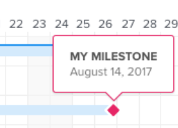

# [!UICONTROL 간트 차트]에 정보가 표시되는 방식 구성

작업 목록 [!UICONTROL 간트 차트] 및 프로젝트 목록 [!UICONTROL 간트 차트]에 표시할 정보를 구성할 수 있습니다.

## 액세스 요구 사항

이 문서의 단계를 따르려면 다음 사항이 있어야 합니다.

<table style="table-layout:auto"> 
 <col> 
 <col> 
 <tbody> 
  <tr> 
   <td role="rowheader">[!DNL Adobe Workfront] 플랜*</td> 
   <td> 
임의 
 </td> 
  </tr> 
  <tr> 
   <td role="rowheader">[!DNL Adobe Workfront] 라이센스*</td> 
   <td> 
[!UICONTROL Review] 이상
 </td> 
  </tr> 
  <tr> 
   <td role="rowheader">액세스 수준 구성*</td> 
   <td> 
프로젝트 및 작업에 대한 [!UICONTROL 보기] 이상 액세스
 
참고: 여전히 액세스 권한이 없는 경우 [!DNL Workfront] 관리자에게 액세스 수준에 추가 제한을 설정했는지 문의하십시오. [!DNL Workfront] 관리자가 액세스 수준을 수정하는 방법에 대한 자세한 내용은 <a href="../../../administration-and-setup/add-users/configure-and-grant-access/create-modify-access-levels.md" class="MCXref xref">사용자 지정 액세스 수준 만들기 또는 수정</a>을 참조하십시오.
 </td> 
  </tr> 
  <tr> 
   <td role="rowheader">개체 권한</td> 
   <td> 
프로젝트에 대한 [!UICONTROL 보기] 이상 액세스 권한
 
추가 액세스 요청에 대한 자세한 내용은 <a href="../../../workfront-basics/grant-and-request-access-to-objects/request-access.md" class="MCXref xref">개체 </a>에 대한 액세스 요청 을 참조하십시오.
 </td> 
  </tr> 
 </tbody> 
</table>

&#42;플랜, 라이선스 유형 또는 액세스 권한을 확인하려면 [!DNL Workfront] 관리자에게 문의하세요.

## 디스플레이 옵션 이해

다음 표에서는 [!UICONTROL 간트 차트]의 표시 옵션에 대해 자세히 설명합니다.

<table style="table-layout:auto"> 
 <col> 
 <col> 
 <col> 
 <tbody> 
  <tr> 
   <td role="rowheader">[!UICONTROL 실제 날짜]</td> 
   <td>  </td> 
   <td> 
[!UICONTROL 실제 시작 날짜] 및 [!UICONTROL 실제 완료 날짜]는 삼각형 아이콘으로 표시됩니다. [!UICONTROL 실제 완료 일자]가 null이면 [!UICONTROL 실제 시작 일자]만 표시됩니다.
 
시작 날짜와 완료 날짜에 대한 자세한 내용은 <a href="../../../manage-work/projects/planning-a-project/project-actual-completion-date.md" class="MCXref xref">프로젝트 개요 [!UICONTROL 실제 완료 날짜] </a> 및 <a href="../../../manage-work/projects/planning-a-project/project-actual-start-date.md" class="MCXref xref">프로젝트 개요 [!UICONTROL 실제 시작 날짜] </a>을(를) 참조하십시오.
 </td> 
  </tr> 
  <tr> 
   <td role="rowheader">[!UICONTROL Assignments]</td> 
   <td>  </td> 
   <td> 
작업 할당자를 표시합니다. 피할당자 이름 옆의 <strong>[!UICONTROL Details]</strong> 링크 위로 마우스를 가져가면 작업에 대한 할당 비율을 포함하여 피할당자에 대한 자세한 정보를 볼 수 있습니다.
 
[!UICONTROL Gantt chart]을(를) PDF으로 내보낼 때 할당자가 [!UICONTROL Gantt chart]에 표시되지 않습니다. [!UICONTROL 간트 차트]를 PDF으로 내보내면 할당자는 작업 목록에만 표시됩니다.
 </td> 
  </tr> 
  <tr> 
   <td role="rowheader">[!UICONTROL 기준 요소]</td> 
   <td>  </td> 
   <td> 
초기 프로젝트 계획에 포함된 프로젝트에 대한 주요 데이터를 나타내는 프로젝트 스냅숏입니다. 기준선은 프로젝트의 수명 내내 가져올 수 있습니다. [!UICONTROL 간트 차트]에 기준선을 표시할 수 있도록 설정하면 표시할 기준선을 선택합니다. [!UICONTROL 간트 차트]에서 한 번에 하나의 기준선만 볼 수 있으며 회색 막대 형태로 표시됩니다.
 
기준선에 대한 자세한 내용은 <a href="../../../manage-work/projects/create-projects/create-baselines.md" class="MCXref xref">프로젝트 기준선 만들기</a>를 참조하십시오.
 </td> 
  </tr> 
  <tr> 
   <td role="rowheader">[!UICONTROL 커밋 일자]</td> 
   <td>  </td> 
   <td> 
작업이 완료될 때 피할당자가 약정으로 제공하는 날짜가 [!UICONTROL 간트 차트]에 마커와 함께 표시됩니다. 
 
커밋 날짜에 대한 자세한 내용은 <a href="../../../manage-work/projects/updating-work-in-a-project/overview-of-commit-dates.md" class="MCXref xref">[!UICONTROL 커밋 날짜] 개요</a>를 참조하십시오.
 </td> 
  </tr> 
  <tr> 
   <td role="rowheader">[!UICONTROL % 완료]</td> 
   <td>  </td> 
   <td>  완료된 작업의 백분율이 작업 라인에 표시됩니다.  </td> 
  </tr> 
  <tr> 
   <td role="rowheader">[!UICONTROL 중요 경로]</td> 
   <td>  </td> 
   <td>프로젝트의 타임라인에 영향을 줄 수 있는 작업은 중요 경로의 일부로 간주되며 빨간색으로 명확하게 표시됩니다. </td> 
  </tr> 
  <tr> 
   <td role="rowheader">[!UICONTROL 이정표] 다이아몬드</td> 
   <td>  </td> 
   <td> 
마일스톤과 연결된 작업 뒤에 다이아몬드 아이콘이 표시됩니다. 마일스톤 위로 마우스를 가져가 마일스톤의 이름과 날짜를 확인합니다. [!DNL Workfront] 관리자가 각 마일스톤 다이아몬드의 색상을 결정합니다.
 
마일스톤에 대한 자세한 내용은 <a href="../../../administration-and-setup/customize-workfront/configure-approval-milestone-processes/create-milestone-path.md" class="MCXref xref">마일스톤 경로 만들기</a>를 참조하세요.
 </td> 
  </tr> 
  <tr> 
   <td role="rowheader">[!UICONTROL 이정표] 줄</td> 
   <td>  </td> 
   <td> 
마일스톤과 연결된 작업 뒤에 줄이 표시됩니다. 마일스톤 위로 마우스를 가져가 마일스톤의 이름과 날짜를 확인합니다. [!DNL Workfront] 관리자가 각 마일스톤 줄의 색을 결정합니다.
 
 이정표에 대한 자세한 내용은  <a href="../../../administration-and-setup/customize-workfront/configure-approval-milestone-processes/create-milestone-path.md" class="MCXref xref">마일스톤 경로 만들기</a>
 </td> 
  </tr> 
  <tr> 
   <td role="rowheader">[!UICONTROL 전임 작업]</td> 
   <td>  </td> 
   <td> 
두 작업 간의 전임 작업 관계를 보여 주는 작업 간 행입니다. 개별 전임 작업 줄을 강조 표시하려면 마우스를 그 위로 가져갑니다. 강조 표시를 유지하려면 클릭합니다. 한 번에 하나의 전임 작업 줄만 강조 표시할 수 있습니다.
 
간트 차트의 여러 페이지에 걸쳐 있는 전임 작업 또는 프로젝트 간 전임 작업이 있는 작업 옆에 <strong>[!UICONTROL 전임 작업]</strong> 아이콘이 표시됩니다.
 
모든 전임 작업 및 후임 작업과 각 작업에 대한 세부 정보(예: 작업 이름, 전임 작업 관계 유형 및 주요 날짜)를 보려면 <strong>[!UICONTROL 전임 작업]</strong> 아이콘을 클릭하십시오.
 
참고: 프로젝트 목록의 [!UICONTROL 간트 차트]에는 프로젝트 간 전임 작업에 대한 정보가 표시됩니다. 다른 프로젝트 간에 전임 작업 관계를 만드는 방법에 대한 자세한 내용은 <a href="../../../manage-work/tasks/use-prdcssrs/cross-project-predecessors.md" class="MCXref xref">프로젝트 간 전임 작업 만들기</a>를 참조하십시오.
 
전임 작업에 대한 자세한 내용은 <a href="../../../manage-work/tasks/use-prdcssrs/enforced-predecessors.md" class="MCXref xref">전임 작업 적용</a>을 참조하십시오.
 </td> 
  </tr> 
  <tr> 
   <td role="rowheader">[!UICONTROL 진행 상태]</td> 
   <td> 
[!UICONTROL 설정 시간] 
 
[!UICONTROL Behind]    
 
[!UICONTROL At Risk]    
 
지연        
 </td> 
   <td> 
 
 
주어진 작업에 대한 현재 진행 상태입니다. 
 
각 [!UICONTROL 진행 상태] 유형에 대한 자세한 내용은 <a href="../../../manage-work/tasks/task-information/task-progress-status.md" class="MCXref xref">작업 [!UICONTROL 진행 상태] 개요</a>를 참조하십시오.
 </td> 
  </tr> 
  <tr> 
   <td role="rowheader">[!UICONTROL 예상 날짜]</td> 
   <td>  </td> 
   <td> 
현재 완료된 작업과 남은 작업을 기준으로 [!UICONTROL 예상 시작] 및 [!UICONTROL 완료 날짜]를 표시하는 예상 타임라인입니다. 
 
예상 완료 날짜에 대한 자세한 내용은 프로젝트, 작업 및 문제에 대한 <a href="../../../manage-work/projects/planning-a-project/project-projected-completion-date.md" class="MCXref xref">[!UICONTROL 예상 완료 날짜] 개요</a>를 참조하십시오.
 </td> 
  </tr> 
 </tbody> 
</table>

## 표시 옵션 구성

1. 작업 목록 [!UICONTROL 간트 차트] 또는 프로젝트 목록 [!UICONTROL 간트 차트](으)로 이동합니다.\
   [!UICONTROL 간트 차트]의 위치에 대한 자세한 내용은 [간트 차트 시작[!UICONTROL 을 참조하세요]](../../../manage-work/gantt-chart/use-the-gantt-chart/get-started-with-gantt.md).

1. (선택 사항) **[!UICONTROL 예상 날짜로 전환]** 설정을 선택하여 [!UICONTROL 예상 날짜]별로 작업을 표시합니다. 기본적으로 작업은 [!UICONTROL 간트 차트]에 [!UICONTROL 계획된 일자]로 표시됩니다.
1. 옵션 아이콘을 클릭하여 **[!UICONTROL 옵션]** 대화 상자를 표시합니다.\
   

1. [!UICONTROL 간트 차트]에 표시할 구성 옵션을 선택하십시오.

   >[!NOTE]
   > 일부 구성 옵션은 프로젝트 목록 [!UICONTROL 간트 차트]에서 사용할 수 없습니다.

1. [!UICONTROL 간트 차트]의 아무 곳이나 클릭하여 **[!UICONTROL 옵션]** 대화 상자를 닫습니다.
