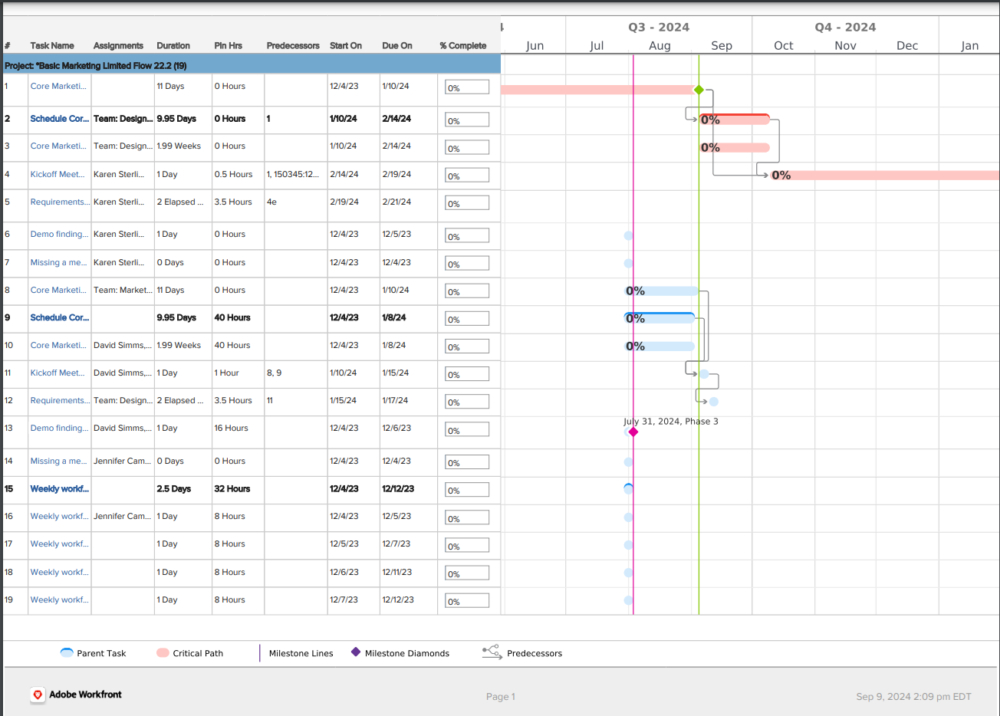

# 내보내기 [!UICONTROL 간트 차트] PDF

을(를) 내보낼 수 있습니다 [!UICONTROL 간트 차트] PDF에 추가할 수 있습니다.

를 내보낸 후 [!UICONTROL 간트 차트] PDF을 위해 전자 메일에 인쇄하거나 첨부하여 다른 사용자와 공유할 수 있습니다.

## 액세스 요구 사항

이 문서의 절차를 수행하려면 다음 사항이 있어야 합니다.

<table style="table-layout:auto"> 
 <col> 
 <col> 
 <tbody> 
  <tr> 
   <td role="rowheader">[!UICONTROL Adobe Workfront] 계획*</td> 
   <td> 
모든 
 </td> 
  </tr> 
  <tr> 
   <td role="rowheader">[!UICONTROL Adobe Workfront] 라이센스*</td> 
   <td> 
[!UICONTROL Review] 이상
 </td> 
  </tr> 
  <tr> 
   <td role="rowheader">액세스 수준 구성*</td> 
   <td> 
프로젝트 및 작업에 대한 [!UICONTROL 보기] 이상 액세스
 
참고: 여전히 액세스할 수 없는 경우 [!DNL Workfront] 관리자가 액세스 수준에서 추가 제한을 설정한 경우 자세한 내용은 [!DNL Workfront] 관리자는 액세스 수준을 수정할 수 있습니다. <a href="../../../administration-and-setup/add-users/configure-and-grant-access/create-modify-access-levels.md" class="MCXref xref">사용자 정의 액세스 수준 만들기 또는 수정</a>.
 </td> 
  </tr> 
  <tr> 
   <td role="rowheader">개체 권한</td> 
   <td> 
프로젝트에 대한 [!UICONTROL 보기] 이상 액세스
 
추가 액세스 요청에 대한 자세한 내용은 <a href="../../../workfront-basics/grant-and-request-access-to-objects/request-access.md" class="MCXref xref">개체에 대한 액세스 요청 </a>.
 </td> 
  </tr> 
 </tbody> 
</table>

&#42;어떤 계획, 라이센스 유형 또는 액세스 권한을 보유하고 있는지 확인하려면 [!DNL Workfront] 관리자

## 내보내기 [!UICONTROL 간트 차트]

1. 액세스 권한 [!UICONTROL 간트 차트] PDF으로 내보낼 항목을 [시작하기 [!UICONTROL 간트 차트]](../../../manage-work/gantt-chart/use-the-gantt-chart/get-started-with-gantt.md).
1. 를 구성했는지 확인합니다. [!UICONTROL 간트 차트] 내보내기 전에 적절한 정보를 표시하기 위해

   >[!NOTE]
   >
   >를 내보내는 경우 [!UICONTROL 간트 차트] 프로젝트 목록에서 PDF 파일에는 각 프로젝트의 작업이 아니라 목록에 있는 프로젝트만 포함됩니다. 작업 목록을 내보내려면 해당 작업이 연결된 프로젝트에서 내보내거나 작업 보고서를 작성하여 보고서 결과를 [!UICONTROL 간트 보기].

   다음 정보를 구성할 수 있습니다.

   * 작업 목록에서 원하는 필터, 보기 및 그룹화를 참조하십시오. 목록 보기에서 선택한 모든 필터 및 그룹화는 [!UICONTROL 간트 차트]. 보기는 내보낸 항목에 반영됩니다 [!UICONTROL 간트 차트] 목록 내 [!UICONTROL 간트 차트] 클릭합니다. 보기는 [!UICONTROL 간트 차트] 자체.

      >[!TIP]
      >
      >더 많은 공간을 [!UICONTROL 간트 차트] 또한 가능한 한 적은 수의 열이 포함된 보기를 적용합니다.

   * 의 구성 옵션 [!UICONTROL 간트 차트]. 예를 들어 이정표, 날짜, [!UICONTROL 기준선], 또는 [!UICONTROL 완료] 에 나타나다 [!UICONTROL 간트 차트].

      자세한 내용은   [에 정보가 표시되는 방식을 구성합니다 [!UICONTROL 간트 차트]](../../../manage-work/gantt-chart/use-the-gantt-chart/configure-info-on-gantt-chart.md).

      >[!NOTE]
      >
      > 할당이 [!UICONTROL 간트 차트] http 화이트보드 [!UICONTROL 간트 차트] PDF으로 내보냅니다. 이 [!UICONTROL 간트 차트] PDF으로 내보내면 지정된 내용이 목록 보기에만 표시됩니다.

   * 에 표시되는 기간입니다 [!UICONTROL 간트 차트].\

      자세한 내용은 [에서 정보 보기 [!UICONTROL 간트 차트]](../../../manage-work/gantt-chart/use-the-gantt-chart/view-info-in-gantt.md).

      내보내기 파일에 기간을 표시하는 방법은 선택 여부에 따라 다릅니다 **[!UICONTROL 내가 보는 것]** 또는 **[!UICONTROL 여러 페이지]** 을 참조하십시오.

1. (선택 사항) 내보낸 PDF에 특정 작업만 포함하려면 포함할 작업을 선택합니다.

   작업을 선택하지 않으면 내보낸 PDF에 모든 작업이 포함됩니다.

   예를 들어 [!UICONTROL 간트 차트] 50개의 작업이 포함되어 있지만 내보낸 프로젝트에 10개의 작업만 표시하려는 경우 [!UICONTROL 간트 차트]표시할 10개의 작업을 선택합니다.

1. 프린터 아이콘을 클릭합니다.\
   다음 **[!UICONTROL PDF으로 내보내기]** 대화 상자가 표시됩니다.\
   

1. 표시되는 항목만 내보내지 또는 전체를 내보내지 여부를 선택합니다 [!UICONTROL 간트 차트]:

   * **[!UICONTROL 내가 보는 것]:** 최대 500개의 항목을 내보내기 전에 화면에 표시되는 모든 작업(하위 작업 포함)을 내보냅니다. (이것은 **[!UICONTROL 미리 보기]** 섹션 a [!UICONTROL 미리 보기] 섹션에는 샘플 데이터만 포함됩니다.)

      하위 작업은 상위 작업이 축소되고 하위 작업이 표시되지 않는 경우에도 내보낸 PDF에 포함됩니다. 상위 작업만 포함하려면 포함할 상위 작업을 선택하고 하위 작업을 선택하지 않은 상태로 둡니다.

      를 사용할 수 있습니다 **[!UICONTROL 확대/축소]** 드롭다운 메뉴 또는 슬라이더 도구를 사용하여 [!UICONTROL 간트 차트]에 설명된 대로 [에서 정보 보기 [!UICONTROL 간트 차트]](../../../manage-work/gantt-chart/use-the-gantt-chart/view-info-in-gantt.md) .

   * **[!UICONTROL 여러 페이지]:** 전체 내보내기 [!UICONTROL 간트 차트]최대 500개의 항목이 현재 화면에 표시되지 않는 경우에도\

      를 사용할 수 있습니다 **[!UICONTROL 확대/축소]** 드롭다운 메뉴 또는 슬라이더 도구를 사용하여 [에 정보가 표시되는 방식을 구성합니다 [!UICONTROL 간트 차트]](../../../manage-work/gantt-chart/use-the-gantt-chart/configure-info-on-gantt-chart.md). 내보낼 페이지를 더 많이 표시하려면 더 세분화된 옵션을 선택하거나, 내보낼 페이지를 더 적게 표시하려면 덜 세분화된 옵션을 선택합니다.

      >[!NOTE]
      >
      >을(를) 내보내려면 [!UICONTROL 간트 차트] 500개 이상의 항목이 포함되어 있는 경우, [!UICONTROL 간트 차트] 이렇게 하면 500개 미만의 항목 또는 250페이지가 표시됩니다. 필터를 적용하는 방법에 대한 자세한 내용은  [의 필터 개요 [!DNL Adobe Workfront]](../../../reports-and-dashboards/reports/reporting-elements/filters-overview.md).
      >
      >
      >다음과 같은 상황에서는 전체 Gantt 차트를 내보낼 수 없습니다.
      >
      >   
      >   
      >   * 250페이지 이상에 걸쳐 있는 경우
      >   * 500개 이상의 항목을 포함하는 경우

1. PDF을 PDF으로 내보낸 후에 인쇄되는 경우, **[!UICONTROL 페이지 크기]** 드롭다운 메뉴에서 인쇄할 용지 크기를 선택합니다.\
   선택할 수 있습니다 **[!UICONTROL 레터]**, **[!UICONTROL 법적 정보]**, **[!UICONTROL 원장]**, **[!UICONTROL A1]**, **[!UICONTROL A2]**, **[!UICONTROL A3]** (일부 언어에서만 사용 가능) 또는 **[!UICONTROL A4]**.
1. 에서 **[!UICONTROL 페이지 방향]** 섹션에서 PDF을 가로 또는 세로 방향으로 내보내는지 여부를 선택합니다.
1. 선택 **[!UICONTROL 범례 표시]** 내보낸 PDF에 범례를 포함하려면 다음을 수행하십시오.
1. 클릭 **[!UICONTROL 내보내기]**.

   pdf [!UICONTROL 간트 차트] 이(가) 만들어지고 컴퓨터에 다운로드됩니다.

   내보낸 파일의 하단에 있는 범례를 확인합니다. 이 페이지에서는 [!UICONTROL 간트 차트] 작업 목록에서 사용할 수 있습니다.

   예를 들어 이정표는 이정표에 연결된 작업이 하나 이상 있는 경우에만 범례에 표시됩니다.

   
