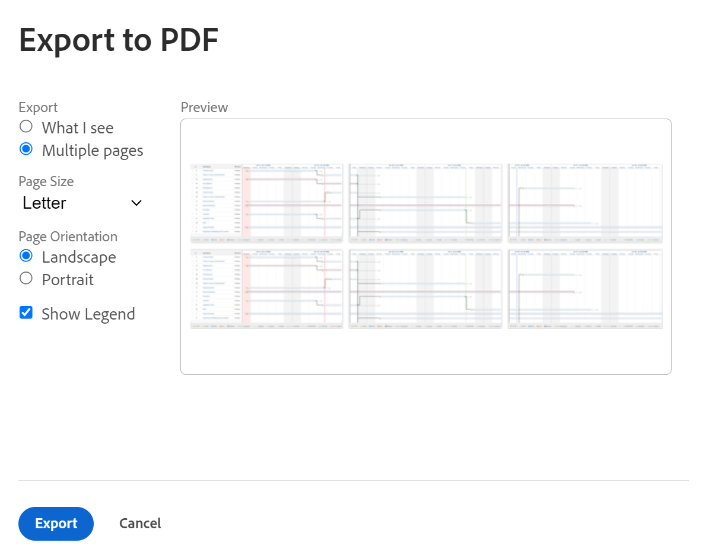

# PDF으로 [!UICONTROL 간트 차트] 내보내기

[!UICONTROL 간트 차트]를 PDF으로 내보낼 수 있습니다.

[!UICONTROL 간트 차트]를 PDF으로 내보낸 후 인쇄하거나 전자 메일에 첨부하여 다른 사용자와 공유할 수 있습니다.

## 액세스 요구 사항

이 문서의 단계를 따르려면 다음 사항이 있어야 합니다.

<table style="table-layout:auto"> 
 <col> 
 <col> 
 <tbody> 
  <tr> 
   <td role="rowheader">[!UICONTROL Adobe Workfront] 계획*</td> 
   <td> 
임의 
 </td> 
  </tr> 
  <tr> 
   <td role="rowheader">[!UICONTROL Adobe Workfront] 라이센스*</td> 
   <td> 
[!UICONTROL Review] 이상
 </td> 
  </tr> 
  <tr> 
   <td role="rowheader">액세스 수준 구성*</td> 
   <td> 
프로젝트 및 작업에 대한 [!UICONTROL 보기] 이상 액세스
 
참고: 여전히 액세스 권한이 없는 경우 [!DNL Workfront] 관리자에게 액세스 수준에 추가 제한을 설정했는지 문의하십시오. [!DNL Workfront] 관리자가 액세스 수준을 수정하는 방법에 대한 자세한 내용은 <a href="../../../administration-and-setup/add-users/configure-and-grant-access/create-modify-access-levels.md" class="MCXref xref">사용자 지정 액세스 수준 만들기 또는 수정</a>을 참조하십시오.
 </td> 
  </tr> 
  <tr> 
   <td role="rowheader">개체 권한</td> 
   <td> 
프로젝트에 대한 [!UICONTROL 보기] 이상 액세스 권한
 
추가 액세스 요청에 대한 자세한 내용은 <a href="../../../workfront-basics/grant-and-request-access-to-objects/request-access.md" class="MCXref xref">개체 </a>에 대한 액세스 요청 을 참조하십시오.
 </td> 
  </tr> 
 </tbody> 
</table>

&#42;플랜, 라이선스 유형 또는 액세스 권한을 확인하려면 [!DNL Workfront] 관리자에게 문의하세요.

## [!UICONTROL 간트 차트] 내보내기

1. [간트 차트 시작]](../../../manage-work/gantt-chart/use-the-gantt-chart/get-started-with-gantt.md)에 설명된 대로 PDF으로 내보낼 [!UICONTROL 간트 차트]에 액세스합니다.[!UICONTROL 
1. 내보내기 전에 적절한 정보를 표시하도록 [!UICONTROL 간트 차트]를 구성했는지 확인하십시오.

   >[!NOTE]
   >
   >프로젝트 목록에서 [!UICONTROL 간트 차트]를 내보내는 경우 PDF 파일에는 각 프로젝트의 작업이 아닌 목록의 프로젝트만 포함됩니다. 작업 목록을 내보내려면 연결된 프로젝트에서 내보내거나 작업 보고서를 작성하고 보고서 결과를 [!UICONTROL 간트 보기]에 표시하면 됩니다.

   다음 정보를 구성할 수 있습니다.

   * 작업 목록에서 원하는 대로 필터, 보기 및 그룹화. 목록 보기에서 선택한 모든 필터 및 그룹화는 [!UICONTROL 간트 차트]를 볼 때 유지됩니다. 보기는 첫 페이지의 [!UICONTROL 간트 차트] 옆에 표시되는 목록 내에서만 내보낸 [!UICONTROL 간트 차트]에 반영됩니다. [!UICONTROL 간트 차트] 자체에는 보기가 표시되지 않습니다.

     >[!TIP]
     >
     >[!UICONTROL 간트 차트] 자체에 더 많은 공간을 허용하려면 가능한 한 적은 수의 열이 포함된 보기를 적용하세요.

   * [!UICONTROL 간트 차트]의 구성 옵션. 예를 들어 [!UICONTROL 간트 차트]에 마일스톤, 날짜, [!UICONTROL 기준선] 또는 [!UICONTROL 완료율]이 표시되도록 설정할 수 있습니다.

     자세한 내용은   [정보가 [!UICONTROL 간트 차트에 표시되는 방식을 구성합니다]](../../../manage-work/gantt-chart/use-the-gantt-chart/configure-info-on-gantt-chart.md).

     >[!NOTE]
     >
     > [!UICONTROL 간트 차트]을(를) PDF으로 내보낼 때 [!UICONTROL 간트 차트]에 할당이 표시되지 않습니다. [!UICONTROL 간트 차트]을(를) PDF으로 내보내면 할당이 목록 보기에만 표시됩니다.

   * [!UICONTROL 간트 차트]에 표시되는 기간입니다.\

     자세한 내용은 [간트 차트에서 정보 보기]](../../../manage-work/gantt-chart/use-the-gantt-chart/view-info-in-gantt.md)를 참조하십시오.[!UICONTROL 

     내보내기 파일에 기간이 표시되는 방식은 이후 단계에서 **[!UICONTROL 표시되는 항목]** 또는 **[!UICONTROL 여러 페이지]**&#x200B;를 선택했는지 여부에 따라 달라집니다.

1. (선택 사항) 내보낸 PDF에 특정 작업만 포함하려면 포함할 작업을 선택합니다.

   작업을 선택하지 않으면 내보낸 PDF에 모든 작업이 포함됩니다.

   예를 들어 50개의 작업이 포함된 프로젝트에 대한 [!UICONTROL 간트 차트]를 보고 있지만 내보낸 [!UICONTROL 간트 차트]에 10개의 작업만 표시하려면 표시할 10개의 작업을 선택합니다.

1. 프린터 아이콘을 클릭합니다.\
   **[!UICONTROL PDF으로 내보내기]** 대화 상자가 표시됩니다.\
   

1. 표시된 항목만 내보내거나 전체 [!UICONTROL 간트 차트]를 내보낼지 선택하십시오.

   * **[!UICONTROL 표시되는 항목]:** 최대 500개의 항목을 내보내기 전에 화면에 표시되는 모든 작업(하위 작업 포함)을 내보냅니다. (**[!UICONTROL 미리 보기]** 섹션에 표시되는 내용이 아닙니다. [!UICONTROL 미리 보기] 섹션에는 샘플 데이터만 포함됩니다.)

     상위 작업이 축소되고 하위 작업이 표시되지 않는 경우에도 하위 작업이 내보낸 PDF에 포함됩니다. 상위 작업만 포함하려면 포함하려는 상위 작업을 선택하고 하위 작업은 선택하지 않은 상태로 두십시오.

     [간트 차트에서 정보 보기]](../../../manage-work/gantt-chart/use-the-gantt-chart/view-info-in-gantt.md)에 설명된 대로 **[!UICONTROL 확대/축소]** 드롭다운 메뉴 또는 슬라이더 도구를 사용하여 [!UICONTROL 간트 차트]의 일부만 표시할 수 있습니다.[!UICONTROL 

   * **[!UICONTROL 여러 페이지]:** 전체 [!UICONTROL Gantt 차트]를 내보냅니다. 현재 화면에 최대 500개 항목까지 표시되지 않습니다.\

     [간트 차트 [!UICONTROL 에 표시되는 정보 방법 구성]](../../../manage-work/gantt-chart/use-the-gantt-chart/configure-info-on-gantt-chart.md)에 설명된 대로 **[!UICONTROL 확대/축소]** 드롭다운 메뉴나 슬라이더 도구를 사용하여 각 페이지에 표시되는 정보의 양을 결정할 수 있습니다. 내보낼 페이지를 더 많이 표시하려면 더 세분화된 옵션을 선택하고, 내보낼 페이지를 더 적게 표시하려면 더 세분화된 옵션을 선택합니다.

     >[!NOTE]
     >
     >500개 이상의 항목을 포함하는 [!UICONTROL 간트 차트]를 내보내려면 [!UICONTROL 간트 차트]를 보기 전에 목록에 필터를 적용하여 500개 이하의 항목 또는 250페이지가 표시되도록 하십시오. 필터를 적용하는 방법에 대한 자세한 내용은 [필터 개요](../../../reports-and-dashboards/reports/reporting-elements/filters-overview.md)를 참조하십시오.
     >
     >
     >다음과 같은 경우에는 전체 간트 차트를 내보낼 수 없습니다.
     >
     >   
     >   
     >   * 250페이지를 초과하는 경우
     >   * 항목이 500개를 초과하는 경우

1. PDF을 페이지로 내보낸 후 인쇄할 경우 **[!UICONTROL PDF 크기]** 드롭다운 메뉴에서 인쇄할 용지 크기를 선택합니다.\
   **[!UICONTROL 편지]**, **[!UICONTROL 법률]**, **[!UICONTROL 원장]**, **[!UICONTROL A1]**, **[!UICONTROL A2]**, **[!UICONTROL A3]**(일부 언어에서만 사용 가능) 또는 **[!UICONTROL A4]**&#x200B;을(를) 선택할 수 있습니다.
1. **[!UICONTROL PDF 방향]** 섹션에서 페이지를 가로 또는 세로 방향으로 내보낼지 선택합니다.
1. 내보낸 PDF에 범례를 포함하려면 **[!UICONTROL 범례 표시]**&#x200B;를 선택합니다.
1. **[!UICONTROL 내보내기]**&#x200B;를 클릭합니다.

   [!UICONTROL 간트 차트]의 PDF가 만들어져 컴퓨터에 다운로드됩니다.

   내보낸 파일의 아래쪽에 범례가 있습니다. [!UICONTROL 간트 차트]에서 활성화했으며 작업 목록에서 사용할 수 있는 옵션만 설명합니다.

   예를 들어 마일스톤은 마일스톤과 연관된 작업이 하나 이상 있는 경우에만 범례에 표시됩니다.

   
