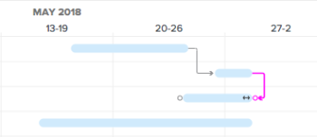

# 작업 목록 [!UICONTROL 간트 차트]의 정보 업데이트

<!--Audited: 08/2025-->

Adobe Workfront 작업 목록의 [!UICONTROL 간트 차트]에는 프로젝트 또는 템플릿에 있는 작업에 대한 세부 정보가 표시됩니다.

템플릿의 작업 목록 [!UICONTROL 간트 차트]에는 템플릿 작업 수준에서 템플릿의 작업 목록에 수행된 업데이트가 반영됩니다. 템플릿에 연결된 [!UICONTROL 간트 차트]을(를) 편집할 수 없습니다.

프로젝트에서 작업 목록 [!UICONTROL 간트 차트]에서 직접 작업 정보를 업데이트할 수 있습니다.

이 문서에서는 작업 목록 [!UICONTROL 간트 차트]에서 직접 수행할 수 있는 다음 작업에 대해 설명합니다.

* 작업 기간 수정
* 전임 작업 관계 만들기 또는 제거
* 작업 시작 및 종료 날짜 변경
* 완료율 업데이트
* 프로젝트 리소스 레벨링

## 액세스 요구 사항

+++ 을 확장하여 이 문서의 기능에 대한 액세스 요구 사항을 봅니다. 

<table style="table-layout:auto"> 
 <col> 
 <col> 
 <tbody> 
  <tr> 
   <td role="rowheader">[!DNL Adobe Workfront] 패키지</td> 
   <td> 
임의
 </td> 
  </tr> 
  <tr> 
   <td role="rowheader">[!DNL Adobe Workfront] 라이센스</td> 
   <td> 
[!UICONTROL Standard]

   
[!UICONTROL 계획]
 </td> 
  </tr> 
  <tr> 
   <td role="rowheader">액세스 수준 구성</td> 
   <td> 
프로젝트 및 작업에 대한 [!UICONTROL 편집] 액세스 권한
 </td> 
  </tr> 
  <tr> 
   <td role="rowheader">개체 권한</td> 
   <td> 
프로젝트 및 작업에 대한 [!UICONTROL 관리] 액세스 권한
 </td> 
  </tr> 
 </tbody> 
</table>

이 표의 정보에 대한 자세한 내용은 [Workfront 설명서의 액세스 요구 사항](/help/quicksilver/administration-and-setup/add-users/access-levels-and-object-permissions/access-level-requirements-in-documentation.md)을 참조하십시오.

+++ 

<!--Old:

<table style="table-layout:auto"> 
 <col> 
 <col> 
 <tbody> 
  <tr> 
   <td role="rowheader">[!DNL Adobe Workfront] plan*</td> 
   <td> 
Any 
 </td> 
  </tr> 
  <tr> 
   <td role="rowheader">[!DNL Adobe Workfront] license*</td> 
   <td> 
[!UICONTROL Plan] 
 </td> 
  </tr> 
  <tr> 
   <td role="rowheader">Access level configurations*</td> 
   <td> 
[!UICONTROL Edit] access to Projects and Tasks
 
Note: If you still don't have access, ask your [!DNL Workfront] administrator if they set additional restrictions in your access level. For information on how a [!DNL Workfront] administrator can modify your access level, see <a href="../../../administration-and-setup/add-users/configure-and-grant-access/create-modify-access-levels.md" class="MCXref xref">Create or modify custom access levels</a>.
 </td> 
  </tr> 
  <tr> 
   <td role="rowheader">Object permissions</td> 
   <td> 
[!UICONTROL Manage] access to the project and tasks 
 
For information on requesting additional access, see <a href="../../../workfront-basics/grant-and-request-access-to-objects/request-access.md" class="MCXref xref">Request access to objects </a>.
 </td> 
  </tr> 
 </tbody> 
</table>-->

## 작업 기간 수정

1. 수정할 프로젝트로 이동합니다.
1. 왼쪽 패널에서 **[!UICONTROL 작업]**&#x200B;을 클릭합니다.

   

1. **[!UICONTROL 간트 차트]** 아이콘을 클릭합니다.

   

   **[!UICONTROL 자동 저장]** 옵션을 사용하면 모든 변경 내용이 자동으로 저장됩니다. 기본적으로 활성화되어 있습니다.

1. (선택 사항) **[!UICONTROL 계획 모드]** 아이콘을 클릭하고 **[!UICONTROL 표준 수동 저장]** 또는 **[!UICONTROL 타임라인 계획 수립]**&#x200B;을 선택하여 변경 사항을 수동으로 저장합니다.

   

1. 작업의 타임라인을 마우스로 가리킨 다음 타임라인 표시기를 다른 날짜로 끕니다.
1. 작업의 올바른 새 완료 날짜에 도달하면 표시기를 놓습니다.
1. (선택 사항 및 조건부) 변경 내용을 수동으로 저장하도록 선택한 경우 변경 내용을 취소하거나 복제하려면 **[!UICONTROL 실행 취소]** 또는&#x200B;**[!UICONTROL 다시 실행]** 아이콘을 클릭합니다.

   >[!TIP]
   >
   >다음 키보드 단축키를 사용하여 간트 차트에서 변경 사항을 실행 취소하거나 재실행할 수 있습니다.
   >
   >   
   >   
   >   * [!DNL Mac]: [!UICONTROL Command + Z]를 사용하여 실행을 취소하고 [!UICONTROL Command + Shift + Z]를 사용하여 실행을 취소합니다.
   >   * [!DNL Windows]: 실행을 취소하려면 [!UICONTROL Ctrl + Z]를 사용하고 실행을 취소하려면 [!UICONTROL Ctrl + Y]를 사용하십시오.
   >   
   >

1. **[!UICONTROL 간트 차트]**&#x200B;의 오른쪽 상단 모서리에서 [!UICONTROL 저장]을 클릭합니다.

## 전임 작업 관계 만들기 또는 제거

1. 수정할 프로젝트로 이동합니다.
1. **[!UICONTROL 작업]** 영역에서 **[!UICONTROL 간트 차트]** 아이콘을 클릭합니다.

   기본적으로 **[!UICONTROL 자동 저장]** 옵션이 선택되어 있으며, 이 경우 모든 변경 내용이 자동으로 저장됩니다.

   

1. (선택 사항) **[!UICONTROL 계획 모드]** 아이콘을 클릭하고 **[!UICONTROL 표준 수동 저장]** 또는 **[!UICONTROL 타임라인 계획 수립]**&#x200B;을 선택하여 변경 사항을 수동으로 저장합니다.

   

1. 전임 작업 관계를 만들려면 작업의 시작점을 클릭하고 작업의 끝점으로 끕니다.
1. 전임 작업 관계를 삭제하려면 두 작업을 연결하는 전임 작업 줄을 클릭하여 선택한 다음 키보드에서 **[!UICONTROL 삭제]**&#x200B;를 누르십시오.\
   

1. (선택 사항 및 조건부) 변경 내용을 수동으로 저장하도록 선택한 경우 변경 내용을 취소하거나 복제하려면 **[!UICONTROL 실행 취소]** 또는 {&#x200B;2}다시 실행&#x200B;**[!UICONTROL 아이콘을 클릭합니다.]**

   >[!TIP]
   >
   >다음 키보드 단축키를 사용하여 간트 차트에서 변경 사항을 실행 취소하거나 재실행할 수 있습니다.
   >
   >   
   >   
   >   * [!DNL Mac]: [!UICONTROL Command + Z]를 사용하여 실행을 취소하고 [!UICONTROL Command + Shift + Z]를 사용하여 실행을 취소합니다.
   >   * [!DNL Windows]: [!UICONTROL 실행을 취소하려면 Ctrl + Z]를 사용하고 실행을 취소하려면 [!UICONTROL Ctrl + Y]를 사용하십시오.
   >   
   >

1. **[!UICONTROL 저장]** 을 클릭합니다.

## 작업 시작 및 종료 날짜 변경

1. 수정할 프로젝트로 이동합니다.
1. **[!UICONTROL 작업]** 영역에서 **[!UICONTROL 간트 차트]** 아이콘을 클릭합니다.

   **[!UICONTROL 자동 저장]** 옵션을 사용하면 모든 변경 내용이 자동으로 저장됩니다. 기본적으로 활성화되어 있습니다.

   

1. (선택 사항) **[!UICONTROL 계획 모드]** 아이콘을 클릭하고 **[!UICONTROL 표준 수동 저장]** 또는 **[!UICONTROL 타임라인 계획 수립]**&#x200B;을 선택하여 변경 사항을 수동으로 저장합니다.

   

1. 작업의 가운데로 마우스를 가져간 후 여러 방향 화살표를 찾습니다.
1. 을(를) 클릭하고 작업을 원하는 날짜로 드래그합니다.

   

1. 작업 제한 사항에 영향을 주는 방식으로 작업 날짜를 변경한 경우 **[!UICONTROL 수락]**&#x200B;을 클릭하여 작업 제한 사항 변경을 확인합니다.

   >[!NOTE]
   >
   >작업에 다음 제한 조건 중 하나가 있으면 [!UICONTROL 작업 제한 조건]이(가) [!UICONTROL 이후에 시작] 프로젝트가 [!UICONTROL 시작 날짜]부터 예약된 경우 또는 [!UICONTROL 완료 날짜]부터 예약된 경우 [!UICONTROL 완료 날짜]보다 이후에 시작(으)로 업데이트됩니다.
   >
   >   
   >   
   >   * [!UICONTROL 가능한 한 빨리]
   >   * [!UICONTROL 가능한 한 늦게]
   >   * [!UICONTROL 가능한 가장 빠른 시간]
   >   * [!UICONTROL 최근 사용 가능한 시간]
   >   
   >   
   >경우에 따라 전임 작업 관계로 인해 작업이 더 일찍 시작되지 않을 수 있으며 작업 이동이 허용되지 않습니다.

1. (선택 사항 및 조건부) 변경 내용을 수동으로 저장하도록 선택한 경우 변경 내용을 취소하거나 복제하려면 **[!UICONTROL 실행 취소]** 또는&#x200B;**[!UICONTROL 다시 실행]** 아이콘을 클릭합니다.

   >[!TIP]
   >
   >다음 키보드 단축키를 사용하여 [!UICONTROL 간트 차트]의 변경 내용을 실행 취소하거나 다시 실행할 수 있습니다.
   >
   >   
   >   
   >   * [!DNL Mac]: [!UICONTROL Command + Z]를 사용하여 실행을 취소하고 [!UICONTROL Command + Shift + Z]를 사용하여 실행을 취소합니다.
   >   * [!DNL Windows]: 실행을 취소하려면 [!UICONTROL Ctrl + Z]를 사용하고 실행을 취소하려면 [!UICONTROL Ctrl + Y]를 사용하십시오.
   >   
   >

1. **[!UICONTROL 저장]**&#x200B;을 클릭합니다.

## 완료율 업데이트

1. 수정할 프로젝트로 이동합니다.
1. **[!UICONTROL 작업]** 영역에서 **[!UICONTROL 간트 차트]** 아이콘을 클릭합니다.

   

   **[!UICONTROL 자동 저장]** 옵션을 사용하면 모든 변경 내용이 자동으로 저장됩니다. 기본적으로 활성화되어 있습니다.

1. (선택 사항) **[!UICONTROL 계획 모드]** 아이콘을 클릭하고 **[!UICONTROL 표준 수동 저장]** 또는 **[!UICONTROL 타임라인 계획 수립]**&#x200B;을 선택하여 변경 사항을 수동으로 저장합니다.
1. 작업 내의 백분율 숫자를 두 번 클릭하고 숫자를 입력합니다.

   >[!IMPORTANT]
   >
   >완료율을 업데이트하려면 [!UICONTROL 옵션] 대화 상자에서 [!UICONTROL % 완료]을(를) 선택해야 합니다. 이렇게 하려면 **[!UICONTROL 옵션]** 아이콘을 클릭하고 **[!UICONTROL % 완료]**&#x200B;를 선택하십시오.
   >
   >
   >   >
   >

1. (선택 사항 및 조건부) 변경 내용을 수동으로 저장하도록 선택한 경우 변경 내용을 취소하거나 복제하려면 **[!UICONTROL 실행 취소]** 또는 {&#x200B;2}다시 실행&#x200B;**[!UICONTROL 아이콘을 클릭합니다.]**

   >[!TIP]
   >
   >다음 키보드 단축키를 사용하여 [!UICONTROL 간트 차트]의 변경 내용을 실행 취소하거나 다시 실행할 수 있습니다.
   >
   >   
   >   
   >   * [!DNL Mac]: [!UICONTROL Command + Z]를 사용하여 실행을 취소하고 [!UICONTROL Command + Shift + Z]를 사용하여 실행을 취소합니다.
   >   * [!DNL Windows]: 실행을 취소하려면 [!UICONTROL Ctrl + Z]를 사용하고 실행을 취소하려면 [!UICONTROL Ctrl + Y]를 사용하십시오.
   >   
   >

1. **[!UICONTROL 간트 차트]**&#x200B;의 오른쪽 상단 모서리에서 [!UICONTROL 저장]을 클릭합니다.

## 프로젝트 리소스 레벨링

작업 목록 [!UICONTROL 간트 차트]를 사용하여 리소스를 레벨링할 수 있습니다.

[!UICONTROL 간트 차트]의 리소스 레벨링에 대한 자세한 내용은 [간트 차트[!UICONTROL 의 리소스 레벨링]](../../../manage-work/gantt-chart/use-the-gantt-chart/level-resources-in-gantt.md)을 참조하십시오.

<!--

(NOTE:&nbsp;this is drafted because I moved the whole content to the article linked above)

<ol>
<li value="1">Go to the project you want to level.</li>
<li value="2"> 
 In the <strong>Tasks</strong> area, click the <strong>Gantt chart</strong> icon.
 
All changes are saved automatically when the <strong>Autosave</strong> option is enabled. It is enabled by default. 
 </li>
<li value="3">

(Optional) Click the <strong>Plan mode</strong> icon and select <strong>Manual save Standard</strong> or <strong>Timeline Planning</strong> to save your changes manually.
 <note type="tip">
You cannot level resources in the Gantt chart when the Autosave option is enabled.
</note>

  

 </li>
<li value="4"> 
Click the <strong>Level Resources</strong> drop-down menu.
 
  
 </li>
<li value="5">Select one of following options:
<ul>
<li><strong>Level Now</strong>: Applies resource leveling to the selected task.</li>
<li>
<strong>Clear Leveling</strong>: Removes all resource leveling from the selected task.
</li>
</ul><note type="note">
Your resources might be overallocated if they are assigned to multiple tasks which occur during the same time frame.
</note></li>
<li value="6"> 
(Optional and conditional) If you have disabled the Autosave option, click the <strong>Undo</strong> or<strong>Redo</strong> icons if you want to cancel or duplicate any of the changes. 
 <note type="tip">

You can use the following keyboard shortcuts to undo or redo changes on the Gantt chart:

<ul>
<li>Mac: Use Command + Z to undo and Command + Shift + Z to redo.</li>
<li>Windows: Use Ctrl + Z to undo and Ctrl + Y to redo.</li>
</ul>
</note> </li>
<li value="7">Click <strong>Save</strong> in the upper-right corner of the Gantt chart.</li>
</ol>

-->

<!--
<h2 data-mc-conditions="QuicksilverOrClassic.Draft mode"> </h2>
-->
