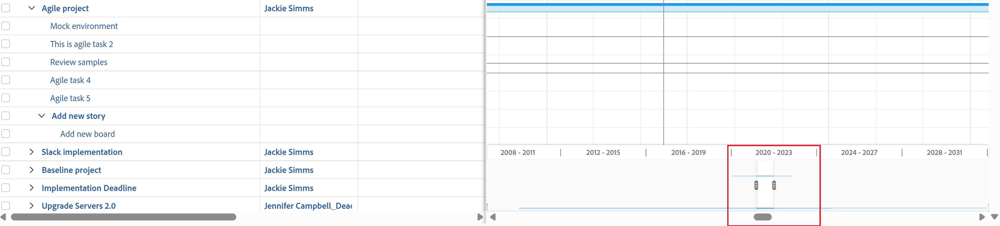

# [!UICONTROL 간트 차트]에서 정보 보기

작업 목록 [!UICONTROL 간트 차트] 및 프로젝트 목록 [!UICONTROL 간트 차트]에 프로젝트 및 작업에 대한 정보가 표시됩니다.

## 액세스 요구 사항

이 문서의 단계를 따르려면 다음 사항이 있어야 합니다.

<table style="table-layout:auto"> 
 <col> 
 <col> 
 <tbody> 
  <tr> 
   <td role="rowheader">[!DNL Adobe Workfront] 플랜*</td> 
   <td> 
임의 
 </td> 
  </tr> 
  <tr> 
   <td role="rowheader">[!DNL Adobe Workfront] 라이센스 개요*</td> 
   <td> 
[!UICONTROL Review] 이상
 </td> 
  </tr> 
  <tr> 
   <td role="rowheader">액세스 수준 구성*</td> 
   <td> 
프로젝트 및 작업에 대한 [!UICONTROL 보기] 이상 액세스
 
<b>메모</b>

아직 액세스 권한이 없는 경우 [!DNL Workfront] 관리자에게 액세스 수준에 추가 제한을 설정했는지 문의하십시오. [!DNL Workfront] 관리자가 액세스 수준을 수정하는 방법에 대한 자세한 내용은 <a href="../../../administration-and-setup/add-users/configure-and-grant-access/create-modify-access-levels.md" class="MCXref xref">사용자 지정 액세스 수준 만들기 또는 수정</a>을 참조하십시오.
 </td>
</tr> 
  <tr> 
   <td role="rowheader">개체 권한</td> 
   <td> 
프로젝트에 대한 [!UICONTROL 보기] 이상 액세스 권한
 
추가 액세스 요청에 대한 자세한 내용은 <a href="../../../workfront-basics/grant-and-request-access-to-objects/request-access.md" class="MCXref xref">개체 </a>에 대한 액세스 요청 을 참조하십시오.
 </td> 
  </tr> 
 </tbody> 
</table>

&#42;플랜, 라이선스 유형 또는 액세스 권한을 확인하려면 [!DNL Workfront] 관리자에게 문의하세요.

## [!UICONTROL 간트 차트] 찾기

Workfront 내의 여러 영역에서 작업 목록 간트 차트 및 프로젝트 목록 [!UICONTROL 간트 차트]를 모두 찾을 수 있습니다. 자세한 내용은 [간트 차트 시작]](../../../manage-work/gantt-chart/use-the-gantt-chart/get-started-with-gantt.md)을 참조하세요.[!UICONTROL 

## [!UICONTROL 중요 경로]에서 작업 보기

프로젝트 목록 [!UICONTROL 간트 차트]에서 [!UICONTROL 중요 경로]에 없는 작업이 연한 파란색 가로선으로 표시됩니다. 프로젝트의 [!UICONTROL 중요 경로]에 있는 작업이 빨간색 가로줄로 표시됩니다.

[!UICONTROL 중요 경로]의 작업에 대한 자세한 내용은 [프로젝트 개요 [!UICONTROL 중요 경로]](../../../manage-work/tasks/manage-tasks/critical-path.md)를 참조하십시오.

## 프로젝트 목록 [!UICONTROL 간트 차트]에서 작업 정보 보기

프로젝트 목록에서 프로젝트에 대한 작업 정보를 직접 볼 수 있습니다. 작업은 각 프로젝트의 이름 아래에 나열됩니다.

>[!NOTE]
>
>프로젝트 목록 [!UICONTROL 간트 차트]에서 작업을 편집할 수 없습니다.

다음 영역의 프로젝트 목록에서 프로젝트에 대한 작업 정보를 직접 볼 수 있습니다.

* [!UICONTROL 프로젝트] 영역
* Portfolio 내
* 프로그램 내

프로젝트 목록에서 프로젝트의 작업을 보려면 다음과 같이 하십시오.

1. 위에서 언급한 영역 중 하나로 이동합니다.

   예를들어 [!UICONTROL 기본 메뉴]에서 **[!UICONTROL 프로젝트]**&#x200B;를 클릭합니다.

   프로젝트 목록이 표시됩니다.

1. 화면 오른쪽 상단의 **[!UICONTROL 간트 차트]** 아이콘 을(를) 클릭합니다.

   <!--
   
(NOTE: images conditioned for classic and nwe)  

   -->

1. **[!UICONTROL 작업 목록 표시]** 아이콘을 클릭합니다.

1. 왼쪽의 프로젝트 목록에서 프로젝트 이름 옆에 있는 드롭다운 화살표를 클릭하여 해당 프로젝트 아래에 작업을 표시합니다.\
   [!UICONTROL 간트 차트]에 작업 정보가 표시됩니다.\
   

1. (선택 사항) 오른쪽 상단의 **[!UICONTROL 인쇄]** 아이콘을 클릭하여 [!UICONTROL 간트 차트]를 내보냅니다.

   >[!NOTE]
   >
   >프로젝트 목록 [!UICONTROL 간트 차트]에서 프로젝트만 내보냅니다. 작업 정보가 포함되어 있지 않습니다.

## [!UICONTROL 간트 차트]에 정보가 표시되는 기간 변경

[!UICONTROL 간트 차트]에 표시된 기간을 조정하여 세부 수준에 대한 정보를 표시하거나 일, 주, 월, 분기 또는 연도 보기로 빠르게 이동할 수 있습니다.

* [세분화된 수준에서 기간 변경](#change-the-time-period-on-a-granular-level)
* [일, 주, 월, 분기 또는 연별 정보 보기](#view-information-by-day-week-month-quarter-or-year)

### 세분화된 수준에서 기간 변경 {#change-the-time-period-on-a-granular-level}

1. [!UICONTROL 간트 차트]의 타임라인 위로 마우스를 가져간 다음 확대/축소 표시기를 왼쪽에서 오른쪽으로 드래그하여 타임라인을 확장하거나 축소합니다.\
   

### 일, 주, 월, 분기 또는 연별 정보 보기 {#view-information-by-day-week-month-quarter-or-year}

1. [!UICONTROL 간트 차트]에서 시간대 드롭다운 메뉴를 클릭합니다.

   

1. 사용 가능한 다음 옵션 중에서 시간대를 선택합니다.

   * **[!UICONTROL 모두 맞춤]**: 이 옵션은 전체 프로젝트의 시간선을 표시합니다.
   * **[!UICONTROL 모든 프로젝트]**: 이 옵션은 프로젝트 목록 간트 차트에서만 사용할 수 있습니다.
   * **[!UICONTROL 년]**
   * **[!UICONTROL 분기]**
   * **[!UICONTROL 개월]**
   * **[!UICONTROL 주]**
   * **[!UICONTROL 일]**

1. (선택 사항) 더 세분화된 시간대(예: [!UICONTROL 주] 또는 [!UICONTROL 일])를 선택하고 [!UICONTROL 간트 차트]의 맨 아래에 있는 가로 스크롤 막대를 클릭하여 드래그하여 프로젝트의 타임라인에서 왼쪽에서 오른쪽으로 이동합니다.\
   [!UICONTROL Gantt]의 타임라인 스냅숏이 표시되어 전체 프로젝트를 표시합니다.

   >[!TIP]
   >
   >타임라인 스냅샷은 가로 스크롤 막대를 클릭한 후에만 표시됩니다.

   

1. (선택 사항) 타임라인 스냅샷 내부의 아무 곳이나 클릭하여 프로젝트 수명의 특정 지점으로 이동합니다.\
   또는\
   스냅숏 뷰어의 핸들을 드래그하여 기본 [!UICONTROL Gantt]에 표시할 특정 타임라인 범위를 선택합니다.

## 필터, 보기 및 그룹화 사용

[!UICONTROL 간트 차트]는 작업 목록에 현재 표시된 정보를 시각적으로 표시한 것입니다. [!UICONTROL 간트 차트]에 모두 나열된 개체에 필터, 보기 및 그룹화를 적용할 수 있습니다.

>[!CAUTION]
>
>작업 목록에 변경 사항을 저장하기 위해 [!UICONTROL 수동] 저장 [!UICONTROL 타임라인 계획 수립]을 선택한 경우 필터, 보기 및 그룹화를 적용할 수 없습니다. 목록의 작업에 변경 내용을 저장하는 방법에 대한 자세한 내용은 [목록의 작업 편집](../../../manage-work/tasks/manage-tasks/edit-tasks-in-a-list.md)을 참조하십시오.

목록에 적용하는 필터 및 그룹화는 프로젝트 목록 및 작업 목록 [!UICONTROL 간트 차트]에 모두 반영되며 간트 차트를 내보낼 때도 포함됩니다.

* 필터\
   목록에 필터를 적용하여 [!UICONTROL 간트 차트]에 표시되는 정보를 제어할 수 있습니다.\
   필터 적용에 대한 자세한 내용은 [필터 개요](../../../reports-and-dashboards/reports/reporting-elements/filters-overview.md)를 참조하십시오.

* 그룹화\
   목록에 적용한 그룹화는 [!UICONTROL 간트 차트]에 반영됩니다.\
   그룹화 적용에 대한 자세한 내용은 Adobe Workfront의 [그룹화 개요](../../../reports-and-dashboards/reports/reporting-elements/groupings-overview.md)를 참조하십시오.

[!UICONTROL 간트 차트]에 보기가 반영되지 않습니다. 그러나 [!UICONTROL 간트 차트]을(를) 내보낼 때([PDF으로 [!UICONTROL 간트 차트] 내보내기](../../../manage-work/gantt-chart/use-the-gantt-chart/export-gantt-chart-to-pdf.md)에 설명된) [!UICONTROL 간트 차트]와 함께 작업 목록이 내보내지고 현재 보기가 목록에 적용됩니다.

## 표시 옵션 구성

[!UICONTROL 간트 차트]에 표시할 정보 유형을 선택할 수 있습니다. 자세한 내용은 [정보가 [!UICONTROL 간트 차트에 표시되는 방식 구성]](../../../manage-work/gantt-chart/use-the-gantt-chart/configure-info-on-gantt-chart.md)을 참조하십시오.
