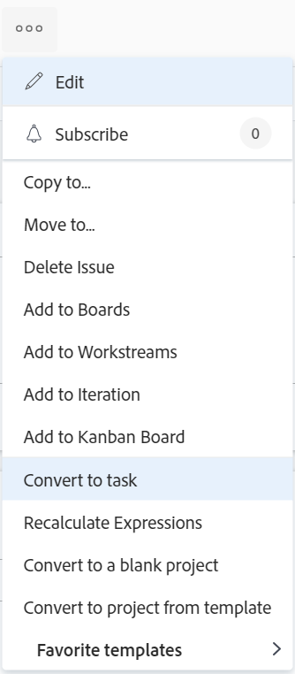

# Adobe Workfront에서 문제를 작업으로 전환

문제가 제출된 후 문제를 완료하기 위해 추가 작업을 수행해야 하는 경우 문제를 작업으로 전환할 수 있습니다.

문제 변환에 대한 일반적인 정보는 [Adobe Workfront의 문제 변환 개요](../../../manage-work/issues/convert-issues/convert-issues.md)를 참조하십시오.

## 액세스 요구 사항

이 문서의 단계를 수행하려면 다음 액세스 권한이 있어야 합니다.

<table style="table-layout:auto"> 
 <col> 
 <col> 
 <tbody> 
  <tr> 
   <td role="rowheader">Adobe Workfront 플랜*</td> 
   <td> 
임의
 </td> 
  </tr> 
  <tr> 
   <td role="rowheader">Adobe Workfront 라이센스*</td> 
   <td> 
작업 이상
 </td> 
  </tr> 
  <tr> 
   <td role="rowheader">액세스 수준 구성*</td> 
   <td> 
문제, 작업 및 프로젝트에 대한 액세스 편집
 
참고: 여전히 액세스 권한이 없는 경우 Workfront 관리자에게 액세스 수준에서 추가 제한을 설정하는지 문의하십시오. Workfront 관리자가 액세스 수준을 변경하는 방법에 대한 자세한 내용은 <a href="../../../administration-and-setup/add-users/configure-and-grant-access/create-modify-access-levels.md" class="MCXref xref">사용자 지정 액세스 수준 만들기 또는 수정</a>을 참조하십시오.
 </td> 
  </tr> 
  <tr> 
   <td role="rowheader">개체 권한</td> 
   <td> 
문제에 대한 권한 보기
 
프로젝트에 대한 기여 권한
 
문제가 전환된 후 작업에 대한 관리 권한을 받습니다.
 
추가 액세스 요청에 대한 자세한 내용은 <a href="../../../workfront-basics/grant-and-request-access-to-objects/request-access.md" class="MCXref xref">개체 </a>에 대한 액세스 요청 을 참조하십시오.
 </td> 
  </tr> 
 </tbody> 
</table>

*보유 중인 플랜, 라이선스 유형 또는 액세스 권한을 확인하려면 Workfront 관리자에게 문의하십시오.

## 문제를 작업으로 전환

1. 프로젝트로 이동한 다음 왼쪽 패널에서 [!UICONTROL **문제**]&#x200B;를 클릭합니다.
1. 문제의 랜딩 페이지로 이동하려면 전환하려는 문제를 클릭하십시오.
1. 문제에 대한 [!UICONTROL **자세히**] 메뉴를 클릭한 다음 [!UICONTROL **작업으로 전환**]&#x200B;하세요.

   

   >[!TIP]
   >
   >문제가 승인 프로세스와 연결되어 있거나 해결 중인 개체와 이미 연결되어 있는 경우, Workfront은 [!UICONTROL 프로젝트로 전환] 상자 맨 위에 경고를 표시하여 승인이 제거되거나 전환 중 해결 중인 개체가 덮어쓰기됨을 알립니다. 자세한 내용은 [Adobe Workfront의 문제 전환 개요](../../../manage-work/issues/convert-issues/convert-issues.md)를 참조하십시오.

1. [!UICONTROL 작업 이름] 섹션에서 작업 이름을 업데이트합니다. 기본적으로 작업 이름은 원래 문제의 이름과 같습니다.

   

1. [!UICONTROL **대상 프로젝트**]&#x200B;를 클릭한 다음 [!UICONTROL **대상 프로젝트**] 필드에 새 작업을 배치할 프로젝트의 이름을 입력하고 목록에 표시될 때 선택합니다. 문제의 프로젝트가 기본적으로 선택됩니다.

1. [!UICONTROL **개요**]&#x200B;를 클릭한 다음 작업에 대한 [!UICONTROL **설명**]&#x200B;을(를) 입력하십시오.

   >[!TIP]
   >
   >   시스템 또는 그룹 관리자는 레이아웃 템플릿을 수정하여 변환 상자의 왼쪽 패널에서 섹션의 순서를 변경할 수 있습니다.

1. (선택 사항 및 조건부) [!UICONTROL **옵션**]&#x200B;을 클릭하고 아래 옵션을 선택하십시오.

   Workfront 관리자 또는 그룹 관리자는 문제를 전환하는 동안 이러한 환경 설정을 표시하려면 먼저 이러한 환경 설정을 활성화해야 합니다.

   * [!UICONTROL **원래 문제를 유지하고 해결 방법을 이 작업에 연결**]

     선택하지 않으면 원래 문제가 삭제됩니다.

     >[!NOTE]
     >
     >문제를 삭제할 수 있는 액세스 또는 권한이 없는 사용자는 이 설정의 상태에 관계없이 문제를 전환할 때 문제를 삭제할 수 없습니다. 문제에 대한 액세스 및 권한에 대한 자세한 내용은 다음을 참조하십시오.
     >   
     >   * [문제에 대한 액세스 권한 부여](../../../administration-and-setup/add-users/configure-and-grant-access/grant-access-issues.md)
     >   * [문제 공유](../../../workfront-basics/grant-and-request-access-to-objects/share-an-issue.md)
     >   
     >

   * [!UICONTROL **이 작업에 대한 액세스 권한을 (사용자 이름)에게 허용**]

     선택하지 않으면 문제의 기본 담당자에게 새 작업에 대한 액세스 권한이 없습니다.

   * [!UICONTROL **문제의 계획된 완료 일자 유지**]

     선택하지 않으면 새 작업의 [!UICONTROL 계획된 완료 일자]가 작업의 [!UICONTROL 계획된 시작 일자]에서 계산됩니다. 새 작업의 [!UICONTROL 계획된 시작 일자]는 새 작업에 대한 시스템 기본 설정에 따라 설정됩니다.

     >[!NOTE]
     >
     >
     >여기에 표시되는 옵션은 Workfront 관리자가 시스템의 모든 사용자에게 이 옵션을 구성한 방법에 따라 다릅니다. 자세한 내용은 [시스템 전체 작업 및 문제 환경 설정 구성](../../../administration-and-setup/set-up-workfront/configure-system-defaults/set-task-issue-preferences.md)을 참조하십시오.
     >
     >또는 조직의 최상위 그룹이 별도로 구성한 경우 여기에 표시되는 옵션은 6단계에서 선택한 프로젝트와 관련된 그룹에 따라 다릅니다. 자세한 내용은 [그룹에 대한 작업 및 문제 환경 설정 구성](../../../administration-and-setup/manage-groups/create-and-manage-groups/configure-task-issue-preferences-group.md)을 참조하십시오.

1. (선택 사항) [!UICONTROL **사용자 지정 Forms**]&#x200B;를 클릭하고 새 작업에 대한 사용자 지정 양식을 첨부합니다.

   >[!TIP]
   >
   >* 문제에 첨부된 다중 오브젝트 사용자 정의 양식이 문제와 작업 모두에서 사용하도록 구성된 경우, 해당 문제와 작업의 사용자 정의 양식 모두에 필드가 있는 경우 전환을 수행할 때 양식에 저장된 모든 정보가 유지됩니다.
   >* 계산된 필드가 있는 다중 오브젝트 사용자 정의 양식이 문제뿐 아니라 작업에도 첨부되는 경우 문제 및 작업은 양식의 계산된 사용자 정의 필드에서 참조되는 모든 필드와 호환되어야 합니다. 비호환성이 있는 경우 조정할 것을 알리는 메시지가 표시됩니다. 자세한 내용은 [양식에 계산된 필드 추가](/help/quicksilver/administration-and-setup/customize-workfront/create-manage-custom-forms/form-designer/design-a-form/add-a-calculated-field.md)를 참조하십시오.
   >* 프로젝트를 편집할 때 대상 프로젝트에 작업 기본 사용자 정의 Forms 필드에 정의된 기본 양식이 있는 경우 해당 작업 양식이 새 작업에도 추가됩니다. 원래 문제와 기본 작업 양식의 필드 간에 공통되는 모든 사용자 정의 필드는 문제 필드의 정보로 미리 채워집니다.

1. [!UICONTROL **작업으로 전환**]&#x200B;을 클릭합니다.

   원래 문제를 삭제하기로 했다면 이제 문제가 지정된 프로젝트의 작업이 됩니다.

   또는

   이제 문제가 선택한 프로젝트의 새 작업에 연결되었으며 원래 문제를 유지하기로 한 경우 작업이 완료되면 완료됩니다.

   일부 문제 필드가 작업으로 전송됩니다. 자세한 내용은 이 문서의 [프로젝트 및 작업에 대한 원본 문제 정보 보기](#view-original-issue-information-on-projects-and-tasks) 섹션을 참조하십시오.

1. (선택 사항) 필요에 따라 작업을 계속 편집합니다.

## 프로젝트 및 작업에 대한 원래 문제 정보 보기 {#view-original-issue-information-on-projects-and-tasks}

프로젝트 및 작업 목록과 보고서 또는 프로젝트 세부 정보 영역에서 원래 문제 정보를 볼 수 있습니다. 보고서 작성에 대한 자세한 내용은 [사용자 지정 보고서 만들기](../../../reports-and-dashboards/reports/creating-and-managing-reports/create-custom-report.md)를 참조하세요.

다음 표는 변환된 프로젝트 및 작업에서 표시되는 문제 필드를 보여 줍니다.

| 문제 필드 | 프로젝트 또는 작업 필드 | 프로젝트 목록 또는 보고서 | 프로젝트 세부 정보 영역 | 작업 목록 또는 보고서 | 작업 세부 정보 영역 |
|---|---|---|---|---|---|
| [!UICONTROL 문제 이름] | [!UICONTROL 전환된 문제 이름] | ✔ | ✔ | ✔ | ✔ |
| [!UICONTROL 기본 연락처] | [!UICONTROL 전환된 문제 작성자 이름] | ✔ | ✔ | ✔ |
| [!UICONTROL 시작 날짜] | [!UICONTROL 전환된 문제 입력 일자] | ✔ |  | ✔ |

>[!CAUTION]
>
>문제의 [!UICONTROL 기본 담당자]가 변경되거나 문제가 전환된 후 프로젝트 또는 작업에서 문제가 연결 해제되는 경우 [!UICONTROL 전환된 문제 작성자 이름]이(가) 업데이트되지 않고 문제가 전환된 시점에 문제의 원래 [!UICONTROL 기본 담당자]가 표시됩니다.
