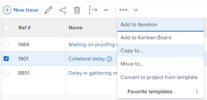
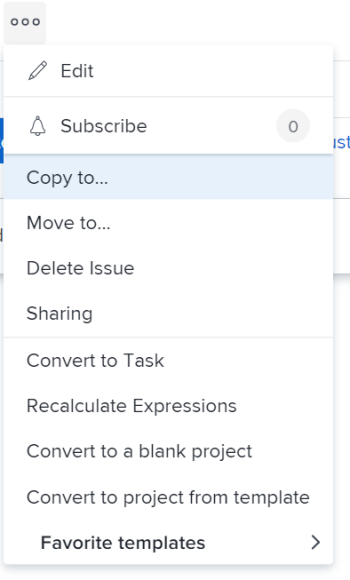

# 문제 복사

<!--Audited: 08/2025-->

문제 또는 요청을 복사하여 동일하거나 다른 프로젝트에 저장할 수 있습니다. 작업에서 다른 프로젝트로 문제를 복사할 수도 있습니다.

다음 오브젝트에서 문제를 복사할 수 있습니다.

* 프로젝트에서 동일한 프로젝트로(동일한 프로젝트에서 복제)
* 작업에서 동일한 작업으로(동일한 작업에 있는 경우 복제)
* 프로젝트에서 다른 프로젝트로
* 작업에서 프로젝트로

>[!TIP]
>
>Workfront에서 &quot;문제&quot;와 &quot;요청&quot;은 서로 교환하여 사용됩니다. 프로젝트와 작업 모두에 문제를 기록하여 해결해야 하는 예기치 않은 작업을 표시할 수 있습니다. 요청 대기열로 지정된 프로젝트에 문제로 기록된 요청을 제출할 수도 있습니다.

## 액세스 요구 사항

+++ 을 확장하여 이 문서의 기능에 대한 액세스 요구 사항을 봅니다.

<table style="table-layout:auto"> 
 <col> 
 <col> 
 <tbody> 
  <tr> 
   <td role="rowheader">Adobe Workfront 패키지</td> 
   <td> 
임의
 </td> 
  </tr> 
  <tr> 
   <td role="rowheader">Adobe Workfront 라이선스</td> 
   <td> 
   <ul><li>
기여자 이상
 </li>
   <li>
프로젝트의 문제 섹션에서 문제를 복사하는 라이트 또는 상위 라이선스
</li></ul>
   또는
   <ul><li>
요청자 이상
 </li>
   <li>
프로젝트의 문제 섹션에서 문제를 복사하는 검토자 이상의 라이선스
</li></ul> </td> 
  </tr> 
  <tr> 
   <td role="rowheader">액세스 수준 구성</td> 
   <td> 
문제에 대한 액세스 편집
 
프로젝트 및 작업에 대한 보기 또는 상위 액세스 권한
 </td> 
  </tr> 
  <tr> 
   <td role="rowheader">개체 권한</td> 
   <td> 
문제에 대한 권한 관리
 
문제를 추가할 수 있는 권한으로 문제를 복사할 항목에 권한을 부여합니다.
</td> 
  </tr> 
 </tbody> 
</table>

이 표의 정보에 대한 자세한 내용은 [Workfront 설명서의 액세스 요구 사항](/help/quicksilver/administration-and-setup/add-users/access-levels-and-object-permissions/access-level-requirements-in-documentation.md)을 참조하십시오.

+++

<!--Old:

<table style="table-layout:auto"> 
 <col> 
 <col> 
 <tbody> 
  <tr> 
   <td role="rowheader">Adobe Workfront plan*</td> 
   <td> 
Any
 </td> 
  </tr> 
  <tr> 
   <td role="rowheader">Adobe Workfront license*</td> 
   <td> 
Request or higher
 
Review or higher license to copy an issue in the Issues section of a project.
 </td> 
  </tr> 
  <tr> 
   <td role="rowheader">Access level*</td> 
   <td> 
Edit access to Issues
 
View or higher access to Projects and Tasks
 
Note: If you still don't have access, ask your Workfront administrator if they set additional restrictions in your access level. For information about access to issues in your Access Level, see <a href="../../../administration-and-setup/add-users/configure-and-grant-access/grant-access-issues.md" class="MCXref xref">Grant access to issues</a>. For information on how a Workfront administrator can change your access level, see <a href="../../../administration-and-setup/add-users/configure-and-grant-access/create-modify-access-levels.md" class="MCXref xref">Create or modify custom access levels</a>. 
 </td> 
  </tr> 
  <tr> 
   <td role="rowheader">Object permissions</td> 
   <td> 
Manage permissions to the issue
 
Contribute permissions to the item where you are copying the issue to with the ability to Add Issues.
 
 For information about granting permissions to issues, see <a href="../../../workfront-basics/grant-and-request-access-to-objects/share-an-issue.md" class="MCXref xref">Share an issue </a>
 
For information on requesting additional permissions, see <a href="../../../workfront-basics/grant-and-request-access-to-objects/request-access.md" class="MCXref xref">Request access to objects </a>.
 </td> 
  </tr> 
 </tbody> 
</table>-->

## 문제 복사 시 고려 사항

### 문제 복사 시 일반적인 고려 사항

복사 프로세스 중에 문제와 연관된 일부 항목을 복사된 문제에 복사하도록 선택할 수 있습니다. 그러나 일부 항목은 기본적으로 새 문제로 전송되지만, 다른 항목은 아래 목록에 설명된 대로 전송되지 않습니다.

기본적으로 다음 항목이 새 문제에 복사됩니다.

* 기본 담당자
* 사용자 정의 양식. 사용자 정의 필드의 정보는 복사 프로세스에서 사용자 정의 데이터를 선택한 경우에만 새 문제로 복사됩니다.
* 승인
* 계획된 시작 및 계획된 완료 일자

다음 오브젝트는 기본적으로 새 문제에 복사되지 않습니다.

* 기록된 시간

### 문서 또는 요청 대기열과 관련된 문제에 대한 고려 사항

문서가 포함되어 있거나 요청 대기열과 연관된 문제를 복사할 때에는 다음 사항을 고려하십시오.

* **문제가 요청 대기열과 연결되어 있는 경우:** 문제를 다른 개체로 복사하고 이 문제가 요청 대기열과 연결되어 있으면 복사된 문제가 첫 번째 문제가 발생한 원래 대기열과 더 이상 연결되지 않습니다.
* **문서가 문제에 첨부되어 있을 때:** 문제를 다른 개체에 복사하고 문제에 문서가 첨부되어 있을 때 문서와 해당 버전이 새 문제로 이동합니다. 문서와 연결된 모든 증명 또는 승인은 이동하지 않습니다.
* **문제가 문서 또는 폴더에 연결되어 있는 경우:** Google Drive와 같은 서드파티 서비스에 연결된 문서 또는 폴더가 있는 문제를 복사하면 문서에 연결된 링크가 복사된 문제로 이동합니다.

## 목록의 문제 복사

문제 목록 또는 문제 보고서에서 하나 이상의 문제를 복사할 수 있습니다.

1. 복사할 문제가 포함된 프로젝트로 이동합니다.

   또는

   문제 보고서로 이동합니다.

1. 프로젝트로 이동하기로 선택한 경우 왼쪽 패널에서 **문제**&#x200B;를 클릭합니다.
1. 복사할 문제를 선택하고 문제 목록의 맨 위에서 **추가 메뉴**&#x200B;를 클릭한 다음 **복사 위치**&#x200B;를 클릭합니다.

   

1. 2단계부터 [단일 문제 복사](#copy-a-single-issue) 섹션에 설명된 대로 문제 복사를 계속하십시오.

   <!--
   <MadCap:conditionalText data-mc-conditions="QuicksilverOrClassic.Draft mode">
   (NOTE: ensure step number stays accurate)
   </MadCap:conditionalText>
   -->

## 단일 문제 복사 {#copy-a-single-issue}

볼 때 하나의 문제를 복사할 수 있습니다.

1. 복사할 문제로 이동한 다음 문제 이름 오른쪽에 있는 **자세히** 메뉴 를 클릭한 다음 **복사 위치**&#x200B;를 클릭합니다.

   

   **문제 복사** 상자가 표시됩니다.

   

1. **대상 프로젝트 선택** 섹션에서 문제를 복사할 프로젝트의 이름을 지정합니다. 현재 프로젝트의 이름이 기본적으로 표시됩니다.

   >[!TIP]
   >
   >100개의 프로젝트만 목록에 표시됩니다.

1. (조건부) 프로젝트에 문제를 복사할 수 있는 액세스 권한이 없는 경우 **액세스 권한 요청**&#x200B;을 클릭합니다.
1. (조건부) 대상 프로젝트의 작업 중 하나에 문제를 추가할 수 있는 액세스 권한이 있는 경우 액세스 요청 없이 선택한 대상 프로젝트에 문제를 계속 복사합니다.

   

   >[!TIP]
   >
   >Workfront 관리자가 이러한 프로젝트에 문제를 추가할 수 없도록 방지하면 선택한 프로젝트가 승인 보류 중, 완료 또는 정지된 경우에도 유사한 메시지가 표시됩니다. 자세한 내용은 [시스템 전체 프로젝트 환경 설정 구성](../../../administration-and-setup/set-up-workfront/configure-system-defaults/set-project-preferences.md)을 참조하십시오.

1. (선택 사항) **옵션** 섹션에서 아래 표에 나열된 항목을 선택 해제하여 새 문제에서 제거하십시오. 기본적으로 모든 옵션이 선택되어 있습니다.

   >[!NOTE]
   >
   >이는 원래 문제가 아닌 복사된 문제에만 영향을 줍니다.

   <table style="table-layout:auto"> 
    <col> 
    <col> 
    <tbody> 
     <tr> 
      <td role="rowheader">할당</td> 
      <td>문제에 할당된 사용자, 작업 역할 또는 팀을 제거합니다.</td> 
     </tr> 
     <tr> 
      <td role="rowheader">진행</td> 
      <td>문제가 있는 경우 완료율을 제거합니다.</td> 
     </tr> 
     <tr> 
      <td role="rowheader">문서</td> 
      <td>문서 탭에서 문서 버전, 연결된 문서 및 폴더를 포함하여 모든 항목을 제거합니다.  기본적으로 문서 증명 및 승인은 다른 문제로 복사할 수 없습니다.</td> 
     </tr> 
     <tr> 
      <td role="rowheader">권한</td> 
      <td>문제가 공유되는 엔티티를 제거합니다. </td> 
     </tr> 
     <tr> 
      <td role="rowheader">업데이트</td> 
      <td>문제의 업데이트 섹션에서 주석을 제거합니다.</td> 
     </tr> 
     <tr> 
      <td role="rowheader">사용자 정의 데이터</td> 
      <td>문제와 함께 복사된 경우 문제에 대한 사용자 정의 양식에 대한 정보와, 문제에 첨부된 문서와 관련된 사용자 정의 양식에 대한 정보를 제거합니다. 사용자 정의 양식은 문제 및 문서에 첨부된 상태로 유지되지만 양식에 대한 정보는 새 문제로 이어지지 않습니다. </td> 
     </tr> 
    </tbody> 
   </table>

1. (선택 사항) **작업 선택** 섹션에서 문제를 이동할 작업을 선택합니다.
1. 목록에서 문제를 여러 개 선택한 경우 **문제 복사** 또는 **문제 복사**&#x200B;를 클릭합니다.

   복사된 문제가 지정된 프로젝트에 추가됩니다.

